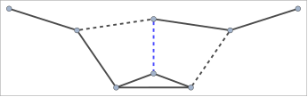
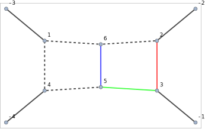

## FCGraphCuttableQ

`FCGraphCuttableQ[{edges, labels}, {m1,m2, ...}]` checks whether the given graph representing a loop integral can be cut such, that no propagator containing masses `{m1,m2, ...}` goes on shell. To that aim `labels` must contain masses occurring in the respective propagators.

`FCGraphCuttableQ` uses `FCGraphFindPath` as the back-end.

The list `{edges, labels}` can be the output of `FCLoopIntegralToGraph`.

### See also

[Overview](Extra/FeynCalc.md), [FCGraphFindPath](FCGraphFindPath.md), [FCLoopIntegralToGraph](FCLoopIntegralToGraph.md), [SameSideExternalEdges](SameSideExternalEdges.md).

### Examples

This integral has no imaginary part due to the massive `m1`-line that cannot be  cut

```mathematica
graph1 = {{-3 -> 2, -1 -> 1, 1 -> 3, 1 -> 4, 2 -> 3, 2 -> 4, 2 -> 4, 3 -> 4}, {q1, q1, {p3, 1, m1^2}, {p3 + q1, 1, m1^2}, 
     {p2, 1, m1^2}, {p1 + q1, 1, m2^2}, {p1 - p2, 1, m1^2}, {p2 - p3, 1, 0}}, {0, 0, SFAD[{{I*p3, 0}, {-m1^2, -1}, 1}], 
     SFAD[{{I*p2, 0}, {-m1^2, -1}, 1}], SFAD[{{I*(p3 + q1), 0}, {-m1^2, -1}, 1}], SFAD[{{I*(p1 + q1), 0}, 
       {-m2^2, -1}, 1}], SFAD[{{I*(p2 - p3), 0}, {0, -1}, 1}], SFAD[{{I*(p1 - p2), 0}, {-m1^2, -1}, 1}]}, 1};
```

```mathematica
FCLoopGraphPlot[graph1, GraphPlot -> {MultiedgeStyle -> 0.35, Frame -> True}, Style -> {
    {"InternalLine", _, _, mm_ /; ! FreeQ[mm, mg | m3]} -> {Red, Thick, Dashed}, 
    {"InternalLine", _, _, mm_ /; ! FreeQ[mm, mc | m2]} -> {Blue, Thick, Dashed}, 
    {"InternalLine", _, _, mm_ /; ! FreeQ[mm, mb | m1]} -> {Black, Thick} 
   }]
```


```mathematica
FCGraphCuttableQ[graph1, {m1}]
```

$$\text{False}$$

```mathematica
graph2 = {{-3 -> 2, -1 -> 1, 1 -> 3, 1 -> 4, 2 -> 4, 2 -> 5, 3 -> 5, 3 -> 6, 4 -> 6, 5 -> 6}, {q1, q1, {p3, 1, 0}, {p3 + q1, 1, m1^2}, 
     {p1 + q1, 1, 0}, {p1, 1, m1^2}, {p2, 1, m1^2}, {p2 - p3, 1, m1^5}, {-p1 + p3, 1, m2^2}, {p1 - p2, 1, m1^2}}, 
    {0, 0, SFAD[{{I*p3, 0}, {0, -1}, 1}], SFAD[{{I*(p1 + q1), 0}, {0, -1}, 1}], SFAD[{{I*p2, 0}, 
       {-m1^2, -1}, 1}], SFAD[{{I*p1, 0}, {-m1^2, -1}, 1}], SFAD[{{I*(p3 + q1), 0}, {-m1^2, -1}, 1}], 
     SFAD[{{I*(-p1 + p3), 0}, {-m2^2, -1}, 1}], SFAD[{{I*(p2 - p3), 0}, {-m1^5, -1}, 1}], 
     SFAD[{{I*(p1 - p2), 0}, {-m1^2, -1}, 1}]}, 1};
```

This graph can be cut through the dashed blue and black lines, hence `FCGraphCuttableQ` returns `True`

```mathematica
FCLoopGraphPlot[graph2, GraphPlot -> {MultiedgeStyle -> 0.35, Frame -> True}, Style -> {
    {"InternalLine", _, _, mm_ /; ! FreeQ[mm, mg | m3]} -> {Red, Thick, Dashed}, 
    {"InternalLine", _, _, mm_ /; ! FreeQ[mm, mc | m2]} -> {Blue, Thick, Dashed}, 
    {"InternalLine", _, _, mm_ /; ! FreeQ[mm, mb | m1]} -> {Black, Thick} 
   }]
```



```mathematica
FCGraphCuttableQ[graph2, {m1}]
```

$$\text{True}$$

In the case of graphs with more than 2 external legs, the situation is somewhat more involved

```mathematica
graph3 = {{-4 -> 4, -3 -> 1, -2 -> 2, -1 -> 3, 1 -> 4, 1 -> 6, 2 -> 3, 2 -> 6, 3 -> 5, 4 -> 5, 5 -> 6}, 
   {Q1 - Q2 - Q3, Q1, Q2, Q3, {-p1 - p2 + Q2 + Q3, 1, 0}, {-p1 - p2 + Q2, 1, 0}, {p1, 1, -m1^2}, {-p1 + Q2, 1, 0}, 
     {p1 + Q1, 1, -m3^2}, {p1 + p2 + Q1, 1, 0}, {p2, 1, -m2^2}}, {0, 0, 0, 0, SFAD[{{p1 + p2 + Q1, 0}, {0, 1}, 1}], 
     SFAD[{{-p1 + Q2, 0}, {0, 1}, 1}], SFAD[{{p2, 0}, {m2^2, 1}, 1}], SFAD[{{p1, 0}, {m1^2, 1}, 1}], 
     SFAD[{{p1 + Q1, 0}, {m3^2, 1}, 1}], SFAD[{{-p1 - p2 + Q2, 0}, {0, 1}, 1}], 
     SFAD[{{-p1 - p2 + Q2 + Q3, 0}, {0, 1}, 1}]}, 1}
```

$$\left\{\{-4\to 4,-3\to 1,-2\to 2,-1\to 3,1\to 4,1\to 6,2\to 3,2\to 6,3\to 5,4\to 5,5\to 6\},\left\{\text{Q1}-\text{Q2}-\text{Q3},\text{Q1},\text{Q2},\text{Q3},\{-\text{p1}-\text{p2}+\text{Q2}+\text{Q3},1,0\},\{-\text{p1}-\text{p2}+\text{Q2},1,0\},\left\{\text{p1},1,-\text{m1}^2\right\},\{\text{Q2}-\text{p1},1,0\},\left\{\text{p1}+\text{Q1},1,-\text{m3}^2\right\},\{\text{p1}+\text{p2}+\text{Q1},1,0\},\left\{\text{p2},1,-\text{m2}^2\right\}\right\},\left\{0,0,0,0,\frac{1}{((\text{p1}+\text{p2}+\text{Q1})^2+i \eta )},\frac{1}{((\text{Q2}-\text{p1})^2+i \eta )},\frac{1}{(\text{p2}^2-\text{m2}^2+i \eta )},\frac{1}{(\text{p1}^2-\text{m1}^2+i \eta )},\frac{1}{((\text{p1}+\text{Q1})^2-\text{m3}^2+i \eta )},\frac{1}{((-\text{p1}-\text{p2}+\text{Q2})^2+i \eta )},\frac{1}{((-\text{p1}-\text{p2}+\text{Q2}+\text{Q3})^2+i \eta )}\right\},1\right\}$$

```mathematica
FCLoopGraphPlot[graph3, GraphPlot -> {MultiedgeStyle -> 0.35, Frame -> True, VertexLabels -> "Name"}, Style -> {
       {"InternalLine", _, _, mm_ /; ! FreeQ[mm, m1]} -> {Red, Thick}, 
       {"InternalLine", _, _, mm_ /; ! FreeQ[mm, m2]} -> {Blue, Thick}, 
       {"InternalLine", _, _, mm_ /; ! FreeQ[mm, m3]} -> {Green, Thick}, 
       {"InternalLine", _, _, mm_ /; ! FreeQ[mm, m4]} -> {Purple, Thick}, 
       {"ExternalLine", q1} -> {Brown, Thick, Dashed} 
      }]
```



By default `FCGraphCuttableQ` thinks that the graph is not cuttable, since it choses the path connecting two external edges on the same side

```mathematica
FCGraphCuttableQ[graph3, {m1, m2, m3}]
```

$$\text{False}$$

```mathematica
FCGraphFindPath[graph3[[1]], {1, 1, 1, 1, -1, -1, 1, -1, 1, -1, 1}]
```

$$\left(
\begin{array}{ccc}
 \{-2\to 2,3\} & \{2\to 3,7\} & \{-1\to 3,4\} \\
\end{array}
\right)$$

We can exclude such paths by letting the function know which external edges are on the same side via the option `SameSideExternalEdges`. In this case `FCGraphCuttableQ`
correctly reports that the graph is cuttable

```mathematica
FCGraphCuttableQ[graph3, {m1, m2, m3}, SameSideExternalEdges -> {-2, -1}]
```

$$\text{True}$$