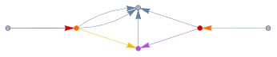
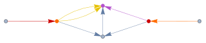
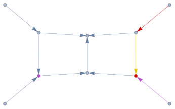

## FCGraphFindPath

`FCGraphFindPath[graph, weights]` determines whether the given graph can be traversed by starting and finishing at one of the external edges.

The respective external edges must differ and `{1}` is returned for all graphs with less than two such edges, since tadpoles have no cut by definition.

The only supported weights are 1 and -1, with -1 meaning that the given edge cannot be passed.

Only directed graphs are supported but the direction of edges does not matter when searching for the path. The path is understood to be free of any cycles (loops).

### See also

[Overview](Extra/FeynCalc.md), [FCGraphCuttableQ](FCGraphCuttableQ.md), [FCLoopIntegralToGraph](FCLoopIntegralToGraph.md), [SameSideExternalEdges](SameSideExternalEdges.md).

### Examples

This integral has no imaginary part due to the massive `m1`-line that cannot be  cut

```mathematica
graph1 = {-3 -> 2, -1 -> 1, 1 -> 3, 1 -> 4, 2 -> 3, 2 -> 4, 2 -> 4, 3 -> 4};
```

```mathematica
GraphPlot[graph1]
```


```mathematica
res1 = FCGraphFindPath[graph1, {1, 1, 1, 1, 1, -1, 1, -1}]
```

$$\left(
\begin{array}{cccc}
 \{-3\to 2,1\} & \{2\to 3,5\} & \{1\to 3,3\} & \{-1\to 1,2\} \\
 \{-3\to 2,1\} & \{2\to 4,7\} & \{1\to 4,4\} & \{-1\to 1,2\} \\
\end{array}
\right)$$

```mathematica
HighlightGraph[graph1, res1[[1]], GraphLayout -> "SpringElectricalEmbedding"]
```



```mathematica
HighlightGraph[graph1, res1[[2]], GraphLayout -> "SpringElectricalEmbedding"]
```



```mathematica
graph2 = {-4 -> 4, -3 -> 1, -2 -> 2, -1 -> 3, 1 -> 4, 1 -> 6, 2 -> 3, 
    2 -> 6, 3 -> 5, 4 -> 5, 5 -> 6};
```

```mathematica
GraphPlot[graph2, VertexLabels -> "Name"]
```


```mathematica
res2 = FCGraphFindPath[graph2, {1, 1, 1, 1, -1, -1, 1, -1, 1, -1, 1}]
```

$$\left(
\begin{array}{ccc}
 \{-2\to 2,3\} & \{2\to 3,7\} & \{-1\to 3,4\} \\
\end{array}
\right)$$

```mathematica
HighlightGraph[graph2, res2[[1]], GraphLayout -> "SpringElectricalEmbedding"]
```



```mathematica
FCGraphFindPath[graph2, {1, 1, 1, 1, -1, -1, 1, -1, 1, -1, 1}, SameSideExternalEdges -> {-1, -2}]
```

$$\{\}$$