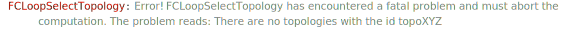

`FCLoopFromGLI[exp, topologies]` replaces `GLI`s in `exp` with the corresponding loop integrals in the `FeynAmpDenominator` notation according to the information provided in topologies.

### See also

[Overview](Extra/FeynCalc.md), [FCTopology](FCTopology.md), [GLI](GLI.md), [FCLoopValidTopologyQ](FCLoopValidTopologyQ.md).

### Examples

```mathematica
topos = {
   FCTopology["topoBox1L", {FAD[{q, m0}], FAD[{q + p1, m1}], FAD[{q + p2, m2}], FAD[{q + p2, m3}]}, {q}, {p1, p2, p3}, {}, {}], 
   FCTopology["topoTad2L", {FAD[{q1, m1}], FAD[{q2, m2}], FAD[{q1 - q2, 0}]}, {q1, q2}, {}, {}, {}]}
```

$$\left\{\text{FCTopology}\left(\text{topoBox1L},\left\{\frac{1}{q^2-\text{m0}^2},\frac{1}{(\text{p1}+q)^2-\text{m1}^2},\frac{1}{(\text{p2}+q)^2-\text{m2}^2},\frac{1}{(\text{p2}+q)^2-\text{m3}^2}\right\},\{q\},\{\text{p1},\text{p2},\text{p3}\},\{\},\{\}\right),\text{FCTopology}\left(\text{topoTad2L},\left\{\frac{1}{\text{q1}^2-\text{m1}^2},\frac{1}{\text{q2}^2-\text{m2}^2},\frac{1}{(\text{q1}-\text{q2})^2}\right\},\{\text{q1},\text{q2}\},\{\},\{\},\{\}\right)\right\}$$

```mathematica
exp = a1 GLI["topoBox1L", {1, 1, 1, 1}] + a2 GLI["topoTad2L", {1, 2, 2}]
```

$$\text{a1} G^{\text{topoBox1L}}(1,1,1,1)+\text{a2} G^{\text{topoTad2L}}(1,2,2)$$

```mathematica
FCLoopFromGLI[exp, topos]
```

$$\frac{\text{a1}}{\left(q^2-\text{m0}^2\right) \left((\text{p1}+q)^2-\text{m1}^2\right) \left((\text{p2}+q)^2-\text{m2}^2\right) \left((\text{p2}+q)^2-\text{m3}^2\right)}+\frac{\text{a2}}{\left(\text{q1}^2-\text{m1}^2\right) \left(\text{q2}^2-\text{m2}^2\right)^2 (\text{q1}-\text{q2})^4}$$

Notice that it is necessary to specify all topologies present in `exp`. The function will not accept `GLI`s
defined for unknown topologies

```mathematica
FCLoopFromGLI[GLI["topoXYZ", {1, 1, 1, 1, 1}], topos]
```



$$\text{\$Aborted}$$

`FCLoopFromGLI` can also handle products of `GLI`s (currently only for standalone integrals or lists of integrals but not for amplitudes).
In this case it will automatically introduce dummy names for the loop momenta.

```mathematica
FCLoopFromGLI[GLI["topoBox1L", {1, 0, 1, 0}] GLI["topoBox1L", {0, 1, 0, 1}], topos]
```

$$\frac{1}{\left(\text{FCGV}(\text{lmom21})^2-\text{m0}^2\right) \left((\text{p1}+\text{FCGV}(\text{lmom11}))^2-\text{m1}^2\right) \left((\text{p2}+\text{FCGV}(\text{lmom11}))^2-\text{m3}^2\right) \left((\text{p2}+\text{FCGV}(\text{lmom21}))^2-\text{m2}^2\right)}$$

You can customize the naming scheme for the momenta via the `LoopMomentum` option. The first argument gives
the number of the loop integral, while the second corresponds to a particular loop momentum this integral depends on.

```mathematica
SelectNotFree[Options[FCLoopFromGLI], LoopMomenta]
```

$$\{\text{LoopMomenta}\to (\{\text{FeynCalc$\grave{ }$FCLoopFromGLI$\grave{ }$Private$\grave{ }$x},\text{FeynCalc$\grave{ }$FCLoopFromGLI$\grave{ }$Private$\grave{ }$y}\}\to \;\text{FCGV}(\text{lmom}<>\text{ToString}[\text{FeynCalc$\grave{ }$FCLoopFromGLI$\grave{ }$Private$\grave{ }$x}]<>\text{ToString}[\text{FeynCalc$\grave{ }$FCLoopFromGLI$\grave{ }$Private$\grave{ }$y}]))\}$$

```mathematica
FCLoopFromGLI[GLI["topoBox1L", {1, 0, 1, 0}] GLI["topoBox1L", {0, 1, 0, 1}], topos,LoopMomenta -> Function[{x, y}, 
    "p" <> ToString[x] <> ToString[x]]]
```

$$\frac{1}{\left(\text{p22}^2-\text{m0}^2\right) \left((\text{p11}+\text{p1})^2-\text{m1}^2\right) \left((\text{p22}+\text{p2})^2-\text{m2}^2\right) \left((\text{p11}+\text{p2})^2-\text{m3}^2\right)}$$