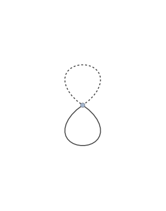
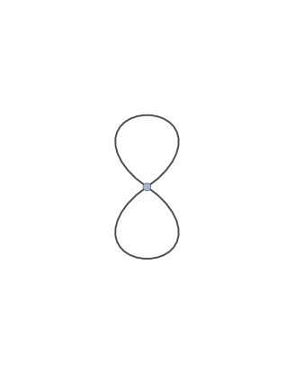
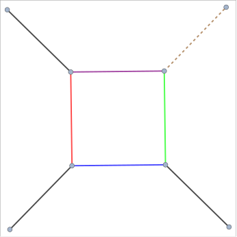

`FCLoopGraphPlot[{edges, labels}]` visualizes the graph of the given loop integral using the provided list of edges, styles and labels using the built-in function `Graph`. The Option `Graph` can be used to pass options to the `Graph` objects.

By default, `FCLoopGraphPlot` returns a `Graph`. When using Mathematica 12.2 or newer, it is also possible to return a `Graphics` object created by `GraphPlot`. For this the option `GraphPlot` must be set to a list of options that will be passed to `GraphPlot`. An empty list is also admissible. For example, `FCLoopGraphPlot[int, GraphPlot -> {MultiedgeStyle -> 0.35, Frame -> True}]`.

Given a list of `Graph` or `Graphics` objects created by `FCLoopGraphPlot`, a nice way to get a better overview is to employ `Magnify[Grid[(Partition[out, UpTo[4]])], 0.9]`.

Notice that older Mathematica versions have numerous shortcomings in the graph drawing capabilities that cannot be reliably worked around. This why to use `FCLoopGraphPlot` you need to have at least Mathematica 11.0 or newer. For best results we recommend using Mathematica 12.2 or newer.

### See also

[Overview](Extra/FeynCalc.md), [FCLoopIntegralToGraph](FCLoopIntegralToGraph.md).

### Examples

#### Showcases

1-loop tadpole

```mathematica
FCLoopIntegralToGraph[FAD[{p, m}], {p}]
FCLoopGraphPlot[%]
```

$$\left\{\{1\to 1\},\left(
\begin{array}{ccc}
 p & 1 & -m^2 \\
\end{array}
\right),\left\{\frac{1}{(p^2-m^2+i \eta )}\right\},1\right\}$$


1-loop massless bubble

```mathematica
FCLoopIntegralToGraph[FAD[p, p - q], {p}]
FCLoopGraphPlot[%]
```

$$\left\{\{-3\to 2,-1\to 1,1\to 2,1\to 2\},\{q,q,\{p,1,0\},\{p-q,1,0\}\},\left\{0,0,\frac{1}{(p^2+i \eta )},\frac{1}{((p-q)^2+i \eta )}\right\},1\right\}$$


1-loop massive bubble

```mathematica
FCLoopIntegralToGraph[FAD[{p, m1}, {p - q, m2}], {p}]
FCLoopGraphPlot[%]
```

$$\left\{\{-3\to 2,-1\to 1,1\to 2,1\to 2\},\left\{q,q,\left\{p,1,-\text{m1}^2\right\},\left\{p-q,1,-\text{m2}^2\right\}\right\},\left\{0,0,\frac{1}{(p^2-\text{m1}^2+i \eta )},\frac{1}{((p-q)^2-\text{m2}^2+i \eta )}\right\},1\right\}$$


1-loop massless triangle

```mathematica
FCLoopIntegralToGraph[FAD[p, p + q1, p + q1 + q2], {p}]
FCLoopGraphPlot[%]
```

$$\left\{\{-3\to 3,-2\to 1,-1\to 2,1\to 2,1\to 3,2\to 3\},\{\text{q1}-\text{q2},\text{q1},\text{q2},\{p+\text{q1},1,0\},\{p+\text{q1}+\text{q2},1,0\},\{p,1,0\}\},\left\{0,0,0,\frac{1}{(p^2+i \eta )},\frac{1}{((p+\text{q1})^2+i \eta )},\frac{1}{((p+\text{q1}+\text{q2})^2+i \eta )}\right\},1\right\}$$


1-loop massless box

```mathematica
FCLoopIntegralToGraph[FAD[p, p + q1, p + q1 + q2, p + q1 + q2 + q3], {p}]
FCLoopGraphPlot[%]
```

$$\left\{\{-4\to 4,-3\to 1,-2\to 2,-1\to 3,1\to 2,1\to 4,2\to 3,3\to 4\},\{\text{q1}-\text{q2}-\text{q3},\text{q1},\text{q2},\text{q3},\{p+\text{q1}+\text{q2},1,0\},\{p+\text{q1}+\text{q2}+\text{q3},1,0\},\{p+\text{q1},1,0\},\{p,1,0\}\},\left\{0,0,0,0,\frac{1}{(p^2+i \eta )},\frac{1}{((p+\text{q1})^2+i \eta )},\frac{1}{((p+\text{q1}+\text{q2})^2+i \eta )},\frac{1}{((p+\text{q1}+\text{q2}+\text{q3})^2+i \eta )}\right\},1\right\}$$


1-loop massless pentagon

```mathematica
FCLoopIntegralToGraph[FAD[p, p + q1, p + q1 + q2, p + q1 + q2 + q3, p + q1 + q2 + q3 + q4], {p}]
FCLoopGraphPlot[%]
```

$$\left\{\{-5\to 5,-4\to 1,-3\to 2,-2\to 3,-1\to 4,1\to 2,1\to 5,2\to 3,3\to 4,4\to 5\},\{\text{q1}-\text{q2}-\text{q3}-\text{q4},\text{q1},\text{q2},\text{q3},\text{q4},\{p+\text{q1}+\text{q2}+\text{q3},1,0\},\{p+\text{q1}+\text{q2}+\text{q3}+\text{q4},1,0\},\{p+\text{q1}+\text{q2},1,0\},\{p+\text{q1},1,0\},\{p,1,0\}\},\left\{0,0,0,0,0,\frac{1}{(p^2+i \eta )},\frac{1}{((p+\text{q1})^2+i \eta )},\frac{1}{((p+\text{q1}+\text{q2})^2+i \eta )},\frac{1}{((p+\text{q1}+\text{q2}+\text{q3})^2+i \eta )},\frac{1}{((p+\text{q1}+\text{q2}+\text{q3}+\text{q4})^2+i \eta )}\right\},1\right\}$$


2-loop massless self-energy

```mathematica
FCLoopIntegralToGraph[FAD[p1, p2, Q - p1 - p2, Q - p1, Q - p2], {p1, p2}]
FCLoopGraphPlot[%]
```

$$\left\{\{-3\to 2,-1\to 1,1\to 3,1\to 4,2\to 3,2\to 4,3\to 4\},\{Q,Q,\{\text{p2},1,0\},\{Q-\text{p2},1,0\},\{Q-\text{p1},1,0\},\{\text{p1},1,0\},\{-\text{p1}-\text{p2}+Q,1,0\}\},\left\{0,0,\frac{1}{(\text{p2}^2+i \eta )},\frac{1}{(\text{p1}^2+i \eta )},\frac{1}{((Q-\text{p2})^2+i \eta )},\frac{1}{((Q-\text{p1})^2+i \eta )},\frac{1}{((-\text{p1}-\text{p2}+Q)^2+i \eta )}\right\},1\right\}$$


Same topology as before but now fully massive and with some dots

```mathematica
FCLoopIntegralToGraph[FAD[{p1, m}, {p2, m2}, {Q - p1 - p2, m}, {Q - p1, m, 2}, {Q - p2, m, 2}], {p1, p2}]
FCLoopGraphPlot[%]
```

$$\left\{\{-3\to 2,-1\to 1,1\to 3,1\to 4,2\to 3,2\to 4,3\to 4\},\left\{Q,Q,\left\{\text{p2},1,-\text{m2}^2\right\},\left\{Q-\text{p2},2,-m^2\right\},\left\{Q-\text{p1},2,-m^2\right\},\left\{\text{p1},1,-m^2\right\},\left\{-\text{p1}-\text{p2}+Q,1,-m^2\right\}\right\},\left\{0,0,\frac{1}{(\text{p2}^2-\text{m2}^2+i \eta )},\frac{1}{(\text{p1}^2-m^2+i \eta )},\frac{1}{((Q-\text{p2})^2-m^2+i \eta )},\frac{1}{((Q-\text{p1})^2-m^2+i \eta )},\frac{1}{((-\text{p1}-\text{p2}+Q)^2-m^2+i \eta )}\right\},1\right\}$$


3-loop massless self-energy

```mathematica
FCLoopIntegralToGraph[FAD[p1, p2, p3, Q - p1 - p2 - p3, Q - p1 - p2, Q - p1, Q - p2, p1 + p3], {p1, p2, p3}]
FCLoopGraphPlot[%]
```

$$\left\{\{-3\to 2,-1\to 1,1\to 5,1\to 6,2\to 3,2\to 5,3\to 4,3\to 6,4\to 5,4\to 6\},\{Q,Q,\{\text{p2},1,0\},\{Q-\text{p2},1,0\},\{\text{p1},1,0\},\{Q-\text{p1},1,0\},\{\text{p3},1,0\},\{\text{p1}+\text{p3},1,0\},\{-\text{p1}-\text{p2}+Q,1,0\},\{-\text{p1}-\text{p2}-\text{p3}+Q,1,0\}\},\left\{0,0,\frac{1}{(\text{p3}^2+i \eta )},\frac{1}{(\text{p2}^2+i \eta )},\frac{1}{(\text{p1}^2+i \eta )},\frac{1}{((\text{p1}+\text{p3})^2+i \eta )},\frac{1}{((Q-\text{p2})^2+i \eta )},\frac{1}{((Q-\text{p1})^2+i \eta )},\frac{1}{((-\text{p1}-\text{p2}+Q)^2+i \eta )},\frac{1}{((-\text{p1}-\text{p2}-\text{p3}+Q)^2+i \eta )}\right\},1\right\}$$


3-loop self-energy with two massive lines

```mathematica
FCLoopIntegralToGraph[Times @@ {SFAD[{{p1, 0}, {m^2, 1}, 1}], SFAD[{{p2, 0}, {0, 1}, 1}], 
    SFAD[{{p3, 0}, {0, 1}, 1}], SFAD[{{p1 + p2 + p3 - Q, 0}, {0, 1}, 1}], SFAD[{{p2 + p3, 0}, {0, 1}, 1}], 
    SFAD[{{p2 - Q, 0}, {0, 1}, 1}], SFAD[{{p1 - Q, 0}, {m^2, 1}, 1}], SFAD[{{p2 + p3 - Q, 0}, {0, 1}, 1}]}, {p1, p2, p3}]
FCLoopGraphPlot[%]
```

$$\left\{\{-3\to 2,-1\to 1,1\to 3,1\to 4,2\to 5,2\to 6,3\to 4,3\to 5,4\to 6,5\to 6\},\left\{Q,Q,\{\text{p2},1,0\},\{\text{p2}-Q,1,0\},\left\{\text{p1}-Q,1,-m^2\right\},\left\{\text{p1},1,-m^2\right\},\{\text{p3},1,0\},\{\text{p2}+\text{p3},1,0\},\{\text{p2}+\text{p3}-Q,1,0\},\{\text{p1}+\text{p2}+\text{p3}-Q,1,0\}\right\},\left\{0,0,\frac{1}{(\text{p3}^2+i \eta )},\frac{1}{(\text{p2}^2+i \eta )},\frac{1}{((\text{p2}+\text{p3})^2+i \eta )},\frac{1}{((\text{p2}-Q)^2+i \eta )},\frac{1}{(\text{p1}^2-m^2+i \eta )},\frac{1}{((\text{p2}+\text{p3}-Q)^2+i \eta )},\frac{1}{((\text{p1}+\text{p2}+\text{p3}-Q)^2+i \eta )},\frac{1}{((\text{p1}-Q)^2-m^2+i \eta )}\right\},1\right\}$$


2-loop triangle

```mathematica
FCLoopIntegralToGraph[FAD[p1, p2, Q1 + p1, Q2 - p1, Q1 + p1 + p2, Q2 - p1 - p2], {p1, p2}]
FCLoopGraphPlot[%]
```

$$\left\{\{-3\to 3,-2\to 1,-1\to 2,1\to 2,1\to 5,2\to 4,3\to 4,3\to 5,4\to 5\},\{\text{Q1}-\text{Q2},\text{Q1},\text{Q2},\{\text{p1},1,0\},\{\text{Q2}-\text{p1},1,0\},\{\text{p1}+\text{Q1},1,0\},\{\text{p1}+\text{p2}+\text{Q1},1,0\},\{-\text{p1}-\text{p2}+\text{Q2},1,0\},\{\text{p2},1,0\}\},\left\{0,0,0,\frac{1}{(\text{p2}^2+i \eta )},\frac{1}{(\text{p1}^2+i \eta )},\frac{1}{((\text{p1}+\text{Q1})^2+i \eta )},\frac{1}{((\text{p1}+\text{p2}+\text{Q1})^2+i \eta )},\frac{1}{((\text{Q2}-\text{p1})^2+i \eta )},\frac{1}{((-\text{p1}-\text{p2}+\text{Q2})^2+i \eta )}\right\},1\right\}$$


#### Special cases

Not all loop integrals admit a graph representation. Furthermore, an integral may have a weird momentum routing that cannot be automatically recognized by
the employed algorithm. Consider e.g.

```mathematica
topo = FCTopology[TRIX1, {SFAD[{{p2, 0}, {0, 1}, 1}], SFAD[{{p1 + Q1, 0}, {0, 1}, 1}], 
    SFAD[{{p1 + p2 + Q1, 0}, {0, 1}, 1}], SFAD[{{-p1 + Q2, 0}, {0, 1}, 1}], SFAD[{{-p1 - p2 + Q2, 0}, {0, 1}, 1}]}, {p1, p2}, {Q1, Q2}, {}, {}]
```

$$\text{FCTopology}\left(\text{TRIX1},\left\{\frac{1}{(\text{p2}^2+i \eta )},\frac{1}{((\text{p1}+\text{Q1})^2+i \eta )},\frac{1}{((\text{p1}+\text{p2}+\text{Q1})^2+i \eta )},\frac{1}{((\text{Q2}-\text{p1})^2+i \eta )},\frac{1}{((-\text{p1}-\text{p2}+\text{Q2})^2+i \eta )}\right\},\{\text{p1},\text{p2}\},\{\text{Q1},\text{Q2}\},\{\},\{\}\right)$$

Here `FCLoopIntegralToGraph` has no way to know that the actual momentum is Q1+Q2, i.e. it is a 2- and not 3-point function

```mathematica
FCLoopIntegralToGraph[topo]
```


$$\text{False}$$

However, if we explicitly provide this information, in many cases the function can still perform the proper reconstruction

```mathematica
FCLoopIntegralToGraph[topo, Momentum -> {Q1 + Q2}]
FCLoopGraphPlot[%]
```

$$\left\{\{-3\to 2,-1\to 1,1\to 3,1\to 4,2\to 3,2\to 4,3\to 4\},\{\text{Q1}+\text{Q2},\text{Q1}+\text{Q2},\{\text{p1}+\text{Q1},1,0\},\{\text{Q2}-\text{p1},1,0\},\{\text{p1}+\text{p2}+\text{Q1},1,0\},\{-\text{p1}-\text{p2}+\text{Q2},1,0\},\{\text{p2},1,0\}\},\left\{0,0,\frac{1}{(\text{p2}^2+i \eta )},\frac{1}{((\text{p1}+\text{Q1})^2+i \eta )},\frac{1}{((\text{p1}+\text{p2}+\text{Q1})^2+i \eta )},\frac{1}{((\text{Q2}-\text{p1})^2+i \eta )},\frac{1}{((-\text{p1}-\text{p2}+\text{Q2})^2+i \eta )}\right\},1\right\}$$


And here is another example. This NRQCD integral from [arXiv:1907.08227](https://arxiv.org/abs/1907.08227) looks like as if it has only one external momentum flowing in

```mathematica
FCLoopIntegralToGraph[FAD[{k, m}, l + p, l - p, k + l], {k, l}]
```


$$\text{False}$$

while in reality there are two of them: `p` and `2p`

```mathematica
FCLoopIntegralToGraph[FAD[{k, m}, l + p, l - p, k + l], {k, l}, Momentum -> {2 p, p}, FCE -> True]
FCLoopGraphPlot[%]
```

$$\left\{\{-4\to 3,-2\to 2,-1\to 1,1\to 2,1\to 3,2\to 3,2\to 3\},\left\{3 p,2 p,p,\{l+p,1,0\},\{l-p,1,0\},\{k+l,1,0\},\left\{k,1,-m^2\right\}\right\},\left\{0,0,0,\frac{1}{((l+p)^2+i \eta )},\frac{1}{((k+l)^2+i \eta )},\frac{1}{((l-p)^2+i \eta )},\frac{1}{(k^2-m^2+i \eta )}\right\},1\right\}$$


In this case the correct form of the external momentum can be deduced upon performing some elementary shifts. The direct application of the function fails

```mathematica
ex = FCTopology[topo1X12679, {SFAD[{{p1, 0}, {0, 1}, 1}], SFAD[{{p2 + p3, 0}, {0, 1}, 1}], SFAD[{{p2 - Q, 0}, {0, 1}, 1}], SFAD[{{p1 + p3 - Q, 0}, {0, 1}, 1}]}, {p1, p2, p3}, {Q}, {}, {}]
```

$$\text{FCTopology}\left(\text{topo1X12679},\left\{\frac{1}{(\text{p1}^2+i \eta )},\frac{1}{((\text{p2}+\text{p3})^2+i \eta )},\frac{1}{((\text{p2}-Q)^2+i \eta )},\frac{1}{((\text{p1}+\text{p3}-Q)^2+i \eta )}\right\},\{\text{p1},\text{p2},\text{p3}\},\{Q\},\{\},\{\}\right)$$

```mathematica
FCLoopIntegralToGraph[ex]
```


$$\text{False}$$

Yet let us consider

```mathematica
exShifted = FCReplaceMomenta[ex, {p2 -> p2 - p3 + p1 - Q, p3 -> p3 - p1 + Q}]
```

$$\text{FCTopology}\left(\text{topo1X12679},\left\{\frac{1}{(\text{p1}^2+i \eta )},\frac{1}{(\text{p2}^2+i \eta )},\frac{1}{((\text{p1}+\text{p2}-\text{p3}-2 Q)^2+i \eta )},\frac{1}{(\text{p3}^2+i \eta )}\right\},\{\text{p1},\text{p2},\text{p3}\},\{Q\},\{\},\{\}\right)$$

Now we immediately see that the proper external momentum to consider is `2Q` instead of just `Q`

```mathematica
FCLoopIntegralToGraph[exShifted, Momentum -> {2 Q}]
FCLoopGraphPlot[%]
```

$$\left\{\{-3\to 2,-1\to 1,1\to 2,1\to 2,1\to 2,1\to 2\},\{2 Q,2 Q,\{\text{p3},1,0\},\{\text{p2},1,0\},\{\text{p1},1,0\},\{\text{p1}+\text{p2}-\text{p3}-2 Q,1,0\}\},\left\{0,0,\frac{1}{(\text{p3}^2+i \eta )},\frac{1}{(\text{p2}^2+i \eta )},\frac{1}{(\text{p1}^2+i \eta )},\frac{1}{((\text{p1}+\text{p2}-\text{p3}-2 Q)^2+i \eta )}\right\},1\right\}$$


When dealing with products of tadpole integrals, the function may not always recognize that the appearing external momenta are spurious. For example, here there is no `q` momentum flowing
through any of the lines

```mathematica
int = SFAD[{{ p1, 0}, {mg^2, 1}, 1}] SFAD[{{ p3, -2 p3 . q}, {0, 1}, 1}]
FCLoopIntegralToGraph[int, {p1, p3}]
```

$$\frac{1}{(\text{p1}^2-\text{mg}^2+i \eta ) (\text{p3}^2-2 (\text{p3}\cdot q)+i \eta )}$$


$$\text{False}$$

In this case we may explicitly tell the function that this integral doesn't depend on any external momenta

```mathematica
FCLoopIntegralToGraph[int, {p1, p3}, Momentum -> {}]
FCLoopGraphPlot[%]
```

$$\left\{\{1\to 1,1\to 1\},\left(
\begin{array}{ccc}
 \;\text{p1} & 1 & -\text{mg}^2 \\
 \;\text{p3}-q & 1 & 0 \\
\end{array}
\right),\left\{\frac{1}{(\text{p1}^2-\text{mg}^2+i \eta )},\frac{1}{(\text{p3}^2-2 (\text{p3}\cdot q)+i \eta )}\right\},1\right\}$$



#### Eyecandy

The `Style` option can be used to label lines carrying different masses in a particular way

```mathematica
OptionValue[FCLoopGraphPlot, Style]
```

$$\{\{\text{InternalLine},\_,\_,0\}:\to \{\text{Dashed},\text{Thick},\text{Black}\},\{\text{InternalLine},\_,\_,\text{FeynCalc$\grave{ }$FCLoopGraphPlot$\grave{ }$Private$\grave{ }$mm$\_$}\;\text{/;}\;\text{FeynCalc$\grave{ }$FCLoopGraphPlot$\grave{ }$Private$\grave{ }$mm}\;\text{=!=}0\}:\to \{\text{Thick},\text{Black}\},\{\text{ExternalLine},\_\}:\to \{\text{Thick},\text{Black}\}\}$$

When dealing with factorizing integral it might be necessary to increase `VertexDegree` to `7` or `8` (or even a higher value, depending on the integrals)

```mathematica
FCLoopIntegralToGraph[FAD[{p1, m1}] FAD[{p2, m2}], {p1, p2}]
FCLoopGraphPlot[%]
```

$$\left\{\{1\to 1,1\to 1\},\left(
\begin{array}{ccc}
 \;\text{p2} & 1 & -\text{m2}^2 \\
 \;\text{p1} & 1 & -\text{m1}^2 \\
\end{array}
\right),\left\{\frac{1}{(\text{p2}^2-\text{m2}^2+i \eta )},\frac{1}{(\text{p1}^2-\text{m1}^2+i \eta )}\right\},1\right\}$$



```mathematica
FCLoopIntegralToGraph[FAD[{p1, m1}] FAD[{p2, m2}] FAD[p3, p3 + q], {p1, p2, p3}, VertexDegree -> 7]
FCLoopGraphPlot[%]
```

$$\left\{\{-3\to 2,-1\to 1,1\to 2,1\to 2,2\to 2,2\to 2\},\left\{q,q,\{\text{p3},1,0\},\{\text{p3}+q,1,0\},\left\{\text{p2},1,-\text{m2}^2\right\},\left\{\text{p1},1,-\text{m1}^2\right\}\right\},\left\{0,0,\frac{1}{(\text{p3}^2+i \eta )},\frac{1}{((\text{p3}+q)^2+i \eta )},\frac{1}{(\text{p2}^2-\text{m2}^2+i \eta )},\frac{1}{(\text{p1}^2-\text{m1}^2+i \eta )}\right\},1\right\}$$


```mathematica
FCLoopIntegralToGraph[FAD[{p1, m1}] FAD[{p2, m2}] FAD[p3, p3 + q] FAD[{p4, m4}], {p1, p2, p3, p4}, VertexDegree -> 9]
FCLoopGraphPlot[%]
```


$$\text{False}$$

$$\text{FCLoopGraphPlot}(\text{False})$$

Here we choose to use thick dashed blue and red lines for massive lines containing `mc` and `mg` respectively. The massless lines are black an dashed.

```mathematica
FCLoopIntegralToGraph[ FAD[{k2, mb}, {k3}, {k1 - q, mc}, {k1 - k2, mc}, {k2 - k3}], {k1, k2,k3}]
Magnify[FCLoopGraphPlot[%, GraphPlot -> {MultiedgeStyle -> 0.35, Frame -> True}, Style -> {{"InternalLine", _, _, mm_ /; ! FreeQ[mm, mg]} -> {Red, Thick, Dashed}, 
     {"InternalLine", _, _, mm_ /; ! FreeQ[mm, mc]} -> {Blue, Thick, Dashed}}], 1.5]
```

$$\left\{\{-3\to 2,-1\to 1,1\to 2,1\to 2,1\to 3,2\to 3,2\to 3\},\left\{q,q,\left\{\text{k1}-q,1,-\text{mc}^2\right\},\left\{\text{k1}-\text{k2},1,-\text{mc}^2\right\},\left\{\text{k2},1,-\text{mb}^2\right\},\{\text{k3},1,0\},\{\text{k2}-\text{k3},1,0\}\right\},\left\{0,0,\frac{1}{(\text{k3}^2+i \eta )},\frac{1}{((\text{k2}-\text{k3})^2+i \eta )},\frac{1}{(\text{k2}^2-\text{mb}^2+i \eta )},\frac{1}{((\text{k1}-q)^2-\text{mc}^2+i \eta )},\frac{1}{((\text{k1}-\text{k2})^2-\text{mc}^2+i \eta )}\right\},1\right\}$$


```mathematica
FCLoopIntegralToGraph[ FAD[{k2, mg}, {k3, mc}, {k1, q}, {k1 - k2}, {k2 - k3, mc}], {k1, k2, k3}]
Magnify[FCLoopGraphPlot[%, GraphPlot -> {MultiedgeStyle -> 0.35, Frame -> True}, Style -> {{"InternalLine", _, _, mm_ /; ! FreeQ[mm, mg]} -> {Red, Thick, Dashed}, 
     {"InternalLine", _, _, mm_ /; ! FreeQ[mm, mc]} -> {Blue, Thick, Dashed}}], 1.5]
```

$$\left\{\{1\to 2,1\to 3,1\to 3,2\to 3,2\to 3\},\left(
\begin{array}{ccc}
 \;\text{k2} & 1 & -\text{mg}^2 \\
 \;\text{k3} & 1 & -\text{mc}^2 \\
 \;\text{k2}-\text{k3} & 1 & -\text{mc}^2 \\
 \;\text{k1}-\text{k2} & 1 & 0 \\
 \;\text{k1} & 1 & -q^2 \\
\end{array}
\right),\left\{\frac{1}{(\text{k3}^2-\text{mc}^2+i \eta )},\frac{1}{(\text{k2}^2-\text{mg}^2+i \eta )},\frac{1}{((\text{k1}-\text{k2})^2+i \eta )},\frac{1}{(\text{k1}^2-q^2+i \eta )},\frac{1}{((\text{k2}-\text{k3})^2-\text{mc}^2+i \eta )}\right\},1\right\}$$


```mathematica
FCLoopIntegralToGraph[ FAD[{k2, mg}, {k3, mc}, {k1 - q}, {k2 - q, mb}, {k1 - k2}, {k2 - k3, mc}], {k1, k2, k3}]
Magnify[FCLoopGraphPlot[%, GraphPlot -> {MultiedgeStyle -> 0.35, Frame -> True}, Style -> {{"InternalLine", _, _, mm_ /; ! FreeQ[mm, mg]} -> {Red, Thick, Dashed}, 
     {"InternalLine", _, _, mm_ /; ! FreeQ[mm, mc]} -> {Blue, Thick, Dashed}}], 1.5]
```

$$\left\{\{-3\to 2,-1\to 1,1\to 3,1\to 4,2\to 3,2\to 3,2\to 4,2\to 4\},\left\{q,q,\left\{\text{k2}-q,1,-\text{mb}^2\right\},\left\{\text{k2},1,-\text{mg}^2\right\},\{\text{k1}-q,1,0\},\{\text{k1}-\text{k2},1,0\},\left\{\text{k3},1,-\text{mc}^2\right\},\left\{\text{k2}-\text{k3},1,-\text{mc}^2\right\}\right\},\left\{0,0,\frac{1}{((\text{k1}-q)^2+i \eta )},\frac{1}{(\text{k3}^2-\text{mc}^2+i \eta )},\frac{1}{(\text{k2}^2-\text{mg}^2+i \eta )},\frac{1}{((\text{k1}-\text{k2})^2+i \eta )},\frac{1}{((\text{k2}-q)^2-\text{mb}^2+i \eta )},\frac{1}{((\text{k2}-\text{k3})^2-\text{mc}^2+i \eta )}\right\},1\right\}$$


```mathematica
FCLoopIntegralToGraph[ FAD[{k2, 0, 2}, {k1 - q}, {k1 - k3, mc}, {k2 - k3, mc}], {k1, k2, k3}]
Magnify[FCLoopGraphPlot[%, GraphPlot -> {MultiedgeStyle -> 0.35, Frame -> True}, Style -> {{"InternalLine", _, _, mm_ /; ! FreeQ[mm, mg]} -> {Red, Thick, Dashed}, 
     {"InternalLine", _, _, mm_ /; ! FreeQ[mm, mc]} -> {Blue, Thick, Dashed}}], 1.5]
```

$$\left\{\{-3\to 2,-1\to 1,1\to 2,1\to 2,1\to 2,1\to 2\},\left\{q,q,\{\text{k2},2,0\},\{\text{k1}-q,1,0\},\left\{\text{k2}-\text{k3},1,-\text{mc}^2\right\},\left\{\text{k1}-\text{k3},1,-\text{mc}^2\right\}\right\},\left\{0,0,\frac{1}{(\text{k2}^2+i \eta )},\frac{1}{((\text{k1}-q)^2+i \eta )},\frac{1}{((\text{k2}-\text{k3})^2-\text{mc}^2+i \eta )},\frac{1}{((\text{k1}-\text{k3})^2-\text{mc}^2+i \eta )}\right\},1\right\}$$


We can style a fully massive 1-loop box in a very creative way

```mathematica
FCLoopIntegralToGraph[FAD[{p, m1}, {p + q1, m2}, {p + q1 + q2, m3}, {p + q1 + q2 + q3, m4}], {p}]
FCLoopGraphPlot[%, GraphPlot -> {MultiedgeStyle -> 0.35, Frame -> True}, Style -> {
    {"InternalLine", _, _, mm_ /; ! FreeQ[mm, m1]} -> {Red, Thick}, 
    {"InternalLine", _, _, mm_ /; ! FreeQ[mm, m2]} -> {Blue, Thick}, 
    {"InternalLine", _, _, mm_ /; ! FreeQ[mm, m3]} -> {Green, Thick}, 
    {"InternalLine", _, _, mm_ /; ! FreeQ[mm, m4]} -> {Purple, Thick},
    {"ExternalLine", q1} -> {Brown, Thick, Dashed} 
   }]
```

$$\left\{\{-4\to 4,-3\to 1,-2\to 2,-1\to 3,1\to 2,1\to 4,2\to 3,3\to 4\},\left\{\text{q1}-\text{q2}-\text{q3},\text{q1},\text{q2},\text{q3},\left\{p+\text{q1}+\text{q2},1,-\text{m3}^2\right\},\left\{p+\text{q1}+\text{q2}+\text{q3},1,-\text{m4}^2\right\},\left\{p+\text{q1},1,-\text{m2}^2\right\},\left\{p,1,-\text{m1}^2\right\}\right\},\left\{0,0,0,0,\frac{1}{(p^2-\text{m1}^2+i \eta )},\frac{1}{((p+\text{q1})^2-\text{m2}^2+i \eta )},\frac{1}{((p+\text{q1}+\text{q2})^2-\text{m3}^2+i \eta )},\frac{1}{((p+\text{q1}+\text{q2}+\text{q3})^2-\text{m4}^2+i \eta )}\right\},1\right\}$$



The same goes for a 2-loop box with 3 massive lines

```mathematica
FCLoopIntegralToGraph[FAD[{p1, m1}, {p2, m2}, {Q1 + p1, m3}, Q2 - p1, Q1 + p1 + p2, Q2 - p1 - p2, Q2 + Q3 - p1 - p2], {p1, p2}]
FCLoopGraphPlot[%, GraphPlot -> {MultiedgeStyle -> 0.35, Frame -> True}, Style -> {
    {"InternalLine", _, _, mm_ /; ! FreeQ[mm, m1]} -> {Red, Thick}, 
    {"InternalLine", _, _, mm_ /; ! FreeQ[mm, m2]} -> {Blue, Thick}, 
    {"InternalLine", _, _, mm_ /; ! FreeQ[mm, m3]} -> {Green, Thick}, 
    {"InternalLine", _, _, mm_ /; ! FreeQ[mm, m4]} -> {Purple, Thick},
    {"ExternalLine", q1} -> {Brown, Thick, Dashed} 
   }]
```

$$\left\{\{-4\to 4,-3\to 1,-2\to 2,-1\to 3,1\to 4,1\to 6,2\to 3,2\to 6,3\to 5,4\to 5,5\to 6\},\left\{\text{Q1}-\text{Q2}-\text{Q3},\text{Q1},\text{Q2},\text{Q3},\{-\text{p1}-\text{p2}+\text{Q2}+\text{Q3},1,0\},\{-\text{p1}-\text{p2}+\text{Q2},1,0\},\left\{\text{p1},1,-\text{m1}^2\right\},\{\text{Q2}-\text{p1},1,0\},\left\{\text{p1}+\text{Q1},1,-\text{m3}^2\right\},\{\text{p1}+\text{p2}+\text{Q1},1,0\},\left\{\text{p2},1,-\text{m2}^2\right\}\right\},\left\{0,0,0,0,\frac{1}{((\text{p1}+\text{p2}+\text{Q1})^2+i \eta )},\frac{1}{((\text{Q2}-\text{p1})^2+i \eta )},\frac{1}{(\text{p2}^2-\text{m2}^2+i \eta )},\frac{1}{(\text{p1}^2-\text{m1}^2+i \eta )},\frac{1}{((\text{p1}+\text{Q1})^2-\text{m3}^2+i \eta )},\frac{1}{((-\text{p1}-\text{p2}+\text{Q2})^2+i \eta )},\frac{1}{((-\text{p1}-\text{p2}+\text{Q2}+\text{Q3})^2+i \eta )}\right\},1\right\}$$


One can also (sort of) visualize the momentum flow, where we use powers to denote the dots

```mathematica
FCLoopIntegralToGraph[FCTopology[topo1X1, {SFAD[{{p2, 0}, {m1^2, 1}, 2}], SFAD[{{p1, 0}, {m1^2, 1}, 2}], 
    SFAD[{{p2 + p3, 0}, {0, 1}, 1}], SFAD[{{p2 + p3, 0}, {0, 1}, 1}], 
    SFAD[{{p1 + p3, 0}, {0, 1}, 1}], SFAD[{{p1 + p2 + p3, 0}, {0, 1}, 1}]}, {p1, p2, p3}, {}, {}, {}]]
FCLoopGraphPlot[%, GraphPlot -> {MultiedgeStyle -> 0.35, Frame -> True}, Labeled -> {
    {"InternalLine", x_, pow_, _} :> x^pow, 
    {"ExternalLine", _} :> {}}]
```

$$\left\{\{1\to 2,1\to 3,1\to 3,2\to 3,2\to 3\},\left(
\begin{array}{ccc}
 \;\text{p1}+\text{p2}+\text{p3} & 1 & 0 \\
 \;\text{p1}+\text{p3} & 1 & 0 \\
 \;\text{p2} & 2 & -\text{m1}^2 \\
 \;\text{p2}+\text{p3} & 2 & 0 \\
 \;\text{p1} & 2 & -\text{m1}^2 \\
\end{array}
\right),\left\{\frac{1}{((\text{p1}+\text{p3})^2+i \eta )},\frac{1}{((\text{p2}+\text{p3})^2+i \eta )},\frac{1}{((\text{p1}+\text{p2}+\text{p3})^2+i \eta )},\frac{1}{(\text{p1}^2-\text{m1}^2+i \eta )},\frac{1}{(\text{p2}^2-\text{m1}^2+i \eta )}\right\},1\right\}$$

