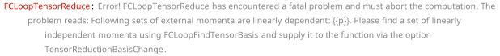
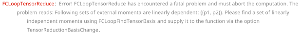

## FCLoopTensorReduce

`FCLoopTensorReduce[exp, topos]` performs tensor reduction for the numerators of multi-loop integrals present in `exp`. Notice that `exp` is expected to be the output of `FCLoopFindTopologies` where all loop integrals have been written as `fun[num, GLI[...]]` with `num` being the numerator to be acted upon.

The reduction is done only for loop momenta contracted with Dirac matrices, polarization vectors or Levi-Civita tensors. Scalar products with external momenta are left untouched. The goal is to rewrite everything in terms of scalar products involving only loop momenta and external momenta appearing in the given topology. These quantities can be then rewritten in terms of inverse propagators (`GLI`s with negative indices), so that the complete dependence on loop momenta will go into the `GLI`s.

Unlike `FCMultiLoopTID`, this function does not perform any partial fractioning or shifts in the loop momenta.

The default value for `fun` is  FCGV["GLIProduct"] set by the option `Head`

### See also

[Overview](Extra/FeynCalc.md), [FCLoopFindTopologies](FCLoopFindTopologies.md).

### Examples

1-loop tadpole topology

```mathematica
topo1 = FCTopology["tad1l", {SFAD[{q, m^2}]}, {q}, {}, {}, {}]
```

$$\text{FCTopology}\left(\text{tad1l},\left\{\frac{1}{(q^2-m^2+i \eta )}\right\},\{q\},\{\},\{\},\{\}\right)$$

```mathematica
amp1 = FCGV["GLIProduct"][GSD[q] . GAD[\[Mu]] . GSD[q], GLI["tad1l", {1}]]
```

$$\text{FCGV}(\text{GLIProduct})\left((\gamma \cdot q).\gamma ^{\mu }.(\gamma \cdot q),G^{\text{tad1l}}(1)\right)$$

```mathematica
amp1Red = FCLoopTensorReduce[amp1, {topo1}]
```

$$\text{FCGV}(\text{GLIProduct})\left(\frac{(2-D) q^2 \gamma ^{\mu }}{D},G^{\text{tad1l}}(1)\right)$$

```mathematica
topo2 = FCTopology[prop1l, {SFAD[{q, m^2}], SFAD[{q - p, m^2}]}, {q}, {p}, {}, {}]
```

$$\text{FCTopology}\left(\text{prop1l},\left\{\frac{1}{(q^2-m^2+i \eta )},\frac{1}{((q-p)^2-m^2+i \eta )}\right\},\{q\},\{p\},\{\},\{\}\right)$$

1-loop self-energy topology

```mathematica
amp2 = gliProduct[GSD[q] . GAD[\[Mu]] . GSD[q], GLI[prop1l, {1, 2}]]
```

$$\text{gliProduct}\left((\gamma \cdot q).\gamma ^{\mu }.(\gamma \cdot q),G^{\text{prop1l}}(1,2)\right)$$

```mathematica
amp2Red = FCLoopTensorReduce[amp2, {topo2}, Head -> gliProduct]
```

$$\text{gliProduct}\left(-\frac{2 D p^{\mu } \gamma \cdot p (p\cdot q)^2-2 p^2 \gamma ^{\mu } (p\cdot q)^2-D p^4 q^2 \gamma ^{\mu }+3 p^4 q^2 \gamma ^{\mu }-2 p^2 q^2 p^{\mu } \gamma \cdot p}{(1-D) p^4},G^{\text{prop1l}}(1,2)\right)$$

If the loop momenta are contracted with some external momenta that do not appear in the given integral topologies, they should be listed via the option `Uncontract`

```mathematica
amp3 = gliProduct[SPD[q, x], GLI[prop1l, {1, 2}]]
```

$$\text{gliProduct}\left(q\cdot x,G^{\text{prop1l}}(1,2)\right)$$

```mathematica
FCLoopTensorReduce[amp3, {topo2}, Uncontract -> {x}, Head -> gliProduct]
```

$$\text{gliProduct}\left(\frac{(p\cdot q) (p\cdot x)}{p^2},G^{\text{prop1l}}(1,2)\right)$$

2-loop self-energy topology

```mathematica
topo3 = FCTopology["prop2L", {SFAD[{q1, m^2}], SFAD[{q2, m^2}], SFAD[q1 - q2], SFAD[q1 - p], SFAD[q2 - p]}, {q1, q2}, {p}, {}, {}]
```

$$\text{FCTopology}\left(\text{prop2L},\left\{\frac{1}{(\text{q1}^2-m^2+i \eta )},\frac{1}{(\text{q2}^2-m^2+i \eta )},\frac{1}{((\text{q1}-\text{q2})^2+i \eta )},\frac{1}{((\text{q1}-p)^2+i \eta )},\frac{1}{((\text{q2}-p)^2+i \eta )}\right\},\{\text{q1},\text{q2}\},\{p\},\{\},\{\}\right)$$

```mathematica
amp3 = FCGV["GLIProduct"][GSD[q1] . GAD[\[Mu]] . GSD[q2], GLI["prop2L", {1, 1, 1, 1, 1}]]
```

$$\text{FCGV}(\text{GLIProduct})\left((\gamma \cdot \;\text{q1}).\gamma ^{\mu }.(\gamma \cdot \;\text{q2}),G^{\text{prop2L}}(1,1,1,1,1)\right)$$

```mathematica
amp3Red = FCLoopTensorReduce[amp3, {topo3}]
```

$$\text{FCGV}(\text{GLIProduct})\left(-\frac{p^4 (\text{q1}\cdot \;\text{q2}) \gamma ^{\text{\$AL}(\text{\$46})}.\gamma ^{\mu }.\gamma ^{\text{\$AL}(\text{\$46})}-p^2 (p\cdot \;\text{q1}) (p\cdot \;\text{q2}) \gamma ^{\text{\$AL}(\text{\$46})}.\gamma ^{\mu }.\gamma ^{\text{\$AL}(\text{\$46})}+D (p\cdot \;\text{q1}) (p\cdot \;\text{q2}) (\gamma \cdot p).\gamma ^{\mu }.(\gamma \cdot p)-p^2 (\text{q1}\cdot \;\text{q2}) (\gamma \cdot p).\gamma ^{\mu }.(\gamma \cdot p)}{(1-D) p^4},G^{\text{prop2L}}(1,1,1,1,1)\right)$$

Some choices of kinematics lead to the so-called zero Gram determinants, meaning that the external momenta are not linearly independent. This prevents the usual tensor reduction but can be handled via a basis change

```mathematica
FCClearScalarProducts[]
SPD[p] = 0;
```

```mathematica
FCLoopTensorReduce[amp3, {topo3}]
```



$$\text{\$Aborted}$$

Using `FCLoopFindTensorBasis` we can construct an alternative basis and supply it to the reduction procedure. In this case we need to introduce an auxiliary vector `n`. For simplicity, we choose it to be light-like

```mathematica
FCLoopFindTensorBasis[{p}, {}, n]
```

$$\{\{p,n\},\{\},\{\}\}$$

In this case to complete the reduction we need to use IBPs. Furthermore, the existing topology should be augmented to include the new auxiliary vector.

```mathematica
amp3red = FCLoopTensorReduce[amp3, {topo3}, TensorReductionBasisChange -> {{p} -> {p, n}}, AuxiliaryMomenta -> {n}, 
   FinalSubstitutions -> {SPD[n] -> 0}]
```

$$\text{FCGV}(\text{GLIProduct})\left(\frac{1}{(2-D) (n\cdot p)^2}\left((\text{q1}\cdot \;\text{q2}) \left(-\gamma ^{\text{\$AL}(\text{\$58})}.\gamma ^{\mu }.\gamma ^{\text{\$AL}(\text{\$58})}\right) (n\cdot p)^2+(n\cdot p) (n\cdot \;\text{q2}) (p\cdot \;\text{q1}) \gamma ^{\text{\$AL}(\text{\$58})}.\gamma ^{\mu }.\gamma ^{\text{\$AL}(\text{\$58})}+(n\cdot p) (n\cdot \;\text{q1}) (p\cdot \;\text{q2}) \gamma ^{\text{\$AL}(\text{\$58})}.\gamma ^{\mu }.\gamma ^{\text{\$AL}(\text{\$58})}-D (n\cdot \;\text{q1}) (n\cdot \;\text{q2}) (\gamma \cdot p).\gamma ^{\mu }.(\gamma \cdot p)-D (n\cdot \;\text{q2}) (p\cdot \;\text{q1}) (\gamma \cdot n).\gamma ^{\mu }.(\gamma \cdot p)-D (n\cdot \;\text{q1}) (p\cdot \;\text{q2}) (\gamma \cdot p).\gamma ^{\mu }.(\gamma \cdot n)-D (p\cdot \;\text{q1}) (p\cdot \;\text{q2}) (\gamma \cdot n).\gamma ^{\mu }.(\gamma \cdot n)+(n\cdot p) (\text{q1}\cdot \;\text{q2}) (\gamma \cdot n).\gamma ^{\mu }.(\gamma \cdot p)+(n\cdot p) (\text{q1}\cdot \;\text{q2}) (\gamma \cdot p).\gamma ^{\mu }.(\gamma \cdot n)+2 (n\cdot \;\text{q1}) (n\cdot \;\text{q2}) (\gamma \cdot p).\gamma ^{\mu }.(\gamma \cdot p)+(n\cdot \;\text{q2}) (p\cdot \;\text{q1}) (\gamma \cdot n).\gamma ^{\mu }.(\gamma \cdot p)-(n\cdot \;\text{q2}) (p\cdot \;\text{q1}) (\gamma \cdot p).\gamma ^{\mu }.(\gamma \cdot n)-(n\cdot \;\text{q1}) (p\cdot \;\text{q2}) (\gamma \cdot n).\gamma ^{\mu }.(\gamma \cdot p)+(n\cdot \;\text{q1}) (p\cdot \;\text{q2}) (\gamma \cdot p).\gamma ^{\mu }.(\gamma \cdot n)+2 (p\cdot \;\text{q1}) (p\cdot \;\text{q2}) (\gamma \cdot n).\gamma ^{\mu }.(\gamma \cdot n)\right),G^{\text{prop2L}}(1,1,1,1,1) \;\text{FCGV}(\text{AddPropagators})(\{n\})\right)$$

```mathematica
{newtopo, gliRule} = FCLoopAugmentTopology[topo3, {SFAD[{{0, q1 . n}}], SFAD[{{0, q2 . n}}]}]
```

$$\left\{\text{FCTopology}\left(\text{prop2LA},\left\{\frac{1}{(\text{q1}^2-m^2+i \eta )},\frac{1}{(\text{q2}^2-m^2+i \eta )},\frac{1}{((\text{q1}-\text{q2})^2+i \eta )},\frac{1}{((\text{q1}-p)^2+i \eta )},\frac{1}{((\text{q2}-p)^2+i \eta )},\frac{1}{(n\cdot \;\text{q1}+i \eta )},\frac{1}{(n\cdot \;\text{q2}+i \eta )}\right\},\{\text{q1},\text{q2}\},\{p,n\},\{\},\{\}\right),\text{FCGV}(\text{AddPropagators})(\{n\}) G^{\text{prop2L}}(\text{n1$\_$},\text{n2$\_$},\text{n3$\_$},\text{n4$\_$},\text{n5$\_$}):\to G^{\text{prop2LA}}(\text{n1},\text{n2},\text{n3},\text{n4},\text{n5},0,0)\right\}$$

In this form the expression can be converted into `GLI`s and passed to an IBP reduction tool

```mathematica
amp3red /. gliRule
```

$$\text{FCGV}(\text{GLIProduct})\left(\frac{1}{(2-D) (n\cdot p)^2}\left((\text{q1}\cdot \;\text{q2}) \left(-\gamma ^{\text{\$AL}(\text{\$58})}.\gamma ^{\mu }.\gamma ^{\text{\$AL}(\text{\$58})}\right) (n\cdot p)^2+(n\cdot p) (n\cdot \;\text{q2}) (p\cdot \;\text{q1}) \gamma ^{\text{\$AL}(\text{\$58})}.\gamma ^{\mu }.\gamma ^{\text{\$AL}(\text{\$58})}+(n\cdot p) (n\cdot \;\text{q1}) (p\cdot \;\text{q2}) \gamma ^{\text{\$AL}(\text{\$58})}.\gamma ^{\mu }.\gamma ^{\text{\$AL}(\text{\$58})}-D (n\cdot \;\text{q1}) (n\cdot \;\text{q2}) (\gamma \cdot p).\gamma ^{\mu }.(\gamma \cdot p)-D (n\cdot \;\text{q2}) (p\cdot \;\text{q1}) (\gamma \cdot n).\gamma ^{\mu }.(\gamma \cdot p)-D (n\cdot \;\text{q1}) (p\cdot \;\text{q2}) (\gamma \cdot p).\gamma ^{\mu }.(\gamma \cdot n)-D (p\cdot \;\text{q1}) (p\cdot \;\text{q2}) (\gamma \cdot n).\gamma ^{\mu }.(\gamma \cdot n)+(n\cdot p) (\text{q1}\cdot \;\text{q2}) (\gamma \cdot n).\gamma ^{\mu }.(\gamma \cdot p)+(n\cdot p) (\text{q1}\cdot \;\text{q2}) (\gamma \cdot p).\gamma ^{\mu }.(\gamma \cdot n)+2 (n\cdot \;\text{q1}) (n\cdot \;\text{q2}) (\gamma \cdot p).\gamma ^{\mu }.(\gamma \cdot p)+(n\cdot \;\text{q2}) (p\cdot \;\text{q1}) (\gamma \cdot n).\gamma ^{\mu }.(\gamma \cdot p)-(n\cdot \;\text{q2}) (p\cdot \;\text{q1}) (\gamma \cdot p).\gamma ^{\mu }.(\gamma \cdot n)-(n\cdot \;\text{q1}) (p\cdot \;\text{q2}) (\gamma \cdot n).\gamma ^{\mu }.(\gamma \cdot p)+(n\cdot \;\text{q1}) (p\cdot \;\text{q2}) (\gamma \cdot p).\gamma ^{\mu }.(\gamma \cdot n)+2 (p\cdot \;\text{q1}) (p\cdot \;\text{q2}) (\gamma \cdot n).\gamma ^{\mu }.(\gamma \cdot n)\right),G^{\text{prop2LA}}(1,1,1,1,1,0,0)\right)$$

Not all cases of zero Gram determinants require an auxiliary vector. If the new basis can be constructed from a subset of the present external momenta, this should be sufficient for the reduction. Consider e.g. this threshold kinematics

```mathematica
FCClearScalarProducts[]
SPD[p1] = mm;
SPD[p2] = mm;
SPD[p1, p2] = mm;
```

```mathematica
topo4 = FCTopology["tri1l", {SFAD[{q, m^2}], SFAD[{q - p1, 0}], SFAD[{q - p2, 0}]}, {q}, {p1, p2}, {}, {}]
```

$$\text{FCTopology}\left(\text{tri1l},\left\{\frac{1}{(q^2-m^2+i \eta )},\frac{1}{((q-\text{p1})^2+i \eta )},\frac{1}{((q-\text{p2})^2+i \eta )}\right\},\{q\},\{\text{p1},\text{p2}\},\{\},\{\}\right)$$

```mathematica
amp4 = FCGV["GLIProduct"][GSD[q] . GAD[\[Mu]] . GSD[r], GLI["tri1l", {1, 1, 1}]]
```

$$\text{FCGV}(\text{GLIProduct})\left((\gamma \cdot q).\gamma ^{\mu }.(\gamma \cdot r),G^{\text{tri1l}}(1,1,1)\right)$$

```mathematica
FCLoopTensorReduce[amp4, {topo4}]
```



$$\text{\$Aborted}$$

```mathematica
FCLoopFindTensorBasis[{p1, p2}, {}, n]
```

$$\left(
\begin{array}{c}
 \;\text{p1} \\
 \;\text{p2} \\
 \;\text{p2}\to \;\text{p1} \;\text{FCGV}(\text{Prefactor})(1) \\
\end{array}
\right)$$

Here the momenta p1 and p2 are obviously identical, so we need to do the reduction w.r.t p1 only

```mathematica
FCLoopTensorReduce[amp4, {topo4}, TensorReductionBasisChange -> {{p1, p2} -> {p1}}]
```

$$\text{FCGV}(\text{GLIProduct})\left(\frac{(\text{p1}\cdot q) (\gamma \cdot \;\text{p1}).\gamma ^{\mu }.(\gamma \cdot r)}{\text{mm}},G^{\text{tri1l}}(1,1,1)\right)$$