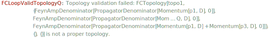

`FCLoopValidTopologyQ[topo]` returns `True` if `topo` is a valid `FCTopology` object or a list thereof.

### See also

[Overview](Extra/FeynCalc.md), [FCTopology](FCTopology.md).

### Examples

This is a valid topology: it has an id, a list of propagators, a list of loop and external momenta, a list of possible substitutions for kinematic invariants and an empty list reserved for future applications

```mathematica
{FAD[p1], FAD[p2], FAD[p3], FAD[Q - p1 - p2 - p3], FAD[Q - p1 - p2], FAD[Q - p1], FAD[Q - p2], FAD[p1 + p3]}
```

$$\left\{\frac{1}{\text{p1}^2},\frac{1}{\text{p2}^2},\frac{1}{\text{p3}^2},\frac{1}{(-\text{p1}-\text{p2}-\text{p3}+Q)^2},\frac{1}{(-\text{p1}-\text{p2}+Q)^2},\frac{1}{(Q-\text{p1})^2},\frac{1}{(Q-\text{p2})^2},\frac{1}{(\text{p1}+\text{p3})^2}\right\}$$

```mathematica
topo = FCTopology[topo1, {FAD[p1], FAD[p2], FAD[p3], FAD[Q - p1 - p2 - p3], FAD[Q - p1 - p2], 
    FAD[Q - p1], FAD[Q - p2], FAD[p1 + p3]}, {p1, p2, p3}, {Q}, {}, {}]
```

$$\text{FCTopology}\left(\text{topo1},\left\{\frac{1}{\text{p1}^2},\frac{1}{\text{p2}^2},\frac{1}{\text{p3}^2},\frac{1}{(-\text{p1}-\text{p2}-\text{p3}+Q)^2},\frac{1}{(-\text{p1}-\text{p2}+Q)^2},\frac{1}{(Q-\text{p1})^2},\frac{1}{(Q-\text{p2})^2},\frac{1}{(\text{p1}+\text{p3})^2}\right\},\{\text{p1},\text{p2},\text{p3}\},\{Q\},\{\},\{\}\right)$$

```mathematica
FCLoopValidTopologyQ[topo]
```

$$\text{True}$$

This topology is missing information about loop and external momenta

```mathematica
topoWrong = FCTopology[topo1, {FAD[p1], FAD[p2], FAD[Q - p1 - p2 - p3], FAD[Q - p1 - p2], 
    FAD[Q - p1], FAD[p1 + p3]}, {}, {}]
```

$$\text{FCTopology}\left(\text{topo1},\left\{\frac{1}{\text{p1}^2},\frac{1}{\text{p2}^2},\frac{1}{(-\text{p1}-\text{p2}-\text{p3}+Q)^2},\frac{1}{(-\text{p1}-\text{p2}+Q)^2},\frac{1}{(Q-\text{p1})^2},\frac{1}{(\text{p1}+\text{p3})^2}\right\},\{\},\{\}\right)$$

```mathematica
FCLoopValidTopologyQ[topoWrong] 
  
 

```



$$\text{False}$$
