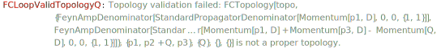

`FCReplaceMomenta[exp, rule]`  replaces the given momentum according to the specified replacement rules. Various options can be used to customize the replacement procedure.

### See also

[Overview](Extra/FeynCalc.md), [FCPermuteMomentaRules](FCPermuteMomentaRules.md).

### Examples

```mathematica
amp = (-I)*Spinor[-Momentum[l2], ME, 1] . GA[\[Mu]] . Spinor[Momentum[l1], ME, 1]*Spinor[Momentum[p1], SMP["m_Q"], 1] . GS[Polarization[kp, -I, Transversality -> True]] . (GS[kp + p1] + SMP["m_Q"]) . GA[\[Mu]] . Spinor[-Momentum[p2], SMP["m_Q"], 1]*FAD[kp + p1 + p2, Dimension -> 4]*FAD[{-l1 - l2 - p2, SMP["m_Q"]}, Dimension -> 4]*SDF[cq, cqbar]*SMP["e"]^3*SMP["Q_u"]^2
```

$$-\frac{i \;\text{e}^3 Q_u^2 \delta _{\text{cq}\;\text{cqbar}} \left(\varphi (-\overline{\text{l2}},\text{ME})\right).\bar{\gamma }^{\mu }.\left(\varphi (\overline{\text{l1}},\text{ME})\right) \left(\varphi (\overline{\text{p1}},m_Q)\right).\left(\bar{\gamma }\cdot \bar{\varepsilon }^*(\text{kp})\right).\left(\bar{\gamma }\cdot \left(\overline{\text{kp}}+\overline{\text{p1}}\right)+m_Q\right).\bar{\gamma }^{\mu }.\left(\varphi (-\overline{\text{p2}},m_Q)\right)}{(\overline{\text{kp}}+\overline{\text{p1}}+\overline{\text{p2}})^2 \left((-\overline{\text{l1}}-\overline{\text{l2}}-\overline{\text{p2}})^2-m_Q^2\right)}$$

```mathematica
FCReplaceMomenta[amp, {p1 -> P + 1/2 q, p2 -> P - 1/2 q}]
ClearAll[amp]
```

$$-\frac{i \;\text{e}^3 Q_u^2 \delta _{\text{cq}\;\text{cqbar}} \left(\varphi (-\overline{\text{l2}},\text{ME})\right).\bar{\gamma }^{\mu }.\left(\varphi (\overline{\text{l1}},\text{ME})\right) \left(\varphi (\overline{\text{p1}},m_Q)\right).\left(\bar{\gamma }\cdot \bar{\varepsilon }^*(\text{kp})\right).\left(\bar{\gamma }\cdot \overline{\text{kp}}+\bar{\gamma }\cdot \left(\overline{P}+\frac{\overline{q}}{2}\right)+m_Q\right).\bar{\gamma }^{\mu }.\left(\varphi (-\overline{\text{p2}},m_Q)\right)}{(\overline{\text{kp}}+2 \overline{P})^2 \left((-\overline{\text{l1}}-\overline{\text{l2}}-\overline{P}+\frac{\overline{q}}{2})^2-m_Q^2\right)}$$

Notice that `FCReplaceMomenta` is not suitable for expanding in 4-momenta (soft limits etc.) as it does not check for cases where a particular substitution yields a singularity. For example, the following code obviously returns a nonsensical result

```mathematica
FCClearScalarProducts[];
SPD[q] = 0;
FCReplaceMomenta[FAD[q + p], {p -> 0}]
FCClearScalarProducts[];
```

$$\frac{1}{0}$$

`FCReplaceMomenta` equally works with `FCTopology` objects. There it is actually the preferred way to perform momentum shifts. Consider e.g.

```mathematica
ex = FCTopology[topo, {SFAD[{{p1, 0}, {0, 1}, 1}], SFAD[{{p2 + p3, 0}, {0, 1}, 1}], SFAD[{{p2 - Q, 0}, {0, 1}, 1}], SFAD[{{p1 + p3 - Q, 0}, {0, 1}, 1}]}, {p1, p2, p3}, {Q}, {}, {}]
```

$$\text{FCTopology}\left(\text{topo},\left\{\frac{1}{(\text{p1}^2+i \eta )},\frac{1}{((\text{p2}+\text{p3})^2+i \eta )},\frac{1}{((\text{p2}-Q)^2+i \eta )},\frac{1}{((\text{p1}+\text{p3}-Q)^2+i \eta )}\right\},\{\text{p1},\text{p2},\text{p3}\},\{Q\},\{\},\{\}\right)$$

where we want to shift `p_2` to `p_2 + Q`. Doing so naively messes us the topology by invalidating the list of loop momenta

```mathematica
ex /. p2 -> p2 + Q
FCLoopValidTopologyQ[%]
```

$$\text{FCTopology}\left(\text{topo},\left\{\frac{1}{(\text{p1}^2+i \eta )},\frac{1}{((\text{p2}+\text{p3}+Q)^2+i \eta )},\frac{1}{(\text{p2}^2+i \eta )},\frac{1}{((\text{p1}+\text{p3}-Q)^2+i \eta )}\right\},\{\text{p1},\text{p2}+Q,\text{p3}\},\{Q\},\{\},\{\}\right)$$



$$\text{False}$$

Using `FCReplaceMomenta` we immediately get we want

```mathematica
FCReplaceMomenta[ex, {p2 -> p2 + Q}]
```

$$\text{FCTopology}\left(\text{topo},\left\{\frac{1}{(\text{p1}^2+i \eta )},\frac{1}{((\text{p2}+\text{p3}+Q)^2+i \eta )},\frac{1}{(\text{p2}^2+i \eta )},\frac{1}{((\text{p1}+\text{p3}-Q)^2+i \eta )}\right\},\{\text{p1},\text{p2},\text{p3}\},\{Q\},\{\},\{\}\right)$$
