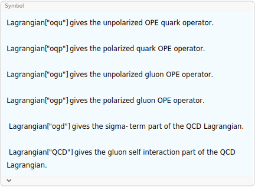
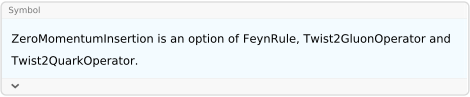

## FeynRule

`FeynRule[lag, {fields}]` derives the Feynman rule corresponding to the field configuration `fields` of the Lagrangian `lag`.

`FeynRule` does not calculate propagator Feynman rules.

The option `ZeroMomentumInsertion` can be used for twist-2 and higher twist operators.

`FeynRule` is not very versatile and was primarily developed for QCD calculations. It is often more useful when dealing with bosonic fields than with fermions. If you need a more powerful and universal solution for deriving Feynman rules, have a look at the standalone Mathematica Package FeynRules (not related to FeynCalc).

### See also

[Overview](Extra/FeynCalc.md)

### Examples

```mathematica
?Lagrangian
```



$\phi ^4$ Feynman rule

```mathematica
- \[Lambda]/4! QuantumField[\[Phi]]^4 
 
FeynRule[%, {QuantumField[\[Phi]][p1], QuantumField[\[Phi]][p2], 
   QuantumField[\[Phi]][p3], QuantumField[\[Phi]][p4]}]
```

$$-\frac{\lambda  \phi ^4}{24}$$

$$-i \lambda$$

Quark-gluon vertex Feynman rule

```mathematica
I QuantumField[AntiQuarkField] . GA[\[Mu]] . CovariantD[\[Mu]] . QuantumField[QuarkField] 
 
FeynRule[%, {QuantumField[GaugeField, {\[Mu]}, {a}][p1], 
   QuantumField[QuarkField][p2], QuantumField[AntiQuarkField][p3]}]
```

$$i \bar{\psi }.\bar{\gamma }^{\mu }.D_{\mu }.\psi$$

$$i T^a g_s \bar{\gamma }^{\mu }$$

4-gluon vertex Feynman rule

```mathematica
-(1/4) FieldStrength[\[Alpha], \[Beta], i] . FieldStrength[\[Alpha], \[Beta], i] 
 
FeynRule[%, {QuantumField[GaugeField, {\[Mu]}, {a}][p1], QuantumField[GaugeField, {\[Nu]}, {b}][p2], 
    QuantumField[GaugeField, {\[Rho]}, {c}][p3], QuantumField[GaugeField, {\[Sigma]}, {d}][p4]}] 
 
GluonVertex[{p, \[Mu], a}, {q, \[Nu], b}, {r, \[Rho], c}, {s, \[Sigma], d}, Dimension -> 4, Explicit -> True] 
 
FCCanonicalizeDummyIndices[% - %%] // Factor
```

$$-\frac{1}{4} F_{\alpha \beta }^i.F_{\alpha \beta }^i$$

$$i g_s^2 f^{ad\text{FCGV}(\text{si49})} f^{bc\text{FCGV}(\text{si49})} \left(\bar{g}^{\mu \rho } \bar{g}^{\nu \sigma }-\bar{g}^{\mu \nu } \bar{g}^{\rho \sigma }\right)+i g_s^2 f^{ac\text{FCGV}(\text{si49})} f^{bd\text{FCGV}(\text{si49})} \left(\bar{g}^{\mu \sigma } \bar{g}^{\nu \rho }-\bar{g}^{\mu \nu } \bar{g}^{\rho \sigma }\right)+i g_s^2 f^{ab\text{FCGV}(\text{si49})} f^{cd\text{FCGV}(\text{si49})} \left(\bar{g}^{\mu \sigma } \bar{g}^{\nu \rho }-\bar{g}^{\mu \rho } \bar{g}^{\nu \sigma }\right)$$

$$-i g_s^2 \left(f^{ad\text{FCGV}(\text{u56})} f^{bc\text{FCGV}(\text{u56})} \left(\bar{g}^{\mu \nu } \bar{g}^{\rho \sigma }-\bar{g}^{\mu \rho } \bar{g}^{\nu \sigma }\right)+f^{ac\text{FCGV}(\text{u56})} f^{bd\text{FCGV}(\text{u56})} \left(\bar{g}^{\mu \nu } \bar{g}^{\rho \sigma }-\bar{g}^{\mu \sigma } \bar{g}^{\nu \rho }\right)+f^{ab\text{FCGV}(\text{u56})} f^{cd\text{FCGV}(\text{u56})} \left(\bar{g}^{\mu \rho } \bar{g}^{\nu \sigma }-\bar{g}^{\mu \sigma } \bar{g}^{\nu \rho }\right)\right)$$

$$0$$

3-gluon vertex Feynman rule

```mathematica
-(1/4) FieldStrength[\[Alpha], \[Beta], i] . FieldStrength[\[Alpha], \[Beta], i] 
 
FeynRule[%, {QuantumField[GaugeField, {\[Mu]}, {a}][p], QuantumField[GaugeField, {\[Nu]}, {b}][q], 
    QuantumField[GaugeField, {\[Rho]}, {c}][r]}] 
 
GluonVertex[{p, \[Mu], a}, {q, \[Nu], b}, {r, \[Rho], c}, Dimension -> 4, Explicit -> True] 
 
ExpandScalarProduct[% - %%] // Factor
```

$$-\frac{1}{4} F_{\alpha \beta }^i.F_{\alpha \beta }^i$$

$$g_s f^{abc} \left(\bar{g}^{\mu \nu } \left(\overline{p}^{\rho }-\overline{q}^{\rho }\right)-\bar{g}^{\mu \rho } \left(\overline{p}^{\nu }-\overline{r}^{\nu }\right)+\bar{g}^{\nu \rho } \left(\overline{q}^{\mu }-\overline{r}^{\mu }\right)\right)$$

$$g_s f^{abc} \left(\bar{g}^{\mu \nu } \left(\overline{p}-\overline{q}\right)^{\rho }+\bar{g}^{\mu \rho } \left(\overline{r}-\overline{p}\right)^{\nu }+\bar{g}^{\nu \rho } \left(\overline{q}-\overline{r}\right)^{\mu }\right)$$

$$0$$

Higgs EFT interaction vertex

```mathematica
heftInt = -(1/4) CH FieldStrength[mu, nu, a] . FieldStrength[mu, nu, a] . QuantumField[H]
```

$$-\frac{1}{4} \;\text{CH} F_{\text{mu}\;\text{nu}}^a.F_{\text{mu}\;\text{nu}}^a.H$$

$Hgg$ vertex Feynman rules

```mathematica
FeynRule[heftInt, {QuantumField[GaugeField, {i}, {a}][p1], QuantumField[GaugeField, 
     {j}, {b}][p2], QuantumField[H][p3]}]
```

$$-i \;\text{CH} \delta ^{ab} \left(\overline{\text{p2}}^i \overline{\text{p1}}^j-\bar{g}^{ij} \left(\overline{\text{p1}}\cdot \overline{\text{p2}}\right)\right)$$

$Hggg$ vertex Feynman rules

```mathematica
FeynRule[heftInt, {QuantumField[GaugeField, {i}, {a}][p1], QuantumField[GaugeField, 
      {j}, {b}][p2], QuantumField[GaugeField, {k}, {c}][p3], QuantumField[H][p4]}] // Simplify
```

$$\text{CH} g_s f^{abc} \left(\bar{g}^{ij} \left(\overline{\text{p1}}^k-\overline{\text{p2}}^k\right)-\bar{g}^{ik} \left(\overline{\text{p1}}^j-\overline{\text{p3}}^j\right)+\bar{g}^{jk} \left(\overline{\text{p2}}^i-\overline{\text{p3}}^i\right)\right)$$

$Hgggg$ vertex Feynman rules

```mathematica
FeynRule[heftInt, {QuantumField[GaugeField, {i}, {a}][p1], QuantumField[GaugeField, {j}, 
       {b}][p2], QuantumField[GaugeField, {k}, {c}][p3], 
     QuantumField[GaugeField, {l}, {d}][p4], QuantumField[H][p5]}] // 
   FCCanonicalizeDummyIndices[#, SUNIndexNames -> {e}] & // Collect2[#, SUNF, 
    FCFactorOut -> I CH SMP["g_s"]^2] &
```

$$i \;\text{CH} g_s^2 \left(f^{ade} f^{bce} \left(\bar{g}^{ik} \bar{g}^{jl}-\bar{g}^{ij} \bar{g}^{kl}\right)+f^{ace} f^{bde} \left(\bar{g}^{il} \bar{g}^{jk}-\bar{g}^{ij} \bar{g}^{kl}\right)+f^{abe} f^{cde} \left(\bar{g}^{il} \bar{g}^{jk}-\bar{g}^{ik} \bar{g}^{jl}\right)\right)$$

Some OPE-related examples:

2-quark Feynman rules (unpolarized).

```mathematica
Lagrangian["oqu"]
FeynRule[%, {QuantumField[QuarkField][p], QuantumField[AntiQuarkField][q]}, 
   ZeroMomentumInsertion -> False] // Factor
```

$$i^m \bar{\psi }.\left(\bar{\gamma }\cdot \Delta \right).D_{\Delta }{}^{m-1}.\psi$$

$$-i i^m \left(\bar{\gamma }\cdot \Delta \right).\left(\vec{\partial }_{\Delta }\right){}^{m-1}$$

```mathematica
?ZeroMomentumInsertion
```



```mathematica
ExpandPartialD[Lagrangian["oqu"] /. OPEm -> 3]
```

$$i g_s^2 T^{\text{c152}}.T^{\text{c153}}.\left(\bar{\gamma }\cdot \Delta \right).\bar{\psi }.A_{\Delta }^{\text{c152}}.A_{\Delta }^{\text{c153}}.\psi -g_s T^{\text{c152}}.\left(\bar{\gamma }\cdot \Delta \right).\bar{\psi }.A_{\Delta }^{\text{c152}}.\left(\partial _{\Delta }\psi \right)-g_s T^{\text{c153}}.\left(\bar{\gamma }\cdot \Delta \right).\bar{\psi }.A_{\Delta }^{\text{c153}}.\left(\partial _{\Delta }\psi \right)-g_s T^{\text{c153}}.\left(\bar{\gamma }\cdot \Delta \right).\bar{\psi }.\left(\partial _{\Delta }A_{\Delta }^{\text{c153}}\right).\psi -i \left(\bar{\gamma }\cdot \Delta \right).\bar{\psi }.\left(\partial _{\Delta }\partial _{\Delta }\psi \right)$$

```mathematica
Lagrangian["oqu"]
FeynRule[% /. OPEm -> 3, {QuantumField[QuarkField][p], QuantumField[AntiQuarkField][q], 
   QuantumField[GaugeField, {\[Mu]}, {a}][r]}, ZeroMomentumInsertion -> True]
FCReplaceMomenta[%, {r -> -p - q}] // ExpandScalarProduct // Expand
```

$$i^m \bar{\psi }.\left(\bar{\gamma }\cdot \Delta \right).D_{\Delta }{}^{m-1}.\psi$$

$$T^a \Delta ^{\mu } g_s \left(-\left(\bar{\gamma }\cdot \Delta \right)\right) \left(2 \left(\Delta \cdot \overline{q}\right)+\Delta \cdot \overline{r}\right)$$

$$T^a \Delta ^{\mu } g_s \bar{\gamma }\cdot \Delta  \left(\Delta \cdot \overline{p}\right)-T^a \Delta ^{\mu } g_s \bar{\gamma }\cdot \Delta  \left(\Delta \cdot \overline{q}\right)$$

```mathematica
Lagrangian["oqu"]
FeynRule[% /. OPEm -> 4, {QuantumField[QuarkField][p], QuantumField[AntiQuarkField][q], 
   QuantumField[GaugeField, {\[Mu]}, {a}][r]}, ZeroMomentumInsertion -> True]
FCReplaceMomenta[%, {r -> -p - q}] // ExpandScalarProduct // Expand
```

$$i^m \bar{\psi }.\left(\bar{\gamma }\cdot \Delta \right).D_{\Delta }{}^{m-1}.\psi$$

$$T^a \Delta ^{\mu } g_s \bar{\gamma }\cdot \Delta  \left(3 (\Delta \cdot \overline{q})^2+(\Delta \cdot \overline{r})^2+3 \left(\Delta \cdot \overline{q}\right) \left(\Delta \cdot \overline{r}\right)\right)$$

$$T^a \Delta ^{\mu } g_s \bar{\gamma }\cdot \Delta  (\Delta \cdot \overline{p})^2+T^a \Delta ^{\mu } g_s \bar{\gamma }\cdot \Delta  (\Delta \cdot \overline{q})^2-T^a \Delta ^{\mu } g_s \bar{\gamma }\cdot \Delta  \left(\Delta \cdot \overline{p}\right) \left(\Delta \cdot \overline{q}\right)$$

2-gluon Feynman rules (unpolarized).

```mathematica
Lagrangian["ogu"]
FeynRule[%, {QuantumField[GaugeField, {\[Mu]}, {a}][p], QuantumField[GaugeField, {\[Nu]}, 
      {b}][q]}, ZeroMomentumInsertion -> False] // Factor
```

$$\frac{1}{2} i^{m-1} F_{\text{FCGV}(\alpha )\Delta }^{\text{FCGV}(\text{a})}.\left(D_{\Delta }^{\text{FCGV}(\text{a})\text{FCGV}(\text{b})}\right){}^{m-2}.F_{\text{FCGV}(\alpha )\Delta }^{\text{FCGV}(\text{b})}$$

$$-i^m \delta ^{ab} \left(\vec{\partial }_{\Delta }\right){}^{m-2} \left(-\bar{g}^{\mu \nu } \left(\Delta \cdot \overline{p}\right) \left(\Delta \cdot \overline{q}\right)+\Delta ^{\nu } \overline{q}^{\mu } \left(\Delta \cdot \overline{p}\right)+\Delta ^{\mu } \overline{p}^{\nu } \left(\Delta \cdot \overline{q}\right)-\Delta ^{\mu } \Delta ^{\nu } \left(\overline{p}\cdot \overline{q}\right)\right)$$

2-gluon Feynman rules (polarized).

```mathematica
Lagrangian["ogp"]
FeynRule[%, {QuantumField[GaugeField, {\[Mu]}, {a}][p], QuantumField[GaugeField, {\[Nu]}, 
       {b}][q]}, ZeroMomentumInsertion -> False] // Factor 
 
Factor2[Calc[% /. p -> -q, Assumptions -> Automatic]]
```

$$\frac{1}{2} i^m \bar{\epsilon }^{\text{FCGV}(\alpha )\text{FCGV}(\beta )\text{FCGV}(\gamma )\Delta }.F_{\text{FCGV}(\beta )\text{FCGV}(\gamma )}^{\text{FCGV}(\text{a})}.\left(D_{\Delta }^{\text{FCGV}(\text{a})\text{FCGV}(\text{b})}\right){}^{m-2}.F_{\text{FCGV}(\alpha )\Delta }^{\text{FCGV}(\text{b})}$$

$$i^{m+1} \delta ^{ab} \left(\vec{\partial }_{\Delta }\right){}^{m-2} \left(\Delta ^{\mu } \bar{\epsilon }^{\nu \Delta \overline{p}\overline{q}}-\Delta ^{\nu } \bar{\epsilon }^{\mu \Delta \overline{p}\overline{q}}-\left(\Delta \cdot \overline{p}\right) \bar{\epsilon }^{\mu \nu \Delta \overline{q}}+\left(\Delta \cdot \overline{q}\right) \bar{\epsilon }^{\mu \nu \Delta \overline{p}}\right)$$

$$0$$

Compare with the Feynman rule tabulated in Twist2GluonOperator.

```mathematica
Twist2GluonOperator[q, {\[Mu], a}, {\[Nu], b}, Polarization -> 1, Explicit -> True]
```

$$i \left(1-(-1)^m\right) \delta ^{ab} (\Delta \cdot q)^{m-1} \overset{\text{}}{\epsilon }^{\mu \nu \Delta q}$$

quark-quark -gluon-gluon Feynman rule (unpolarized).

```mathematica
Lagrangian["oqu"] 
 
frule = FeynRule[%, {QuantumField[QuarkField][p], QuantumField[AntiQuarkField][q], 
     QuantumField[GaugeField, {\[Mu]}, {a}][r], QuantumField[GaugeField, {\[Nu]}, {b}][s]}, 
    ZeroMomentumInsertion -> True, InitialFunction -> Identity];
```

$$i^m \bar{\psi }.\left(\bar{\gamma }\cdot \Delta \right).D_{\Delta }{}^{m-1}.\psi$$


$$\text{\$Aborted}$$

```mathematica
LeafCount[frule]
```

$$1$$

```mathematica
Twist2QuarkOperator[{p}, {q}, {r, \[Mu], a}, {s, \[Nu], b}, Polarization -> 0]
```

$$-(-1)^m \Delta ^{\mu } \Delta ^{\nu } g_s^2 \left(\bar{\gamma }\cdot \Delta \right).\left(T^a.T^b \left(\sum _{i=0}^{-3+m} \;\text{}\;\text{} (i+1)(\Delta \cdot q)^j (-(\Delta \cdot p))^{-i+m-3} (\Delta \cdot q+\Delta \cdot r)^{i-j}\right)+T^b.T^a \left(\sum _{i=0}^{-3+m} \;\text{}\;\text{} (i+1)(\Delta \cdot q)^j (-(\Delta \cdot p))^{-i+m-3} (\Delta \cdot q+\Delta \cdot s)^{i-j}\right)\right)$$

```mathematica
(*Twist2QuarkOperator[{p},{q},{r,\[Mu],a},{s,\[Nu],b},Polarization->0]
Calc[frule-%%/.OPEm->5/.s->-p-q-r/.D->4]*)
```