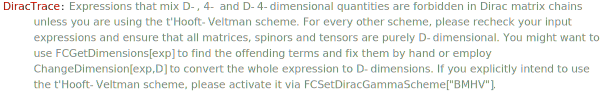

## GSE

`GSE[p]` can be used as input for a $D-4$-dimensional $\gamma \cdot p = \gamma^\mu p_\mu$ and is transformed into `DiracGamma[Momentum[p,D-4],D-4]` by `FeynCalcInternal` (`FCI`). `GSE[p,q, ...]` is a short form for `GSE[p].GSE[q]. ...`.

### See also

[Overview](Extra/FeynCalc.md), [DiracGamma](DiracGamma.md), [GA](GA.md), [GAD](GAD.md), [GSD](GSD.md).

### Examples

```mathematica
GSE[p]
```

$$\hat{\gamma }\cdot \hat{p}$$

```mathematica
GSE[p] // FCI // StandardForm

(*DiracGamma[Momentum[p, -4 + D], -4 + D]*)
```

```mathematica
GSE[p, q, r, s]
```

$$\left(\hat{\gamma }\cdot \hat{p}\right).\left(\hat{\gamma }\cdot \hat{q}\right).\left(\hat{\gamma }\cdot \hat{r}\right).\left(\hat{\gamma }\cdot \hat{s}\right)$$

```mathematica
GSE[p, q, r, s] // StandardForm

(*GSE[p] . GSE[q] . GSE[r] . GSE[s]*)
```

```mathematica
GSE[q] . (GSE[p] + m) . GSE[q]
```

$$\left(\hat{\gamma }\cdot \hat{q}\right).\left(m+\hat{\gamma }\cdot \hat{p}\right).\left(\hat{\gamma }\cdot \hat{q}\right)$$

In order to use Dirac algebra with $D-4$ dimensional objects you need to activate the t'Hooft-Veltman-Breitenlohner-Maison scheme first

```mathematica
FCSetDiracGammaScheme["NDR"]; 
 
DiracSimplify[GSE[q] . GS[q] . GSE[q]]
```



$$\text{\$Aborted}$$

```mathematica
FCSetDiracGammaScheme["BMHV"]; 
 
DiracSimplify[GSE[q] . GS[q] . GSE[q]]
```

$$\hat{q}^2 \left(-\left(\bar{\gamma }\cdot \overline{q}\right)\right)$$

```mathematica
FCSetDiracGammaScheme["NDR"];
```