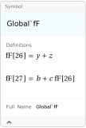

## Isolate

`Isolate[expr]` substitutes abbreviations `KK[i]` for all `Plus[...]` (sub-sums) in `expr`. The inserted `KK[i]` have head `HoldForm`. `Isolate[expr, varlist]` substitutes `KK[i]` for all subsums in `expr` which are free of any occurrence of a member of the list `varlist`. Instead of `KK` any other head or a list of names of the abbreviations may be specified with the option `IsolateNames`.

### See also

[Overview](Extra/FeynCalc.md), [IsolateNames](IsolateNames.md), [Collect2](Collect2.md).

### Examples

```mathematica
t0 = Isolate[a + b]
```

$$\text{KK}(24)$$

```mathematica
t1 = Isolate[(a + b) f + (c + d) f + e, f]
```

$$e+f \;\text{KK}(24)+f \;\text{KK}(25)$$

```mathematica
StandardForm[t1]
```

$$e+f \;\text{KK}[24]+f \;\text{KK}[25]$$

```mathematica
{t0, t1, ReleaseHold[t1]}
```

$$\{\text{KK}(24),e+f \;\text{KK}(24)+f \;\text{KK}(25),f (a+b)+f (c+d)+e\}$$

```mathematica
Isolate[a[z] (b + c (y + z)) + d[z] (y + z), {a, d}, IsolateNames -> fF]
```

$$\text{fF}(27) a(z)+\text{fF}(26) d(z)$$

```mathematica
Information[fF]
```



```mathematica
Global`fF
```

$$\text{fF}$$

```mathematica
fF[26] = y + z
```

$$y+z$$

```mathematica
fF[27] = b + c HoldForm[fF[26]]
```

$$b+c \;\text{fF}(26)$$

```mathematica
Isolate[a - b - c - d - e, IsolateNames -> l, IsolateSplit -> 15]
```

$$l(29)$$

```mathematica
Clear[t0, t1, l, fF]
```
