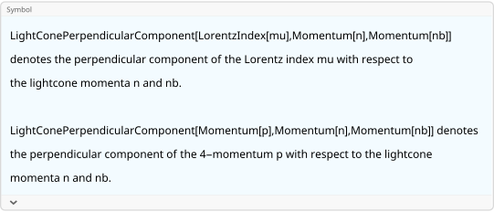

## Light-cone formalism

### See also

[Overview](Extra/FeynCalc.md).

### Notation for light-cone components

FeynCalc is equipped with special symbols that facilitate calculations involving light-cone vectors. The default $n$ and $\bar{n}$ vectors are defined via the global variables `$FCDefaultLightconeVectorN` and `$FCDefaultLightconeVectorNB`. By default those are set to `FCGV["n"]` and `FCGV["nb"]` to avoid possible conflicts with user-defined variables

```mathematica
{$FCDefaultLightconeVectorN, $FCDefaultLightconeVectorNB}
```

$$\{\text{FCGV}(\text{n}),\text{FCGV}(\text{nb})\}$$

These names can be of course changed. A particularly convenient choice is to use `n` and `nb`. Notice that these commands must be evaluated at the beginning of every FeynCalc session

```mathematica
$FCDefaultLightconeVectorN = n;
$FCDefaultLightconeVectorNB = nb;
```

Apart from this you must also explicitly define the values of the scalar products $n^2$, $\bar{n}^2$ and $n \cdot \bar{n}$

```mathematica
FCClearScalarProducts[]
ScalarProduct[n] = 0;
ScalarProduct[nb] = 0;
ScalarProduct[n, nb] = 2;
```

The Plus, Minus and peRpendicular components of 4-vectors are called `FVLP`, `FVLN` and `FVLR` respectively. The plus and minus components are immediately rewritten into forms involving $n$ and $\bar{n}$. The perpendicular component is a separate entity that cannot be simplified further.

```mathematica
{FVLP[p, \[Mu]], FVLN[p, \[Mu]], FVLR[p, \[Mu]]}
```

$$\left\{\frac{1}{2} \overline{\text{nb}}^{\mu } \left(\overline{n}\cdot \overline{p}\right),\frac{1}{2} \overline{n}^{\mu } \left(\overline{\text{nb}}\cdot \overline{p}\right),\overline{p}^{\mu }{}_{\perp }\right\}$$

```mathematica
{FVLPD[p, \[Mu]], FVLND[p, \[Mu]], FVLRD[p, \[Mu]]}
```

$$\left\{\frac{1}{2} \;\text{nb}^{\mu } (n\cdot p),\frac{1}{2} n^{\mu } (\text{nb}\cdot p),p^{\mu }{}_{\perp }\right\}$$

It is also possible to specify your own symbols for the light-cone vectors thus overriding what is set via the global variables

```mathematica
FVLR[p, mu, myN, myNB]
% // FCI // StandardForm
```

$$\overline{p}^{\text{mu}}{}_{\perp }$$

```mathematica
(*Pair[LightConePerpendicularComponent[LorentzIndex[mu], Momentum[myN], Momentum[myNB]], LightConePerpendicularComponent[Momentum[p], Momentum[myN], Momentum[myNB]]]*)
```

Internally, the perpendicular component is implemented as an extra head wrapped around such internal symbols as `LorentzIndex` or `Momentum`. This head is called `LightConePerpendicularComponent` and has 3 arguments. The last two arguments specify the light-cone vectors.

```mathematica
?LightConePerpendicularComponent
```



The pattern introduced for 4-vectors can be also found when working scalar products, metric tensors or Dirac matrices

```mathematica
{SPLP[p, q], SPLN[p, q], SPLR[p, q]}
```

$$\left\{\frac{1}{2} \left(\overline{n}\cdot \overline{p}\right) \left(\overline{\text{nb}}\cdot \overline{q}\right),\frac{1}{2} \left(\overline{n}\cdot \overline{q}\right) \left(\overline{\text{nb}}\cdot \overline{p}\right),\overline{p}\cdot \overline{q}_{\perp }\right\}$$

```mathematica
{SPLPD[p, q], SPLND[p, q], SPLRD[p, q]}
```

$$\left\{\frac{1}{2} (n\cdot p) (\text{nb}\cdot q),\frac{1}{2} (n\cdot q) (\text{nb}\cdot p),p\cdot q_{\perp }\right\}$$

```mathematica
{MTLP[\[Mu], \[Nu]], MTLN[\[Mu], \[Nu]], MTLR[\[Mu], \[Nu]]}
```

$$\left\{\frac{1}{2} \overline{n}^{\nu } \overline{\text{nb}}^{\mu },\frac{1}{2} \overline{n}^{\mu } \overline{\text{nb}}^{\nu },\bar{g}^{\mu \nu }{}_{\perp }\right\}$$

```mathematica
{GALP[\[Mu]], GALN[\[Mu]], GALR[\[Mu]]}
```

$$\left\{\frac{1}{2} \overline{\text{nb}}^{\mu } \bar{\gamma }\cdot \overline{n},\frac{1}{2} \overline{n}^{\mu } \bar{\gamma }\cdot \overline{\text{nb}},\bar{\gamma }^{\mu }{}_{\perp }\right\}$$

```mathematica
{GSLP[\[Mu]], GSLN[\[Mu]], GSLR[\[Mu]]}
```

$$\left\{\frac{1}{2} \bar{\gamma }\cdot \overline{n} \left(\overline{\text{nb}}\cdot \overline{\mu }\right),\frac{1}{2} \left(\overline{n}\cdot \overline{\mu }\right) \bar{\gamma }\cdot \overline{\text{nb}},\bar{\gamma }\cdot \overline{\mu }_{\perp }\right\}$$

Contracting the full metric tensor with the perpendicular component returns the latter

```mathematica
MT[\[Mu], \[Nu]] MTLR[\[Mu], \[Rho]]
% // Contract
```

$$\bar{g}^{\mu \nu } \bar{g}^{\mu \rho }{}_{\perp }$$

$$\bar{g}^{\nu \rho }{}_{\perp }$$

The dimensionality of the perpendicular component is $2$ in $4$-dimensions and $D-2$ in $D$-dimensions

```mathematica
MT[\[Mu], \[Nu]] MTLR[\[Mu], \[Nu]]
% // Contract
```

$$\bar{g}^{\mu \nu } \bar{g}^{\mu \nu }{}_{\perp }$$

$$2$$

```mathematica
MTD[\[Mu], \[Nu]] MTLRD[\[Mu], \[Nu]]
% // Contract
```

$$g^{\mu \nu } g^{\mu \nu }{}_{\perp }$$

$$D-2$$

### Dirac matrices with light-cone components

Dirac algebra involving matrices contracted to light-cone momenta or having particular light-cone components is fully supported. The general strategy followed by `DiracSimplify` is to move all perpendicular components to the very right of the chain.

```mathematica
ex1 = GALR[p] . GA[\[Mu], \[Nu]]
```

$$\bar{\gamma }^p{}_{\perp }.\bar{\gamma }^{\mu }.\bar{\gamma }^{\nu }$$

```mathematica
ex1 // DiracSimplify
```

$$-\frac{1}{2} \overline{n}^{\mu } \left(\bar{\gamma }\cdot \overline{\text{nb}}\right).\bar{\gamma }^p{}_{\perp }.\bar{\gamma }^{\nu }{}_{\perp }-\frac{1}{2} \overline{\text{nb}}^{\mu } \left(\bar{\gamma }\cdot \overline{n}\right).\bar{\gamma }^p{}_{\perp }.\bar{\gamma }^{\nu }{}_{\perp }+\frac{1}{2} \overline{n}^{\nu } \left(\bar{\gamma }\cdot \overline{\text{nb}}\right).\bar{\gamma }^p{}_{\perp }.\bar{\gamma }^{\mu }{}_{\perp }+\frac{1}{4} \overline{n}^{\nu } \overline{\text{nb}}^{\mu } \left(\bar{\gamma }\cdot \overline{n}\right).\left(\bar{\gamma }\cdot \overline{\text{nb}}\right).\bar{\gamma }^p{}_{\perp }+\frac{1}{2} \overline{\text{nb}}^{\nu } \left(\bar{\gamma }\cdot \overline{n}\right).\bar{\gamma }^p{}_{\perp }.\bar{\gamma }^{\mu }{}_{\perp }-\frac{1}{4} \overline{n}^{\mu } \overline{\text{nb}}^{\nu } \left(\bar{\gamma }\cdot \overline{n}\right).\left(\bar{\gamma }\cdot \overline{\text{nb}}\right).\bar{\gamma }^p{}_{\perp }+\overline{n}^{\mu } \overline{\text{nb}}^{\nu } \bar{\gamma }^p{}_{\perp }+\bar{\gamma }^p{}_{\perp }.\bar{\gamma }^{\mu }{}_{\perp }.\bar{\gamma }^{\nu }{}_{\perp }$$

```mathematica
ex2 = GALR[p] . GA[\[Mu], \[Nu]] . GALR[p]
```

$$\bar{\gamma }^p{}_{\perp }.\bar{\gamma }^{\mu }.\bar{\gamma }^{\nu }.\bar{\gamma }^p{}_{\perp }$$

```mathematica
ex2 // DiracSimplify
```

$$-2 \bar{\gamma }^{\mu }{}_{\perp }.\bar{\gamma }^{\nu }{}_{\perp }+4 \bar{g}^{\mu \nu }{}_{\perp }+\frac{1}{2} \overline{n}^{\nu } \overline{\text{nb}}^{\mu } \left(\bar{\gamma }\cdot \overline{n}\right).\left(\bar{\gamma }\cdot \overline{\text{nb}}\right)-\frac{1}{2} \overline{n}^{\mu } \overline{\text{nb}}^{\nu } \left(\bar{\gamma }\cdot \overline{n}\right).\left(\bar{\gamma }\cdot \overline{\text{nb}}\right)+2 \overline{n}^{\mu } \overline{\text{nb}}^{\nu }$$

Notice that when entering particular light-cone components of Dirac matrices, the standard trick for entering multiple indices does not work. This is because the 2nd and 3rd arguments are reserved for user-specified light-cone vectors

```mathematica
GALR[mu1, myN, myNB]
% // FCI // StandardForm
```

$$\bar{\gamma }^{\text{mu1}}{}_{\perp }$$

```mathematica
(*DiracGamma[LightConePerpendicularComponent[LorentzIndex[mu1], Momentum[myN], Momentum[myNB]]]*)
```

Instead, you should put your list of indices into curly brackets

```mathematica
GALR[{\[Mu], \[Nu], \[Rho]}]
```

$$\bar{\gamma }^{\mu }{}_{\perp }.\bar{\gamma }^{\nu }{}_{\perp }.\bar{\gamma }^{\rho }{}_{\perp }$$

```mathematica
ex3 = GALR[p] . GALR[{\[Mu], \[Nu]}] . GALR[p]
```

$$\bar{\gamma }^p{}_{\perp }.\bar{\gamma }^{\mu }{}_{\perp }.\bar{\gamma }^{\nu }{}_{\perp }.\bar{\gamma }^p{}_{\perp }$$

```mathematica
ex3 // DiracSimplify
```

$$4 \bar{g}^{\mu \nu }{}_{\perp }-2 \bar{\gamma }^{\mu }{}_{\perp }.\bar{\gamma }^{\nu }{}_{\perp }$$

```mathematica
ex4 = DiracTrace[GA[\[Rho], \[Sigma]] . GALR[{\[Mu], \[Nu]}]]
```

$$\text{tr}\left(\bar{\gamma }^{\rho }.\bar{\gamma }^{\sigma }.\bar{\gamma }^{\mu }{}_{\perp }.\bar{\gamma }^{\nu }{}_{\perp }\right)$$

```mathematica
ex4 // DiracSimplify
```

$$4 \bar{g}^{\mu \sigma }{}_{\perp } \bar{g}^{\nu \rho }{}_{\perp }-4 \bar{g}^{\mu \rho }{}_{\perp } \bar{g}^{\nu \sigma }{}_{\perp }+4 \bar{g}^{\rho \sigma } \bar{g}^{\mu \nu }{}_{\perp }$$

```mathematica
ex5 = DiracTrace[GA[\[Rho], \[Sigma]] . GA[5] . GALR[{\[Mu], \[Nu]}]]
```

$$\text{tr}\left(\bar{\gamma }^{\rho }.\bar{\gamma }^{\sigma }.\bar{\gamma }^5.\bar{\gamma }^{\mu }{}_{\perp }.\bar{\gamma }^{\nu }{}_{\perp }\right)$$

```mathematica
ex5 // DiracSimplify
```

$$2 i \overline{n}^{\rho } \bar{\epsilon }^{\mu _{\perp }\nu _{\perp }\sigma _{\perp }\;\overline{\text{nb}}}+2 i \overline{\text{nb}}^{\rho } \bar{\epsilon }^{\mu _{\perp }\nu _{\perp }\sigma _{\perp }\overline{n}}-2 i \overline{n}^{\sigma } \bar{\epsilon }^{\mu _{\perp }\nu _{\perp }\rho _{\perp }\;\overline{\text{nb}}}-i \overline{n}^{\sigma } \overline{\text{nb}}^{\rho } \bar{\epsilon }^{\mu _{\perp }\nu _{\perp }\overline{n}\;\overline{\text{nb}}}-2 i \overline{\text{nb}}^{\sigma } \bar{\epsilon }^{\mu _{\perp }\nu _{\perp }\rho _{\perp }\overline{n}}+i \overline{n}^{\rho } \overline{\text{nb}}^{\sigma } \bar{\epsilon }^{\mu _{\perp }\nu _{\perp }\overline{n}\;\overline{\text{nb}}}-4 i \bar{\epsilon }^{\mu _{\perp }\nu _{\perp }\rho _{\perp }\sigma _{\perp }}$$

### Introducing light-cone components by hand

In some calculations one might end up with a mixture of explicit light-cone components and generic Lorentz tensors. If those tensors admit a particularly simple representation in terms of light-cone components, it can be enforced using the function `ToLightConeComponents`

For example, the following expression cannot be simplified any further

```mathematica
ex6 = GS[nb, vp]
```

$$\left(\bar{\gamma }\cdot \overline{\text{nb}}\right).\left(\bar{\gamma }\cdot \overline{\text{vp}}\right)$$

Now let us suppose that $(v')^{\mu}$ can be actually written as $\alpha n^\mu + \bar{n}^{\mu}/(4 \alpha)$. We can implement this as  follows

```mathematica
SP[vp, nb] = 2*alpha;
SP[vp, n] = 2*1/(4 alpha);
LightConePerpendicularComponent[Momentum[vp], Momentum[n], Momentum[nb]] = 0;
```

```mathematica
FV[vp, mu]
% // ToLightConeComponents
```

$$\overline{\text{vp}}^{\text{mu}}$$

$$\text{alpha} \overline{n}^{\text{mu}}+\frac{\overline{\text{nb}}^{\text{mu}}}{4 \;\text{alpha}}$$

However, this will not make FeynCalc automatically simplify the Dirac chain

```mathematica
ex6 // DiracSimplify
```

$$\left(\bar{\gamma }\cdot \overline{\text{nb}}\right).\left(\bar{\gamma }\cdot \overline{\text{vp}}\right)$$

Using `ToLightConeComponents` we can explicitly rewrite `vp` in the chain in terms of the light-cone components and hence enforce the desired simplification. In fact, the function will also automatically simplify some common expressions such $\gamma \cdot \bar{n} \gamma \cdot \bar{n} = \gamma \cdot n \gamma \cdot n = 0$

```mathematica
ex6 // ToLightConeComponents
% // DiracSimplify
```

$$\text{alpha} \left(\bar{\gamma }\cdot \overline{\text{nb}}\right).\left(\bar{\gamma }\cdot \overline{n}\right)$$

$$4 \;\text{alpha}-\text{alpha} \left(\bar{\gamma }\cdot \overline{n}\right).\left(\bar{\gamma }\cdot \overline{\text{nb}}\right)$$

Such simplifications inside `ToLightConeComponents` can be disabled using the option `DotSimplify`

```mathematica
ex6 // ToLightConeComponents[#, DotSimplify -> False] &
% // DiracSimplify
```

$$\left(\bar{\gamma }\cdot \overline{\text{nb}}\right).\left(\text{alpha} \bar{\gamma }\cdot \overline{n}+\frac{\bar{\gamma }\cdot \overline{\text{nb}}}{4 \;\text{alpha}}\right)$$

$$4 \;\text{alpha}-\text{alpha} \left(\bar{\gamma }\cdot \overline{n}\right).\left(\bar{\gamma }\cdot \overline{\text{nb}}\right)$$

### Reductions of loop integrals with numerators involving light-cone components

```mathematica
int = FVLRD[p, \[Mu]] SFAD[p, p - q]
```

$$\frac{p^{\mu }{}_{\perp }}{(p^2+i \eta ).((p-q)^2+i \eta )}$$

```mathematica
TID[int, p]
```

$$\frac{q^{\mu }{}_{\perp }}{2 (p^2+i \eta ).((p-q)^2+i \eta )}$$

### Differentiations

`FourDivergence` cannot yet differentiate w.r.t light-cone components directly. However, the same effect can be easily achieved by first differentiating w.r.t the usual 4-momentum and then contracting the free index with the corresponding metric tensor

```mathematica
ex = FV[p1, \[Mu]]/SP[p1]
```

$$\frac{\overline{\text{p1}}^{\mu }}{\overline{\text{p1}}^2}$$

Differentiating w.r.t $p_{1,+}$, $p_{1,-}$ or $p_{1,\perp}$

```mathematica
MTLN[\[Nu], \[Rho]] FourDivergence[ex, FV[p1, \[Rho]]] // Contract
```

$$\frac{\overline{n}^{\nu } \overline{\text{nb}}^{\mu }}{2 \overline{\text{p1}}^2}-\frac{\overline{n}^{\nu } \overline{\text{p1}}^{\mu } \left(\overline{\text{nb}}\cdot \overline{\text{p1}}\right)}{\overline{\text{p1}}^4}$$

```mathematica
MTLP[\[Nu], \[Rho]] FourDivergence[ex, FV[p1, \[Rho]]] // Contract
```

$$\frac{\overline{n}^{\mu } \overline{\text{nb}}^{\nu }}{2 \overline{\text{p1}}^2}-\frac{\overline{\text{nb}}^{\nu } \overline{\text{p1}}^{\mu } \left(\overline{n}\cdot \overline{\text{p1}}\right)}{\overline{\text{p1}}^4}$$

```mathematica
MTLR[\[Nu], \[Rho]] FourDivergence[ex, FV[p1, \[Rho]]] // Contract
```

$$\frac{\bar{g}^{\mu \nu }{}_{\perp }}{\overline{\text{p1}}^2}-\frac{2 \overline{\text{p1}}^{\mu } \overline{\text{p1}}^{\nu }{}_{\perp }}{\overline{\text{p1}}^4}$$