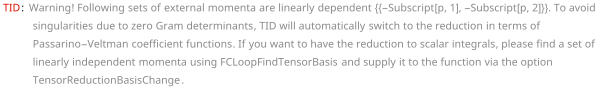

## TID

`TID[amp, q]` performs  tensor decomposition of 1-loop integrals with loop momentum `q`.

### See also

[Overview](Extra/FeynCalc.md), [OneLoopSimplify](OneLoopSimplify.md), [TIDL](TIDL.md), [PaVeLimitTo4](PaVeLimitTo4.md).

### Examples

```mathematica
FCClearScalarProducts[];
```

```mathematica
int = FAD[{k, m}, k - Subscript[p, 1], k - Subscript[p, 2]] FVD[k, \[Mu]] // FCI
```

$$\frac{k^{\mu }}{\left(k^2-m^2\right).(k-p_1){}^2.(k-p_2){}^2}$$

By default, all tensor integrals are reduced to the Passarino-Veltman scalar integrals $A_0$, $B_0$, $C_0$, $D_0$ etc.

```mathematica
TID[int, k]
```

$$\frac{p_1{}^2 p_2{}^{\mu }-p_1{}^{\mu } \left(p_1\cdot p_2\right)}{2 \left((p_1\cdot p_2){}^2-p_1{}^2 p_2{}^2\right) k^2.\left((k+p_1){}^2-m^2\right)}-\frac{p_2{}^2 \left(m^2+p_1{}^2\right) p_1{}^{\mu }+p_1{}^2 \left(m^2+p_2{}^2\right) p_2{}^{\mu }+\left(m^2+p_1{}^2\right) \left(-p_2{}^{\mu }\right) \left(p_1\cdot p_2\right)-\left(m^2+p_2{}^2\right) p_1{}^{\mu } \left(p_1\cdot p_2\right)}{2 \left((p_1\cdot p_2){}^2-p_1{}^2 p_2{}^2\right) \left(k^2-m^2\right).(k-p_1){}^2.(k-p_2){}^2}-\frac{p_2{}^{\mu } \left(p_1\cdot p_2\right)-p_2{}^2 p_1{}^{\mu }}{2 \left((p_1\cdot p_2){}^2-p_1{}^2 p_2{}^2\right) k^2.\left((k+p_2){}^2-m^2\right)}-\frac{p_1{}^2 p_2{}^{\mu }+p_2{}^2 p_1{}^{\mu }-p_1{}^{\mu } \left(p_1\cdot p_2\right)-p_2{}^{\mu } \left(p_1\cdot p_2\right)}{2 k^2.(k-p_1+p_2){}^2 \left((p_1\cdot p_2){}^2-p_1{}^2 p_2{}^2\right)}$$

Scalar integrals can be converted to the Passarino-Veltman notation via the option `ToPaVe`

```mathematica
TID[int, k, ToPaVe -> True]
```

$$\frac{i \pi ^2 \left(p_1{}^2 p_2{}^{\mu }-p_1{}^{\mu } \left(p_1\cdot p_2\right)\right) \;\text{B}_0\left(p_1{}^2,0,m^2\right)}{2 \left((p_1\cdot p_2){}^2-p_1{}^2 p_2{}^2\right)}-\frac{i \pi ^2 \left(p_2{}^{\mu } \left(p_1\cdot p_2\right)-p_2{}^2 p_1{}^{\mu }\right) \;\text{B}_0\left(p_2{}^2,0,m^2\right)}{2 \left((p_1\cdot p_2){}^2-p_1{}^2 p_2{}^2\right)}-\frac{i \pi ^2 \left(p_1{}^2 p_2{}^{\mu }+p_2{}^2 p_1{}^{\mu }-p_1{}^{\mu } \left(p_1\cdot p_2\right)-p_2{}^{\mu } \left(p_1\cdot p_2\right)\right) \;\text{B}_0\left(p_1{}^2-2 \left(p_1\cdot p_2\right)+p_2{}^2,0,0\right)}{2 \left((p_1\cdot p_2){}^2-p_1{}^2 p_2{}^2\right)}-\frac{i \pi ^2 \left(p_2{}^2 \left(m^2+p_1{}^2\right) p_1{}^{\mu }+p_1{}^2 \left(m^2+p_2{}^2\right) p_2{}^{\mu }+\left(m^2+p_1{}^2\right) \left(-p_2{}^{\mu }\right) \left(p_1\cdot p_2\right)-\left(m^2+p_2{}^2\right) p_1{}^{\mu } \left(p_1\cdot p_2\right)\right) \;\text{C}_0\left(p_1{}^2,p_2{}^2,p_1{}^2-2 \left(p_1\cdot p_2\right)+p_2{}^2,0,m^2,0\right)}{2 \left((p_1\cdot p_2){}^2-p_1{}^2 p_2{}^2\right)}$$

We can force the reduction algorithm to use Passarino-Veltman coefficient functions via the option `UsePaVeBasis`

```mathematica
TID[int, k, UsePaVeBasis -> True]
```

$$-i \pi ^2 p_1{}^{\mu } \;\text{C}_1\left(p_1{}^2,p_1{}^2+p_2{}^2-2 \left(p_1\cdot p_2\right),p_2{}^2,m^2,0,0\right)-i \pi ^2 p_2{}^{\mu } \;\text{C}_1\left(p_2{}^2,p_1{}^2+p_2{}^2-2 \left(p_1\cdot p_2\right),p_1{}^2,m^2,0,0\right)$$

Very often the integral can be simplified via partial fractioning even before performing the loop reduction. In this case the output will contain a mixture of `FAD` symbols and Passarino-Veltman functions

```mathematica
TID[SPD[p, q] FAD[q, {q - p, m}] FVD[q, mu], q, UsePaVeBasis -> True]
```

$$\frac{p^{\text{mu}}}{2 \left(q^2-m^2\right)}+\frac{1}{2} i \pi ^2 \left(m^2-p^2\right) p^{\text{mu}} \left(\frac{\left(m^2-p^2\right) \;\text{B}_0\left(p^2,0,m^2\right)}{2 p^2}-\frac{\text{A}_0\left(m^2\right)}{2 p^2}\right)$$

This can be avoided by setting both `UsePaVeBasis` and `ToPaVe` to `True`

```mathematica
TID[SPD[p, q] FAD[q, {q - p, m}] FVD[q, mu], q, UsePaVeBasis -> True, ToPaVe -> True]
```

$$\frac{1}{2} i \pi ^2 \left(m^2-p^2\right) p^{\text{mu}} \left(\frac{\left(m^2-p^2\right) \;\text{B}_0\left(p^2,0,m^2\right)}{2 p^2}-\frac{\text{A}_0\left(m^2\right)}{2 p^2}\right)+\frac{1}{2} i \pi ^2 p^{\text{mu}} \;\text{A}_0\left(m^2\right)$$

Alternatively, we may set `ToPaVe` to `Automatic` which will automatically invoke the `ToPaVe` function
if the final result contains even a single Passarino-Veltman function

```mathematica
TID[SPD[p, q] FAD[q, {q - p, m}] FVD[q, mu], q, ToPaVe -> Automatic]
```

$$\frac{\left(m^2-p^2\right)^2 p^{\text{mu}}}{4 p^2 q^2.\left((q-p)^2-m^2\right)}-\frac{\left(m^2-3 p^2\right) p^{\text{mu}}}{4 p^2 \left(q^2-m^2\right)}$$

```mathematica
TID[SPD[p, q] FAD[q, {q - p, m}] FVD[q, mu], q, UsePaVeBasis -> True, ToPaVe -> Automatic]
```

$$\frac{1}{2} i \pi ^2 \left(m^2-p^2\right) p^{\text{mu}} \left(\frac{\left(m^2-p^2\right) \;\text{B}_0\left(p^2,0,m^2\right)}{2 p^2}-\frac{\text{A}_0\left(m^2\right)}{2 p^2}\right)+\frac{1}{2} i \pi ^2 p^{\text{mu}} \;\text{A}_0\left(m^2\right)$$

The basis of Passarino-Veltman coefficient functions is used automatically if there are zero Gram determinants

```mathematica
FCClearScalarProducts[]; 
 
SPD[Subscript[p, 1], Subscript[p, 1]] = M^2; 
 
SPD[Subscript[p, 2], Subscript[p, 2]] = M^2; 
 
SPD[Subscript[p, 1], Subscript[p, 2]] = M^2; 
 
TID[FAD[{k, m}, k - Subscript[p, 1], k - Subscript[p, 2]] FVD[k, \[Mu]], k]
```



$$-i \pi ^2 \left(p_1{}^{\mu }+p_2{}^{\mu }\right) \;\text{C}_1\left(0,M^2,M^2,0,0,m^2\right)$$

A vanishing Gram determinant signals that the external momenta are linearly dependent on each other. This redundancy can be resolved by switching to a different basis. To that aim we need to run `FCLoopFindTensorBasis` to analyze the set of external momenta causing troubles

```mathematica
FCLoopFindTensorBasis[{-Subscript[p, 1], -Subscript[p, 2]}, {}, n]
```

$$\left(
\begin{array}{c}
 -p_1 \\
 -p_2 \\
 -p_2\to -p_1 \;\text{FCGV}(\text{Prefactor})(1) \\
\end{array}
\right)$$

We see that $p_1$ and $p_2$ are proportional to each other, so that only one of these vectors is linearly independent. This also means that the scalar products involving loop momentum $p_1 \cdot k$ and $p_2 \cdot k$ are identical. Supplying this information to `TID` we can now achieve the desired reduction to scalars.

```mathematica
TID[FAD[{k, m}, k - Subscript[p, 1], k - Subscript[p, 2]] FVD[k, \[Mu]], k, 
  TensorReductionBasisChange -> {{-Subscript[p, 1], -Subscript[p, 2]} -> {-Subscript[p, 1]}}, 
  FinalSubstitutions -> {SPD[k, Subscript[p, 2]] -> SPD[k, Subscript[p, 1]]}]
```

$$\frac{\left((m-M) (m+M)+2 M^2\right) p_1{}^{\mu }}{2 M^2 \left(k^2\right)^2.\left((k+p_1){}^2-m^2\right)}-\frac{p_1{}^{\mu }}{2 M^2 k^2.\left((k+p_1){}^2-m^2\right)}$$

Notice that the result contains a propagator squared. This can be reduced further using IBPs (e.g. by employing FIRE or KIRA via the FeynHelpers interface).

For cases involving light-like external momenta we often need to introduce an auxiliary vector, since the available vector are not sufficient to form a basis

```mathematica
FCClearScalarProducts[]; 
 
SPD[p] = 0; 
 
TID[FAD[{k, m}, k - p] FVD[k, \[Mu]], k]
```


$$\frac{p^{\mu }}{k^2.\left((k-p)^2-m^2\right)}+i \pi ^2 p^{\mu } \;\text{B}_1\left(0,0,m^2\right)$$

Running `FCLoopFindTensorBasis` we get a suggestion to introduce an auxiliary vector $n$ to the basis. The scalar products of this vector with other external momenta must be nonvanishing, but we are free to make the vector itself light-like (for simplicity)

```mathematica
FCLoopFindTensorBasis[{-p}, {}, n]
```

$$\{\{-p,n\},\{\},\{\}\}$$

```mathematica
SPD[n] = 0; 
 
TID[FAD[{k, m}, k - p] FVD[k, \[Mu]], k, TensorReductionBasisChange -> {{-p} -> {-p, n}}, AuxiliaryMomenta -> {n}]
```

$$\frac{-2 p^{\mu } (k\cdot n)+m^2 n^{\mu }+2 p^{\mu } (n\cdot p)}{2 (n\cdot p) k^2.\left((k-p)^2-m^2\right)}-\frac{n^{\mu }}{2 (n\cdot p) \left(k^2-m^2\right)}$$

Unfortunately, in this case `TID` alone cannot eliminate the scalar products of $n$ with the loop momentum in the numerator. For that we need to use IBPs. Still, it manages to reduce the tensor integral to scalars, even though at this stage not all of them can be mapped to scalar PaVe functions. 

The dependence on the auxiliary vector $n$ must cancel in the final result for this integral, as the auxiliary vector is unphysical and the original integral does not depend on it. To arrive at these cancellations for more complicated tensor integral it might be necessary to exploit the relations between the physical vectors as given by `FCLoopFindTensorBasis` and contract those with $n$.

In FeynCalc, Passarino-Veltman coefficient functions are defined in the same way as in LoopTools. If one wants to use a different definition, it is useful to activate the option GenPaVe

```mathematica
FCClearScalarProducts[]; 
 
SPD[Subscript[p, 1], Subscript[p, 1]] = 0; 
 
SPD[Subscript[p, 2], Subscript[p, 2]] = 0; 
 
SPD[Subscript[p, 1], Subscript[p, 2]] = 0; 
 
TID[FAD[{k, m}, k - Subscript[p, 1], k - Subscript[p, 2]] FVD[k, \[Mu]] // FCI, k, GenPaVe -> True] 
 
FCClearScalarProducts[];
```


$$-i \pi ^2 p_1{}^{\mu } \;\text{GenPaVe}\left(\{1\},\left(
\begin{array}{cc}
 0 & m \\
 p_1 & 0 \\
 p_2 & 0 \\
\end{array}
\right)\right)-i \pi ^2 p_2{}^{\mu } \;\text{GenPaVe}\left(\{2\},\left(
\begin{array}{cc}
 0 & m \\
 p_1 & 0 \\
 p_2 & 0 \\
\end{array}
\right)\right)$$

To simplify manifestly IR-finite 1-loop results written in terms of Passarino-Veltman functions, we may employ the option `PaVeLimitTo4` (must be used together with `ToPaVe`). The result is valid up to 0th order in `Epsilon`, i.e. sufficient for 1-loop calculations.

```mathematica
FCClearScalarProducts[]; 
 
int = (D - 1) (D - 2)/(D - 3) FVD[p, mu] FVD[p, nu] FAD[p, p - q]
```

$$\frac{(D-2) (D-1) p^{\text{mu}} p^{\text{nu}}}{(D-3) p^2.(p-q)^2}$$

```mathematica
TID[int, p, ToPaVe -> True]
```

$$\frac{i \pi ^2 (2-D) \;\text{B}_0\left(q^2,0,0\right) \left(D q^{\text{mu}} q^{\text{nu}}-q^2 g^{\text{mu}\;\text{nu}}\right)}{4 (3-D)}$$

```mathematica
TID[int, p, ToPaVe -> True, PaVeLimitTo4 -> True]
```

$$\frac{1}{2} i \pi ^2 \;\text{B}_0\left(\overline{q}^2,0,0\right) \left(4 \overline{q}^{\text{mu}} \overline{q}^{\text{nu}}-\overline{q}^2 \bar{g}^{\text{mu}\;\text{nu}}\right)+\frac{1}{2} i \pi ^2 \left(2 \overline{q}^{\text{mu}} \overline{q}^{\text{nu}}-\overline{q}^2 \bar{g}^{\text{mu}\;\text{nu}}\right)$$

Sometimes one would like to have external momenta multiplied by symbolic parameters in the propagators. In this case one should first declare the corresponding variables to be of `FCVariable` type

```mathematica
DataType[a, FCVariable] = True;
DataType[b, FCVariable] = True;
```

```mathematica
ExpandScalarProduct[SP[P, Q] /. P -> a P1 + b P2] 
 
StandardForm[%]

```mathematica

$$a \left(\overline{\text{P1}}\cdot \overline{Q}\right)+b \left(\overline{\text{P2}}\cdot \overline{Q}\right)$$

```mathematica
(*a Pair[Momentum[P1], Momentum[Q]] + b Pair[Momentum[P2], Momentum[Q]]*)
```