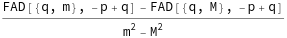
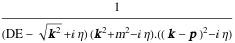
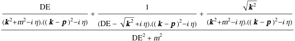

##  Apart2 

Apart2[expr] partial fractions propagators of the form 1/[(q^2-m1^2)(q^2-m2^2)]..

###  See also 

FAD, FeynAmpDenominator, ApartFF.

###  Examples 

```mathematica
FAD[{q, m}, {q, M}, q - p]
Apart2[%]
StandardForm[FCE[%]]
```

$$\frac{1}{\left(q^2-m^2\right).\left(q^2-M^2\right).(q-p)^2}$$

$$\frac{\frac{1}{\left(q^2-m^2\right).(q-p)^2}-\frac{1}{\left(q^2-M^2\right).(q-p)^2}}{m^2-M^2}$$



Apart2 can also handle Cartesian propagators with square roots. To disable this mode use $text{Sqrt}to text{False}$ 

```mathematica
int = CFAD[{{k, 0}, {+m^2, -1}, 1}, {{k - p, 0}, {0, -1}, 1}] GFAD[{{DE - Sqrt[CSPD[k, k]], 1}, 1}]
int // FeynAmpDenominatorCombine // Apart2
```

$$$$

$$$$