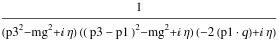

##  FCFeynmanProjectivize 

`FCFeynmanProjectivize[int]` checks if the given Feynman integral is a projective form. If this is not the case, the integral will be projectivized.

Projectivity is a necessary condition for computing the integral with the aid of the Cheng-Wu theorem

###  See also 

FCFeynmanParametrize, FCFeynmanPrepare.

###  Examples 

```mathematica
int = SFAD[{p3, mg^2}] SFAD[{p3 - p1, mg^2}] SFAD[{{0, -2 p1 . q}}]
```

$$$$

```mathematica
fp = FCFeynmanParametrize[int, {p1, p3}, Names -> x, Indexed -> True, FCReplaceD -> {D -> 4 - 2 ep}, Simplify -> True, 
   Assumptions -> {mg > 0, ep > 0}, FinalSubstitutions -> {SPD[q] -> qq, mg^2 -> mg2}]
```

$$\left\{(x(2) x(3))^{3 \text{ep}-3} \left((x(2)+x(3)) \left(\text{mg2} x(2) x(3)+\text{qq} x(1)^2\right)\right)^{1-2 \text{ep}},-\Gamma (2 \text{ep}-1),\{x(1),x(2),x(3)\}\right\}$$

```mathematica
FCFeynmanProjectivize[fp[[1]], x]
```

$$\text{FCFeynmanProjectivize: The integral is already projective, no further transformations are required.}$$

$$(x(2) x(3))^{3 \text{ep}-3} \left((x(2)+x(3)) \left(\text{mg2} x(2) x(3)+\text{qq} x(1)^2\right)\right)^{1-2 \text{ep}}$$

```mathematica
FCFeynmanProjectivize[(x[1] + x[2])^(-2 + 2*ep)/(mb2*(x[1]^2 + x[1]*x[2] + x[2]^2))^ep, x]
```

$$\text{FCFeynmanProjectivize: The integral is already projective, no further transformations are required.}$$

$$(x(1)+x(2))^{2 \text{ep}-2} \left(\text{mb2} \left(x(1)^2+x(2) x(1)+x(2)^2\right)\right)^{-\text{ep}}$$

```mathematica
FCFeynmanProjectivize[x[1]^(x - 1) (x[2])^(y - 1), x, {}] 
  
 

```

$$\text{FCFeynmanProjectivize: The integral is not projective, trying to projectivize.}$$

$$\text{FCFeynmanProjectivize: Projective transformation successful, the integral is now projective.}$$

$$\frac{\left(\frac{x(1)}{x(1)+x(2)}\right)^{x-1} \left(\frac{x(2)}{x(1)+x(2)}\right)^{y-1}}{(x(1)+x(2))^2}$$