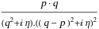
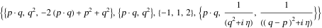
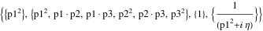

##  FCLoopBasisExtract 

FCLoopBasisExtract[int, {q1, q2, ...}]  is an auxiliary function that extracts the scalar products that form the basis of the loop integral in int. It needs to know the loop momenta on which the integral depends and the dimensions of the momenta that may occur in the integral..

###  Examples 

```mathematica
SPD[q, p] SFAD[q, q - p, q - p]
FCLoopBasisExtract[%, {q}, SetDimensions -> {4, D}]
```

$$$$

$$$$

```mathematica
SFAD[p1]
FCLoopBasisExtract[%, {p1, p2, p3}, FCTopology -> True, FCE -> True]

```

$$$$

$$$$