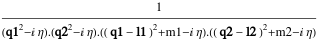
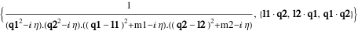

##  FCLoopBasisFindCompletion 

FCLoopBasisFindCompletion[int, {q1, q2, ...}] determines propagators that need to be included in the loop integral int (that depends on the loop momenta q1,q2,...), to ensure that the propagators of int form a basis. For integrals with propagators that do not form a basis, such a completion must be found prior to processing those integrals with tools that do Integration-By-Parts (IBP) reduction (e.g. FIRE). Furthermore, int must not contain propagators that are linearly dependent..

###  Examples 

```mathematica
FAD[q, {q - p + l, m}] 
 
FCLoopBasisFindCompletion[%, {q}] 
 
FAD[{q1, m1}, {q2, m2}] 
 
FCLoopBasisFindCompletion[%, {q1, q2}] 
 
FAD[q1 + p, q2 - k] SPD[q1, q2] 
 
FCLoopBasisFindCompletion[%, {q1, q2}, Method -> {FAD[{q2 + k, m}], FAD[{q1 - p, m}], SPD[p, q2], SPD[k, q1]}]
```

$$\frac{1}{q^2.\left((l-p+q)^2-m^2\right)}$$

$$\left\{\frac{1}{q^2.\left((l-p+q)^2-m^2\right)},\{l\cdot q\}\right\}$$

$$\frac{1}{\left(\text{q1}^2-\text{m1}^2\right).\left(\text{q2}^2-\text{m2}^2\right)}$$

$$\left\{\frac{1}{\left(\text{q1}^2-\text{m1}^2\right).\left(\text{q2}^2-\text{m2}^2\right)},\{\text{q1}\cdot \text{q2}\}\right\}$$

$$\frac{\text{q1}\cdot \text{q2}}{(p+\text{q1})^2.(\text{q2}-k)^2}$$

$$\left\{\frac{\text{q1}\cdot \text{q2}}{(p+\text{q1})^2.(\text{q2}-k)^2},\left\{\frac{1}{(k+\text{q2})^2-m^2},\frac{1}{(\text{q1}-p)^2-m^2},p\cdot \text{q2},k\cdot \text{q1}\right\}\right\}$$

Cartesian integrals are also supported.

```mathematica
CFAD[q1, q2, {q1 - l1, m1}, {q2 - l2, m2}] 
 
FCLoopBasisFindCompletion[%, {q1, q2}]
```

$$$$

$$$$