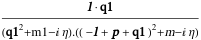
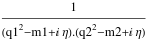

##  FCLoopBasisIncompleteQ 

FCLoopBasisIncompleteQ[int, {q1, q2, ...}] checks if the propagators of the loop integral int( that depends on the loop momenta q1,q2,...) do not form a basis..

###  Examples 

```mathematica
FAD[{q1, m1}] 
 
FCLoopBasisIncompleteQ[%, {q1}] 
 
SPD[q1, l] FAD[{q1, m1}, {q1 - l + p, m}] 
 
FCLoopBasisIncompleteQ[%, {q1}] 
 
FAD[{q1, m1}, {q2, m2}] 
 
FCLoopBasisIncompleteQ[%, {q1, q2}] 
 
FAD[q1, q2, {q1 - l1, m1}, {q2 - l2, m2}] 
 
FCLoopBasisIncompleteQ[%, {q1, q2}] 
 
CSPD[q1, l] CFAD[{q1, m1}, {q1 - l + p, m}] 
 
FCLoopBasisIncompleteQ[%, {q1}] 
 
SFAD[{q1, m1}, {q2, m2}] 
 
FCLoopBasisIncompleteQ[%, {q1, q2}]
```

$$\frac{1}{\text{q1}^2-\text{m1}^2}$$

$$\text{False}$$

$$\frac{l\cdot \text{q1}}{\left(\text{q1}^2-\text{m1}^2\right).\left((-l+p+\text{q1})^2-m^2\right)}$$

$$\text{False}$$

$$\frac{1}{\left(\text{q1}^2-\text{m1}^2\right).\left(\text{q2}^2-\text{m2}^2\right)}$$

$$\text{True}$$

$$\frac{1}{\text{q1}^2.\text{q2}^2.\left((\text{q1}-\text{l1})^2-\text{m1}^2\right).\left((\text{q2}-\text{l2})^2-\text{m2}^2\right)}$$

$$\text{True}$$

$$$$

$$\text{False}$$

$$$$

$$\text{True}$$