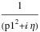
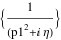
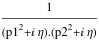
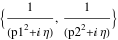
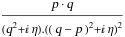
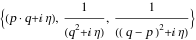

##  FCLoopBasisIntegralToPropagators 

FCLoopBasisIntegralToPropagators[int, {q1, q2, ...}] is an auxiliary function that converts the loop integral int that depends on the loop momenta q1, q2, ... to a list of propagators and scalar products. All propagators and scalar products that do not depend on the loop momenta are discarded, unless the Rest option is set to True..

###  Examples 

```mathematica
SFAD[p1] 
 
FCLoopBasisIntegralToPropagators[%, {p1}] 
 
SFAD[p1, p2] 
 
FCLoopBasisIntegralToPropagators[%, {p1, p2}] 
 
SPD[q, p] SFAD[q, q - p, q - p] 
 
FCLoopBasisIntegralToPropagators[%, {q}]
```

$$$$

$$$$

$$$$

$$$$

$$$$

$$$$