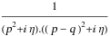
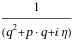

##  FCLoopEikonalPropagatorFreeQ 

FCLoopEikonalPropagatorFreeQ[exp]  checks if the integral is free of eikonal propagators 1/[p.q+x]. If the option First is set to False, propagators that have both a quadratic and linear piece, e.g. 1/[(q-p)^2+q.r+x] will also count as eikonal propagators. The option Momentum can be used to check for the presence of eikonal propagators only with respect to particular momenta. The check is performed only for StandardPropagatorDenominator and CartesianPropagatorDenominator..

###  Examples 

```mathematica
FCI@SFAD[p, p - q] 
 
FCLoopEikonalPropagatorFreeQ[%] 
 
FCI@SFAD[{{0, p . q}}] 
 
FCLoopEikonalPropagatorFreeQ[%] 
 
FCI@CFAD[{{0, p . q}}] 
 
FCLoopEikonalPropagatorFreeQ[%, Momentum -> {q}] 
 
FCI@SFAD[{{q, q . p}}] 
 
FCLoopEikonalPropagatorFreeQ[%, First -> False]
```

$$$$

$$\text{True}$$

$$\frac{1}{(p\cdot q+i \eta )}$$

$$\text{False}$$

$$\frac{1}{(p\cdot q-i \eta )}$$

$$\text{False}$$

$$$$

$$\text{False}$$