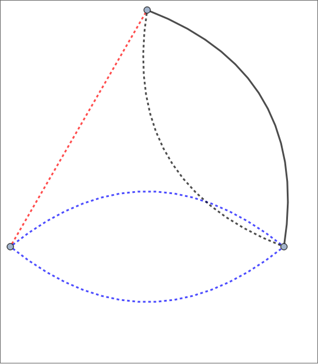
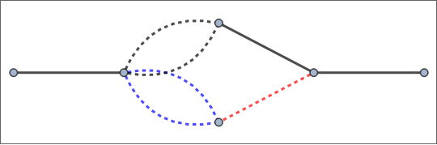
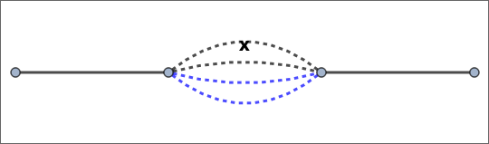

##  FCLoopGraphPlot 

`FCLoopGraphPlot[{edges, labels}]` visualizes the graph of the given loop integral using the provided list of edges, styles and labels using the built-in function `Graph`. The Option `Graph` can be used to pass options to the `Graph` objects.

By default, `FCLoopGraphPlot` returns a `Graph`. When using Mathematica 12.2 or newer, it is also possible to return a `Graphics` object created by `GraphPlot`. For this the option `GraphPlot` must be set to a list of options that will be passed to `GraphPlot`. An empty list is also admissible. For example, `FCLoopGraphPlot[int, GraphPlot -> {MultiedgeStyle -> 0.35, Frame -> True}]`.

Given a list of `Graph` or `Graphics` objects created by `FCLoopGraphPlot`, a nice way to get a better overview is to employ `Magnify[Grid[(Partition[out, UpTo[4]])], 0.9]`.

Notice that older Mathematica versions have numerous shortcomings in the graph drawing capabilities that cannot be reliably worked around. This why to use `FCLoopGraphPlot` you need to have at least Mathematica 11.0 or newer. For best results we recommend using Mathematica 12.2 or newer.

###  See also 

FCLoopIntegralToGraph

###  Examples 

```mathematica
FCLoopIntegralToGraph[FAD[{p, m}], {p}]
FCLoopGraphPlot[%]
```

$$\left\{\{1\to 1\},\left(
\begin{array}{ccc}
 p & 1 & -m^2 \\
\end{array}
\right),\left\{\frac{1}{(p^2-m^2+i \eta )}\right\},1\right\}$$


```mathematica
FCLoopIntegralToGraph[FAD[p, p - q], {p}]
FCLoopGraphPlot[%]
```

$$\left\{\{-3\to 2,-1\to 1,1\to 2,1\to 2\},\{q,q,\{p,1,0\},\{p-q,1,0\}\},\left\{0,0,\frac{1}{(p^2+i \eta )},\frac{1}{((p-q)^2+i \eta )}\right\},1\right\}$$


```mathematica
FCLoopIntegralToGraph[FAD[p, p + q1, p + q1 + q2], {p}]
FCLoopGraphPlot[%]
```

$$\left\{\{-3\to 3,-2\to 1,-1\to 2,1\to 2,1\to 3,2\to 3\},\{\text{q1}-\text{q2},\text{q1},\text{q2},\{p+\text{q1},1,0\},\{p+\text{q1}+\text{q2},1,0\},\{p,1,0\}\},\left\{0,0,0,\frac{1}{(p^2+i \eta )},\frac{1}{((p+\text{q1})^2+i \eta )},\frac{1}{((p+\text{q1}+\text{q2})^2+i \eta )}\right\},1\right\}$$


```mathematica
FCLoopIntegralToGraph[FAD[p, p + q1, p + q1 + q2, p + q1 + q2 + q3], {p}]
FCLoopGraphPlot[%]
```

$$\left\{\{-4\to 4,-3\to 1,-2\to 2,-1\to 3,1\to 2,1\to 4,2\to 3,3\to 4\},\{\text{q1}-\text{q2}-\text{q3},\text{q1},\text{q2},\text{q3},\{p+\text{q1}+\text{q2},1,0\},\{p+\text{q1}+\text{q2}+\text{q3},1,0\},\{p+\text{q1},1,0\},\{p,1,0\}\},\left\{0,0,0,0,\frac{1}{(p^2+i \eta )},\frac{1}{((p+\text{q1})^2+i \eta )},\frac{1}{((p+\text{q1}+\text{q2})^2+i \eta )},\frac{1}{((p+\text{q1}+\text{q2}+\text{q3})^2+i \eta )}\right\},1\right\}$$


```mathematica
FCLoopIntegralToGraph[FAD[p, p + q1, p + q1 + q2, p + q1 + q2 + q3, p + q1 + q2 + q3 + q4], {p}]
FCLoopGraphPlot[%]
```

$$\left\{\{-5\to 5,-4\to 1,-3\to 2,-2\to 3,-1\to 4,1\to 2,1\to 5,2\to 3,3\to 4,4\to 5\},\{\text{q1}-\text{q2}-\text{q3}-\text{q4},\text{q1},\text{q2},\text{q3},\text{q4},\{p+\text{q1}+\text{q2}+\text{q3},1,0\},\{p+\text{q1}+\text{q2}+\text{q3}+\text{q4},1,0\},\{p+\text{q1}+\text{q2},1,0\},\{p+\text{q1},1,0\},\{p,1,0\}\},\left\{0,0,0,0,0,\frac{1}{(p^2+i \eta )},\frac{1}{((p+\text{q1})^2+i \eta )},\frac{1}{((p+\text{q1}+\text{q2})^2+i \eta )},\frac{1}{((p+\text{q1}+\text{q2}+\text{q3})^2+i \eta )},\frac{1}{((p+\text{q1}+\text{q2}+\text{q3}+\text{q4})^2+i \eta )}\right\},1\right\}$$


```mathematica
FCLoopIntegralToGraph[FAD[p1, p2, Q - p1 - p2, Q - p1, Q - p2], {p1, p2}]
FCLoopGraphPlot[%]
```

$$\left\{\{-3\to 2,-1\to 1,1\to 3,1\to 4,2\to 3,2\to 4,3\to 4\},\{Q,Q,\{\text{p2},1,0\},\{Q-\text{p2},1,0\},\{Q-\text{p1},1,0\},\{\text{p1},1,0\},\{-\text{p1}-\text{p2}+Q,1,0\}\},\left\{0,0,\frac{1}{(\text{p2}^2+i \eta )},\frac{1}{(\text{p1}^2+i \eta )},\frac{1}{((Q-\text{p2})^2+i \eta )},\frac{1}{((Q-\text{p1})^2+i \eta )},\frac{1}{((-\text{p1}-\text{p2}+Q)^2+i \eta )}\right\},1\right\}$$


```mathematica
FCLoopIntegralToGraph[FAD[p1, p2, p3, Q - p1 - p2 - p3, Q - p1 - p2, Q - p1, Q - p2, p1 + p3], {p1, p2, p3}]
FCLoopGraphPlot[%]
```

$$\left\{\{-3\to 2,-1\to 1,1\to 5,1\to 6,2\to 3,2\to 5,3\to 4,3\to 6,4\to 5,4\to 6\},\{Q,Q,\{\text{p2},1,0\},\{Q-\text{p2},1,0\},\{\text{p1},1,0\},\{Q-\text{p1},1,0\},\{\text{p3},1,0\},\{\text{p1}+\text{p3},1,0\},\{-\text{p1}-\text{p2}+Q,1,0\},\{-\text{p1}-\text{p2}-\text{p3}+Q,1,0\}\},\left\{0,0,\frac{1}{(\text{p3}^2+i \eta )},\frac{1}{(\text{p2}^2+i \eta )},\frac{1}{(\text{p1}^2+i \eta )},\frac{1}{((\text{p1}+\text{p3})^2+i \eta )},\frac{1}{((Q-\text{p2})^2+i \eta )},\frac{1}{((Q-\text{p1})^2+i \eta )},\frac{1}{((-\text{p1}-\text{p2}+Q)^2+i \eta )},\frac{1}{((-\text{p1}-\text{p2}-\text{p3}+Q)^2+i \eta )}\right\},1\right\}$$


The `Style` option can be used to label lines carrying different masses in a particular way

```mathematica
FCLoopIntegralToGraph[ FAD[{k2, mb}, {k3}, {k1 - q, mc}, {k1 - k2, mc}, {k2 - k3}], {k1, k2,k3}]
Magnify[FCLoopGraphPlot[%, GraphPlot -> {MultiedgeStyle -> 0.35, Frame -> True}, Style -> {{"InternalLine", _, _, mm_ /; ! FreeQ[mm, mg]} -> {Red, Thick, Dashed}, 
     {"InternalLine", _, _, mm_ /; ! FreeQ[mm, mc]} -> {Blue, Thick, Dashed}}], 1.5]
```

$$\left\{\{-3\to 2,-1\to 1,1\to 2,1\to 2,1\to 3,2\to 3,2\to 3\},\left\{q,q,\left\{\text{k1}-q,1,-\text{mc}^2\right\},\left\{\text{k1}-\text{k2},1,-\text{mc}^2\right\},\left\{\text{k2},1,-\text{mb}^2\right\},\{\text{k3},1,0\},\{\text{k2}-\text{k3},1,0\}\right\},\left\{0,0,\frac{1}{(\text{k3}^2+i \eta )},\frac{1}{(\text{k2}^2-\text{mb}^2+i \eta )},\frac{1}{((\text{k2}-\text{k3})^2+i \eta )},\frac{1}{((\text{k1}-q)^2-\text{mc}^2+i \eta )},\frac{1}{((\text{k1}-\text{k2})^2-\text{mc}^2+i \eta )}\right\},1\right\}$$

$$$$

```mathematica
FCLoopIntegralToGraph[ FAD[{k2, mg}, {k3, mc}, {k1, q}, {k1 - k2}, {k2 - k3, mc}], {k1, k2, k3}]
Magnify[FCLoopGraphPlot[%, GraphPlot -> {MultiedgeStyle -> 0.35, Frame -> True}, Style -> {{"InternalLine", _, _, mm_ /; ! FreeQ[mm, mg]} -> {Red, Thick, Dashed}, 
     {"InternalLine", _, _, mm_ /; ! FreeQ[mm, mc]} -> {Blue, Thick, Dashed}}], 1.5]
```

$$\left\{\{1\to 2,1\to 3,1\to 3,2\to 3,2\to 3\},\left(
\begin{array}{ccc}
 \text{k2} & 1 & -\text{mg}^2 \\
 \text{k3} & 1 & -\text{mc}^2 \\
 \text{k2}-\text{k3} & 1 & -\text{mc}^2 \\
 \text{k1} & 1 & -q^2 \\
 \text{k1}-\text{k2} & 1 & 0 \\
\end{array}
\right),\left\{\frac{1}{(\text{k3}^2-\text{mc}^2+i \eta )},\frac{1}{(\text{k2}^2-\text{mg}^2+i \eta )},\frac{1}{(\text{k1}^2-q^2+i \eta )},\frac{1}{((\text{k1}-\text{k2})^2+i \eta )},\frac{1}{((\text{k2}-\text{k3})^2-\text{mc}^2+i \eta )}\right\},1\right\}$$

$$$$

```mathematica
FCLoopIntegralToGraph[ FAD[{k2, mg}, {k3, mc}, {k1 - q}, {k2 - q, mb}, {k1 - k2}, {k2 - k3, mc}], {k1, k2, k3}]
Magnify[FCLoopGraphPlot[%, GraphPlot -> {MultiedgeStyle -> 0.35, Frame -> True}, Style -> {{"InternalLine", _, _, mm_ /; ! FreeQ[mm, mg]} -> {Red, Thick, Dashed}, 
     {"InternalLine", _, _, mm_ /; ! FreeQ[mm, mc]} -> {Blue, Thick, Dashed}}], 1.5]
```

$$\left\{\{-3\to 2,-1\to 1,1\to 3,1\to 4,2\to 3,2\to 3,2\to 4,2\to 4\},\left\{q,q,\left\{\text{k2},1,-\text{mg}^2\right\},\left\{\text{k2}-q,1,-\text{mb}^2\right\},\left\{\text{k3},1,-\text{mc}^2\right\},\left\{\text{k2}-\text{k3},1,-\text{mc}^2\right\},\{\text{k1}-q,1,0\},\{\text{k1}-\text{k2},1,0\}\right\},\left\{0,0,\frac{1}{(\text{k3}^2-\text{mc}^2+i \eta )},\frac{1}{(\text{k2}^2-\text{mg}^2+i \eta )},\frac{1}{((\text{k1}-q)^2+i \eta )},\frac{1}{((\text{k1}-\text{k2})^2+i \eta )},\frac{1}{((\text{k2}-q)^2-\text{mb}^2+i \eta )},\frac{1}{((\text{k2}-\text{k3})^2-\text{mc}^2+i \eta )}\right\},1\right\}$$

$$$$

```mathematica
FCLoopIntegralToGraph[ FAD[{k2, 0, 2}, {k1 - q}, {k1 - k3, mc}, {k2 - k3, mc}], {k1, k2, k3}]
Magnify[FCLoopGraphPlot[%, GraphPlot -> {MultiedgeStyle -> 0.35, Frame -> True}, Style -> {{"InternalLine", _, _, mm_ /; ! FreeQ[mm, mg]} -> {Red, Thick, Dashed}, 
      {"InternalLine", _, _, mm_ /; ! FreeQ[mm, mc]} -> {Blue, Thick, Dashed}}], 1.5] 
  
  
  
  
 

```

$$\left\{\{-3\to 2,-1\to 1,1\to 2,1\to 2,1\to 2,1\to 2\},\left\{q,q,\{\text{k2},2,0\},\{\text{k1}-q,1,0\},\left\{\text{k2}-\text{k3},1,-\text{mc}^2\right\},\left\{\text{k1}-\text{k3},1,-\text{mc}^2\right\}\right\},\left\{0,0,\frac{1}{(\text{k2}^2+i \eta )},\frac{1}{((\text{k1}-q)^2+i \eta )},\frac{1}{((\text{k2}-\text{k3})^2-\text{mc}^2+i \eta )},\frac{1}{((\text{k1}-\text{k3})^2-\text{mc}^2+i \eta )}\right\},1\right\}$$

$$$$