##  FCLoopGraphPlot 

`FCLoopGraphPlot[{edges, labels}]` visualizes the graph of the given loop integral using the provided list of edges, styles and labels using the built-in function `Graph`. The Option `Graph` can be used to pass options to the `Graph` objects.

By default, `FCLoopGraphPlot` returns a `Graph`. When using Mathematica 12.2 or newer, it is also possible to return a `Graphics` object created by `GraphPlot`. For this the option `GraphPlot` must be set to a list of options that will be passed to `GraphPlot`. An empty list is also admissible. For example, `FCLoopGraphPlot[int, GraphPlot -> {MultiedgeStyle -> 0.35, Frame -> True}]`.

Given a list of `Graph` or `Graphics` objects created by `FCLoopGraphPlot`, a nice way to get a better overview is to employ `Magnify[Grid[(Partition[out, UpTo[4]])], 0.9]`.

Notice that older Mathematica versions have numerous shortcomings in the graph drawing capabilities that cannot be reliably worked around. This why to use `FCLoopGraphPlot` you need to have at least Mathematica 11.0 or newer. For best results we recommend using Mathematica 12.2 or newer.

###  See also 

FCLoopIntegralToGraph

###  Examples 

```mathematica
FCLoopIntegralToGraph[FAD[{p, m}], {p}]
FCLoopGraphPlot[%]
```

$$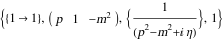$$

$$$$

```mathematica
FCLoopIntegralToGraph[FAD[p, p - q], {p}]
FCLoopGraphPlot[%]
```

$$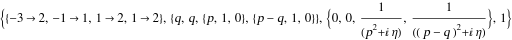$$

$$$$

```mathematica
FCLoopIntegralToGraph[FAD[p, p + q1, p + q1 + q2], {p}]
FCLoopGraphPlot[%]
```

$$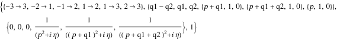$$

$$$$

```mathematica
FCLoopIntegralToGraph[FAD[p, p + q1, p + q1 + q2, p + q1 + q2 + q3], {p}]
FCLoopGraphPlot[%]
```

$$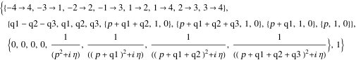$$

$$$$

```mathematica
FCLoopIntegralToGraph[FAD[p, p + q1, p + q1 + q2, p + q1 + q2 + q3, p + q1 + q2 + q3 + q4], {p}]
FCLoopGraphPlot[%]
```

$$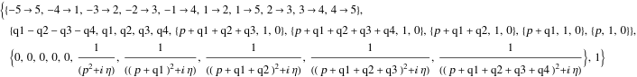$$

$$$$

The `Style` option can be used to label lines carrying different masses in a particular way

```mathematica
FCLoopIntegralToGraph[ FAD[{k2, mb}, {k3}, {k1 - q, mc}, {k1 - k2, mc}, {k2 - k3}], {k1, k2,k3}]
Magnify[FCLoopGraphPlot[%, GraphPlot -> {MultiedgeStyle -> 0.35, Frame -> True}, Style -> {{"InternalLine", _, _, mm_ /; ! FreeQ[mm, mg]} -> {Red, Thick, Dashed}, 
     {"InternalLine", _, _, mm_ /; ! FreeQ[mm, mc]} -> {Blue, Thick, Dashed}}], 1.5]
```

$$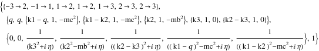$$

$$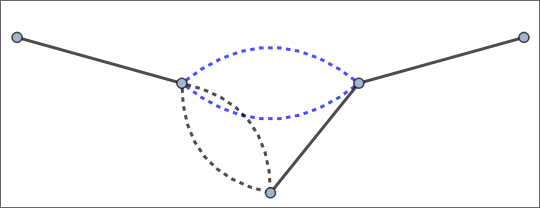$$

```mathematica
FCLoopIntegralToGraph[ FAD[{k2, mg}, {k3, mc}, {k1, q}, {k1 - k2}, {k2 - k3, mc}], {k1, k2, k3}]
Magnify[FCLoopGraphPlot[%, GraphPlot -> {MultiedgeStyle -> 0.35, Frame -> True}, Style -> {{"InternalLine", _, _, mm_ /; ! FreeQ[mm, mg]} -> {Red, Thick, Dashed}, 
     {"InternalLine", _, _, mm_ /; ! FreeQ[mm, mc]} -> {Blue, Thick, Dashed}}], 1.5]
```

$$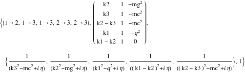$$

$$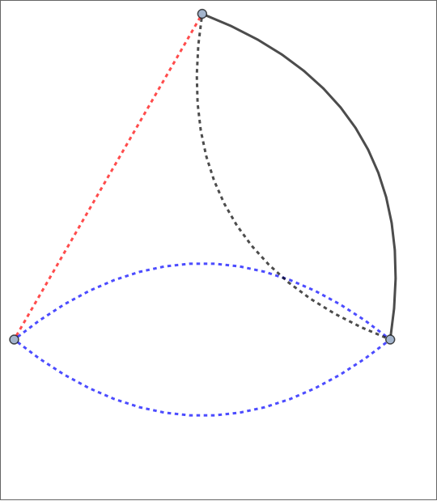$$

```mathematica
FCLoopIntegralToGraph[ FAD[{k2, mg}, {k3, mc}, {k1 - q}, {k2 - q, mb}, {k1 - k2}, {k2 - k3, mc}], {k1, k2, k3}]
Magnify[FCLoopGraphPlot[%, GraphPlot -> {MultiedgeStyle -> 0.35, Frame -> True}, Style -> {{"InternalLine", _, _, mm_ /; ! FreeQ[mm, mg]} -> {Red, Thick, Dashed}, 
     {"InternalLine", _, _, mm_ /; ! FreeQ[mm, mc]} -> {Blue, Thick, Dashed}}], 1.5]
```

$$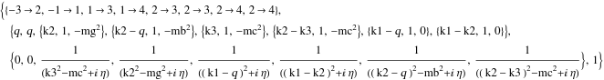$$

$$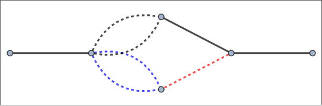$$

```mathematica
FCLoopIntegralToGraph[ FAD[{k2, 0, 2}, {k1 - q}, {k1 - k3, mc}, {k2 - k3, mc}], {k1, k2, k3}]
Magnify[FCLoopGraphPlot[%, GraphPlot -> {MultiedgeStyle -> 0.35, Frame -> True}, Style -> {{"InternalLine", _, _, mm_ /; ! FreeQ[mm, mg]} -> {Red, Thick, Dashed}, 
      {"InternalLine", _, _, mm_ /; ! FreeQ[mm, mc]} -> {Blue, Thick, Dashed}}], 1.5] 
  
 

```

$$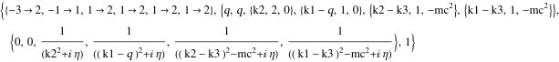$$

$$$$