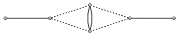
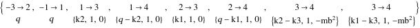
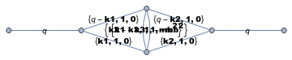

##  FCLoopIntegralToGraph 

`FCLoopIntegralToGraph[int, {q1, q2, ...}]` constructs a graph representation of the loop integral `int` that depends on the loop momenta `q1, q2, ...`. The function returns a list of the form `{edges,labels,props,pref}`, where `edges` is a list of edge rules representing the loop integral `int`, `labels` is a list of lists containing the line momentum, multiplicity and the mass term of each propagator, `props` is a list with the original propagators and `pref` is the piece of the integral that was ignored when constructing the graph representation (e.g. scalar products or vectors in the numerator) 

Use `FCLoopGraphPlot` to visualize the output of `FCLoopIntegralToGraph`

A quick and simple way to plot the graph is to evaluate `GraphPlot[List @@@ Transpose[output[[1 ;; 2]]]]` or `GraphPlot[Labeled @@@ Transpose[output[[1 ;; 2]]]]`. The visual quality will not be that great, though. To obtain a nicer plot one might use `GraphPlot` with a custom `EdgeTaggedGraph` or export the output to a file and visualize it with an external tool such as dot/neato from graphviz.

###  See also 

FCLoopGraphPlot.

###  Examples 

```mathematica
out = FCLoopIntegralToGraph[ FAD[{q - k1}, k1, q - k2, k2, {k2 - k3, mb}, {k1 - k3, mb}], {k1, k2, k3}]
```

$$\left\{\{-3\to 2,-1\to 1,1\to 3,1\to 4,2\to 3,2\to 4,3\to 4,3\to 4\},\left\{q,q,\{\text{k2},1,0\},\{q-\text{k2},1,0\},\{\text{k1},1,0\},\{q-\text{k1},1,0\},\left\{\text{k2}-\text{k3},1,-\text{mb}^2\right\},\left\{\text{k1}-\text{k3},1,-\text{mb}^2\right\}\right\},\left\{0,0,\frac{1}{(\text{k2}^2+i \eta )},\frac{1}{(\text{k1}^2+i \eta )},\frac{1}{((q-\text{k2})^2+i \eta )},\frac{1}{((q-\text{k1})^2+i \eta )},\frac{1}{((\text{k2}-\text{k3})^2-\text{mb}^2+i \eta )},\frac{1}{((\text{k1}-\text{k3})^2-\text{mb}^2+i \eta )}\right\},1\right\}$$

```mathematica
FCLoopGraphPlot[out]
```



```mathematica
Labeled @@@ Transpose[out[[1 ;; 2]]]
```

$$$$

```mathematica
GraphPlot[List @@@ Transpose[out[[1 ;; 2]]]]
```

$$$$