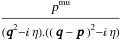

##  FCLoopMixedIntegralQ 

FCLoopMixedIntegralQ[exp]  returns True if the integral contains both Lorentz and Cartesian indices and momenta..

###  Examples 

```mathematica
FCI[FVD[p, mu] CFAD[q, q - p]] 
 
FCLoopMixedIntegralQ[%] 
 
FCI[FVD[p, mu] FAD[q, q - p]] 
 
FCLoopMixedIntegralQ[%]
```

$$$$

$$\text{True}$$

$$\frac{p^{\text{mu}}}{q^2.(q-p)^2}$$

$$\text{False}$$