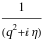
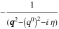
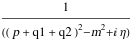
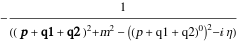
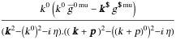

##  FCLoopMixedToCartesianAndTemporal 

FCLoopMixedToCartesianAndTemporal[int, {q1, q2, ...}] attempts to convert loop integrals that contain both Lorentz and Cartesian or temporal indices/momenta to pure temporal and Cartesian indices..

###  Examples 

```mathematica
FCI@SFAD[q] 
 
FCLoopMixedToCartesianAndTemporal[%, {q}, FCE -> True] 
 
FCI@SFAD[{q1 + q2 + p, m^2}] 
 
FCLoopMixedToCartesianAndTemporal[%, {q1, q2}] 
 
FCI[TC[k] FVD[k, mu] FAD[k, k + p]] 
 
FCLoopMixedToCartesianAndTemporal[%, {k}]
```

$$$$

$$$$

$$$$

$$$$

$$\frac{k^0 k^{\text{mu}}}{k^2.(k+p)^2}$$

$$$$