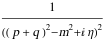
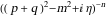
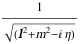

##  FCLoopNonIntegerPropagatorPowersFreeQ 

FCLoopNonIntegerPropagatorPowersFreeQ[int] checks if the integral contains propagators raised to noninteger (i.e. fractional or symbolic) powers..

###  Examples 

```mathematica
SFAD[{q + p, m^2, 2}] 
 
FCLoopNonIntegerPropagatorPowersFreeQ[FCI[%]] 
 
SFAD[{q + p, m^2, n}] 
 
FCLoopNonIntegerPropagatorPowersFreeQ[FCI[%]] 
 
CFAD[{l, m^2, 1/2}] 
 
FCLoopNonIntegerPropagatorPowersFreeQ[FCI[%]]
```

$$$$

$$\text{True}$$

$$$$

$$\text{False}$$

$$$$

$$\text{False}$$