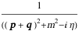
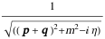

##  FCLoopNonIntegerPropagatorsFreeQ 

FCLoopNonIntegerPropagatorsFreeQ[exp] checks if the integral contains propagators raised to noninteger (i.e. fractional or symbolic) powers.

###  Examples 

```mathematica
FCI@CFAD[{q + p, m^2}] 
 
FCLoopNonIntegerPropagatorPowersFreeQ[%] 
 
FCI@CFAD[{q + p, m^2, 1/2}] 
 
FCLoopNonIntegerPropagatorPowersFreeQ[%]
```

$$$$

$$\text{True}$$

$$$$

$$\text{False}$$