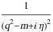
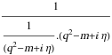

##  FCLoopPropagatorPowersCombine 

FCLoopPropagatorPowersCombine[exp] combines the same propagators in a FeynAmpDenominator to one propagator raised to an integer power..

###  Examples 

```mathematica
SFAD[{{q, 0}, {m, 1}, 1}, {{q, 0}, {m, 1}, 1}] 
 
FCLoopPropagatorPowersCombine[%]
% // StandardForm
```

$$$$

$$$$

```
(*FeynAmpDenominator[StandardPropagatorDenominator[Momentum[q, D], 0, -m, {2, 1}]]*)
```

```mathematica
SFAD[{{q, 0}, {m, 1}, -1}, {{q, 0}, {m, 1}, 1}] 
 
FCLoopPropagatorPowersCombine[%]
```

$$$$

$$1$$