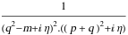

##  FCLoopPropagatorPowersExpand 

FCLoopPropagatorPowersExpand[exp]  rewrites propagators raised to integer powers as products.

###  Examples 

```mathematica
SFAD[{q, m, 2}]
FCLoopPropagatorPowersExpand[%]
% // StandardForm
```

$$$$

$$$$

```
(*FeynAmpDenominator[StandardPropagatorDenominator[Momentum[q, D], 0, -m, {1, 1}], StandardPropagatorDenominator[Momentum[q, D], 0, -m, {1, 1}]]*)
```

```mathematica
SFAD[{q, m, 2}, q + p]
FCLoopPropagatorPowersExpand[%]
% // StandardForm
```

$$$$

$$$$

```
(*FeynAmpDenominator[StandardPropagatorDenominator[Momentum[q, D], 0, -m, {1, 1}], StandardPropagatorDenominator[Momentum[q, D], 0, -m, {1, 1}], StandardPropagatorDenominator[Momentum[p, D] + Momentum[q, D], 0, 0, {1, 1}]]*)
```