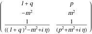

##  FCLoopPropagatorsToLineMomenta 

FCLoopPropagatorsToLineMomenta[{prop1, prop2, ...}]  is an auxiliary function that extracts line momenta flowing through the given list of propagators..

###  Examples 

```mathematica
FCLoopPropagatorsToLineMomenta[{SFAD[{q + l, m^2}], SFAD[{p, -m^2}]}, FCE -> True]
```

$$$$

```mathematica
FCLoopPropagatorsToLineMomenta[{CFAD[{{0, 2 v . (q + r)}, m^2}]}, FCE -> True, AuxiliaryMomenta -> {v}]
```

$$\left(
\begin{array}{c}
 q+r \\
 m^2 \\
 \frac{1}{(2 ((q+r)\cdot v)+m^2-i \eta )} \\
\end{array}
\right)$$