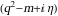
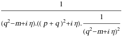
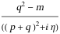

##  FCLoopRemoveNegativePropagatorPowers 

FCLoopRemoveNegativePropagatorPowers[exp] rewrites propagators raised to integer powers as products..

###  Examples 

```mathematica
SFAD[{q, m, -1}]
FCLoopRemoveNegativePropagatorPowers[%]
% // StandardForm
```

$$$$

$$q^2-m$$

```
(*-m + Pair[Momentum[q, D], Momentum[q, D]]*)
```

```mathematica
SFAD[{q, m}, q + p, {q, m, -2}]
FCLoopRemoveNegativePropagatorPowers[%]
% // StandardForm

```

$$$$

$$$$

```
(*FeynAmpDenominator[StandardPropagatorDenominator[Momentum[p, D] + Momentum[q, D], 0, 0, {1, 1}]] (-m + Pair[Momentum[q, D], Momentum[q, D]])*)
```