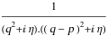
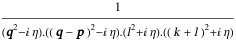

##  FCLoopSamePropagatorHeadsQ 

FCLoopSamePropagatorHeadsQ[exp]  returns True if the FeynAmpDenominator of exp contains only propagator denominators of the same type (e.g. only StandardPropagatorDenominator or only CartesianPropagatorDenominator)..

###  Examples 

```mathematica
FCI@SFAD[q, q - p]
FCLoopSamePropagatorHeadsQ[%]
```

$$$$

$$\text{True}$$

```mathematica
FeynAmpDenominatorCombine[CFAD[q, q - p] SFAD[l, l + k]]
FCLoopSamePropagatorHeadsQ[%]
```

$$$$

$$\text{False}$$