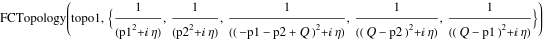
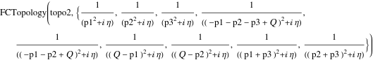

##  FCTopology 

FCTopology[id, {prop1, prop2, ...}] denotes a topology with the identifier id that is characterized by the propagators {prop1, prop2, ...}. The propagators in the list do not necessarily have to form a valid basis, i.e. the basis may also be incomplete or overdetermined..

###  See also 

A 2-loop topology with one external momentum Q

###  Examples 

```mathematica
FCTopology[topo1, {SFAD[p1], SFAD[p2], SFAD[Q - p1 - p2], SFAD[Q - p2], SFAD[Q - p1]}]
```

$$$$

A 3-loop topology with one external momentum Q

```mathematica
FCTopology[topo2, {SFAD[p1], SFAD[p2], SFAD[p3], SFAD[Q - p1 - p2 - p3], SFAD[Q - p1 - p2], SFAD[Q - p1], SFAD[Q - p2], SFAD[p1 + p3], SFAD[p2 + p3]}]
```

$$$$