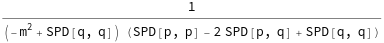

##  FeynAmpDenominatorExplicit 

FeynAmpDenominatorExplicit[exp] changes each occurence of PropagatorDenominator[a,b] in exp into 1/(ScalarProduct[a,a]-b^2) and replaces FeynAmpDenominator by Identity..

###  See also 

FeynAmpDenominator, PropagatorDenominator.

###  Examples 

```mathematica
FAD[{q, m}, {q - p, 0}] 
 
FeynAmpDenominatorExplicit[%] 
 
% // FCE // StandardForm
```

$$\frac{1}{\left(q^2-m^2\right).(q-p)^2}$$

$$\frac{1}{\left(q^2-m^2\right) \left(-2 (p\cdot q)+p^2+q^2\right)}$$

