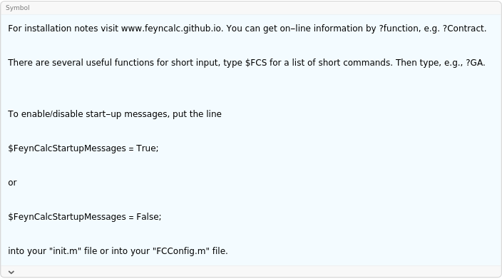

##  FeynCalc 

FeynCalc is simply a symbol with a usage definition..

###  Examples 

```mathematica
?FeynCalc
For installation notes visit www . feyncalc . github . io . You can get on - line information by ?function, e . g . ?Contract. 
 
There are several useful functions for short input, type $FCS for a list of short commands . Then type, e . g ., ?GA.
```

$$$$

```mathematica
To enable/disable start - up messages, put the line 
 
$FeynCalcStartupMessages = True; 
 
or 
 
$FeynCalcStartupMessages = False; 
 
into your "init.m" file or into your "FCConfig.m" file .
```