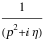
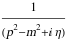
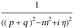

##  ToSFAD 

ToSFAD[exp] converts all propagator denominators written as FAD or FeynAmpDenmoninator[...,PropagatorDenominator[...],...] to SFAD or FeynAmpDenmoninator[...,StandardPropagatorDenominator[...],...] respectively..

###  Examples 

```mathematica
ToSFAD[FAD[p]]
% // StandardForm
```

$$$$

```
(*SFAD[{{p, 0}, {0, 1}, 1}]*)
```

```mathematica
ToSFAD[FAD[{p, m}]]
% // StandardForm
```

$$$$

```
(*SFAD[{{p, 0}, {m^2, 1}, 1}]*)
```

```mathematica
ToSFAD[FAD[{p + q, m, 2}]]
% // StandardForm

```

$$$$

```
(*SFAD[{{p + q, 0}, {m^2, 1}, 1}, {{p + q, 0}, {m^2, 1}, 1}]*)
```