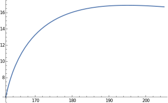

## Load FeynCalc and the necessary add-ons or other packages

```mathematica
description = "Anel El -> W W, EW, total cross section, tree";
If[ $FrontEnd === Null, 
  	$FeynCalcStartupMessages = False; 
  	Print[description]; 
  ];
If[ $Notebooks === False, 
  	$FeynCalcStartupMessages = False 
  ];
$LoadAddOns = {"FeynArts"};
<< FeynCalc`
$FAVerbose = 0; 
 
FCCheckVersion[9, 3, 1];
```

$$\text{FeynCalc }\;\text{10.0.0 (dev version, 2023-12-20 22:40:59 +01:00, dff3b835). For help, use the }\underline{\text{online} \;\text{documentation}}\;\text{, check out the }\underline{\text{wiki}}\;\text{ or visit the }\underline{\text{forum}.}$$

$$\text{Please check our }\underline{\text{FAQ}}\;\text{ for answers to some common FeynCalc questions and have a look at the supplied }\underline{\text{examples}.}$$

$$\text{If you use FeynCalc in your research, please evaluate FeynCalcHowToCite[] to learn how to cite this software.}$$

$$\text{Please keep in mind that the proper academic attribution of our work is crucial to ensure the future development of this package!}$$

$$\text{FeynArts }\;\text{3.11 (3 Aug 2020) patched for use with FeynCalc, for documentation see the }\underline{\text{manual}}\;\text{ or visit }\underline{\text{www}.\text{feynarts}.\text{de}.}$$

$$\text{If you use FeynArts in your research, please cite}$$

$$\text{ $\bullet $ T. Hahn, Comput. Phys. Commun., 140, 418-431, 2001, arXiv:hep-ph/0012260}$$

## Generate Feynman diagrams

Nicer typesetting

```mathematica
MakeBoxes[p1, TraditionalForm] := "\!\(\*SubscriptBox[\(p\), \(1\)]\)";
MakeBoxes[p2, TraditionalForm] := "\!\(\*SubscriptBox[\(p\), \(2\)]\)";
MakeBoxes[k1, TraditionalForm] := "\!\(\*SubscriptBox[\(k\), \(1\)]\)";
MakeBoxes[k2, TraditionalForm] := "\!\(\*SubscriptBox[\(k\), \(2\)]\)";
```

```mathematica
diags = InsertFields[CreateTopologies[0, 2 -> 2], {F[2, {1}], -F[2, {1}]} -> 
     		{V[3], -V[3]}, InsertionLevel -> {Classes}]; 
 
Paint[diags, ColumnsXRows -> {2, 1}, Numbering -> Simple, 
  	SheetHeader -> None, ImageSize -> {512, 256}];
```


## Obtain the amplitude

```mathematica
amp[0] = FCFAConvert[CreateFeynAmp[diags], IncomingMomenta -> {p1, p2}, 
   	OutgoingMomenta -> {k1, k2}, UndoChiralSplittings -> True, ChangeDimension -> 4, 
   	TransversePolarizationVectors -> {k1, k2}, 
   	List -> True, SMP -> True, Contract -> True, FinalSubstitutions -> {SMP["e"] -> Sqrt[4 Pi SMP["alpha_fs"]], 
     	SMP["m_Z"] -> SMP["m_W"]/SMP["cos_W"]}];
```

Let us separately mark the Higgs contribution separately

```mathematica
amp[1] = {markHiggs amp[0][[1]], amp[0][[2]], amp[0][[3]], amp[0][[4]]};
```

```mathematica
amp[2] = Total[amp[1]] // DiracSimplify;
```

## Fix the kinematics

```mathematica
FCClearScalarProducts[];
SetMandelstam[s, t, u, p1, p2, -k1, -k2, SMP["m_e"], SMP["m_e"], SMP["m_W"], SMP["m_W"]];
```

## Square the amplitude

```mathematica
ampSquared[0] = (amp[2] (ComplexConjugate[amp[2]])) // 
        	FeynAmpDenominatorExplicit // FermionSpinSum[#, ExtraFactor -> 1/2^2] & // 
      	DiracSimplify // DoPolarizationSums[#, k1] & // DoPolarizationSums[#, k2] & // 
   	TrickMandelstam[#, {s, t, u, 2 SMP["m_e"]^2 + 2 SMP["m_W"]^2}] &;
```

```mathematica
ampSquaredFull[0] = (ampSquared[0] /. markHiggs -> 1 /. u -> 2 SMP["m_e"]^2 + 2 SMP["m_W"]^2 - s - t) // 
   	Simplify;
```

```mathematica
ampSquaredFull[1] = Simplify[Numerator[ampSquaredFull[0]] /. 
    	SMP["cos_W"] -> Sqrt[1 - SMP["sin_W"]^2]]/Denominator[ampSquaredFull[0]]
```

$$-\left(\left(\pi ^2 \alpha ^2 \left(\left(2 s^2 \left(s-m_H^2\right){}^2 m_e^8+4 s \left(s-m_H^2\right) \left(\left(-\left(\left(s-4 t \left(\left.\sin (\theta _W\right)\right){}^2\right) m_W^2\right)-2 s t \left(\left(\left.\sin (\theta _W\right)\right){}^2-1\right)\right) m_H^2+s \left(\left(-4 t \left(\left.\sin (\theta _W\right)\right){}^2+s+2 t\right) m_W^2+s t \left(2 \left(\left.\sin (\theta _W\right)\right){}^2-1\right)\right)\right) m_e^6+2 \left(\left(\left(96 t^2 \left(\left.\sin (\theta _W\right)\right){}^4-16 s t \left(\left.\sin (\theta _W\right)\right){}^2-3 s^2\right) m_W^4-2 s t \left(16 t \left(\left.\sin (\theta _W\right)\right){}^4+4 (2 s-3 t) \left(\left.\sin (\theta _W\right)\right){}^2+3 s\right) m_W^2+s^2 t \left(8 t \left(\left.\sin (\theta _W\right)\right){}^4-12 t \left(\left.\sin (\theta _W\right)\right){}^2+s+6 t\right)\right) m_H^4-2 s \left(\left(96 t^2 \left(\left.\sin (\theta _W\right)\right){}^4-16 t (s+3 t) \left(\left.\sin (\theta _W\right)\right){}^2+s (2 t-3 s)\right) m_W^4-s t \left(32 t \left(\left.\sin (\theta _W\right)\right){}^4+8 (2 s-3 t) \left(\left.\sin (\theta _W\right)\right){}^2+9 s+4 t\right) m_W^2+s^2 t \left(8 t \left(\left.\sin (\theta _W\right)\right){}^4-8 t \left(\left.\sin (\theta _W\right)\right){}^2+s+4 t\right)\right) m_H^2+s^2 \left(\left(96 t^2 \left(\left.\sin (\theta _W\right)\right){}^4-16 t (s+6 t) \left(\left.\sin (\theta _W\right)\right){}^2-3 s^2+24 t^2+4 s t\right) m_W^4-4 s t \left(8 t \left(\left.\sin (\theta _W\right)\right){}^4+(4 s-6 t) \left(\left.\sin (\theta _W\right)\right){}^2+3 s+4 t\right) m_W^2+s^2 t \left(8 t \left(\left.\sin (\theta _W\right)\right){}^4-4 t \left(\left.\sin (\theta _W\right)\right){}^2+s+4 t\right)\right)\right) m_e^4-\left(4 \left(2 \left(-48 t^2 \left(\left.\sin (\theta _W\right)\right){}^4-2 s t \left(\left.\sin (\theta _W\right)\right){}^2+s^2\right) m_W^6+2 t \left(\left.\sin (\theta _W\right)\right){}^2 \left(s (5 s-4 t)-24 (s-2 t) t \left(\left.\sin (\theta _W\right)\right){}^2\right) m_W^4+s t \left(8 (s-4 t) t \left(\left.\sin (\theta _W\right)\right){}^4+12 t^2 \left(\left.\sin (\theta _W\right)\right){}^2-s (2 s+3 t)\right) m_W^2+s^2 t^2 \left(4 (s+2 t) \left(\left.\sin (\theta _W\right)\right){}^4-2 (s+3 t) \left(\left.\sin (\theta _W\right)\right){}^2+s+2 t\right)\right) m_H^4-4 s \left(4 \left(-48 t^2 \left(\left.\sin (\theta _W\right)\right){}^4-2 (s-6 t) t \left(\left.\sin (\theta _W\right)\right){}^2+s (s+t)\right) m_W^6+2 t \left(-48 (s-2 t) t \left(\left.\sin (\theta _W\right)\right){}^4+2 \left(5 s^2-10 t s-12 t^2\right) \left(\left.\sin (\theta _W\right)\right){}^2-s (s+t)\right) m_W^4-s t \left(-16 (s-4 t) t \left(\left.\sin (\theta _W\right)\right){}^4+4 (s-6 t) t \left(\left.\sin (\theta _W\right)\right){}^2+4 s^2+2 t^2+5 s t\right) m_W^2+s^2 t^2 \left(8 (s+2 t) \left(\left.\sin (\theta _W\right)\right){}^4-2 (s+4 t) \left(\left.\sin (\theta _W\right)\right){}^2+s+3 t\right)\right) m_H^2+s^2 \left(8 \left(-48 t^2 \left(\left.\sin (\theta _W\right)\right){}^4-2 (s-12 t) t \left(\left.\sin (\theta _W\right)\right){}^2+s (s+2 t)\right) m_W^6+4 t \left(-48 (s-2 t) t \left(\left.\sin (\theta _W\right)\right){}^4+2 \left(5 s^2-16 t s-24 t^2\right) \left(\left.\sin (\theta _W\right)\right){}^2+s (t-2 s)\right) m_W^4-4 s t \left(-8 (s-4 t) t \left(\left.\sin (\theta _W\right)\right){}^4+4 (s-3 t) t \left(\left.\sin (\theta _W\right)\right){}^2+2 s^2+2 t^2+3 s t\right) m_W^2+s^2 t^2 \left(16 (s+2 t) \left(\left.\sin (\theta _W\right)\right){}^4-8 t \left(\left.\sin (\theta _W\right)\right){}^2+s+4 t\right)\right)\right) m_e^2+2 \left(s-m_H^2\right){}^2 \left(4 \left(24 t^2 \left(\left.\sin (\theta _W\right)\right){}^4+4 s t \left(\left.\sin (\theta _W\right)\right){}^2+s^2\right) m_W^8-8 t \left(4 t (s+6 t) \left(\left.\sin (\theta _W\right)\right){}^4+s (3 t-4 s) \left(\left.\sin (\theta _W\right)\right){}^2+s^2\right) m_W^6+t \left(8 t \left(17 s^2+20 t s+12 t^2\right) \left(\left.\sin (\theta _W\right)\right){}^4-20 s^2 t \left(\left.\sin (\theta _W\right)\right){}^2+s^2 (4 s+5 t)\right) m_W^4-2 s t^2 \left(8 \left(2 s^2+3 t s+2 t^2\right) \left(\left.\sin (\theta _W\right)\right){}^4-4 \left(2 s^2+2 t s+t^2\right) \left(\left.\sin (\theta _W\right)\right){}^2+s (2 s+t)\right) m_W^2+s^2 t^3 (s+t) \left(8 \left(\left.\sin (\theta _W\right)\right){}^4-4 \left(\left.\sin (\theta _W\right)\right){}^2+1\right)\right)\right) m_W^4-2 s \left(1-\left(\left.\sin (\theta _W\right)\right){}^2\right) \left(2 s^2 \left(s-m_H^2\right){}^2 m_e^8+2 s \left(s-m_H^2\right) \left(\left(\left(4 t \left(\left.\sin (\theta _W\right)\right){}^2-2 s+2 t\right) m_W^2+s t \left(3-2 \left(\left.\sin (\theta _W\right)\right){}^2\right)\right) m_H^2+s \left(2 \left(-2 t \left(\left.\sin (\theta _W\right)\right){}^2+s+t\right) m_W^2+s t \left(2 \left(\left.\sin (\theta _W\right)\right){}^2-1\right)\right)\right) m_e^6+2 \left(\left(\left(s (2 t-3 s)-8 (s-3 t) t \left(\left.\sin (\theta _W\right)\right){}^2\right) m_W^4+s t \left((4 t-8 s) \left(\left.\sin (\theta _W\right)\right){}^2-5 s+6 t\right) m_W^2+s^2 t \left(-4 t \left(\left.\sin (\theta _W\right)\right){}^2+s+3 t\right)\right) m_H^4+s \left(2 \left(3 s^2+8 t \left(\left.\sin (\theta _W\right)\right){}^2 s-4 t s+6 t^2\right) m_W^4+4 s t \left((4 s-2 t) \left(\left.\sin (\theta _W\right)\right){}^2+4 s-t\right) m_W^2+s^2 t \left(4 t \left(\left.\sin (\theta _W\right)\right){}^2-2 s-3 t\right)\right) m_H^2+s^2 \left(\left(-3 s^2+6 t s+12 t^2-8 t (s+3 t) \left(\left.\sin (\theta _W\right)\right){}^2\right) m_W^4-s t \left((8 s-4 t) \left(\left.\sin (\theta _W\right)\right){}^2+11 s+10 t\right) m_W^2+s^2 t (s+2 t)\right)\right) m_e^4+\left(-2 \left(4 \left(s (s+t)-t (s+12 t) \left(\left.\sin (\theta _W\right)\right){}^2\right) m_W^6+2 t \left(\left(5 s^2-16 t s+24 t^2\right) \left(\left.\sin (\theta _W\right)\right){}^2+s (5 s+t)\right) m_W^4-s t \left(4 s^2+t s-6 t^2+4 t (t-s) \left(\left.\sin (\theta _W\right)\right){}^2\right) m_W^2+s^2 t^2 \left(-2 t \left(\left.\sin (\theta _W\right)\right){}^2+s+t\right)\right) m_H^4+s \left(8 \left(2 s^2+4 t s+3 t^2-2 t (s+6 t) \left(\left.\sin (\theta _W\right)\right){}^2\right) m_W^6+4 t \left(8 s^2-3 t s-6 t^2+2 \left(5 s^2-22 t s+12 t^2\right) \left(\left.\sin (\theta _W\right)\right){}^2\right) m_W^4-2 s t \left(8 s^2+t s-8 t^2-4 (s-2 t) t \left(\left.\sin (\theta _W\right)\right){}^2\right) m_W^2+s^2 t^2 \left(4 s \left(\left.\sin (\theta _W\right)\right){}^2+s+2 t\right)\right) m_H^2-4 s^2 \left(2 \left(s^2-t \left(\left.\sin (\theta _W\right)\right){}^2 s+3 t s+3 t^2\right) m_W^6-t \left(-3 s^2+(28 t-5 s) \left(\left.\sin (\theta _W\right)\right){}^2 s+t s+6 t^2\right) m_W^4-s t \left(2 s^2+t s-t^2+2 t^2 \left(\left.\sin (\theta _W\right)\right){}^2\right) m_W^2+s^2 t^2 (s+t) \left(\left.\sin (\theta _W\right)\right){}^2\right)\right) m_e^2+4 \left(s-m_H^2\right){}^2 m_W^2 \left(2 \left(2 t (s+3 t) \left(\left.\sin (\theta _W\right)\right){}^2+s (s+t)\right) m_W^6-t \left(\left(-8 s^2+10 t s+24 t^2\right) \left(\left.\sin (\theta _W\right)\right){}^2+3 s t\right) m_W^4+2 t \left(s^3+2 t \left(3 s^2+5 t s+3 t^2\right) \left(\left.\sin (\theta _W\right)\right){}^2\right) m_W^2-s t^3 (s+t) \left(2 \left(\left.\sin (\theta _W\right)\right){}^2-1\right)\right)\right) m_W^2+\left(2 s^2 \left(s-m_H^2\right){}^2 m_e^8+4 s \left(s-m_H^2\right) \left(\left(s t-(s-2 t) m_W^2\right) m_H^2+s^2 m_W^2\right) m_e^6+2 \left(\left(\left(-3 s^2+4 t s+12 t^2\right) m_W^4-4 s (s-2 t) t m_W^2+s^2 t (s+t)\right) m_H^4-2 s^2 \left(-3 (s-2 t) m_W^4+t (4 t-7 s) m_W^2+s^2 t\right) m_H^2+s^2 \left(\left(-3 s^2+8 t s+12 t^2\right) m_W^4-2 s t (5 s+4 t) m_W^2+s^2 t (s+t)\right)\right) m_e^4+\left(-\left(\left(8 s (s+2 t) m_W^6+4 t \left(10 s^2+13 t s+12 t^2\right) m_W^4-4 s t \left(2 s^2+t s-2 t^2\right) m_W^2+s^3 t^2\right) m_H^4\right)-8 s m_W^2 \left(-2 \left(s^2+3 t s+3 t^2\right) m_W^4-3 t \left(3 s^2+3 t s+2 t^2\right) m_W^2+s t \left(2 s^2+t s-t^2\right)\right) m_H^2+8 s^2 m_W^2 \left(-\left(\left(s^2+4 t s+6 t^2\right) m_W^4\right)-4 s t (s+t) m_W^2+s^2 t (s+t)\right)\right) m_e^2+8 \left(s-m_H^2\right){}^2 m_W^4 \left(\left(s^2+2 t s+3 t^2\right) m_W^4+2 t \left(s^2-2 t s-3 t^2\right) m_W^2+t \left(s^3+3 t s^2+5 t^2 s+3 t^3\right)\right)\right) \left(s-s \left(\left.\sin (\theta _W\right)\right){}^2\right){}^2\right)\right)/\left(2 s^2 t^2 \left(s-m_H^2\right){}^2 m_W^4 \left(m_W^2-s \left(\left.\cos (\theta _W\right)\right){}^2\right){}^2 \left(\left.\sin (\theta _W\right)\right){}^4\right)\right)$$

The Higgs diagram is needed to cancel the divergence that goes like m_e*Sqrt[s] in the high energy limit.
If we neglect the electron mass, then this particular diagram does not contribute.

```mathematica
ampSquaredMassless[0] = (ampSquared[0] /. SMP["m_e"] -> 0 /. u -> 2 SMP["m_W"]^2 - s - t) // 
   	Simplify;
```

```mathematica
ampSquaredMassless[1] = Simplify[Numerator[ampSquaredMassless[0]] /. 
    	SMP["cos_W"] -> Sqrt[1 - SMP["sin_W"]^2]]/Denominator[ampSquaredMassless[0]]
```

$$-\frac{1}{s^2 t^2 \left(\left.\sin (\theta _W\right)\right){}^4 \left(m_W^2-s \left(\left.\cos (\theta _W\right)\right){}^2\right){}^2}\pi ^2 \alpha ^2 \left(2 s t m_W^2 \left(4 \left(s^3+s t^2+2 t^3\right) \left(\left.\sin (\theta _W\right)\right){}^4-4 \left(s^3+2 s t^2+5 t^3\right) \left(\left.\sin (\theta _W\right)\right){}^2-s t (10 s+13 t)\right)+4 m_W^8 \left(s^2+4 s t \left(\left.\sin (\theta _W\right)\right){}^2+24 t^2 \left(\left.\sin (\theta _W\right)\right){}^4\right)+8 m_W^6 \left(2 t \left(s^2+s t-12 t^2\right) \left(\left.\sin (\theta _W\right)\right){}^4+s \left(s^2+3 s t-9 t^2\right) \left(\left.\sin (\theta _W\right)\right){}^2-s^2 (s+2 t)\right)+m_W^4 \left(s^2 \left(4 s^2+12 s t+29 t^2\right)-8 s \left(s^3+6 s^2 t+2 s t^2-12 t^3\right) \left(\left.\sin (\theta _W\right)\right){}^2+4 \left(s^4+10 s^3 t+27 s^2 t^2+16 s t^3+24 t^4\right) \left(\left.\sin (\theta _W\right)\right){}^4\right)+s^2 t (s+t) \left(4 \left(s^2+2 s t+3 t^2\right) \left(\left.\sin (\theta _W\right)\right){}^4-8 \left(s^2+2 s t+2 t^2\right) \left(\left.\sin (\theta _W\right)\right){}^2+4 s^2+8 s t+9 t^2\right)\right)$$

## Total cross section

```mathematica
prefac = 1/(16 Pi s^2);
integral = prefac*Integrate[ampSquaredFull[1], t];
```

```mathematica
logFreePart = SelectFree2[integral, Log];
logPartRaw = SelectNotFree2[integral, Log] // Simplify;
```

```mathematica
tUpper = -1/2 (s - 2 SMP["m_W"]^2 - 2 SMP["m_e"]^2 - Sqrt[(s - 4 SMP["m_e"]^2) (s - 4 SMP["m_W"]^2)]);
tLower = -1/2 (s - 2 SMP["m_W"]^2 - 2 SMP["m_e"]^2 + Sqrt[(s - 4 SMP["m_e"]^2) (s - 4 SMP["m_W"]^2)]);
```

```mathematica
logPart = Numerator[logPartRaw]/(Denominator[logPartRaw] /. (-s SMP["cos_W"]^2 + SMP["m_W"]^2)^2 -> 
      	(-s SMP["cos_W"]^2 + SMP["m_W"]^2) (-s (1 - SMP["sin_W"]^2) + SMP["m_W"]^2)) // Simplify
```

$$\left(\pi  \alpha ^2 \log (t) \left(2 m_e^6 \left(m_H^2 \left(\left(4 m_W^4+s^2\right) \left(\left.\sin (\theta _W\right)\right){}^2-s^2\right)+s m_W^2 \left(s-2 m_W^2\right) \left(2 \left(\left.\sin (\theta _W\right)\right){}^2-1\right)\right)+m_e^4 \left(m_H^2 \left(s^2 m_W^2 \left(4 \left(\left.\sin (\theta _W\right)\right){}^2-5\right)+2 s m_W^4 \left(6 \left(\left.\sin (\theta _W\right)\right){}^2+5\right)+16 m_W^6 \left(\left.\sin (\theta _W\right)\right){}^2-s^3 \left(\left(\left.\sin (\theta _W\right)\right){}^2-1\right)\right)+s \left(s^2 m_W^2 \left(11-10 \left(\left.\sin (\theta _W\right)\right){}^2\right)-4 s m_W^4 \left(2 \left(\left.\sin (\theta _W\right)\right){}^2+5\right)+m_W^6 \left(4-16 \left(\left.\sin (\theta _W\right)\right){}^2\right)+s^3 \left(\left(\left.\sin (\theta _W\right)\right){}^2-1\right)\right)\right)+4 m_e^2 m_W^2 \left(m_H^2 \left(s^2 m_W^2 \left(5 \left(\left.\sin (\theta _W\right)\right){}^2-6\right)+s m_W^4 \left(7 \left(\left.\sin (\theta _W\right)\right){}^2-2\right)-2 m_W^6 \left(\left.\sin (\theta _W\right)\right){}^2-s^3 \left(\left(\left.\sin (\theta _W\right)\right){}^2-1\right)\right)+s \left(s^2 m_W^2 \left(5-4 \left(\left.\sin (\theta _W\right)\right){}^2\right)+s m_W^4 \left(5-9 \left(\left.\sin (\theta _W\right)\right){}^2\right)+2 m_W^6 \left(\left(\left.\sin (\theta _W\right)\right){}^2-1\right)+s^3 \left(\left(\left.\sin (\theta _W\right)\right){}^2-1\right)\right)\right)+4 m_W^4 \left(s-m_H^2\right) \left(s^2 m_W^2 \left(2 \left(\left.\sin (\theta _W\right)\right){}^2-1\right)+2 s m_W^4 \left(5 \left(\left.\sin (\theta _W\right)\right){}^2-2\right)+4 m_W^6 \left(\left.\sin (\theta _W\right)\right){}^2+s^3 \left(\left(\left.\sin (\theta _W\right)\right){}^2-1\right)\right)\right)\right)/\left(16 s^3 m_W^4 \left(s-m_H^2\right) \left(\left.\sin (\theta _W\right)\right){}^4 \left(s \left(\left.\cos (\theta _W\right)\right){}^2-m_W^2\right)\right)$$

```mathematica
xsectionPart1 = ((logFreePart /. {t -> tUpper}) - (logFreePart /. {t ->tLower})) // 
    	Simplify // PowerExpand // Simplify
```

$$-\left(\left(\pi  \alpha ^2 \sqrt{s-4 m_e^2} \sqrt{s-4 m_W^2} \left(12 s m_e^4 \left(m_W^2+s \left(\left(\left.\sin (\theta _W\right)\right){}^2-1\right)\right) \left(m_H^4 \left(\left(4 m_W^4+s^2\right) \left(\left.\sin (\theta _W\right)\right){}^2-s^2\right)+s m_H^2 \left(s m_W^2 \left(2 \left(\left.\sin (\theta _W\right)\right){}^2-1\right)+m_W^4 \left(2-8 \left(\left.\sin (\theta _W\right)\right){}^2\right)-s^2 \left(\left(\left.\sin (\theta _W\right)\right){}^2-1\right)\right)+s \left(-6 s^2 m_W^2 \left(\left(\left.\sin (\theta _W\right)\right){}^2-1\right)+2 s m_W^4 \left(8 \left(\left.\sin (\theta _W\right)\right){}^2-9\right)+12 m_W^6+s^3 \left(\left(\left.\sin (\theta _W\right)\right){}^2-1\right)\right)\right)+m_e^2 \left(-2 s m_H^2 m_W^2 \left(s^3 m_W^2 \left(-108 \left(\left.\sin (\theta _W\right)\right){}^4+212 \left(\left.\sin (\theta _W\right)\right){}^2-123\right)+2 s^2 m_W^4 \left(176 \left(\left.\sin (\theta _W\right)\right){}^4-216 \left(\left.\sin (\theta _W\right)\right){}^2-21\right)+8 s m_W^6 \left(184 \left(\left.\sin (\theta _W\right)\right){}^4-34 \left(\left.\sin (\theta _W\right)\right){}^2+3\right)+768 m_W^8 \left(\left.\sin (\theta _W\right)\right){}^4+6 s^4 \left(5 \left(\left.\sin (\theta _W\right)\right){}^4-12 \left(\left.\sin (\theta _W\right)\right){}^2+7\right)\right)+m_H^4 \left(18 s^4 m_W^2 \left(2 \left(\left.\sin (\theta _W\right)\right){}^4-5 \left(\left.\sin (\theta _W\right)\right){}^2+3\right)-2 s^3 m_W^4 \left(66 \left(\left.\sin (\theta _W\right)\right){}^4-136 \left(\left.\sin (\theta _W\right)\right){}^2+81\right)+4 s^2 m_W^6 \left(88 \left(\left.\sin (\theta _W\right)\right){}^4-120 \left(\left.\sin (\theta _W\right)\right){}^2+3\right)+16 s m_W^8 \left(\left.\sin (\theta _W\right)\right){}^2 \left(92 \left(\left.\sin (\theta _W\right)\right){}^2-17\right)+768 m_W^{10} \left(\left.\sin (\theta _W\right)\right){}^4-3 s^5 \left(\left(\left.\sin (\theta _W\right)\right){}^2-1\right){}^2\right)+s^2 m_W^2 \left(s^3 m_W^2 \left(-120 \left(\left.\sin (\theta _W\right)\right){}^4+248 \left(\left.\sin (\theta _W\right)\right){}^2-147\right)+4 s^2 m_W^4 \left(88 \left(\left.\sin (\theta _W\right)\right){}^4-114 \left(\left.\sin (\theta _W\right)\right){}^2-3\right)+4 s m_W^6 \left(368 \left(\left.\sin (\theta _W\right)\right){}^4-68 \left(\left.\sin (\theta _W\right)\right){}^2+3\right)+768 m_W^8 \left(\left.\sin (\theta _W\right)\right){}^4+12 s^4 \left(3 \left(\left.\sin (\theta _W\right)\right){}^4-7 \left(\left.\sin (\theta _W\right)\right){}^2+4\right)\right)\right)+s m_W^4 \left(s-m_H^2\right){}^2 \left(4 s^2 m_W^2 \left(8 \left(\left.\sin (\theta _W\right)\right){}^4-12 \left(\left.\sin (\theta _W\right)\right){}^2-15\right)+32 s m_W^4 \left(20 \left(\left.\sin (\theta _W\right)\right){}^4-8 \left(\left.\sin (\theta _W\right)\right){}^2+3\right)+96 m_W^6 \left(\left.\sin (\theta _W\right)\right){}^2 \left(4 \left(\left.\sin (\theta _W\right)\right){}^2-1\right)+s^3 \left(60 \left(\left.\sin (\theta _W\right)\right){}^4-128 \left(\left.\sin (\theta _W\right)\right){}^2+63\right)\right)\right)\right)/\left(96 s^4 m_W^4 \left(s-m_H^2\right){}^2 \left(\left.\sin (\theta _W\right)\right){}^4 \left(m_W^2-s \left(\left.\cos (\theta _W\right)\right){}^2\right){}^2\right)\right)$$

```mathematica
xsectionPart2 = logPart /. Log[t + a_ : 0] :> Log[(tUpper + a)/(tLower + a)] // Simplify
```

$$\left(\pi  \alpha ^2 \log \left(-\frac{\sqrt{\left(s-4 m_e^2\right) \left(s-4 m_W^2\right)}+2 m_e^2+2 m_W^2-s}{\sqrt{\left(s-4 m_e^2\right) \left(s-4 m_W^2\right)}-2 m_e^2-2 m_W^2+s}\right) \left(2 m_e^6 \left(m_H^2 \left(\left(4 m_W^4+s^2\right) \left(\left.\sin (\theta _W\right)\right){}^2-s^2\right)+s m_W^2 \left(s-2 m_W^2\right) \left(2 \left(\left.\sin (\theta _W\right)\right){}^2-1\right)\right)+m_e^4 \left(m_H^2 \left(s^2 m_W^2 \left(4 \left(\left.\sin (\theta _W\right)\right){}^2-5\right)+2 s m_W^4 \left(6 \left(\left.\sin (\theta _W\right)\right){}^2+5\right)+16 m_W^6 \left(\left.\sin (\theta _W\right)\right){}^2-s^3 \left(\left(\left.\sin (\theta _W\right)\right){}^2-1\right)\right)+s \left(s^2 m_W^2 \left(11-10 \left(\left.\sin (\theta _W\right)\right){}^2\right)-4 s m_W^4 \left(2 \left(\left.\sin (\theta _W\right)\right){}^2+5\right)+m_W^6 \left(4-16 \left(\left.\sin (\theta _W\right)\right){}^2\right)+s^3 \left(\left(\left.\sin (\theta _W\right)\right){}^2-1\right)\right)\right)+4 m_e^2 m_W^2 \left(m_H^2 \left(s^2 m_W^2 \left(5 \left(\left.\sin (\theta _W\right)\right){}^2-6\right)+s m_W^4 \left(7 \left(\left.\sin (\theta _W\right)\right){}^2-2\right)-2 m_W^6 \left(\left.\sin (\theta _W\right)\right){}^2-s^3 \left(\left(\left.\sin (\theta _W\right)\right){}^2-1\right)\right)+s \left(s^2 m_W^2 \left(5-4 \left(\left.\sin (\theta _W\right)\right){}^2\right)+s m_W^4 \left(5-9 \left(\left.\sin (\theta _W\right)\right){}^2\right)+2 m_W^6 \left(\left(\left.\sin (\theta _W\right)\right){}^2-1\right)+s^3 \left(\left(\left.\sin (\theta _W\right)\right){}^2-1\right)\right)\right)+4 m_W^4 \left(s-m_H^2\right) \left(s^2 m_W^2 \left(2 \left(\left.\sin (\theta _W\right)\right){}^2-1\right)+2 s m_W^4 \left(5 \left(\left.\sin (\theta _W\right)\right){}^2-2\right)+4 m_W^6 \left(\left.\sin (\theta _W\right)\right){}^2+s^3 \left(\left(\left.\sin (\theta _W\right)\right){}^2-1\right)\right)\right)\right)/\left(16 s^3 m_W^4 \left(s-m_H^2\right) \left(\left.\sin (\theta _W\right)\right){}^4 \left(s \left(\left.\cos (\theta _W\right)\right){}^2-m_W^2\right)\right)$$

```mathematica
crossSectionTotal = (xsectionPart1 + xsectionPart2)
```

$$\left(\pi  \log \left(-\frac{2 m_e^2+2 m_W^2-s+\sqrt{\left(s-4 m_e^2\right) \left(s-4 m_W^2\right)}}{-2 m_e^2-2 m_W^2+s+\sqrt{\left(s-4 m_e^2\right) \left(s-4 m_W^2\right)}}\right) \alpha ^2 \left(2 \left(\left(\left(4 m_W^4+s^2\right) \left(\left.\sin (\theta _W\right)\right){}^2-s^2\right) m_H^2+s m_W^2 \left(s-2 m_W^2\right) \left(2 \left(\left.\sin (\theta _W\right)\right){}^2-1\right)\right) m_e^6+\left(\left(16 \left(\left.\sin (\theta _W\right)\right){}^2 m_W^6+2 s \left(6 \left(\left.\sin (\theta _W\right)\right){}^2+5\right) m_W^4+s^2 \left(4 \left(\left.\sin (\theta _W\right)\right){}^2-5\right) m_W^2-s^3 \left(\left(\left.\sin (\theta _W\right)\right){}^2-1\right)\right) m_H^2+s \left(\left(4-16 \left(\left.\sin (\theta _W\right)\right){}^2\right) m_W^6-4 s \left(2 \left(\left.\sin (\theta _W\right)\right){}^2+5\right) m_W^4+s^2 \left(11-10 \left(\left.\sin (\theta _W\right)\right){}^2\right) m_W^2+s^3 \left(\left(\left.\sin (\theta _W\right)\right){}^2-1\right)\right)\right) m_e^4+4 m_W^2 \left(\left(-2 \left(\left.\sin (\theta _W\right)\right){}^2 m_W^6+s \left(7 \left(\left.\sin (\theta _W\right)\right){}^2-2\right) m_W^4+s^2 \left(5 \left(\left.\sin (\theta _W\right)\right){}^2-6\right) m_W^2-s^3 \left(\left(\left.\sin (\theta _W\right)\right){}^2-1\right)\right) m_H^2+s \left(2 \left(\left(\left.\sin (\theta _W\right)\right){}^2-1\right) m_W^6+s \left(5-9 \left(\left.\sin (\theta _W\right)\right){}^2\right) m_W^4+s^2 \left(5-4 \left(\left.\sin (\theta _W\right)\right){}^2\right) m_W^2+s^3 \left(\left(\left.\sin (\theta _W\right)\right){}^2-1\right)\right)\right) m_e^2+4 \left(s-m_H^2\right) m_W^4 \left(4 \left(\left.\sin (\theta _W\right)\right){}^2 m_W^6+2 s \left(5 \left(\left.\sin (\theta _W\right)\right){}^2-2\right) m_W^4+s^2 \left(2 \left(\left.\sin (\theta _W\right)\right){}^2-1\right) m_W^2+s^3 \left(\left(\left.\sin (\theta _W\right)\right){}^2-1\right)\right)\right)\right)/\left(16 s^3 \left(s-m_H^2\right) m_W^4 \left(s \left(\left.\cos (\theta _W\right)\right){}^2-m_W^2\right) \left(\left.\sin (\theta _W\right)\right){}^4\right)-\left(\pi  \alpha ^2 \sqrt{s-4 m_e^2} \sqrt{s-4 m_W^2} \left(12 s \left(m_W^2+s \left(\left(\left.\sin (\theta _W\right)\right){}^2-1\right)\right) \left(\left(\left(4 m_W^4+s^2\right) \left(\left.\sin (\theta _W\right)\right){}^2-s^2\right) m_H^4+s \left(\left(2-8 \left(\left.\sin (\theta _W\right)\right){}^2\right) m_W^4+s \left(2 \left(\left.\sin (\theta _W\right)\right){}^2-1\right) m_W^2-s^2 \left(\left(\left.\sin (\theta _W\right)\right){}^2-1\right)\right) m_H^2+s \left(12 m_W^6+2 s \left(8 \left(\left.\sin (\theta _W\right)\right){}^2-9\right) m_W^4-6 s^2 \left(\left(\left.\sin (\theta _W\right)\right){}^2-1\right) m_W^2+s^3 \left(\left(\left.\sin (\theta _W\right)\right){}^2-1\right)\right)\right) m_e^4+\left(\left(768 \left(\left.\sin (\theta _W\right)\right){}^4 m_W^{10}+16 s \left(\left.\sin (\theta _W\right)\right){}^2 \left(92 \left(\left.\sin (\theta _W\right)\right){}^2-17\right) m_W^8+4 s^2 \left(88 \left(\left.\sin (\theta _W\right)\right){}^4-120 \left(\left.\sin (\theta _W\right)\right){}^2+3\right) m_W^6-2 s^3 \left(66 \left(\left.\sin (\theta _W\right)\right){}^4-136 \left(\left.\sin (\theta _W\right)\right){}^2+81\right) m_W^4+18 s^4 \left(2 \left(\left.\sin (\theta _W\right)\right){}^4-5 \left(\left.\sin (\theta _W\right)\right){}^2+3\right) m_W^2-3 s^5 \left(\left(\left.\sin (\theta _W\right)\right){}^2-1\right){}^2\right) m_H^4-2 s m_W^2 \left(768 \left(\left.\sin (\theta _W\right)\right){}^4 m_W^8+8 s \left(184 \left(\left.\sin (\theta _W\right)\right){}^4-34 \left(\left.\sin (\theta _W\right)\right){}^2+3\right) m_W^6+2 s^2 \left(176 \left(\left.\sin (\theta _W\right)\right){}^4-216 \left(\left.\sin (\theta _W\right)\right){}^2-21\right) m_W^4+s^3 \left(-108 \left(\left.\sin (\theta _W\right)\right){}^4+212 \left(\left.\sin (\theta _W\right)\right){}^2-123\right) m_W^2+6 s^4 \left(5 \left(\left.\sin (\theta _W\right)\right){}^4-12 \left(\left.\sin (\theta _W\right)\right){}^2+7\right)\right) m_H^2+s^2 m_W^2 \left(768 \left(\left.\sin (\theta _W\right)\right){}^4 m_W^8+4 s \left(368 \left(\left.\sin (\theta _W\right)\right){}^4-68 \left(\left.\sin (\theta _W\right)\right){}^2+3\right) m_W^6+4 s^2 \left(88 \left(\left.\sin (\theta _W\right)\right){}^4-114 \left(\left.\sin (\theta _W\right)\right){}^2-3\right) m_W^4+s^3 \left(-120 \left(\left.\sin (\theta _W\right)\right){}^4+248 \left(\left.\sin (\theta _W\right)\right){}^2-147\right) m_W^2+12 s^4 \left(3 \left(\left.\sin (\theta _W\right)\right){}^4-7 \left(\left.\sin (\theta _W\right)\right){}^2+4\right)\right)\right) m_e^2+s \left(s-m_H^2\right){}^2 m_W^4 \left(96 \left(\left.\sin (\theta _W\right)\right){}^2 \left(4 \left(\left.\sin (\theta _W\right)\right){}^2-1\right) m_W^6+32 s \left(20 \left(\left.\sin (\theta _W\right)\right){}^4-8 \left(\left.\sin (\theta _W\right)\right){}^2+3\right) m_W^4+4 s^2 \left(8 \left(\left.\sin (\theta _W\right)\right){}^4-12 \left(\left.\sin (\theta _W\right)\right){}^2-15\right) m_W^2+s^3 \left(60 \left(\left.\sin (\theta _W\right)\right){}^4-128 \left(\left.\sin (\theta _W\right)\right){}^2+63\right)\right)\right)\right)/\left(96 s^4 \left(s-m_H^2\right){}^2 m_W^4 \left(m_W^2-s \left(\left.\cos (\theta _W\right)\right){}^2\right){}^2 \left(\left.\sin (\theta _W\right)\right){}^4\right)$$

Neglecting the electron mass produces a much simpler formula for the total cross section

```mathematica
xsectionMasslessPart1 = (xsectionPart1 /. SMP["m_e"] -> 0) // 
  	Collect2[#, SMP["sin_W"], Factoring -> Factor2, 
    	FCFactorOut -> Pi*SMP["alpha_fs"]^2*Sqrt[s - 4 SMP["m_W"]^2]/
       	(96 s^2 Sqrt[s]*(-s SMP["cos_W"]^2 + SMP["m_W"]^2)^2 SMP["sin_W"]^4)] &
```

$$\frac{\pi  \alpha ^2 \sqrt{s-4 m_W^2} \left(16 \left(3 m_W^2+8 s\right) \left(2 m_W^4+s^2\right) \left(\left.\sin (\theta _W\right)\right){}^2-3 s \left(-20 s m_W^2+32 m_W^4+21 s^2\right)-4 \left(8 s^2 m_W^2+160 s m_W^4+96 m_W^6+15 s^3\right) \left(\left.\sin (\theta _W\right)\right){}^4\right)}{96 s^{5/2} \left(\left.\sin (\theta _W\right)\right){}^4 \left(m_W^2-s \left(\left.\cos (\theta _W\right)\right){}^2\right){}^2}$$

```mathematica
xsectionMasslessPart2 = (xsectionPart2 /. SMP["m_e"] -> 0) // 
  	Collect2[#, SMP["sin_W"], Factoring -> Factor2, 
    	FCFactorOut -> Log[(s - 2 SMP["m_W"]^2 - Sqrt[s (s - 4 SMP["m_W"]^2)])/(s - 2 SMP["m_W"]^2 + Sqrt[s (s - 4 SMP["m_W"]^2)])]*Pi*SMP["alpha_fs"]^2/
       	((96*s^3*(-s SMP["cos_W"]^2 + SMP["m_W"]^2) SMP["sin_W"]^4))] &
```

$$\frac{\pi  \alpha ^2 \log \left(\frac{-\sqrt{s \left(s-4 m_W^2\right)}-2 m_W^2+s}{\sqrt{s \left(s-4 m_W^2\right)}-2 m_W^2+s}\right) \left(24 s \left(s m_W^2+4 m_W^4+s^2\right)-24 \left(2 s^2 m_W^2+10 s m_W^4+4 m_W^6+s^3\right) \left(\left.\sin (\theta _W\right)\right){}^2\right)}{96 s^3 \left(\left.\sin (\theta _W\right)\right){}^4 \left(m_W^2-s \left(\left.\cos (\theta _W\right)\right){}^2\right)}$$

```mathematica
crossSectionTotalMassless = xsectionMasslessPart1 + xsectionMasslessPart2
```

$$\frac{\pi  \alpha ^2 \log \left(\frac{-\sqrt{s \left(s-4 m_W^2\right)}-2 m_W^2+s}{\sqrt{s \left(s-4 m_W^2\right)}-2 m_W^2+s}\right) \left(24 s \left(s m_W^2+4 m_W^4+s^2\right)-24 \left(2 s^2 m_W^2+10 s m_W^4+4 m_W^6+s^3\right) \left(\left.\sin (\theta _W\right)\right){}^2\right)}{96 s^3 \left(\left.\sin (\theta _W\right)\right){}^4 \left(m_W^2-s \left(\left.\cos (\theta _W\right)\right){}^2\right)}+\frac{\pi  \alpha ^2 \sqrt{s-4 m_W^2} \left(16 \left(3 m_W^2+8 s\right) \left(2 m_W^4+s^2\right) \left(\left.\sin (\theta _W\right)\right){}^2-3 s \left(-20 s m_W^2+32 m_W^4+21 s^2\right)-4 \left(8 s^2 m_W^2+160 s m_W^4+96 m_W^6+15 s^3\right) \left(\left.\sin (\theta _W\right)\right){}^4\right)}{96 s^{5/2} \left(\left.\sin (\theta _W\right)\right){}^4 \left(m_W^2-s \left(\left.\cos (\theta _W\right)\right){}^2\right){}^2}$$

We can also plot the full cross-section (in pb) as a function of Sqrt[s] (in GeV)

```mathematica
crossSectionTotalPlot = 
 	3.89*10^8*crossSectionTotal /. {SMP["m_e"] -> 0.51*10^(-3), SMP["m_H"] -> 125.0, SMP["m_W"] -> 80.4, SMP["sin_W"] -> Sqrt[0.231], 
    	SMP["cos_W"] -> Sqrt[1.0 - 0.231], SMP["alpha_fs"] -> 1/137, s -> sqrtS^2} // Simplify
```

$$\left(\sqrt{\text{sqrtS}^2-25856.6} \sqrt{\text{sqrtS}^2-\text{1.0404000000000002$\grave{ }$*${}^{\wedge}$-6}} \left(-787392. \;\text{sqrtS}^{12}+3.42456\times 10^{10} \;\text{sqrtS}^{10}-5.57252\times 10^{14} \;\text{sqrtS}^8+4.35633\times 10^{18} \;\text{sqrtS}^6-1.58771\times 10^{22} \;\text{sqrtS}^4+2.38882\times 10^{24} \;\text{sqrtS}^2-1.51082\times 10^{19}\right)+\left(-305052. \;\text{sqrtS}^{12}+1.07176\times 10^{10} \;\text{sqrtS}^{10}-1.27913\times 10^{14} \;\text{sqrtS}^8+1.13672\times 10^{18} \;\text{sqrtS}^6-1.52926\times 10^{22} \;\text{sqrtS}^4+1.07667\times 10^{26} \;\text{sqrtS}^2-2.03181\times 10^{29}\right) \;\text{sqrtS}^2 \log \left(\frac{\text{sqrtS}^2-1. \sqrt{\text{sqrtS}^4-25856.6 \;\text{sqrtS}^2+0.0269012}-12928.3}{\text{sqrtS}^2+\sqrt{\text{sqrtS}^4-25856.6 \;\text{sqrtS}^2+0.0269012}-12928.3}\right)\right)/\left(\text{sqrtS}^8 \left(1. \;\text{sqrtS}^4-24030.9 \;\text{sqrtS}^2+1.31343\times 10^8\right)^2\right)$$

The plot can be compared to the one in Physics at LEP2: Vol. 1 (Altarelli:1996gh), page 93, Fig. 2

```mathematica
If[ $FrontEnd =!= Null, 
 	Plot[crossSectionTotalPlot, {sqrtS, 162, 205}] 
 ]
```



## Check the final results

```mathematica
knownResults = {
   	(Pi*Log[(-2 + s - Sqrt[(-4 + s)*s])/(-2 + s + Sqrt[(-4 + s)*s])]*SMP["alpha_fs"]^2*(24*s*(4 + s + s^2) - 
         		24*(4 + 10*s + 2*s^2 + s^3)*SMP["sin_W"]^2))/(96*s^3*(1 - s*SMP["cos_W"]^2)*SMP["sin_W"]^4) + 
     (Pi*Sqrt[-4 + s]*SMP["alpha_fs"]^2*(-3*s*(32 - 20*s + 21*s^2) + 16*(3 + 8*s)*(2 + s^2)*SMP["sin_W"]^2 - 
          4*(96 + 160*s + 8*s^2 + 15*s^3)*SMP["sin_W"]^4))/(96*s^(5/2)*(1 - s*SMP["cos_W"]^2)^2*SMP["sin_W"]^4) 
   };
FCCompareResults[{crossSectionTotalMassless /. SMP["m_W"] -> 1}, 
   knownResults, 
   Text -> {"\tCompare to Grozin, Using REDUCE in High Energy Physics, Chapter 5.4:", 
     "CORRECT.", "WRONG!"}, Interrupt -> {Hold[Quit[1]], Automatic}];
Print["\tCPU Time used: ", Round[N[TimeUsed[], 3], 0.001], " s."];

```

$$\text{$\backslash $tCompare to Grozin, Using REDUCE in High Energy Physics, Chapter 5.4:} \;\text{CORRECT.}$$

$$\text{$\backslash $tCPU Time used: }63.736\text{ s.}$$