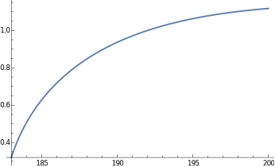

## Load FeynCalc and the necessary add-ons or other packages

```mathematica
description = "Anel El -> Z Z, EW, total cross section, tree";
If[ $FrontEnd === Null, 
  	$FeynCalcStartupMessages = False; 
  	Print[description]; 
  ];
If[ $Notebooks === False, 
  	$FeynCalcStartupMessages = False 
  ];
$LoadAddOns = {"FeynArts"};
<< FeynCalc`
$FAVerbose = 0; 
 
FCCheckVersion[9, 3, 1];
```

$$\text{FeynCalc }\;\text{10.0.0 (dev version, 2023-12-20 22:40:59 +01:00, dff3b835). For help, use the }\underline{\text{online} \;\text{documentation}}\;\text{, check out the }\underline{\text{wiki}}\;\text{ or visit the }\underline{\text{forum}.}$$

$$\text{Please check our }\underline{\text{FAQ}}\;\text{ for answers to some common FeynCalc questions and have a look at the supplied }\underline{\text{examples}.}$$

$$\text{If you use FeynCalc in your research, please evaluate FeynCalcHowToCite[] to learn how to cite this software.}$$

$$\text{Please keep in mind that the proper academic attribution of our work is crucial to ensure the future development of this package!}$$

$$\text{FeynArts }\;\text{3.11 (3 Aug 2020) patched for use with FeynCalc, for documentation see the }\underline{\text{manual}}\;\text{ or visit }\underline{\text{www}.\text{feynarts}.\text{de}.}$$

$$\text{If you use FeynArts in your research, please cite}$$

$$\text{ $\bullet $ T. Hahn, Comput. Phys. Commun., 140, 418-431, 2001, arXiv:hep-ph/0012260}$$

## Generate Feynman diagrams

Nicer typesetting

```mathematica
MakeBoxes[p1, TraditionalForm] := "\!\(\*SubscriptBox[\(p\), \(1\)]\)";
MakeBoxes[p2, TraditionalForm] := "\!\(\*SubscriptBox[\(p\), \(2\)]\)";
MakeBoxes[k1, TraditionalForm] := "\!\(\*SubscriptBox[\(k\), \(1\)]\)";
MakeBoxes[k2, TraditionalForm] := "\!\(\*SubscriptBox[\(k\), \(2\)]\)";
```

```mathematica
diags = InsertFields[CreateTopologies[0, 2 -> 2], {F[2, {1}], -F[2, {1}]} -> 
     		{V[2], V[2]}, InsertionLevel -> {Classes}]; 
 
Paint[diags, ColumnsXRows -> {3, 1}, Numbering -> Simple, 
  	SheetHeader -> None, ImageSize -> {512, 256}];
```


## Obtain the amplitude

```mathematica
amp[0] = FCFAConvert[CreateFeynAmp[diags], IncomingMomenta -> {p1, p2}, 
   	OutgoingMomenta -> {k1, k2}, UndoChiralSplittings -> True, ChangeDimension -> 4, 
   	TransversePolarizationVectors -> {k1, k2}, List -> True, SMP -> True, 
   	Contract -> True, FinalSubstitutions -> {SMP["e"] -> Sqrt[4 Pi SMP["alpha_fs"]], 
     	SMP["m_W"] -> SMP["m_Z"] SMP["cos_W"]}];
```

Let us separately mark the Higgs contribution separately

```mathematica
amp[1] = {markHiggs amp[0][[1]], amp[0][[2]], amp[0][[3]]};
```

```mathematica
amp[2] = Total[amp[1]] // DiracSimplify;
```

## Fix the kinematics

```mathematica
FCClearScalarProducts[];
SetMandelstam[s, t, u, p1, p2, -k1, -k2, SMP["m_e"], SMP["m_e"], SMP["m_Z"], SMP["m_Z"]];
```

## Square the amplitude

We need to multiply by 1/2 to account for two identical particles in the final state

```mathematica
ampSquared[0] = 1/2*(amp[2] (ComplexConjugate[amp[2]])) // 
        	FeynAmpDenominatorExplicit // FermionSpinSum[#, ExtraFactor -> 1/2^2] & // 
      	DiracSimplify // DoPolarizationSums[#, k1] & // DoPolarizationSums[#, k2] & // 
   	TrickMandelstam[#, {s, t, u, 2 SMP["m_e"]^2 + 2 SMP["m_Z"]^2}] &;
```

```mathematica
ampSquaredFull[0] = (ampSquared[0] /. markHiggs -> 1 /. u -> 2 SMP["m_e"]^2 + 2 SMP["m_Z"]^2 - s - t) // 
   	Simplify;
```

```mathematica
ampSquaredFull[1] = Simplify[Numerator[ampSquaredFull[0]] /. 
    	SMP["cos_W"] -> Sqrt[1 - SMP["sin_W"]^2]]/Denominator[ampSquaredFull[0]]
```

$$-\left(\left(\pi ^2 \alpha ^2 \left(4 \left(12 m_Z^4-4 s m_Z^2+s^2\right) m_e^{12}-\left(\left(s-4 m_Z^2\right) m_H^4+4 m_Z^2 \left(4 \left(8 \left(\left.\sin (\theta _W\right)\right){}^4-4 \left(\left.\sin (\theta _W\right)\right){}^2+1\right) m_Z^2+s\right) m_H^2+4 \left(-48 m_Z^6+\left(-32 s \left(\left.\sin (\theta _W\right)\right){}^4+16 s \left(\left.\sin (\theta _W\right)\right){}^2+39 s+48 t\right) m_Z^4-s (13 s+16 t) m_Z^2+2 s^2 (s+2 t)\right)\right) m_e^{10}+\left(192 m_Z^8+64 \left(12 s \left(\left.\sin (\theta _W\right)\right){}^4-6 s \left(\left.\sin (\theta _W\right)\right){}^2-4 s-9 t\right) m_Z^6+4 \left(32 s^2 \left(\left.\sin (\theta _W\right)\right){}^8-32 s^2 \left(\left.\sin (\theta _W\right)\right){}^6-8 s (9 s+16 t) \left(\left.\sin (\theta _W\right)\right){}^4+8 s (5 s+8 t) \left(\left.\sin (\theta _W\right)\right){}^2+43 s^2+72 t^2+116 s t\right) m_Z^4-16 s \left(3 s^2+10 t s+6 t^2\right) m_Z^2+s^2 \left(5 s^2+24 t s+24 t^2\right)+m_H^4 \left(4 \left(32 \left(\left.\sin (\theta _W\right)\right){}^8-32 \left(\left.\sin (\theta _W\right)\right){}^6+24 \left(\left.\sin (\theta _W\right)\right){}^4-8 \left(\left.\sin (\theta _W\right)\right){}^2+7\right) m_Z^4-8 (s+2 t) m_Z^2+s (s+4 t)\right)+4 m_H^2 \left(-12 \left(1-4 \left(\left.\sin (\theta _W\right)\right){}^2\right){}^2 m_Z^6-8 \left(8 s \left(\left.\sin (\theta _W\right)\right){}^8-8 s \left(\left.\sin (\theta _W\right)\right){}^6-2 (3 s+8 t) \left(\left.\sin (\theta _W\right)\right){}^4+4 (s+2 t) \left(\left.\sin (\theta _W\right)\right){}^2+s-2 t\right) m_Z^4+s (3 s+4 t) m_Z^2\right)\right) m_e^8-\left(192 \left(-6 s \left(\left.\sin (\theta _W\right)\right){}^4+3 s \left(\left.\sin (\theta _W\right)\right){}^2+2 t\right) m_Z^8-4 \left(128 s^2 \left(\left.\sin (\theta _W\right)\right){}^8-128 s^2 \left(\left.\sin (\theta _W\right)\right){}^6-32 s (9 s+16 t) \left(\left.\sin (\theta _W\right)\right){}^4+32 s (5 s+8 t) \left(\left.\sin (\theta _W\right)\right){}^2+13 s^2+144 t^2+124 s t\right) m_Z^6-8 \left(-64 s^2 t \left(\left.\sin (\theta _W\right)\right){}^8+64 s^2 t \left(\left.\sin (\theta _W\right)\right){}^6+16 s \left(s^2+5 t s+6 t^2\right) \left(\left.\sin (\theta _W\right)\right){}^4-8 s \left(s^2+6 t s+6 t^2\right) \left(\left.\sin (\theta _W\right)\right){}^2-3 \left(3 s^3+15 t s^2+19 t^2 s+8 t^3\right)\right) m_Z^4-8 s \left(2 s^3 \left(\left.\sin (\theta _W\right)\right){}^4-s^3 \left(\left.\sin (\theta _W\right)\right){}^2+2 s^3+8 t^3+21 s t^2+13 s^2 t\right) m_Z^2+s^2 \left(s^3+10 t s^2+24 t^2 s+16 t^3\right)+2 m_H^4 \left(-2 \left(128 \left(\left.\sin (\theta _W\right)\right){}^8-128 \left(\left.\sin (\theta _W\right)\right){}^6+16 \left(\left.\sin (\theta _W\right)\right){}^4+8 \left(\left.\sin (\theta _W\right)\right){}^2+5\right) m_Z^6+2 \left(128 t \left(\left.\sin (\theta _W\right)\right){}^8-128 t \left(\left.\sin (\theta _W\right)\right){}^6+48 (s+2 t) \left(\left.\sin (\theta _W\right)\right){}^4-8 (3 s+4 t) \left(\left.\sin (\theta _W\right)\right){}^2+9 s+20 t\right) m_Z^4-2 \left(4 s^2 \left(\left.\sin (\theta _W\right)\right){}^4-2 s^2 \left(\left.\sin (\theta _W\right)\right){}^2+s^2+6 t^2+7 s t\right) m_Z^2+s t (2 s+3 t)\right)+4 m_H^2 \left(12 \left(24 \left(\left.\sin (\theta _W\right)\right){}^4-12 \left(\left.\sin (\theta _W\right)\right){}^2+1\right) m_Z^8+2 \left(128 s \left(\left.\sin (\theta _W\right)\right){}^8-128 s \left(\left.\sin (\theta _W\right)\right){}^6-8 (17 s+32 t) \left(\left.\sin (\theta _W\right)\right){}^4+4 (21 s+32 t) \left(\left.\sin (\theta _W\right)\right){}^2+s-20 t\right) m_Z^6+\left(-256 s t \left(\left.\sin (\theta _W\right)\right){}^8+256 s t \left(\left.\sin (\theta _W\right)\right){}^6-16 \left(s^2-4 t s-12 t^2\right) \left(\left.\sin (\theta _W\right)\right){}^4+8 \left(s^2-8 t s-12 t^2\right) \left(\left.\sin (\theta _W\right)\right){}^2-19 s^2+24 t^2-16 s t\right) m_Z^4+s \left(8 s^2 \left(\left.\sin (\theta _W\right)\right){}^4-4 s^2 \left(\left.\sin (\theta _W\right)\right){}^2+3 s^2+6 t^2+8 s t\right) m_Z^2\right)\right) m_e^6+\left(32 s \left(8 \left(\left.\sin (\theta _W\right)\right){}^4-4 \left(\left.\sin (\theta _W\right)\right){}^2+1\right) m_Z^{10}+8 \left(240 s^2 \left(\left.\sin (\theta _W\right)\right){}^8-240 s^2 \left(\left.\sin (\theta _W\right)\right){}^6-4 s (11 s+56 t) \left(\left.\sin (\theta _W\right)\right){}^4+4 s (13 s+28 t) \left(\left.\sin (\theta _W\right)\right){}^2-9 s^2+24 t^2-4 s t\right) m_Z^8-8 \left(64 s^2 (2 s+3 t) \left(\left.\sin (\theta _W\right)\right){}^8-64 s^2 (2 s+3 t) \left(\left.\sin (\theta _W\right)\right){}^6-16 s \left(s^2+11 t s+14 t^2\right) \left(\left.\sin (\theta _W\right)\right){}^4+8 s \left(3 s^2+14 t s+14 t^2\right) \left(\left.\sin (\theta _W\right)\right){}^2-2 s^3+24 t^3+28 s t^2+5 s^2 t\right) m_Z^6+\left(64 s^2 \left(3 s^2+4 t s+12 t^2\right) \left(\left.\sin (\theta _W\right)\right){}^8-64 s^2 \left(3 s^2+4 t s+12 t^2\right) \left(\left.\sin (\theta _W\right)\right){}^6+16 s \left(9 s^3+4 t s^2-20 t^2 s-32 t^3\right) \left(\left.\sin (\theta _W\right)\right){}^4+16 s \left(-3 s^3+16 t^2 s+16 t^3\right) \left(\left.\sin (\theta _W\right)\right){}^2+15 s^4+48 t^4+144 s t^3+208 s^2 t^2+104 s^3 t\right) m_Z^4-2 s (s+2 t) \left(8 s^3 \left(\left.\sin (\theta _W\right)\right){}^4-4 s^3 \left(\left.\sin (\theta _W\right)\right){}^2+s^3+4 t^3+14 s t^2+9 s^2 t\right) m_Z^2+2 m_H^2 \left(-16 \left(8 \left(\left.\sin (\theta _W\right)\right){}^4-4 \left(\left.\sin (\theta _W\right)\right){}^2+1\right) m_Z^8-16 \left(120 s \left(\left.\sin (\theta _W\right)\right){}^8-120 s \left(\left.\sin (\theta _W\right)\right){}^6-2 (3 s+28 t) \left(\left.\sin (\theta _W\right)\right){}^4+2 (9 s+14 t) \left(\left.\sin (\theta _W\right)\right){}^2-3 s-4 t\right) m_Z^6+4 \left(128 s (2 s+3 t) \left(\left.\sin (\theta _W\right)\right){}^8-128 s (2 s+3 t) \left(\left.\sin (\theta _W\right)\right){}^6+8 \left(s^2-14 t s-28 t^2\right) \left(\left.\sin (\theta _W\right)\right){}^4+4 \left(7 s^2+26 t s+28 t^2\right) \left(\left.\sin (\theta _W\right)\right){}^2-s^2-22 t^2-6 s t\right) m_Z^4-\left(64 s \left(3 s^2+4 t s+12 t^2\right) \left(\left.\sin (\theta _W\right)\right){}^8-64 s \left(3 s^2+4 t s+12 t^2\right) \left(\left.\sin (\theta _W\right)\right){}^6+16 \left(11 s^3+20 t s^2+8 t^2 s-16 t^3\right) \left(\left.\sin (\theta _W\right)\right){}^4-32 \left(2 s^3+4 t s^2-t^2 s-4 t^3\right) \left(\left.\sin (\theta _W\right)\right){}^2+17 s^3-32 t^3+20 s t^2+60 s^2 t\right) m_Z^2+2 s \left(8 s^2 (s+2 t) \left(\left.\sin (\theta _W\right)\right){}^4-4 s^2 (s+2 t) \left(\left.\sin (\theta _W\right)\right){}^2+s^3+4 t^3+7 s t^2+5 s^2 t\right)\right) m_Z^2+s^2 t (s+t) (s+2 t)^2+m_H^4 \left(8 \left(240 \left(\left.\sin (\theta _W\right)\right){}^8-240 \left(\left.\sin (\theta _W\right)\right){}^6+20 \left(\left.\sin (\theta _W\right)\right){}^4+20 \left(\left.\sin (\theta _W\right)\right){}^2-3\right) m_Z^8-8 \left(64 (2 s+3 t) \left(\left.\sin (\theta _W\right)\right){}^8-64 (2 s+3 t) \left(\left.\sin (\theta _W\right)\right){}^6+8 (3 s+8 t) \left(\left.\sin (\theta _W\right)\right){}^4+4 (s-2 t) \left(\left.\sin (\theta _W\right)\right){}^2+s+5 t\right) m_Z^6+\left(64 \left(3 s^2+4 t s+12 t^2\right) \left(\left.\sin (\theta _W\right)\right){}^8-64 \left(3 s^2+4 t s+12 t^2\right) \left(\left.\sin (\theta _W\right)\right){}^6+16 \left(13 s^2+36 t s+36 t^2\right) \left(\left.\sin (\theta _W\right)\right){}^4-16 \left(5 s^2+16 t s+12 t^2\right) \left(\left.\sin (\theta _W\right)\right){}^2+19 s^2+80 t^2+80 s t\right) m_Z^4-2 \left(8 s^2 (s+2 t) \left(\left.\sin (\theta _W\right)\right){}^4-4 s^2 (s+2 t) \left(\left.\sin (\theta _W\right)\right){}^2+s^3+8 t^3+16 s t^2+7 s^2 t\right) m_Z^2+s t \left(s^2+5 t s+4 t^2\right)\right)\right) m_e^4+\left(-\left(\left(-32 \left(\left.\sin (\theta _W\right)\right){}^2 \left(56 \left(\left.\sin (\theta _W\right)\right){}^6-56 \left(\left.\sin (\theta _W\right)\right){}^4+20 \left(\left.\sin (\theta _W\right)\right){}^2-3\right) m_Z^{10}+4 \left(32 (11 s+14 t) \left(\left.\sin (\theta _W\right)\right){}^8-32 (11 s+14 t) \left(\left.\sin (\theta _W\right)\right){}^6+8 (7 s+22 t) \left(\left.\sin (\theta _W\right)\right){}^4+16 (s-2 t) \left(\left.\sin (\theta _W\right)\right){}^2-5 s\right) m_Z^8-2 \left(64 \left(3 s^2+4 t s+12 t^2\right) \left(\left.\sin (\theta _W\right)\right){}^8-64 \left(3 s^2+4 t s+12 t^2\right) \left(\left.\sin (\theta _W\right)\right){}^6-8 \left(s^2-28 t s-52 t^2\right) \left(\left.\sin (\theta _W\right)\right){}^4+4 \left(7 s^2-20 t s-28 t^2\right) \left(\left.\sin (\theta _W\right)\right){}^2-5 s^2+18 t^2+10 s t\right) m_Z^6+4 \left(16 \left(s^3+2 t s^2+8 t^2 s+8 t^3\right) \left(\left.\sin (\theta _W\right)\right){}^8-16 \left(s^3+2 t s^2+8 t^2 s+8 t^3\right) \left(\left.\sin (\theta _W\right)\right){}^6+4 \left(s^3+20 t s^2+36 t^2 s+24 t^3\right) \left(\left.\sin (\theta _W\right)\right){}^4-4 t \left(9 s^2+14 t s+8 t^2\right) \left(\left.\sin (\theta _W\right)\right){}^2+t \left(6 s^2+13 t s+8 t^2\right)\right) m_Z^4-2 t (s+t) \left(8 s^2 \left(\left.\sin (\theta _W\right)\right){}^4-4 s^2 \left(\left.\sin (\theta _W\right)\right){}^2+s^2+2 t^2+4 s t\right) m_Z^2+s t^2 (s+t)^2\right) m_H^4\right)-4 m_Z^2 \left(-8 \left(-112 s \left(\left.\sin (\theta _W\right)\right){}^8+112 s \left(\left.\sin (\theta _W\right)\right){}^6+8 (t-5 s) \left(\left.\sin (\theta _W\right)\right){}^4+(6 s-4 t) \left(\left.\sin (\theta _W\right)\right){}^2+t\right) m_Z^8-2 \left(32 s (11 s+14 t) \left(\left.\sin (\theta _W\right)\right){}^8-32 s (11 s+14 t) \left(\left.\sin (\theta _W\right)\right){}^6+8 \left(7 s^2+14 t s-10 t^2\right) \left(\left.\sin (\theta _W\right)\right){}^4+8 \left(2 s^2+5 t^2\right) \left(\left.\sin (\theta _W\right)\right){}^2-5 s^2-10 t^2-6 s t\right) m_Z^6+\left(64 s \left(3 s^2+4 t s+12 t^2\right) \left(\left.\sin (\theta _W\right)\right){}^8-64 s \left(3 s^2+4 t s+12 t^2\right) \left(\left.\sin (\theta _W\right)\right){}^6-8 \left(s^3-18 t s^2-30 t^2 s+16 t^3\right) \left(\left.\sin (\theta _W\right)\right){}^4+4 \left(7 s^3-10 t s^2-6 t^2 s+16 t^3\right) \left(\left.\sin (\theta _W\right)\right){}^2-5 s^3-16 t^3-6 s t^2+4 s^2 t\right) m_Z^4-\left(32 s \left(s^3+2 t s^2+8 t^2 s+8 t^3\right) \left(\left.\sin (\theta _W\right)\right){}^8-32 s \left(s^3+2 t s^2+8 t^2 s+8 t^3\right) \left(\left.\sin (\theta _W\right)\right){}^6+8 \left(s^4+18 t s^3+30 t^2 s^2+16 t^3 s-4 t^4\right) \left(\left.\sin (\theta _W\right)\right){}^4-8 t \left(8 s^3+11 t s^2+4 t^2 s-2 t^3\right) \left(\left.\sin (\theta _W\right)\right){}^2+t \left(11 s^3+15 t s^2+4 t^2 s-4 t^3\right)\right) m_Z^2+s t (s+t) \left(8 s^2 \left(\left.\sin (\theta _W\right)\right){}^4-4 s^2 \left(\left.\sin (\theta _W\right)\right){}^2+s^2+t^2+s t\right)\right) m_H^2+2 s m_Z^2 \left(-16 \left(-56 s \left(\left.\sin (\theta _W\right)\right){}^8+56 s \left(\left.\sin (\theta _W\right)\right){}^6+(8 t-20 s) \left(\left.\sin (\theta _W\right)\right){}^4+(3 s-4 t) \left(\left.\sin (\theta _W\right)\right){}^2+t\right) m_Z^8-2 \left(32 s (11 s+14 t) \left(\left.\sin (\theta _W\right)\right){}^8-32 s (11 s+14 t) \left(\left.\sin (\theta _W\right)\right){}^6+8 \left(7 s^2+6 t s-20 t^2\right) \left(\left.\sin (\theta _W\right)\right){}^4+16 \left(s^2+2 t s+5 t^2\right) \left(\left.\sin (\theta _W\right)\right){}^2-5 s^2-8 t^2-12 s t\right) m_Z^6+\left(64 s \left(3 s^2+4 t s+12 t^2\right) \left(\left.\sin (\theta _W\right)\right){}^8-64 s \left(3 s^2+4 t s+12 t^2\right) \left(\left.\sin (\theta _W\right)\right){}^6-8 \left(s^3-8 t s^2-8 t^2 s+32 t^3\right) \left(\left.\sin (\theta _W\right)\right){}^4+4 \left(7 s^3+16 t^2 s+32 t^3\right) \left(\left.\sin (\theta _W\right)\right){}^2-5 s^3-8 t^3+2 s t^2-2 s^2 t\right) m_Z^4-2 \left(16 s \left(s^3+2 t s^2+8 t^2 s+8 t^3\right) \left(\left.\sin (\theta _W\right)\right){}^8-16 s \left(s^3+2 t s^2+8 t^2 s+8 t^3\right) \left(\left.\sin (\theta _W\right)\right){}^6+4 \left(s^4+16 t s^3+24 t^2 s^2+8 t^3 s-8 t^4\right) \left(\left.\sin (\theta _W\right)\right){}^4+4 t \left(-7 s^3-8 t s^2+4 t^3\right) \left(\left.\sin (\theta _W\right)\right){}^2+t \left(5 s^3+10 t s^2+6 t^2 s-t^3\right)\right) m_Z^2+s t (s+t) \left(8 s^2 \left(\left.\sin (\theta _W\right)\right){}^4-4 s^2 \left(\left.\sin (\theta _W\right)\right){}^2+s^2+2 t^2+2 s t\right)\right)\right) m_e^2+2 \left(s-m_H^2\right){}^2 m_Z^4 \left(4 m_Z^8-4 (s+3 t) m_Z^6+\left(s^2+6 t s+14 t^2\right) m_Z^4-2 t (s+2 t)^2 m_Z^2+t \left(s^3+3 t s^2+4 t^2 s+2 t^3\right)\right) \left(32 \left(\left.\sin (\theta _W\right)\right){}^8-32 \left(\left.\sin (\theta _W\right)\right){}^6+24 \left(\left.\sin (\theta _W\right)\right){}^4-8 \left(\left.\sin (\theta _W\right)\right){}^2+1\right)\right)\right)/\left(4 \left(\left.\cos (\theta _W\right)\right){}^4 \left(t-m_e^2\right){}^2 \left(s-m_H^2\right){}^2 m_Z^4 \left(-m_e^2-2 m_Z^2+s+t\right){}^2 \left(\left.\sin (\theta _W\right)\right){}^4\right)\right)$$

If we neglect the electron mass, then the Higgs  diagram does not contribute.

```mathematica
ampSquaredMassless[0] = (ampSquared[0] /. SMP["m_e"] -> 0 /. u -> 2 SMP["m_Z"]^2 - s - t) // 
  	Simplify
```

$$-\frac{\pi ^2 \alpha ^2 \left(32 \left(\left.\sin (\theta _W\right)\right){}^8-32 \left(\left.\sin (\theta _W\right)\right){}^6+24 \left(\left.\sin (\theta _W\right)\right){}^4-8 \left(\left.\sin (\theta _W\right)\right){}^2+1\right) \left(m_Z^4 \left(s^2+6 s t+14 t^2\right)-4 m_Z^6 (s+3 t)-2 t m_Z^2 (s+2 t)^2+4 m_Z^8+t \left(s^3+3 s^2 t+4 s t^2+2 t^3\right)\right)}{2 t^2 \left(\left.\cos (\theta _W\right)\right){}^4 \left(\left.\sin (\theta _W\right)\right){}^4 \left(-2 m_Z^2+s+t\right){}^2}$$

```mathematica
ampSquaredMassless[1] = Simplify[Numerator[ampSquaredMassless[0]] /. 
    	SMP["cos_W"] -> Sqrt[1 - SMP["sin_W"]^2]]/Denominator[ampSquaredMassless[0]]
```

$$-\frac{\pi ^2 \alpha ^2 \left(32 \left(\left.\sin (\theta _W\right)\right){}^8-32 \left(\left.\sin (\theta _W\right)\right){}^6+24 \left(\left.\sin (\theta _W\right)\right){}^4-8 \left(\left.\sin (\theta _W\right)\right){}^2+1\right) \left(m_Z^4 \left(s^2+6 s t+14 t^2\right)-4 m_Z^6 (s+3 t)-2 t m_Z^2 (s+2 t)^2+4 m_Z^8+t \left(s^3+3 s^2 t+4 s t^2+2 t^3\right)\right)}{2 t^2 \left(\left.\cos (\theta _W\right)\right){}^4 \left(\left.\sin (\theta _W\right)\right){}^4 \left(-2 m_Z^2+s+t\right){}^2}$$

## Total cross section

```mathematica
prefac = 1/(16 Pi s^2);
integral = prefac*Integrate[ampSquaredFull[1], t];
```

```mathematica
logFreePart = SelectFree2[integral, Log];
logPart = SelectNotFree2[integral, Log] // Simplify;
```

```mathematica
tUpper = -1/2 (s - 2 SMP["m_Z"]^2 - 2 SMP["m_e"]^2 - Sqrt[(s - 4 SMP["m_e"]^2) (s - 4 SMP["m_Z"]^2)]);
tLower = -1/2 (s - 2 SMP["m_Z"]^2 - 2 SMP["m_e"]^2 + Sqrt[(s - 4 SMP["m_e"]^2) (s - 4 SMP["m_Z"]^2)]);
```

```mathematica
xsectionPart1 = ((logFreePart /. {t -> tUpper}) - (logFreePart /. {t ->tLower})) // 
  	Simplify
```

$$-\left(\left(\pi  \alpha ^2 \sqrt{\left(s-4 m_e^2\right) \left(s-4 m_Z^2\right)} \left(m_e^2 m_Z^4 \left(-4 m_H^2 \left(s m_Z^2 \left(-176 \left(\left.\sin (\theta _W\right)\right){}^4+88 \left(\left.\sin (\theta _W\right)\right){}^2-13\right)+4 m_Z^4 \left(8 \left(\left.\sin (\theta _W\right)\right){}^4-4 \left(\left.\sin (\theta _W\right)\right){}^2+1\right)+4 s^2 \left(16 \left(\left.\sin (\theta _W\right)\right){}^8-16 \left(\left.\sin (\theta _W\right)\right){}^6+20 \left(\left.\sin (\theta _W\right)\right){}^4-8 \left(\left.\sin (\theta _W\right)\right){}^2+1\right)\right)+m_H^4 \left(s \left(128 \left(\left.\sin (\theta _W\right)\right){}^8-128 \left(\left.\sin (\theta _W\right)\right){}^6+160 \left(\left.\sin (\theta _W\right)\right){}^4-64 \left(\left.\sin (\theta _W\right)\right){}^2+7\right)-8 m_Z^2 \left(44 \left(\left.\sin (\theta _W\right)\right){}^4-22 \left(\left.\sin (\theta _W\right)\right){}^2+3\right)\right)+4 s \left(-2 s m_Z^2 \left(44 \left(\left.\sin (\theta _W\right)\right){}^4-22 \left(\left.\sin (\theta _W\right)\right){}^2+3\right)+m_Z^4 \left(32 \left(\left.\sin (\theta _W\right)\right){}^4-16 \left(\left.\sin (\theta _W\right)\right){}^2+1\right)+2 s^2 \left(16 \left(\left.\sin (\theta _W\right)\right){}^8-16 \left(\left.\sin (\theta _W\right)\right){}^6+20 \left(\left.\sin (\theta _W\right)\right){}^4-8 \left(\left.\sin (\theta _W\right)\right){}^2+1\right)\right)\right)+m_e^4 \left(-4 m_H^2 m_Z^2 \left(s m_Z^2 \left(256 \left(\left.\sin (\theta _W\right)\right){}^8-256 \left(\left.\sin (\theta _W\right)\right){}^6+64 \left(\left.\sin (\theta _W\right)\right){}^4+1\right)-16 m_Z^4 \left(8 \left(\left.\sin (\theta _W\right)\right){}^4-4 \left(\left.\sin (\theta _W\right)\right){}^2+1\right)+s^2\right)+m_H^4 \left(8 s m_Z^2+2 m_Z^4 \left(256 \left(\left.\sin (\theta _W\right)\right){}^8-256 \left(\left.\sin (\theta _W\right)\right){}^6+32 \left(\left.\sin (\theta _W\right)\right){}^4+16 \left(\left.\sin (\theta _W\right)\right){}^2-7\right)-s^2\right)+4 s^3 m_Z^2+2 s^2 m_Z^4 \left(256 \left(\left.\sin (\theta _W\right)\right){}^8-256 \left(\left.\sin (\theta _W\right)\right){}^6+96 \left(\left.\sin (\theta _W\right)\right){}^4-16 \left(\left.\sin (\theta _W\right)\right){}^2-3\right)-32 s m_Z^6 \left(1-4 \left(\left.\sin (\theta _W\right)\right){}^2\right){}^2+48 m_Z^8\right)+4 m_e^6 \left(-8 s^2 m_Z^2+28 s m_Z^4-48 m_Z^6+s^3\right)+8 m_Z^8 \left(s-m_H^2\right){}^2 \left(32 \left(\left.\sin (\theta _W\right)\right){}^8-32 \left(\left.\sin (\theta _W\right)\right){}^6+24 \left(\left.\sin (\theta _W\right)\right){}^4-8 \left(\left.\sin (\theta _W\right)\right){}^2+1\right)\right)\right)/\left(64 s^2 m_Z^4 \left(\left.\cos (\theta _W\right)\right){}^4 \left(s-m_H^2\right){}^2 \left(\left.\sin (\theta _W\right)\right){}^4 \left(m_e^2 \left(s-4 m_Z^2\right)+m_Z^4\right)\right)\right)$$

```mathematica
xsectionPart2 = logPart /. Log[t + a_ : 0] :> Log[(tUpper + a)/(tLower + a)] // Simplify
```

$$-\left(\left(\pi  \alpha ^2 \left(\log \left(\frac{-\sqrt{\left(s-4 m_e^2\right) \left(s-4 m_Z^2\right)}-2 m_Z^2+s}{\sqrt{\left(s-4 m_e^2\right) \left(s-4 m_Z^2\right)}-2 m_Z^2+s}\right)-\log \left(\frac{\sqrt{\left(s-4 m_e^2\right) \left(s-4 m_Z^2\right)}-2 m_Z^2+s}{-\sqrt{\left(s-4 m_e^2\right) \left(s-4 m_Z^2\right)}-2 m_Z^2+s}\right)\right) \left(m_e^4 \left(m_H^2 \left(-4 s m_Z^2+2 m_Z^4 \left(1-4 \left(\left.\sin (\theta _W\right)\right){}^2\right){}^2 \left(16 \left(\left.\sin (\theta _W\right)\right){}^4-8 \left(\left.\sin (\theta _W\right)\right){}^2-3\right)+s^2\right)-8 s^2 m_Z^2+2 s m_Z^4 \left(-256 \left(\left.\sin (\theta _W\right)\right){}^8+256 \left(\left.\sin (\theta _W\right)\right){}^6-96 \left(\left.\sin (\theta _W\right)\right){}^4+16 \left(\left.\sin (\theta _W\right)\right){}^2+15\right)+16 m_Z^6 \left(16 \left(\left.\sin (\theta _W\right)\right){}^4-8 \left(\left.\sin (\theta _W\right)\right){}^2-1\right)+s^3\right)+2 m_e^2 m_Z^2 \left(m_H^2 \left(2 s m_Z^2 \left(-64 \left(\left.\sin (\theta _W\right)\right){}^8+64 \left(\left.\sin (\theta _W\right)\right){}^6+16 \left(\left.\sin (\theta _W\right)\right){}^4-16 \left(\left.\sin (\theta _W\right)\right){}^2+3\right)+8 m_Z^4 \left(32 \left(\left.\sin (\theta _W\right)\right){}^8-32 \left(\left.\sin (\theta _W\right)\right){}^6+22 \left(\left.\sin (\theta _W\right)\right){}^4-7 \left(\left.\sin (\theta _W\right)\right){}^2+1\right)+s^2 \left(-8 \left(\left.\sin (\theta _W\right)\right){}^4+4 \left(\left.\sin (\theta _W\right)\right){}^2-1\right)\right)+4 s^2 m_Z^2 \left(32 \left(\left.\sin (\theta _W\right)\right){}^8-32 \left(\left.\sin (\theta _W\right)\right){}^6+4 \left(\left.\sin (\theta _W\right)\right){}^2-1\right)-8 s m_Z^4 \left(32 \left(\left.\sin (\theta _W\right)\right){}^8-32 \left(\left.\sin (\theta _W\right)\right){}^6+34 \left(\left.\sin (\theta _W\right)\right){}^4-13 \left(\left.\sin (\theta _W\right)\right){}^2+2\right)+8 m_Z^6 \left(8 \left(\left.\sin (\theta _W\right)\right){}^4-4 \left(\left.\sin (\theta _W\right)\right){}^2+1\right)+s^3 \left(8 \left(\left.\sin (\theta _W\right)\right){}^4-4 \left(\left.\sin (\theta _W\right)\right){}^2+1\right)\right)+2 m_Z^4 \left(s-m_H^2\right) \left(4 m_Z^4+s^2\right) \left(32 \left(\left.\sin (\theta _W\right)\right){}^8-32 \left(\left.\sin (\theta _W\right)\right){}^6+24 \left(\left.\sin (\theta _W\right)\right){}^4-8 \left(\left.\sin (\theta _W\right)\right){}^2+1\right)\right)\right)/\left(64 s^2 m_Z^4 \left(\left.\cos (\theta _W\right)\right){}^4 \left(s-m_H^2\right) \left(s-2 m_Z^2\right) \left(\left.\sin (\theta _W\right)\right){}^4\right)\right)$$

```mathematica
crossSectionTotal = (xsectionPart1 + xsectionPart2)
```

$$-\left(\left(\pi  \left(\log \left(\frac{-2 m_Z^2+s-\sqrt{\left(s-4 m_e^2\right) \left(s-4 m_Z^2\right)}}{-2 m_Z^2+s+\sqrt{\left(s-4 m_e^2\right) \left(s-4 m_Z^2\right)}}\right)-\log \left(\frac{-2 m_Z^2+s+\sqrt{\left(s-4 m_e^2\right) \left(s-4 m_Z^2\right)}}{-2 m_Z^2+s-\sqrt{\left(s-4 m_e^2\right) \left(s-4 m_Z^2\right)}}\right)\right) \left(\left(16 \left(16 \left(\left.\sin (\theta _W\right)\right){}^4-8 \left(\left.\sin (\theta _W\right)\right){}^2-1\right) m_Z^6+2 s \left(-256 \left(\left.\sin (\theta _W\right)\right){}^8+256 \left(\left.\sin (\theta _W\right)\right){}^6-96 \left(\left.\sin (\theta _W\right)\right){}^4+16 \left(\left.\sin (\theta _W\right)\right){}^2+15\right) m_Z^4-8 s^2 m_Z^2+s^3+m_H^2 \left(2 \left(1-4 \left(\left.\sin (\theta _W\right)\right){}^2\right){}^2 \left(16 \left(\left.\sin (\theta _W\right)\right){}^4-8 \left(\left.\sin (\theta _W\right)\right){}^2-3\right) m_Z^4-4 s m_Z^2+s^2\right)\right) m_e^4+2 m_Z^2 \left(8 \left(8 \left(\left.\sin (\theta _W\right)\right){}^4-4 \left(\left.\sin (\theta _W\right)\right){}^2+1\right) m_Z^6-8 s \left(32 \left(\left.\sin (\theta _W\right)\right){}^8-32 \left(\left.\sin (\theta _W\right)\right){}^6+34 \left(\left.\sin (\theta _W\right)\right){}^4-13 \left(\left.\sin (\theta _W\right)\right){}^2+2\right) m_Z^4+4 s^2 \left(32 \left(\left.\sin (\theta _W\right)\right){}^8-32 \left(\left.\sin (\theta _W\right)\right){}^6+4 \left(\left.\sin (\theta _W\right)\right){}^2-1\right) m_Z^2+s^3 \left(8 \left(\left.\sin (\theta _W\right)\right){}^4-4 \left(\left.\sin (\theta _W\right)\right){}^2+1\right)+m_H^2 \left(8 \left(32 \left(\left.\sin (\theta _W\right)\right){}^8-32 \left(\left.\sin (\theta _W\right)\right){}^6+22 \left(\left.\sin (\theta _W\right)\right){}^4-7 \left(\left.\sin (\theta _W\right)\right){}^2+1\right) m_Z^4+2 s \left(-64 \left(\left.\sin (\theta _W\right)\right){}^8+64 \left(\left.\sin (\theta _W\right)\right){}^6+16 \left(\left.\sin (\theta _W\right)\right){}^4-16 \left(\left.\sin (\theta _W\right)\right){}^2+3\right) m_Z^2+s^2 \left(-8 \left(\left.\sin (\theta _W\right)\right){}^4+4 \left(\left.\sin (\theta _W\right)\right){}^2-1\right)\right)\right) m_e^2+2 \left(s-m_H^2\right) m_Z^4 \left(4 m_Z^4+s^2\right) \left(32 \left(\left.\sin (\theta _W\right)\right){}^8-32 \left(\left.\sin (\theta _W\right)\right){}^6+24 \left(\left.\sin (\theta _W\right)\right){}^4-8 \left(\left.\sin (\theta _W\right)\right){}^2+1\right)\right) \alpha ^2\right)/\left(64 s^2 \left(\left.\cos (\theta _W\right)\right){}^4 \left(s-m_H^2\right) m_Z^4 \left(s-2 m_Z^2\right) \left(\left.\sin (\theta _W\right)\right){}^4\right)\right)-\left(\pi  \sqrt{\left(s-4 m_e^2\right) \left(s-4 m_Z^2\right)} \left(8 \left(s-m_H^2\right){}^2 \left(32 \left(\left.\sin (\theta _W\right)\right){}^8-32 \left(\left.\sin (\theta _W\right)\right){}^6+24 \left(\left.\sin (\theta _W\right)\right){}^4-8 \left(\left.\sin (\theta _W\right)\right){}^2+1\right) m_Z^8+m_e^2 \left(\left(s \left(128 \left(\left.\sin (\theta _W\right)\right){}^8-128 \left(\left.\sin (\theta _W\right)\right){}^6+160 \left(\left.\sin (\theta _W\right)\right){}^4-64 \left(\left.\sin (\theta _W\right)\right){}^2+7\right)-8 m_Z^2 \left(44 \left(\left.\sin (\theta _W\right)\right){}^4-22 \left(\left.\sin (\theta _W\right)\right){}^2+3\right)\right) m_H^4-4 \left(4 \left(8 \left(\left.\sin (\theta _W\right)\right){}^4-4 \left(\left.\sin (\theta _W\right)\right){}^2+1\right) m_Z^4+s \left(-176 \left(\left.\sin (\theta _W\right)\right){}^4+88 \left(\left.\sin (\theta _W\right)\right){}^2-13\right) m_Z^2+4 s^2 \left(16 \left(\left.\sin (\theta _W\right)\right){}^8-16 \left(\left.\sin (\theta _W\right)\right){}^6+20 \left(\left.\sin (\theta _W\right)\right){}^4-8 \left(\left.\sin (\theta _W\right)\right){}^2+1\right)\right) m_H^2+4 s \left(\left(32 \left(\left.\sin (\theta _W\right)\right){}^4-16 \left(\left.\sin (\theta _W\right)\right){}^2+1\right) m_Z^4-2 s \left(44 \left(\left.\sin (\theta _W\right)\right){}^4-22 \left(\left.\sin (\theta _W\right)\right){}^2+3\right) m_Z^2+2 s^2 \left(16 \left(\left.\sin (\theta _W\right)\right){}^8-16 \left(\left.\sin (\theta _W\right)\right){}^6+20 \left(\left.\sin (\theta _W\right)\right){}^4-8 \left(\left.\sin (\theta _W\right)\right){}^2+1\right)\right)\right) m_Z^4+4 m_e^6 \left(-48 m_Z^6+28 s m_Z^4-8 s^2 m_Z^2+s^3\right)+m_e^4 \left(48 m_Z^8-32 s \left(1-4 \left(\left.\sin (\theta _W\right)\right){}^2\right){}^2 m_Z^6+2 s^2 \left(256 \left(\left.\sin (\theta _W\right)\right){}^8-256 \left(\left.\sin (\theta _W\right)\right){}^6+96 \left(\left.\sin (\theta _W\right)\right){}^4-16 \left(\left.\sin (\theta _W\right)\right){}^2-3\right) m_Z^4+4 s^3 m_Z^2-4 m_H^2 \left(-16 \left(8 \left(\left.\sin (\theta _W\right)\right){}^4-4 \left(\left.\sin (\theta _W\right)\right){}^2+1\right) m_Z^4+s \left(256 \left(\left.\sin (\theta _W\right)\right){}^8-256 \left(\left.\sin (\theta _W\right)\right){}^6+64 \left(\left.\sin (\theta _W\right)\right){}^4+1\right) m_Z^2+s^2\right) m_Z^2+m_H^4 \left(2 \left(256 \left(\left.\sin (\theta _W\right)\right){}^8-256 \left(\left.\sin (\theta _W\right)\right){}^6+32 \left(\left.\sin (\theta _W\right)\right){}^4+16 \left(\left.\sin (\theta _W\right)\right){}^2-7\right) m_Z^4+8 s m_Z^2-s^2\right)\right)\right) \alpha ^2\right)/\left(64 s^2 \left(\left.\cos (\theta _W\right)\right){}^4 \left(s-m_H^2\right){}^2 m_Z^4 \left(m_Z^4+m_e^2 \left(s-4 m_Z^2\right)\right) \left(\left.\sin (\theta _W\right)\right){}^4\right)$$

Neglecting the electron mass produces a much simpler formula for the total cross section

```mathematica
xsectionMasslessPart1 = (xsectionPart1 /. SMP["m_e"] -> 0) // Simplify
```

$$-\frac{\pi  \alpha ^2 \sqrt{s \left(s-4 m_Z^2\right)} \left(32 \left(\left.\sin (\theta _W\right)\right){}^8-32 \left(\left.\sin (\theta _W\right)\right){}^6+24 \left(\left.\sin (\theta _W\right)\right){}^4-8 \left(\left.\sin (\theta _W\right)\right){}^2+1\right)}{8 s^2 \left(\left.\cos (\theta _W\right)\right){}^4 \left(\left.\sin (\theta _W\right)\right){}^4}$$

```mathematica
xsectionMasslessPart2 = (xsectionPart2 /. SMP["m_e"] -> 0) // Simplify
```

$$-\frac{\pi  \alpha ^2 \left(4 m_Z^4+s^2\right) \left(32 \left(\left.\sin (\theta _W\right)\right){}^8-32 \left(\left.\sin (\theta _W\right)\right){}^6+24 \left(\left.\sin (\theta _W\right)\right){}^4-8 \left(\left.\sin (\theta _W\right)\right){}^2+1\right) \left(\log \left(\frac{-\sqrt{s \left(s-4 m_Z^2\right)}-2 m_Z^2+s}{\sqrt{s \left(s-4 m_Z^2\right)}-2 m_Z^2+s}\right)-\log \left(\frac{\sqrt{s \left(s-4 m_Z^2\right)}-2 m_Z^2+s}{-\sqrt{s \left(s-4 m_Z^2\right)}-2 m_Z^2+s}\right)\right)}{32 s^2 \left(\left.\cos (\theta _W\right)\right){}^4 \left(s-2 m_Z^2\right) \left(\left.\sin (\theta _W\right)\right){}^4}$$

```mathematica
crossSectionTotalMassless = xsectionMasslessPart1 + xsectionMasslessPart2
```

$$-\frac{\pi  \alpha ^2 \sqrt{s \left(s-4 m_Z^2\right)} \left(32 \left(\left.\sin (\theta _W\right)\right){}^8-32 \left(\left.\sin (\theta _W\right)\right){}^6+24 \left(\left.\sin (\theta _W\right)\right){}^4-8 \left(\left.\sin (\theta _W\right)\right){}^2+1\right)}{8 s^2 \left(\left.\cos (\theta _W\right)\right){}^4 \left(\left.\sin (\theta _W\right)\right){}^4}-\frac{\pi  \alpha ^2 \left(4 m_Z^4+s^2\right) \left(32 \left(\left.\sin (\theta _W\right)\right){}^8-32 \left(\left.\sin (\theta _W\right)\right){}^6+24 \left(\left.\sin (\theta _W\right)\right){}^4-8 \left(\left.\sin (\theta _W\right)\right){}^2+1\right) \left(\log \left(\frac{-\sqrt{s \left(s-4 m_Z^2\right)}-2 m_Z^2+s}{\sqrt{s \left(s-4 m_Z^2\right)}-2 m_Z^2+s}\right)-\log \left(\frac{\sqrt{s \left(s-4 m_Z^2\right)}-2 m_Z^2+s}{-\sqrt{s \left(s-4 m_Z^2\right)}-2 m_Z^2+s}\right)\right)}{32 s^2 \left(\left.\cos (\theta _W\right)\right){}^4 \left(s-2 m_Z^2\right) \left(\left.\sin (\theta _W\right)\right){}^4}$$

We can also plot the full cross-section (in pb) as a function of Sqrt[s] (in GeV)

```mathematica
crossSectionTotalPlot = 
 	3.89*10^8*crossSectionTotal /. {SMP["m_e"] -> 0.51*10^(-3), SMP["m_H"] -> 125.0, SMP["m_Z"] -> 91.2, SMP["sin_W"] -> Sqrt[0.231], 
    	SMP["cos_W"] -> Sqrt[1.0 - 0.231], SMP["alpha_fs"] -> 1/137, s -> sqrtS^2} // Simplify
```

$$\frac{1}{\text{sqrtS}^4 \left(\text{sqrtS}^2-15625.\right)^2}\left(-\frac{17424.3 \sqrt{\text{sqrtS}^4-33269.8 \;\text{sqrtS}^2+0.0346139} \left(1. \;\text{sqrtS}^6+5.09207\times 10^{14} \;\text{sqrtS}^4-1.59127\times 10^{19} \;\text{sqrtS}^2+1.24318\times 10^{23}\right)}{1. \;\text{sqrtS}^2+2.65974\times 10^{14}}-\frac{1}{\text{sqrtS}^2-16634.9}8339.72 \left(\text{sqrtS}^2-15625.\right) \left(1. \;\text{sqrtS}^6-15625. \;\text{sqrtS}^4+2.76719\times 10^8 \;\text{sqrtS}^2-4.32374\times 10^{12}\right) \left(\log \left(\frac{\text{sqrtS}^2-1. \sqrt{\text{sqrtS}^4-33269.8 \;\text{sqrtS}^2+0.0346139}-16634.9}{\text{sqrtS}^2+\sqrt{\text{sqrtS}^4-33269.8 \;\text{sqrtS}^2+0.0346139}-16634.9}\right)-1. \log \left(\frac{\text{sqrtS}^2+\sqrt{\text{sqrtS}^4-33269.8 \;\text{sqrtS}^2+0.0346139}-16634.9}{\text{sqrtS}^2-1. \sqrt{\text{sqrtS}^4-33269.8 \;\text{sqrtS}^2+0.0346139}-16634.9}\right)\right)\right)$$

The plot can be compared to the one in  arXiv:hep-ex/9911003, Fig. 8

```mathematica
If[ $FrontEnd =!= Null, 
 	Plot[crossSectionTotalPlot, {sqrtS, 183, 200}] 
 ]
```



## Check the final results

```mathematica
knownResults = {
   	-(Pi*(4*(-2 + s)*Sqrt[(-4 + s)*s] + 
         	(4 + s^2)*Log[(-2 + s - Sqrt[(-4 + s)*s])/(-2 + s + Sqrt[(-4 + s)*s])] - 
         	(4 + s^2)*Log[(-2 + s + Sqrt[(-4 + s)*s])/(-2 + s - Sqrt[(-4 + s)*s])])*
        SMP["alpha_fs"]^2*(1 - 8*SMP["sin_W"]^2 + 24*SMP["sin_W"]^4 - 32*SMP["sin_W"]^6 + 
         	32*SMP["sin_W"]^8))/(32*(-2 + s)*s^2*SMP["cos_W"]^4*SMP["sin_W"]^4) 
   };
FCCompareResults[{crossSectionTotalMassless /. SMP["m_Z"] -> 1}, 
   knownResults, 
   Text -> {"\tCompare to the known result: ", 
     "CORRECT.", "WRONG!"}, Interrupt -> {Hold[Quit[1]], Automatic}];
Print["\tCPU Time used: ", Round[N[TimeUsed[], 3], 0.001], " s."];
```

$$\text{$\backslash $tCompare to the known result: } \;\text{CORRECT.}$$

$$\text{$\backslash $tCPU Time used: }56.255\text{ s.}$$