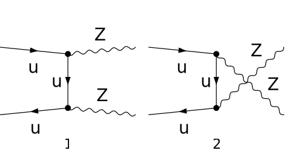

## Load FeynCalc and the necessary add-ons or other packages

```mathematica
description = "Q Qbar -> Z Z, EW, matrix element squared, tree";
If[ $FrontEnd === Null, 
  	$FeynCalcStartupMessages = False; 
  	Print[description]; 
  ];
If[ $Notebooks === False, 
  	$FeynCalcStartupMessages = False 
  ];
$LoadAddOns = {"FeynArts"};
<< FeynCalc`
$FAVerbose = 0; 
 
FCCheckVersion[9, 3, 1];
```

$$\text{FeynCalc }\;\text{10.0.0 (dev version, 2023-12-20 22:40:59 +01:00, dff3b835). For help, use the }\underline{\text{online} \;\text{documentation}}\;\text{, check out the }\underline{\text{wiki}}\;\text{ or visit the }\underline{\text{forum}.}$$

$$\text{Please check our }\underline{\text{FAQ}}\;\text{ for answers to some common FeynCalc questions and have a look at the supplied }\underline{\text{examples}.}$$

$$\text{If you use FeynCalc in your research, please evaluate FeynCalcHowToCite[] to learn how to cite this software.}$$

$$\text{Please keep in mind that the proper academic attribution of our work is crucial to ensure the future development of this package!}$$

$$\text{FeynArts }\;\text{3.11 (3 Aug 2020) patched for use with FeynCalc, for documentation see the }\underline{\text{manual}}\;\text{ or visit }\underline{\text{www}.\text{feynarts}.\text{de}.}$$

$$\text{If you use FeynArts in your research, please cite}$$

$$\text{ $\bullet $ T. Hahn, Comput. Phys. Commun., 140, 418-431, 2001, arXiv:hep-ph/0012260}$$

## Generate Feynman diagrams

Nicer typesetting

```mathematica
MakeBoxes[p1, TraditionalForm] := "\!\(\*SubscriptBox[\(p\), \(1\)]\)";
MakeBoxes[p2, TraditionalForm] := "\!\(\*SubscriptBox[\(p\), \(2\)]\)";
MakeBoxes[k1, TraditionalForm] := "\!\(\*SubscriptBox[\(k\), \(1\)]\)";
MakeBoxes[k2, TraditionalForm] := "\!\(\*SubscriptBox[\(k\), \(2\)]\)";
```

```mathematica
diags = InsertFields[CreateTopologies[0, 2 -> 2], {F[3, {1}], 
      		-F[3, {1}]} -> {V[2], V[2]}, InsertionLevel -> {Particles}, 
    		ExcludeParticles -> {S[_]}]; 
 
Paint[diags, ColumnsXRows -> {2, 1}, Numbering -> Simple, 
  	SheetHeader -> None, ImageSize -> {512, 256}];
```



## Obtain the amplitude

For simplicity let us neglect the masses of the quarks

```mathematica
amp[0] = 9/4 SMP["e_Q"]^2 FCFAConvert[CreateFeynAmp[diags], 
    	IncomingMomenta -> {p1, p2}, OutgoingMomenta -> {k1, k2}, ChangeDimension -> 4, 
    	List -> False, SMP -> True,  Contract -> True, DropSumOver -> True, 
    	TransversePolarizationVectors -> {k1, k2}, FinalSubstitutions -> {SMP["m_u"] -> 0}];
```

```mathematica
amp[1] = amp[0] // DiracSimplify
```

$$\frac{3 \left(\varphi (-\overline{p_2})\right).\left(\bar{\gamma }\cdot \bar{\varepsilon }^*\left(k_1\right)\right).\left(\bar{\gamma }\cdot \overline{k_1}\right).\left(\bar{\gamma }\cdot \bar{\varepsilon }^*\left(k_2\right)\right).\bar{\gamma }^7.\left(\varphi (\overline{p_1})\right) \;\text{e}^2 e_Q^2 \delta _{\text{Col1}\;\text{Col2}}}{2 (\overline{k_1}-\overline{p_2}){}^2 \left(\left.\cos (\theta _W\right)\right){}^2}+\frac{3 \left(\varphi (-\overline{p_2})\right).\left(\bar{\gamma }\cdot \bar{\varepsilon }^*\left(k_2\right)\right).\left(\bar{\gamma }\cdot \overline{k_2}\right).\left(\bar{\gamma }\cdot \bar{\varepsilon }^*\left(k_1\right)\right).\bar{\gamma }^7.\left(\varphi (\overline{p_1})\right) \;\text{e}^2 e_Q^2 \delta _{\text{Col1}\;\text{Col2}}}{2 (\overline{k_2}-\overline{p_2}){}^2 \left(\left.\cos (\theta _W\right)\right){}^2}-\frac{3 \left(\varphi (-\overline{p_2})\right).\left(\bar{\gamma }\cdot \bar{\varepsilon }^*\left(k_2\right)\right).\bar{\gamma }^7.\left(\varphi (\overline{p_1})\right) \left(\overline{p_2}\cdot \bar{\varepsilon }^*\left(k_1\right)\right) \;\text{e}^2 e_Q^2 \delta _{\text{Col1}\;\text{Col2}}}{(\overline{k_1}-\overline{p_2}){}^2 \left(\left.\cos (\theta _W\right)\right){}^2}-\frac{3 \left(\varphi (-\overline{p_2})\right).\left(\bar{\gamma }\cdot \bar{\varepsilon }^*\left(k_1\right)\right).\bar{\gamma }^7.\left(\varphi (\overline{p_1})\right) \left(\overline{p_2}\cdot \bar{\varepsilon }^*\left(k_2\right)\right) \;\text{e}^2 e_Q^2 \delta _{\text{Col1}\;\text{Col2}}}{(\overline{k_2}-\overline{p_2}){}^2 \left(\left.\cos (\theta _W\right)\right){}^2}-\frac{\left(\varphi (-\overline{p_2})\right).\left(\bar{\gamma }\cdot \bar{\varepsilon }^*\left(k_1\right)\right).\left(\bar{\gamma }\cdot \overline{k_1}\right).\left(\bar{\gamma }\cdot \bar{\varepsilon }^*\left(k_2\right)\right).\bar{\gamma }^6.\left(\varphi (\overline{p_1})\right) \;\text{e}^2 e_Q^2 \left(\left.\sin (\theta _W\right)\right){}^2 \delta _{\text{Col1}\;\text{Col2}}}{(\overline{k_1}-\overline{p_2}){}^2 \left(\left.\cos (\theta _W\right)\right){}^2}-\frac{\left(\varphi (-\overline{p_2})\right).\left(\bar{\gamma }\cdot \bar{\varepsilon }^*\left(k_1\right)\right).\left(\bar{\gamma }\cdot \overline{k_1}\right).\left(\bar{\gamma }\cdot \bar{\varepsilon }^*\left(k_2\right)\right).\bar{\gamma }^7.\left(\varphi (\overline{p_1})\right) \;\text{e}^2 e_Q^2 \left(\left.\sin (\theta _W\right)\right){}^2 \delta _{\text{Col1}\;\text{Col2}}}{(\overline{k_1}-\overline{p_2}){}^2 \left(\left.\cos (\theta _W\right)\right){}^2}-\frac{\left(\varphi (-\overline{p_2})\right).\left(\bar{\gamma }\cdot \bar{\varepsilon }^*\left(k_2\right)\right).\left(\bar{\gamma }\cdot \overline{k_2}\right).\left(\bar{\gamma }\cdot \bar{\varepsilon }^*\left(k_1\right)\right).\bar{\gamma }^6.\left(\varphi (\overline{p_1})\right) \;\text{e}^2 e_Q^2 \left(\left.\sin (\theta _W\right)\right){}^2 \delta _{\text{Col1}\;\text{Col2}}}{(\overline{k_2}-\overline{p_2}){}^2 \left(\left.\cos (\theta _W\right)\right){}^2}-\frac{\left(\varphi (-\overline{p_2})\right).\left(\bar{\gamma }\cdot \bar{\varepsilon }^*\left(k_2\right)\right).\left(\bar{\gamma }\cdot \overline{k_2}\right).\left(\bar{\gamma }\cdot \bar{\varepsilon }^*\left(k_1\right)\right).\bar{\gamma }^7.\left(\varphi (\overline{p_1})\right) \;\text{e}^2 e_Q^2 \left(\left.\sin (\theta _W\right)\right){}^2 \delta _{\text{Col1}\;\text{Col2}}}{(\overline{k_2}-\overline{p_2}){}^2 \left(\left.\cos (\theta _W\right)\right){}^2}+\frac{2 \left(\varphi (-\overline{p_2})\right).\left(\bar{\gamma }\cdot \bar{\varepsilon }^*\left(k_2\right)\right).\bar{\gamma }^6.\left(\varphi (\overline{p_1})\right) \left(\overline{p_2}\cdot \bar{\varepsilon }^*\left(k_1\right)\right) \;\text{e}^2 e_Q^2 \left(\left.\sin (\theta _W\right)\right){}^2 \delta _{\text{Col1}\;\text{Col2}}}{(\overline{k_1}-\overline{p_2}){}^2 \left(\left.\cos (\theta _W\right)\right){}^2}+\frac{2 \left(\varphi (-\overline{p_2})\right).\left(\bar{\gamma }\cdot \bar{\varepsilon }^*\left(k_2\right)\right).\bar{\gamma }^7.\left(\varphi (\overline{p_1})\right) \left(\overline{p_2}\cdot \bar{\varepsilon }^*\left(k_1\right)\right) \;\text{e}^2 e_Q^2 \left(\left.\sin (\theta _W\right)\right){}^2 \delta _{\text{Col1}\;\text{Col2}}}{(\overline{k_1}-\overline{p_2}){}^2 \left(\left.\cos (\theta _W\right)\right){}^2}+\frac{2 \left(\varphi (-\overline{p_2})\right).\left(\bar{\gamma }\cdot \bar{\varepsilon }^*\left(k_1\right)\right).\bar{\gamma }^6.\left(\varphi (\overline{p_1})\right) \left(\overline{p_2}\cdot \bar{\varepsilon }^*\left(k_2\right)\right) \;\text{e}^2 e_Q^2 \left(\left.\sin (\theta _W\right)\right){}^2 \delta _{\text{Col1}\;\text{Col2}}}{(\overline{k_2}-\overline{p_2}){}^2 \left(\left.\cos (\theta _W\right)\right){}^2}+\frac{2 \left(\varphi (-\overline{p_2})\right).\left(\bar{\gamma }\cdot \bar{\varepsilon }^*\left(k_1\right)\right).\bar{\gamma }^7.\left(\varphi (\overline{p_1})\right) \left(\overline{p_2}\cdot \bar{\varepsilon }^*\left(k_2\right)\right) \;\text{e}^2 e_Q^2 \left(\left.\sin (\theta _W\right)\right){}^2 \delta _{\text{Col1}\;\text{Col2}}}{(\overline{k_2}-\overline{p_2}){}^2 \left(\left.\cos (\theta _W\right)\right){}^2}-\frac{9 \left(\varphi (-\overline{p_2})\right).\left(\bar{\gamma }\cdot \bar{\varepsilon }^*\left(k_1\right)\right).\left(\bar{\gamma }\cdot \overline{k_1}\right).\left(\bar{\gamma }\cdot \bar{\varepsilon }^*\left(k_2\right)\right).\bar{\gamma }^7.\left(\varphi (\overline{p_1})\right) \;\text{e}^2 e_Q^2 \delta _{\text{Col1}\;\text{Col2}}}{16 (\overline{k_1}-\overline{p_2}){}^2 \left(\left.\cos (\theta _W\right)\right){}^2 \left(\left.\sin (\theta _W\right)\right){}^2}-\frac{9 \left(\varphi (-\overline{p_2})\right).\left(\bar{\gamma }\cdot \bar{\varepsilon }^*\left(k_2\right)\right).\left(\bar{\gamma }\cdot \overline{k_2}\right).\left(\bar{\gamma }\cdot \bar{\varepsilon }^*\left(k_1\right)\right).\bar{\gamma }^7.\left(\varphi (\overline{p_1})\right) \;\text{e}^2 e_Q^2 \delta _{\text{Col1}\;\text{Col2}}}{16 (\overline{k_2}-\overline{p_2}){}^2 \left(\left.\cos (\theta _W\right)\right){}^2 \left(\left.\sin (\theta _W\right)\right){}^2}+\frac{9 \left(\varphi (-\overline{p_2})\right).\left(\bar{\gamma }\cdot \bar{\varepsilon }^*\left(k_2\right)\right).\bar{\gamma }^7.\left(\varphi (\overline{p_1})\right) \left(\overline{p_2}\cdot \bar{\varepsilon }^*\left(k_1\right)\right) \;\text{e}^2 e_Q^2 \delta _{\text{Col1}\;\text{Col2}}}{8 (\overline{k_1}-\overline{p_2}){}^2 \left(\left.\cos (\theta _W\right)\right){}^2 \left(\left.\sin (\theta _W\right)\right){}^2}+\frac{9 \left(\varphi (-\overline{p_2})\right).\left(\bar{\gamma }\cdot \bar{\varepsilon }^*\left(k_1\right)\right).\bar{\gamma }^7.\left(\varphi (\overline{p_1})\right) \left(\overline{p_2}\cdot \bar{\varepsilon }^*\left(k_2\right)\right) \;\text{e}^2 e_Q^2 \delta _{\text{Col1}\;\text{Col2}}}{8 (\overline{k_2}-\overline{p_2}){}^2 \left(\left.\cos (\theta _W\right)\right){}^2 \left(\left.\sin (\theta _W\right)\right){}^2}$$

## Fix the kinematics

```mathematica
FCClearScalarProducts[];
SetMandelstam[s, t, u, p1, p2, -k1, -k2 , 0, 0, SMP["m_Z"], SMP["m_Z"]];
```

## Square the amplitude

We average over the spins and the colors of the quarks, hence the additional factor 1/3^2 1/2^2. Since the final state particles are indistinguishable, we add an extra 1/2.

```mathematica
ampSquared[0] = (1/3^2) (1/2) (amp[1] (ComplexConjugate[amp[1]])) // 
        	FeynAmpDenominatorExplicit // FermionSpinSum[#, ExtraFactor -> 1/2^2] & // 
      	DiracSimplify // DoPolarizationSums[#, k1] & // DoPolarizationSums[#, k2] & // 
   	SUNSimplify[#, SUNNToCACF -> False] & // TrickMandelstam[#, {s, t, u, 2 SMP["m_Z"]^2}] &
```

$$\frac{\text{e}^4 N e_Q^4 \left(512 \left(\left.\sin (\theta _W\right)\right){}^8-768 \left(\left.\sin (\theta _W\right)\right){}^6+864 \left(\left.\sin (\theta _W\right)\right){}^4-432 \left(\left.\sin (\theta _W\right)\right){}^2+81\right) \left(-4 t^2 u m_Z^2-t^2 m_Z^4-4 t u^2 m_Z^2+8 t u m_Z^4-u^2 m_Z^4+t^3 u+t u^3\right)}{4608 t^2 u^2 \left(\left.\cos (\theta _W\right)\right){}^4 \left(\left.\sin (\theta _W\right)\right){}^4}$$

## Check the final results

```mathematica
knownResults = {
   	2 SMP["e"]^4 SUNN /72 ((-SMP["e_Q"] SMP["sin_W"]/SMP["cos_W"])^4 + 
      	( 3/2 SMP["e_Q"] 1/(2 SMP["sin_W"] SMP["cos_W"] ) - 
         	SMP["e_Q"] SMP["sin_W"]/SMP["cos_W"])^4)*((2 (t/u + u/t - SMP["m_Z"]^4 (1/t^2 + 1/u^2)) + 
       	8 SMP["m_Z"]^2 s/(t u))) 
   };
FCCompareResults[{ampSquared[0]}, 
   knownResults, 
   Factoring -> Function[x, TrickMandelstam[x, {s, t, u, 2 SMP["m_Z"]^2}]], 
   Text -> {"\tCompare to J. Ohnemus and J. Owens, Phys. Rev. D43, 3626-3639, 1991, Eq. 4:", 
     "CORRECT.", "WRONG!"}, Interrupt -> {Hold[Quit[1]], Automatic}];
Print["\tCPU Time used: ", Round[N[TimeUsed[], 3], 0.001], " s."];
```

$$\text{$\backslash $tCompare to J. Ohnemus and J. Owens, Phys. Rev. D43, 3626-3639, 1991, Eq. 4:} \;\text{CORRECT.}$$

$$\text{$\backslash $tCPU Time used: }36.452\text{ s.}$$