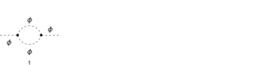
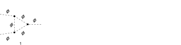
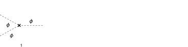

## Load FeynCalc and the necessary add-ons or other packages

This example uses a custom phi^3 model created with FeynRules.

```mathematica
description = "Renormalization, phi^3, MSbar, 1-loop";
If[ $FrontEnd === Null, 
  	$FeynCalcStartupMessages = False; 
  	Print[description]; 
  ];
If[ $Notebooks === False, 
  	$FeynCalcStartupMessages = False 
  ];
LaunchKernels[4];
$LoadAddOns = {"FeynArts", "FeynHelpers"};
<< FeynCalc`
$FAVerbose = 0;
$ParallelizeFeynCalc = True; 
 
FCCheckVersion[10, 2, 0];
If[ToExpression[StringSplit[$FeynHelpersVersion, "."]][[1]] < 2, 
 	Print["You need at least FeynHelpers 2.0 to run this example."]; 
 	Abort[]; 
 ]
```

$$\text{FeynCalc }\;\text{10.2.0 (dev version, 2026-05-18 16:39:56 +02:00, 05e25b95). For help, use the }\underline{\text{online} \;\text{documentation},}\;\text{ visit the }\underline{\text{forum}}\;\text{ and have a look at the supplied }\underline{\text{examples}.}\;\text{ The PDF-version of the manual can be downloaded }\underline{\text{here}.}$$

$$\text{If you use FeynCalc in your research, please evaluate FeynCalcHowToCite[] to learn how to cite this software.}$$

$$\text{Please keep in mind that the proper academic attribution of our work is crucial to ensure the future development of this package!}$$

$$\text{FeynArts }\;\text{3.12 (27 Mar 2025) patched for use with FeynCalc, for documentation see the }\underline{\text{manual}}\;\text{ or visit }\underline{\text{www}.\text{feynarts}.\text{de}.}$$

$$\text{If you use FeynArts in your research, please cite}$$

$$\text{ $\bullet $ T. Hahn, Comput. Phys. Commun., 140, 418-431, 2001, arXiv:hep-ph/0012260}$$

$$\text{FeynHelpers }\;\text{2.0.0 (2026-02-05 17:03:01 +02:00, 5db84fbb). For help, use the }\underline{\text{online} \;\text{documentation},}\;\text{ visit the }\underline{\text{forum}}\;\text{ and have a look at the supplied }\underline{\text{examples}.}\;\text{ The PDF-version of the manual can be downloaded }\underline{\text{here}.}$$

$$\text{ If you use FeynHelpers in your research, please evaluate FeynHelpersHowToCite[] to learn how to cite this work.}$$

## Configure some options

```mathematica
modelName = "Phi3";
```

```mathematica
modelDir = FileNameJoin[{$UserBaseDirectory, "Applications", "FeynCalc", "Examples", "Models", modelName}];
```

```mathematica
FAPatch[PatchModelsOnly -> True, FAModelsDirectory -> modelDir];

(*Successfully patched FeynArts.*)
```

Here we define all Z-factors for renormalization constants present in the Lagrangian

```mathematica
renConstants = Zg | Zphi | Zmphi
```

$$\text{Zg}|\text{Zphi}|\text{Zmphi}$$

## Generate Feynman diagrams

```mathematica
diagScalarSE = InsertFields[CreateTopologies[1, 1 -> 1, 
     ExcludeTopologies -> {Tadpoles, WFCorrections, WFCorrectionCTs}], {S[1]} -> {S[1]}, 
    InsertionLevel -> {Particles}, Model -> FileNameJoin[{modelDir, modelName}], 
    GenericModel -> FileNameJoin[{modelDir, "Phi3"}]];
```

```mathematica
diagScalar3VTX = InsertFields[CreateTopologies[1, 2 -> 1, 
     ExcludeTopologies -> {Tadpoles, WFCorrections, WFCorrectionCTs}], {S[1], S[1]} -> {S[1]}, 
    InsertionLevel -> {Particles}, Model -> FileNameJoin[{modelDir, modelName}], 
    GenericModel -> FileNameJoin[{modelDir, "Phi3"}]];
```

```mathematica
diagScalarSECT = InsertFields[CreateCTTopologies[1, 1 -> 1, 
     ExcludeTopologies -> {Tadpoles, WFCorrections, WFCorrectionCTs}], {S[1]} -> {S[1]}, 
    InsertionLevel -> {Particles}, Model -> FileNameJoin[{modelDir, modelName}], 
    GenericModel -> FileNameJoin[{modelDir, "Phi3"}]];
```

```mathematica
diagScalar3VTXCT = InsertFields[CreateCTTopologies[1, 2 -> 1, 
     ExcludeTopologies -> {Tadpoles, WFCorrections, WFCorrectionCTs}], {S[1], S[1]} -> {S[1]}, 
    InsertionLevel -> {Particles}, Model -> FileNameJoin[{modelDir, modelName}], 
    GenericModel -> FileNameJoin[{modelDir, "Phi3"}]];
```

Self-energy and vertex diagrams

```mathematica
Paint[diagScalarSE, ColumnsXRows -> {4, 1}, SheetHeader -> None, 
   Numbering -> Simple, ImageSize -> 128 {4, 1}];
Paint[diagScalar3VTX, ColumnsXRows -> {4, 1}, SheetHeader -> None, 
   Numbering -> Simple, ImageSize -> 128 {4, 1}];
```





Counter-term diagrams

```mathematica
Paint[diagScalarSECT, ColumnsXRows -> {4, 1}, SheetHeader -> None, 
   Numbering -> Simple, ImageSize -> 128 {4, 1}];
Paint[diagScalar3VTXCT, ColumnsXRows -> {4, 1}, SheetHeader -> None, 
   Numbering -> Simple, ImageSize -> 128 {4, 1}];
```




## Master integrals

The only required masters are 1-loop tadpoles


```mathematica
tadpoleMaster = Get[FileNameJoin[{$FeynCalcDirectory, "Examples", "MasterIntegrals","Tadpoles", "tad1LxFx1x1xxEp999x.m"}]];
```

```mathematica
tadpoleMaster1 = tadpoleMaster /. m1 -> mx /. tad1LxFx1x1xxEp999x -> "tad1Lv1";
tadpoleMaster2 = tadpoleMaster /. m1 -> mphi /. tad1LxFx1x1xxEp999x -> "tad1Lv2";
```

```mathematica
tadpoleMaster1
```

$$\left\{G^{\text{tad1Lv1}}(1)\to -e^{\gamma  \;\text{ep}} \left(\text{mx}^2\right)^{1-\text{ep}} \Gamma (\text{ep}-1),\left\{\text{FCTopology}\left(\text{tad1Lv1},\left\{\frac{1}{(\text{k1}^2-\text{mx}^2+i \eta )}\right\},\{\text{k1}\},\{\},\{\},\{\}\right)\right\}\right\}$$

```mathematica
tadpoleMaster2
```

$$\left\{G^{\text{tad1Lv2}}(1)\to -e^{\gamma  \;\text{ep}} \left(\text{mphi}^2\right)^{1-\text{ep}} \Gamma (\text{ep}-1),\left\{\text{FCTopology}\left(\text{tad1Lv2},\left\{\frac{1}{(\text{k1}^2-\text{mphi}^2+i \eta )}\right\},\{\text{k1}\},\{\},\{\},\{\}\right)\right\}\right\}$$

## Obtain the amplitudes

```mathematica
{scalarSE$RawAmp, scalarSECT$RawAmp} = 
   FCFAConvert[CreateFeynAmp[#, Truncated -> True, PreFactor -> 1], 
     	IncomingMomenta -> {p}, OutgoingMomenta -> {p}, 
     	DropSumOver -> True, 
     	LoopMomenta -> {k}, UndoChiralSplittings -> True, 
     	ChangeDimension -> D, SMP -> True, 
     	FinalSubstitutions -> {}] & /@ {
    	diagScalarSE, diagScalarSECT};
```

```mathematica
{scalar3VTX$RawAmp, scalar3VTXCT$RawAmp} = 
   FCFAConvert[CreateFeynAmp[#, Truncated -> True, PreFactor -> 1], 
     	IncomingMomenta -> {p1, p2}, OutgoingMomenta -> {q1}, 
     	DropSumOver -> True, 
     	LoopMomenta -> {k}, UndoChiralSplittings -> True, 
     	ChangeDimension -> D, SMP -> True, 
     	FinalSubstitutions -> {}] & /@ {
    	diagScalar3VTX, diagScalar3VTXCT};
```

## Calculate the amplitudes

### Scalar self-energy

The 1-loop scalar self-energy has superficial degree of divergence equal to 2.

```mathematica
FCClearScalarProducts[];
divDegree = 2;
aux1 = FCLoopGetFeynAmpDenominators[scalarSE$RawAmp, {k}, denHead, Momentum -> {p}, "Massless" -> True];
aux2 = FCLoopAddAuxiliaryMass[aux1[[2]], {k}, -mxt^2, 0, Head -> denHead]
```

$$\left\{\text{denHead}\left(\frac{1}{((k-p)^2-\text{mphi}^2+i \eta )}\right)\to \frac{1}{((k-p)^2-\text{mphi}^2+i \eta )}\right\}$$

```mathematica
scalarSE$StrName = StringReplace[ToString[Hold[scalarSE$Amp]], {"Hold[" -> "", "]" -> ""}]
```

$$\text{scalarSE\$Amp}$$

```mathematica
AbsoluteTiming[scalarSE$Amp = (aux1[[1]] /. aux2) // Contract[#, FCParallelize -> True] & // 
     DiracSimplify[#, FCParallelize -> True] &;]
```

$$\{0.035708,\text{Null}\}$$

```mathematica
AbsoluteTiming[scalarSE$Amp1 = Collect2[scalarSE$Amp, p, IsolateNames -> KK];]
AbsoluteTiming[scalarSE$Amp2 = FourSeries[scalarSE$Amp1, {p, 0, divDegree}, FCParallelize -> True];]
AbsoluteTiming[scalarSE$Amp3 = Collect2[FRH[scalarSE$Amp2], FeynAmpDenominator, FCParallelize -> True];]
```

$$\{0.023218,\text{Null}\}$$

$$\{0.076535,\text{Null}\}$$

$$\{0.023189,\text{Null}\}$$

The rest of the calculation follows the standard multiloop template

```mathematica
FCClearScalarProducts[];
SPD[p] = pp;
```

```mathematica
{scalarSE$Amp4, scalarSE$Topos} = FCLoopFindTopologies[scalarSE$Amp3, {k}, FCParallelize -> True, 
    FCLoopBasisOverdeterminedQ -> True, FinalSubstitutions -> {Hold[SPD][p] -> pp}, Names -> scalarSEtopo];
```

$$\text{FCLoopFindTopologies: Number of the initial candidate topologies: }1$$

$$\text{FCLoopFindTopologies: Number of the identified unique topologies: }1$$

$$\text{FCLoopFindTopologies: Number of the preferred topologies among the unique topologies: }0$$

$$\text{FCLoopFindTopologies: Number of the identified subtopologies: }0$$

$$\text{FCLoopFindTopologyMappings: }\;\text{Final number of found topologies: }1$$

```mathematica
AbsoluteTiming[scalarSE$Amp5 = FCLoopTensorReduce[scalarSE$Amp4, scalarSE$Topos, FCParallelize -> True];]
```

$$\{0.212603,\text{Null}\}$$

```mathematica
{scalarSE$Amp6, scalarSE$Topos2} = FCLoopRewriteOverdeterminedTopologies[scalarSE$Amp5, scalarSE$Topos];
```

$$\text{FCLoopRewriteIncompleteTopologies: }\;\text{No overdetermined topologies detected.}$$

```mathematica
scalarSE$SubTopos = FCLoopFindSubtopologies[scalarSE$Topos2, Flatten -> True, Remove -> True]
```

$$\{\}$$

```mathematica
{scalarSE$TopoMappings, scalarSE$FinalTopos} = FCLoopFindTopologyMappings[scalarSE$Topos2, PreferredTopologies -> scalarSE$SubTopos];
```

$$\text{FCLoopFindTopologyMappings: }\;\text{Found }0\text{ mapping relations }$$

$$\text{FCLoopFindTopologyMappings: }\;\text{Final number of independent topologies: }1$$

```mathematica
scalarSE$AmpGLI = FCLoopApplyTopologyMappings[scalarSE$Amp6, {scalarSE$TopoMappings, scalarSE$FinalTopos}, FCParallelize -> True];
```

```mathematica
scalarSE$GLIs = Cases2[scalarSE$AmpGLI, GLI];
```

```mathematica
scalarSE$dir = FileNameJoin[{$TemporaryDirectory, "Reduction-" <> modelName <> "-" <> scalarSE$StrName <> "-1L"}];
Quiet[CreateDirectory[scalarSE$dir]];
```

```mathematica
KiraCreateJobFile[scalarSE$FinalTopos, scalarSE$GLIs, scalarSE$dir]
```

$$\{\text{/tmp/Reduction-Phi3-scalarSE\$Amp-1L/scalarSEtopo1/job.yaml}\}$$

```mathematica
KiraCreateIntegralFile[scalarSE$GLIs, scalarSE$FinalTopos, scalarSE$dir]
KiraCreateConfigFiles[scalarSE$FinalTopos, scalarSE$GLIs, scalarSE$dir, 
  KiraMassDimensions -> {pp -> 2, mphi -> 1, mx -> 1, gxi -> 0}]
```

$$\text{KiraCreateIntegralFile: Number of loop integrals: }3$$

$$\{\text{/tmp/Reduction-Phi3-scalarSE\$Amp-1L/scalarSEtopo1/KiraLoopIntegrals}\}$$

$$\left(
\begin{array}{cc}
 \;\text{/tmp/Reduction-Phi3-scalarSE\$Amp-1L/scalarSEtopo1/config/integralfamilies.yaml} & \;\text{/tmp/Reduction-Phi3-scalarSE\$Amp-1L/scalarSEtopo1/config/kinematics.yaml} \\
\end{array}
\right)$$

```mathematica
KiraRunReduction[scalarSE$dir, scalarSE$FinalTopos, 
  KiraBinaryPath -> FileNameJoin[{$HomeDirectory, ".local", "bin", "kira"}], 
  KiraFermatPath -> FileNameJoin[{$HomeDirectory, "bin", "ferl64", "fer64"}]]
```

$$\{\text{True}\}$$

```mathematica
scalarSE$ReductionTables = KiraImportResults[scalarSE$FinalTopos, scalarSE$dir] // Flatten;
```

```mathematica
scalarSE$resPreFinal = Collect2[Total[scalarSE$AmpGLI /. Dispatch[scalarSE$ReductionTables]] // FeynAmpDenominatorExplicit, GLI, D, FCParallelize -> True];
```

```mathematica
scalarSE$masters = Cases2[scalarSE$resPreFinal, GLI];
```

```mathematica
scalarSE$MIMappings = FCLoopFindIntegralMappings[scalarSE$masters, Join[tadpoleMaster1[[2]], tadpoleMaster2[[2]], 
    scalarSE$FinalTopos], PreferredIntegrals -> {tadpoleMaster1[[1]][[1]], tadpoleMaster2[[1]][[1]]}]
```

$$\left(
\begin{array}{c}
 G^{\text{scalarSEtopo1}}(1)\to G^{\text{tad1Lv2}}(1) \\
 G^{\text{tad1Lv2}}(1) \\
\end{array}
\right)$$

Our master integrals are calculated using the standard multiloop normalization. To convert it back to the textbook normalization
we need to multiply by I*(4 Pi)^(ep-2)

```mathematica
scalarSE$resFinal = Collect2[scalarSE$resPreFinal, D, GLI, IsolateNames -> KK] // FCReplaceD[#, D -> 4 - 2 ep] & // 
          ReplaceAll[#, scalarSE$MIMappings[[1]]] & // ReplaceAll[#, {tadpoleMaster1[[1]], tadpoleMaster2[[1]]}] & //If[! FreeQ[#, GLI], Print["Unsubstituted GLIs!"]; Abort[], #] & // 
       Collect2[#, ep, IsolateNames -> KK2] & // Series[(I*(4*Pi)^(-2 + ep)) #, {ep, 0, -1}] & // Normal // FRH //Collect2[#, DiracGamma] &
```

$$\frac{i g^2}{32 \pi ^2 \;\text{ep}}$$

```mathematica
scalarSECT$RawAmp
```

$$\left\{i \;\text{pp} (\text{Zphi}-1)-i \;\text{mphi}^2 (\text{Zmphi} \;\text{Zphi}-1)\right\}$$

```mathematica
scalarSE$RenConstants = (scalarSE$resFinal + Total[scalarSECT$RawAmp]) // ReplaceRepeated[#, {
           	(h : renConstants) :> 1 + alpha rc[ToExpression["del" <> ToString[h]], 1]}] & //
       	Series[#, {alpha, 0, 1}] & // Normal // 
     	ReplaceAll[#, alpha -> 1] & // Collect2[#, pp, Pair] & // 
   	FCMatchSolve[#, {ep, g, mphi, pp}] & // ExpandAll
```

$$\text{FCMatchSolve: Following coefficients trivially vanish: }\{\text{rc}(\text{delZphi},1)\to 0\}$$

$$\text{FCMatchSolve: Solving for: }\{\text{rc}(\text{delZmphi},1)\}$$

$$\text{FCMatchSolve: A solution exists.}$$

$$\left\{\text{rc}(\text{delZphi},1)\to 0,\text{rc}(\text{delZmphi},1)\to \frac{g^2}{32 \pi ^2 \;\text{ep} \;\text{mphi}^2}\right\}$$

### Three-scalar vertex

The 1-loop three-scalar-vertex has superficial degree of divergence equal to 0. We set q1=0, so that p1+p2=0 yields p1=-p2

```mathematica
FCClearScalarProducts[];
divDegree = 0;
aux1 = FCLoopGetFeynAmpDenominators[scalar3VTX$RawAmp /. q1 -> 0 /. p2 -> -p1 /. p1 -> p, {k}, denHead,Momentum -> {p}, "Massless" -> True];
aux2 = FCLoopAddAuxiliaryMass[aux1[[2]], {k}, -mxt^2, 0, Head -> denHead]
```

$$\left\{\text{denHead}\left(\frac{1}{((k-p)^2-\text{mphi}^2+i \eta )}\right)\to \frac{1}{((k-p)^2-\text{mphi}^2+i \eta )}\right\}$$

```mathematica
scalar3VTX$StrName = StringReplace[ToString[Hold[scalar3VTX$Amp]], {"Hold[" -> "", "]" -> ""}]
```

$$\text{scalar3VTX\$Amp}$$

```mathematica
AbsoluteTiming[scalar3VTX$Amp = (aux1[[1]] /. aux2) // Contract[#, FCParallelize -> True] & // 
     DiracSimplify[#, FCParallelize -> True] &;]
```

$$\{0.037126,\text{Null}\}$$

```mathematica
AbsoluteTiming[scalar3VTX$Amp1 = Collect2[scalar3VTX$Amp, p, IsolateNames -> KK];]
AbsoluteTiming[scalar3VTX$Amp2 = FourSeries[scalar3VTX$Amp1, {p, 0, divDegree}, FCParallelize -> True];]
AbsoluteTiming[scalar3VTX$Amp3 = Collect2[FRH[scalar3VTX$Amp2], FeynAmpDenominator, FCParallelize -> True];]
```

$$\{0.003356,\text{Null}\}$$

$$\{0.018509,\text{Null}\}$$

$$\{0.018693,\text{Null}\}$$

The rest of the calculation follows the standard multiloop template

```mathematica
FCClearScalarProducts[];
SPD[p] = pp;
```

```mathematica
{scalar3VTX$Amp4, scalar3VTX$Topos} = FCLoopFindTopologies[scalar3VTX$Amp3, {k}, FCParallelize -> True, 
    FCLoopBasisOverdeterminedQ -> True, FinalSubstitutions -> {Hold[SPD][p] -> pp}, Names -> scalar3VTXtopo];
```

$$\text{FCLoopFindTopologies: Number of the initial candidate topologies: }1$$

$$\text{FCLoopFindTopologies: Number of the identified unique topologies: }1$$

$$\text{FCLoopFindTopologies: Number of the preferred topologies among the unique topologies: }0$$

$$\text{FCLoopFindTopologies: Number of the identified subtopologies: }0$$

$$\text{FCLoopFindTopologyMappings: }\;\text{Final number of found topologies: }1$$

```mathematica
AbsoluteTiming[scalar3VTX$Amp5 = FCLoopTensorReduce[scalar3VTX$Amp4, scalar3VTX$Topos, FCParallelize -> True];]
```

$$\{0.157859,\text{Null}\}$$

```mathematica
{scalar3VTX$Amp6, scalar3VTX$Topos2} = FCLoopRewriteOverdeterminedTopologies[scalar3VTX$Amp5, scalar3VTX$Topos];
```

$$\text{FCLoopRewriteIncompleteTopologies: }\;\text{No overdetermined topologies detected.}$$

```mathematica
scalar3VTX$SubTopos = FCLoopFindSubtopologies[scalar3VTX$Topos2, Flatten -> True, Remove -> True]
```

$$\{\}$$

```mathematica
{scalar3VTX$TopoMappings, scalar3VTX$FinalTopos} = FCLoopFindTopologyMappings[scalar3VTX$Topos2, PreferredTopologies -> scalar3VTX$SubTopos];
```

$$\text{FCLoopFindTopologyMappings: }\;\text{Found }0\text{ mapping relations }$$

$$\text{FCLoopFindTopologyMappings: }\;\text{Final number of independent topologies: }1$$

```mathematica
scalar3VTX$AmpGLI = FCLoopApplyTopologyMappings[scalar3VTX$Amp6, {scalar3VTX$TopoMappings, scalar3VTX$FinalTopos}, FCParallelize -> True];
```

```mathematica
scalar3VTX$GLIs = Cases2[scalar3VTX$AmpGLI, GLI];
```

```mathematica
scalar3VTX$dir = FileNameJoin[{$TemporaryDirectory, "Reduction-" <> modelName <> "-" <> scalar3VTX$StrName <> "-1L"}];
Quiet[CreateDirectory[scalar3VTX$dir]];
```

```mathematica
KiraCreateJobFile[scalar3VTX$FinalTopos, scalar3VTX$GLIs, scalar3VTX$dir]
```

$$\{\text{/tmp/Reduction-Phi3-scalar3VTX\$Amp-1L/scalar3VTXtopo1/job.yaml}\}$$

```mathematica
KiraCreateIntegralFile[scalar3VTX$GLIs, scalar3VTX$FinalTopos, scalar3VTX$dir]
KiraCreateConfigFiles[scalar3VTX$FinalTopos, scalar3VTX$GLIs, scalar3VTX$dir, 
  KiraMassDimensions -> {pp -> 2, mphi -> 1, mx -> 1, gxi -> 0}]
```

$$\text{KiraCreateIntegralFile: Number of loop integrals: }1$$

$$\{\text{/tmp/Reduction-Phi3-scalar3VTX\$Amp-1L/scalar3VTXtopo1/KiraLoopIntegrals}\}$$

$$\left(
\begin{array}{cc}
 \;\text{/tmp/Reduction-Phi3-scalar3VTX\$Amp-1L/scalar3VTXtopo1/config/integralfamilies.yaml} & \;\text{/tmp/Reduction-Phi3-scalar3VTX\$Amp-1L/scalar3VTXtopo1/config/kinematics.yaml} \\
\end{array}
\right)$$

```mathematica
KiraRunReduction[scalar3VTX$dir, scalar3VTX$FinalTopos, 
  KiraBinaryPath -> FileNameJoin[{$HomeDirectory, ".local", "bin", "kira"}], 
  KiraFermatPath -> FileNameJoin[{$HomeDirectory, "bin", "ferl64", "fer64"}]]
```

$$\{\text{True}\}$$

```mathematica
scalar3VTX$ReductionTables = KiraImportResults[scalar3VTX$FinalTopos, scalar3VTX$dir] // Flatten;
```

```mathematica
scalar3VTX$resPreFinal = Collect2[Total[scalar3VTX$AmpGLI /. Dispatch[scalar3VTX$ReductionTables]] //FeynAmpDenominatorExplicit, GLI, 
    GaugeXi, flagCheck, D, DiracGamma, FCParallelize -> True];
```

```mathematica
scalar3VTX$masters = Cases2[scalar3VTX$resPreFinal, GLI];
```

```mathematica
scalar3VTX$MIMappings = FCLoopFindIntegralMappings[scalar3VTX$masters, Join[tadpoleMaster1[[2]], tadpoleMaster2[[2]], 
    scalar3VTX$FinalTopos], PreferredIntegrals -> {tadpoleMaster1[[1]][[1]], tadpoleMaster2[[1]][[1]]}]
```

$$\left(
\begin{array}{c}
 G^{\text{scalar3VTXtopo1}}(1)\to G^{\text{tad1Lv2}}(1) \\
 G^{\text{tad1Lv2}}(1) \\
\end{array}
\right)$$

Our master integrals are calculated using the standard multiloop normalization. To convert it back to the textbook normalization
we need to multiply by I*(4 Pi)^(ep-2)

```mathematica
scalar3VTX$resFinal = Collect2[scalar3VTX$resPreFinal, D, GLI, IsolateNames -> KK] // FCReplaceD[#, D -> 4 - 2 ep] & // 
          ReplaceAll[#, scalar3VTX$MIMappings[[1]]] & // ReplaceAll[#, {tadpoleMaster1[[1]], tadpoleMaster2[[1]]}] & //If[! FreeQ[#, GLI], Print["Unsubstituted GLIs!"]; Abort[], #] & // 
       Collect2[#, ep, IsolateNames -> KK2] & // Series[(I*(4*Pi)^(-2 + ep)) #, {ep, 0, -1}] & // Normal // FRH //Collect2[#, DiracGamma] &
```

$$-\frac{i g^3}{32 \pi ^2 \;\text{mphi}^2}$$

```mathematica
If[FreeQ[scalar3VTX$resFinal, ep], 
  scalar3VTX$resFinal = 0]
```

$$0$$

```mathematica
scalar3VTX$RenConstants = (scalar3VTX$resFinal + Total[scalar3VTXCT$RawAmp]) // ReplaceRepeated[#, {
            	(h : renConstants) :> 1 + alpha rc[ToExpression["del" <> ToString[h]], 1]}] & //
        	Series[#, {alpha, 0, 1}] & // Normal // ReplaceAll[#, Join[scalarSE$RenConstants, scalarSE$RenConstants]] & // 
     	ReplaceAll[#, alpha -> 1] & // Collect2[#, pp, Pair] & // 
   	FCMatchSolve[#, {ep, g, gxi, la, DiracGamma, mphi, mx, pp}] & // ExpandAll
```

$$\text{FCMatchSolve: Following coefficients trivially vanish: }\{\text{rc}(\text{delZg},1)\to 0\}$$

$$\text{FCMatchSolve: Solving for: }\{\}$$

$$\text{FCMatchSolve: Only a trivial solution exists.}$$

$$\{\text{rc}(\text{delZg},1)\to 0\}$$

## Check the final results

Our final phi^3 1-loop renormalization constants

```mathematica
finalResults = Thread[Rule[List @@ renConstants, 
    (List @@ renConstants /. (h : renConstants) :> 1 + rc[ToExpression["del" <> ToString[h]], 1]) // ReplaceAll[#, Join[scalarSE$RenConstants, 
        scalar3VTX$RenConstants]] &]]
```

$$\left\{\text{Zg}\to 1,\text{Zphi}\to 1,\text{Zmphi}\to \frac{g^2}{32 \pi ^2 \;\text{ep} \;\text{mphi}^2}+1\right\}$$

```mathematica
Join[scalarSE$RenConstants, scalar3VTX$RenConstants] // InputForm
```

```mathematica
{rc[delZphi, 1] -> 0, rc[delZmphi, 1] -> g^2/(32*ep*mphi^2*Pi^2), 
 rc[delZg, 1] -> 0}
```

```mathematica
knownResult = {rc[delZphi, 1] -> 0, rc[delZmphi, 1] -> g^2/(32*ep*mphi^2*Pi^2), rc[delZg, 1] -> 0};
```

Here are the literature results

```mathematica
FCCompareResults[Join[scalarSE$RenConstants, scalar3VTX$RenConstants] /. Rule -> Equal, knownResult /. Rule -> Equal, 
  Text -> {"\tCompare to Cheng and Li, Gauge theory of elementary particle physics, Problems and Solutions, Eq. 2.120:", 
    "CORRECT.", "WRONG!"}, Interrupt -> {Hold[Quit[1]], Automatic}]
Print["\tCPU Time used: ", Round[N[TimeUsed[], 4], 0.001], " s."];

```mathematica

$$\text{$\backslash $tCompare to Cheng and Li, Gauge theory of elementary particle physics, Problems and Solutions, Eq. 2.120:} \;\text{CORRECT.}$$

$$\text{True}$$

$$\text{$\backslash $tCPU Time used: }33.139\text{ s.}$$