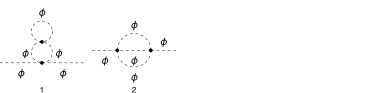
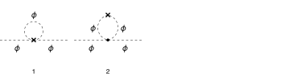

## Load FeynCalc and the necessary add-ons or other packages

This example uses a custom QCD model created with FeynRules.

```mathematica
description = "Renormalization, phi^4, MSbar, 2-loop";
If[ $FrontEnd === Null, 
  	$FeynCalcStartupMessages = False; 
  	Print[description]; 
  ];
If[ $Notebooks === False, 
  	$FeynCalcStartupMessages = False 
  ];
LaunchKernels[8];
$LoadAddOns = {"FeynArts", "FeynHelpers"};
<< FeynCalc`
$FAVerbose = 0;
$ParallelizeFeynCalc = True; 
 
FCCheckVersion[10, 2, 0];
If[ToExpression[StringSplit[$FeynHelpersVersion, "."]][[1]] < 2, 
 	Print["You need at least FeynHelpers 2.0 to run this example."]; 
 	Abort[]; 
 ]
```

$$\text{FeynCalc }\;\text{10.2.0 (dev version, 2026-05-18 16:39:56 +02:00, 05e25b95). For help, use the }\underline{\text{online} \;\text{documentation},}\;\text{ visit the }\underline{\text{forum}}\;\text{ and have a look at the supplied }\underline{\text{examples}.}\;\text{ The PDF-version of the manual can be downloaded }\underline{\text{here}.}$$

$$\text{If you use FeynCalc in your research, please evaluate FeynCalcHowToCite[] to learn how to cite this software.}$$

$$\text{Please keep in mind that the proper academic attribution of our work is crucial to ensure the future development of this package!}$$

$$\text{FeynArts }\;\text{3.12 (27 Mar 2025) patched for use with FeynCalc, for documentation see the }\underline{\text{manual}}\;\text{ or visit }\underline{\text{www}.\text{feynarts}.\text{de}.}$$

$$\text{If you use FeynArts in your research, please cite}$$

$$\text{ $\bullet $ T. Hahn, Comput. Phys. Commun., 140, 418-431, 2001, arXiv:hep-ph/0012260}$$

$$\text{FeynHelpers }\;\text{2.0.0 (2026-02-05 17:03:01 +02:00, 5db84fbb). For help, use the }\underline{\text{online} \;\text{documentation},}\;\text{ visit the }\underline{\text{forum}}\;\text{ and have a look at the supplied }\underline{\text{examples}.}\;\text{ The PDF-version of the manual can be downloaded }\underline{\text{here}.}$$

$$\text{ If you use FeynHelpers in your research, please evaluate FeynHelpersHowToCite[] to learn how to cite this work.}$$

## Configure some options

```mathematica
modelName = "Phi4";
```

```mathematica
modelDir = FileNameJoin[{$UserBaseDirectory, "Applications", "FeynCalc", "Examples", "Models", modelName}];
```

```mathematica
FAPatch[PatchModelsOnly -> True, FAModelsDirectory -> modelDir];

(*Successfully patched FeynArts.*)
```

Here we define all Z-factors for renormalization constants present in the Lagrangian

```mathematica
renConstants = Zg | Zphi | Zmphi
```

$$\text{Zg}|\text{Zphi}|\text{Zmphi}$$

## Generate Feynman diagrams

```mathematica
diagScalarSE = InsertFields[CreateTopologies[2, 1 -> 1, 
     ExcludeTopologies -> {Tadpoles, WFCorrections, WFCorrectionCTs}], {S[1]} -> {S[1]}, 
    InsertionLevel -> {Particles}, Model -> FileNameJoin[{modelDir, modelName}], 
    GenericModel -> FileNameJoin[{modelDir, modelName}]];
```

```mathematica
diagScalarSECT = InsertFields[CreateCTTopologies[2, 1 -> 1, 
     ExcludeTopologies -> {Tadpoles, WFCorrections, WFCorrectionCTs}], {S[1]} -> {S[1]}, 
    InsertionLevel -> {Particles}, Model -> FileNameJoin[{modelDir, modelName}], 
    GenericModel -> FileNameJoin[{modelDir, modelName}]];
```

```mathematica
diagScalarTreeSECT = InsertFields[CreateCTTopologies[1, 1 -> 1, 
     ExcludeTopologies -> {Tadpoles, WFCorrections, WFCorrectionCTs}], {S[1]} -> {S[1]}, 
    InsertionLevel -> {Particles}, Model -> FileNameJoin[{modelDir, modelName}], 
    GenericModel -> FileNameJoin[{modelDir, modelName}]];
```

Self-energy and vertex diagrams

```mathematica
Paint[diagScalarSE, ColumnsXRows -> {4, 1}, SheetHeader -> None, 
   Numbering -> Simple, ImageSize -> 128 {4, 1}];
```



Counter-term diagrams

```mathematica
Paint[diagScalarSECT, ColumnsXRows -> {4, 1}, SheetHeader -> None, 
   Numbering -> Simple, ImageSize -> 128 {4, 1}];
```



```mathematica
Paint[diagScalarTreeSECT, ColumnsXRows -> {4, 1}, SheetHeader -> None,
   Numbering -> Simple, ImageSize -> 128 {4, 1}];
```


## Master integrals

The only required masters are 1- and 2-loop tadpoles

```mathematica
tadpoleMaster = Get[FileNameJoin[{$FeynCalcDirectory, "Examples", "MasterIntegrals","Tadpoles", "tad1LxFx1x1xxEp999x.m"}]];
```

```mathematica
tadpoleMaster1 = tadpoleMaster /. m1 -> mphi /. tad1L -> "tad1Lv1";
```

```mathematica
tadpoleMaster2 = Get[FileNameJoin[{$FeynCalcDirectory, "Examples", "MasterIntegrals","Tadpoles", 
        "tad2LxFx111x111xxEp1x.m"}]] /. m1 -> mphi /. tad2LxFx111x111xxEp1x -> "tad2Lv2";
```

## Obtain the amplitudes

```mathematica
{scalarSE$RawAmp, scalarSECT$RawAmp, diagScalarTreeSECT$RawAmp} = 
   FCFAConvert[CreateFeynAmp[#, Truncated -> True, PreFactor -> 1], 
     	IncomingMomenta -> {p}, OutgoingMomenta -> {p}, 
     	DropSumOver -> True, 
     	LoopMomenta -> {k1, k2}, UndoChiralSplittings -> True, 
     	ChangeDimension -> D, SMP -> True, 
     	FinalSubstitutions -> {}] & /@ {
    	diagScalarSE, diagScalarSECT, diagScalarTreeSECT};
```

## Calculate the amplitudes

### Scalar self-energy at 2 loops

The 2-loop scalar self-energy has superficial degree of divergence equal to 2

```mathematica
scalarSE$RawAmp
```

$$\left\{\frac{i g^2}{4 \left(\text{k1}^2-\text{mphi}^2\right)^2 \left(\text{k2}^2-\text{mphi}^2\right)},\frac{i g^2}{6 \left(\text{k1}^2-\text{mphi}^2\right).\left(\text{k2}^2-\text{mphi}^2\right).\left((\text{k1}+\text{k2}+p)^2-\text{mphi}^2\right)}\right\}$$

```mathematica
FCClearScalarProducts[];
divDegree = 2;
aux1 = FCLoopGetFeynAmpDenominators[scalarSE$RawAmp, {k1, k2}, denHead, Momentum -> {p}, "Massless" -> True];
aux2 = FCLoopAddAuxiliaryMass[aux1[[2]], {k1, k2}, -mxt^2, 0, Head -> denHead]
```

$$\left\{\text{denHead}\left(\frac{1}{((\text{k1}+\text{k2}+p)^2-\text{mphi}^2+i \eta )}\right)\to \frac{1}{((\text{k1}+\text{k2}+p)^2-\text{mphi}^2+i \eta )}\right\}$$

```mathematica
AbsoluteTiming[scalarSE$PreAmp1 = Contract[(aux1[[1]] /. aux2), FCParallelize -> True];]
```

$$\{0.018132,\text{Null}\}$$

```mathematica
AbsoluteTiming[scalarSE$Amp = scalarSE$PreAmp1;]
```

$$\{\text{9.$\grave{ }$*${}^{\wedge}$-6},\text{Null}\}$$

```mathematica
isoSymbols = FCMakeSymbols[KK, Range[1, $KernelCount], List]
```

$$\{\text{KK1},\text{KK2},\text{KK3},\text{KK4},\text{KK5},\text{KK6},\text{KK7},\text{KK8}\}$$

```mathematica
AbsoluteTiming[scalarSE$Amp1 = Collect2[scalarSE$Amp, p, IsolateNames -> isoSymbols, FCParallelize -> True];]
```

$$\{0.070468,\text{Null}\}$$

```mathematica
AbsoluteTiming[scalarSE$Amp2 = FourSeries[scalarSE$Amp1, {p, 0, divDegree}, FCParallelize -> True];]
```

$$\{0.064812,\text{Null}\}$$

```mathematica
AbsoluteTiming[scalarSE$Amp3 = Collect2[FRH2[scalarSE$Amp2, isoSymbols], FeynAmpDenominator, FCParallelize -> True];]
```

$$\{0.038086,\text{Null}\}$$

The rest of the calculation follows the standard multiloop template

```mathematica
FCClearScalarProducts[]
SPD[p] = pp;
```

```mathematica
AbsoluteTiming[{scalarSE$Amp4, scalarSE$Topos} = FCLoopFindTopologies[scalarSE$Amp3, {k1, k2}, FCI -> True, FCParallelize -> True, 
     FCLoopBasisOverdeterminedQ -> True, FinalSubstitutions -> {Hold[SPD][p] -> pp}];]
```

$$\text{FCLoopFindTopologies: Number of the initial candidate topologies: }2$$

$$\text{FCLoopFindTopologies: Number of the identified unique topologies: }1$$

$$\text{FCLoopFindTopologies: Number of the preferred topologies among the unique topologies: }0$$

$$\text{FCLoopFindTopologies: Number of the identified subtopologies: }1$$

$$\text{FCLoopFindTopologyMappings: }\;\text{Final number of found topologies: }1$$

$$\{0.194084,\text{Null}\}$$

```mathematica
AbsoluteTiming[scalarSE$Amp5 = FCLoopTensorReduce[scalarSE$Amp4, scalarSE$Topos, FCParallelize -> True];]
```

$$\{0.245141,\text{Null}\}$$

```mathematica
AbsoluteTiming[{scalarSE$Amp6, scalarSE$Topos2} = FCLoopRewriteOverdeterminedTopologies[scalarSE$Amp5, scalarSE$Topos, FCParallelize -> True];]
```

$$\text{FCLoopRewriteIncompleteTopologies: }\;\text{No overdetermined topologies detected.}$$

$$\{0.029625,\text{Null}\}$$

```mathematica
AbsoluteTiming[{scalarSE$Amp7, scalarSE$Topos3} = FCLoopRewriteIncompleteTopologies[scalarSE$Amp6, scalarSE$Topos2, FCParallelize -> True];]
```

$$\text{FCLoopRewriteIncompleteTopologies: }\;\text{No incomplete topologies detected.}$$

$$\{0.030115,\text{Null}\}$$

```mathematica
AbsoluteTiming[scalarSE$SubTopos = FCLoopFindSubtopologies[scalarSE$Topos3, Flatten -> True, Remove -> True, FCParallelize -> True];]
```

$$\{0.068658,\text{Null}\}$$

```mathematica
{scalarSE$TopoMappings, 
    scalarSE$FinalTopos} = FCLoopFindTopologyMappings[scalarSE$Topos3, PreferredTopologies -> scalarSE$SubTopos, FCParallelize -> True];
```

$$\text{FCLoopFindTopologyMappings: }\;\text{Found }0\text{ mapping relations }$$

$$\text{FCLoopFindTopologyMappings: }\;\text{Final number of independent topologies: }1$$

```mathematica
AbsoluteTiming[scalarSE$AmpGLI = FCLoopApplyTopologyMappings[scalarSE$Amp7, {scalarSE$TopoMappings, 
      scalarSE$FinalTopos}, FCParallelize -> True];]
```

$$\{0.05805,\text{Null}\}$$

```mathematica
scalarSE$GLIs = Cases2[scalarSE$AmpGLI, GLI];
```

```mathematica
scalarSE$dir = FileNameJoin[{$TemporaryDirectory, "Reduction-scalarSE-2L-massless"}];
Quiet[CreateDirectory[scalarSE$dir]];
```

```mathematica
KiraCreateJobFile[scalarSE$FinalTopos, scalarSE$GLIs, scalarSE$dir]
```

$$\{\text{/tmp/Reduction-scalarSE-2L-massless/fctopology1/job.yaml}\}$$

```mathematica
KiraCreateIntegralFile[scalarSE$GLIs, scalarSE$FinalTopos, scalarSE$dir]
KiraCreateConfigFiles[scalarSE$FinalTopos, scalarSE$GLIs, scalarSE$dir, 
  KiraMassDimensions -> {pp -> 2, mphi -> 1}]
```

$$\text{KiraCreateIntegralFile: Number of loop integrals: }4$$

$$\{\text{/tmp/Reduction-scalarSE-2L-massless/fctopology1/KiraLoopIntegrals}\}$$

$$\left(
\begin{array}{cc}
 \;\text{/tmp/Reduction-scalarSE-2L-massless/fctopology1/config/integralfamilies.yaml} & \;\text{/tmp/Reduction-scalarSE-2L-massless/fctopology1/config/kinematics.yaml} \\
\end{array}
\right)$$

```mathematica
KiraRunReduction[scalarSE$dir, scalarSE$FinalTopos, 
  KiraBinaryPath -> FileNameJoin[{$HomeDirectory, ".local", "bin", "kira"}], 
  KiraFermatPath -> FileNameJoin[{$HomeDirectory, "bin", "ferl64", "fer64"}]]
```

$$\{\text{True}\}$$

```mathematica
scalarSE$ReductionTables = KiraImportResults[scalarSE$FinalTopos, scalarSE$dir] // Flatten;
```

```mathematica
AbsoluteTiming[scalarSE$resPreFinal1 = (scalarSE$AmpGLI /. Dispatch[scalarSE$ReductionTables]);]
```

$$\{0.000207,\text{Null}\}$$

```mathematica
AbsoluteTiming[scalarSE$resPreFinal2 = Map[Collect2[#, GLI, FCParallelize -> True] &, scalarSE$resPreFinal1];]
```

$$\{0.041954,\text{Null}\}$$

```mathematica
scalarSE$masters = Cases2[scalarSE$resPreFinal1, GLI];
```

```mathematica
scalarSE$MIMappings = FCLoopFindIntegralMappings[scalarSE$masters, Join[tadpoleMaster1[[2]], {tadpoleMaster2[[2]]}, 
    scalarSE$FinalTopos], PreferredIntegrals -> {tadpoleMaster1[[1]][[1]] tadpoleMaster1[[1]][[1]], tadpoleMaster2[[1]][[1]]}]
```

$$\left(
\begin{array}{cc}
 G^{\text{fctopology1}}(1,1,0)\to G^{\text{tad1LxFx1x1xxEp999x}}(1)^2 & G^{\text{fctopology1}}(1,1,1)\to G^{\text{tad2Lv2}}(1,1,1) \\
 G^{\text{tad2Lv2}}(1,1,1) & G^{\text{tad1LxFx1x1xxEp999x}}(1)^2 \\
\end{array}
\right)$$

```mathematica
isoSymbols1 = FCMakeSymbols[LL, Range[1, $KernelCount], List];
isoSymbols2 = FCMakeSymbols[LM, Range[1, $KernelCount], List];
```

```mathematica
AbsoluteTiming[scalarSE$resPreFinal2 = Collect2[scalarSE$resPreFinal1, D, GLI, IsolateNames -> isoSymbols1, FCParallelize -> True] // FCReplaceD[#, D -> 4 - 2 ep] & // ReplaceAll[#, scalarSE$MIMappings[[1]]] & // 
      ReplaceAll[#, {tadpoleMaster1[[1]], tadpoleMaster2[[1]]}] & // Collect2[#, ep, IsolateNames -> isoSymbols2, FCParallelize -> True] &;]
```

$$\{0.436495,\text{Null}\}$$

```mathematica
AbsoluteTiming[scalarSE$resPreFinal3 = scalarSE$resPreFinal2 // Series[#, {ep, 0, -1}] & // Normal // Series[(I*(4*Pi)^(-2 + ep))^2 #, {ep, 0, -1}] & // Normal;]
```

$$\{0.616321,\text{Null}\}$$

```mathematica
AbsoluteTiming[scalarSE$resPreFinal4 = Collect2[FRH2[FRH2[scalarSE$resPreFinal3, isoSymbols2], isoSymbols1], DiracGamma, pp, mxt, ep, FCParallelize -> True];]
```

$$\{0.052991,\text{Null}\}$$

```mathematica
isoSymbols3 = FCMakeSymbols[LH, Range[1, $KernelCount], List];
```

```mathematica
AbsoluteTiming[scalarSE$resPreFinal5 = Series[Total[Collect2[scalarSE$resPreFinal4, mxt, IsolateNames -> isoSymbols3, FCParallelize -> True]], {mxt, 0, 2}] // Normal;]
```

$$\{0.084357,\text{Null}\}$$

```mathematica
AbsoluteTiming[scalarSE$resPreFinal6 = Collect2[FRH2[scalarSE$resPreFinal5, isoSymbols3] // ReplaceAll[#, Log[m_Symbol^2] :> 2 Log[m]] &, DiracGamma, pp, mxt, ep, FCParallelize -> True];]
```

$$\{0.04683,\text{Null}\}$$

```mathematica
scalarSE$resFinal = Collect2[Collect2[scalarSE$resPreFinal6, ep, g, Factoring -> FullSimplify], ep, mphi, mxt]
```

$$-\frac{i g^2 \;\text{mphi}^2}{512 \pi ^4 \;\text{ep}^2}+\frac{i g^2 \;\text{mphi}^2 \log (\text{mphi})}{128 \pi ^4 \;\text{ep}}-\frac{i g^2 \;\text{mphi}^2 (1+\log (4)+\log (\pi ))}{256 \pi ^4 \;\text{ep}}+\frac{i g^2 \;\text{pp}}{6144 \pi ^4 \;\text{ep}}$$

### Scalar self-energy 1-loop CT

```mathematica
FCClearScalarProducts[];
divDegree = 2;
aux1 = FCLoopGetFeynAmpDenominators[scalarSECT$RawAmp /. k1 -> k1 + p, {k1}, denHead, Momentum -> {p}, "Massless" -> True];
aux2 = FCLoopAddAuxiliaryMass[aux1[[2]], {k1}, -mxt^2, 0, Head -> denHead]
```

$$\left\{\text{denHead}\left(\frac{1}{((\text{k1}+p)^2-\text{mphi}^2+i \eta )}\right)\to \frac{1}{((\text{k1}+p)^2-\text{mphi}^2+i \eta )}\right\}$$

```mathematica
scalarSECT$StrName = StringReplace[ToString[Hold[scalarSECT$Amp]], {"Hold[" -> "", "]" -> ""}]
```

$$\text{scalarSECT\$Amp}$$

```mathematica
AbsoluteTiming[scalarSECT$Amp = (aux1[[1]] /. aux2);]
```

$$\{0.000086,\text{Null}\}$$

```mathematica
AbsoluteTiming[scalarSECT$Amp1 = Collect2[scalarSECT$Amp, p, IsolateNames -> KK];]
AbsoluteTiming[scalarSECT$Amp2 = FourSeries[scalarSECT$Amp1, {p, 0, divDegree}, FCParallelize -> True];]
AbsoluteTiming[scalarSECT$Amp3 = Collect2[FRH[scalarSECT$Amp2], FeynAmpDenominator, FCParallelize -> True];]
```

$$\{0.007307,\text{Null}\}$$

$$\{0.092444,\text{Null}\}$$

$$\{0.025691,\text{Null}\}$$

The rest of the calculation follows the standard multiloop template

```mathematica
FCClearScalarProducts[];
SPD[p] = pp;
```

```mathematica
{scalarSECT$Amp4, scalarSECT$Topos} = FCLoopFindTopologies[scalarSECT$Amp3, {k1}, FCParallelize -> True, 
    FCLoopBasisOverdeterminedQ -> True, FinalSubstitutions -> {Hold[SPD][p] -> pp}, Names -> scalarSEtopo];
```

$$\text{FCLoopFindTopologies: Number of the initial candidate topologies: }1$$

$$\text{FCLoopFindTopologies: Number of the identified unique topologies: }1$$

$$\text{FCLoopFindTopologies: Number of the preferred topologies among the unique topologies: }0$$

$$\text{FCLoopFindTopologies: Number of the identified subtopologies: }0$$

$$\text{FCLoopFindTopologyMappings: }\;\text{Final number of found topologies: }1$$

```mathematica
AbsoluteTiming[scalarSECT$Amp5 = FCLoopTensorReduce[scalarSECT$Amp4, scalarSECT$Topos, FCParallelize -> True];]
```

$$\{0.250283,\text{Null}\}$$

```mathematica
AbsoluteTiming[scalarSECT$Amp6 = DiracSimplify[scalarSECT$Amp5, FCParallelize -> True];]
```

$$\{0.025733,\text{Null}\}$$

```mathematica
{scalarSECT$Amp7, scalarSECT$Topos2} = FCLoopRewriteOverdeterminedTopologies[scalarSECT$Amp6, scalarSECT$Topos, FCParallelize -> True];
```

$$\text{FCLoopRewriteIncompleteTopologies: }\;\text{No overdetermined topologies detected.}$$

```mathematica
{scalarSECT$Amp8, scalarSECT$Topos3} = FCLoopRewriteIncompleteTopologies[scalarSECT$Amp7, scalarSECT$Topos2, FCParallelize -> True];
```

$$\text{FCLoopRewriteIncompleteTopologies: }\;\text{No incomplete topologies detected.}$$

```mathematica
AbsoluteTiming[scalarSECT$SubTopos = FCLoopFindSubtopologies[scalarSECT$Topos2, Flatten -> True, Remove -> True, FCParallelize -> True];]
```

$$\{0.052253,\text{Null}\}$$

```mathematica
AbsoluteTiming[{scalarSECT$TopoMappings, scalarSECT$FinalTopos} = FCLoopFindTopologyMappings[scalarSECT$Topos2, PreferredTopologies -> scalarSECT$SubTopos, FCParallelize -> True];]
```

$$\text{FCLoopFindTopologyMappings: }\;\text{Found }0\text{ mapping relations }$$

$$\text{FCLoopFindTopologyMappings: }\;\text{Final number of independent topologies: }1$$

$$\{0.065111,\text{Null}\}$$

```mathematica
AbsoluteTiming[scalarSECT$AmpGLI = FCLoopApplyTopologyMappings[scalarSECT$Amp8, {scalarSECT$TopoMappings, scalarSECT$FinalTopos},FCParallelize -> True];]
```

$$\{0.061072,\text{Null}\}$$

```mathematica
scalarSECT$GLIs = Cases2[scalarSECT$AmpGLI, GLI];
```

```mathematica
scalarSECT$dir = FileNameJoin[{$TemporaryDirectory, "Reduction-" <> scalarSECT$StrName <> "-1L-massive"}];
Quiet[CreateDirectory[scalarSECT$dir]];
```

```mathematica
KiraCreateJobFile[scalarSECT$FinalTopos, scalarSECT$GLIs, scalarSECT$dir]
```

$$\{\text{/tmp/Reduction-scalarSECT\$Amp-1L-massive/scalarSEtopo1/job.yaml}\}$$

```mathematica
KiraCreateIntegralFile[scalarSECT$GLIs, scalarSECT$FinalTopos, scalarSECT$dir]
KiraCreateConfigFiles[scalarSECT$FinalTopos, scalarSECT$GLIs, scalarSECT$dir, 
  KiraMassDimensions -> {pp -> 2, mphi -> 1}]
```

$$\text{KiraCreateIntegralFile: Number of loop integrals: }4$$

$$\{\text{/tmp/Reduction-scalarSECT\$Amp-1L-massive/scalarSEtopo1/KiraLoopIntegrals}\}$$

$$\left(
\begin{array}{cc}
 \;\text{/tmp/Reduction-scalarSECT\$Amp-1L-massive/scalarSEtopo1/config/integralfamilies.yaml} & \;\text{/tmp/Reduction-scalarSECT\$Amp-1L-massive/scalarSEtopo1/config/kinematics.yaml} \\
\end{array}
\right)$$

```mathematica
KiraRunReduction[scalarSECT$dir, scalarSECT$FinalTopos, 
  KiraBinaryPath -> FileNameJoin[{$HomeDirectory, ".local", "bin", "kira"}], 
  KiraFermatPath -> FileNameJoin[{$HomeDirectory, "bin", "ferl64", "fer64"}]]
```

$$\{\text{True}\}$$

```mathematica
scalarSECT$ReductionTables = KiraImportResults[scalarSECT$FinalTopos, scalarSECT$dir] // Flatten;
```

```mathematica
scalarSECT$resPreFinal1 = Collect2[Total[scalarSECT$AmpGLI /. Dispatch[scalarSECT$ReductionTables]], GLI, D, FCParallelize -> True];
```

```mathematica
scalarSECT$masters = Cases2[scalarSECT$resPreFinal1, GLI];
```

```mathematica
scalarSECT$MIMappings = FCLoopFindIntegralMappings[scalarSECT$masters, Join[tadpoleMaster1[[2]], 
    scalarSECT$FinalTopos], PreferredIntegrals -> {tadpoleMaster1[[1]][[1]]}]
```

$$\left(
\begin{array}{c}
 G^{\text{scalarSEtopo1}}(1)\to G^{\text{tad1LxFx1x1xxEp999x}}(1) \\
 G^{\text{tad1LxFx1x1xxEp999x}}(1) \\
\end{array}
\right)$$

Our master integrals are calculated using the standard multiloop normalization. To convert it back to the textbook normalization
we need to multiply by I*(4 Pi)^(ep-2)

At this point we need to insert the 1-loop renormalization constants

```mathematica
knownResults1L = {rc[delZphi, 1] -> 0, rc[delZmphi, 1] -> 1/(32*ep*Pi^2), rc[delZg, 1] -> (3)/(32*ep*Pi^2)};
```

```mathematica
Collect2[scalarSECT$resPreFinal1, D, GLI, IsolateNames -> KK] // FCReplaceD[#, D -> 4 - 2 ep] & // 
  ReplaceAll[#, scalarSECT$MIMappings[[1]]] &
```

$$\frac{1}{4} (4-2 \;\text{ep}) \;\text{KK}(53) G^{\text{tad1LxFx1x1xxEp999x}}(1)+\frac{1}{2} \;\text{KK}(55) G^{\text{tad1LxFx1x1xxEp999x}}(1)$$

```mathematica
AbsoluteTiming[scalarSECT$resPreFinal2 = Collect2[scalarSECT$resPreFinal1, D, GLI, IsolateNames -> KK] // FCReplaceD[#, D -> 4 - 2 ep] & // 
            ReplaceAll[#, scalarSECT$MIMappings[[1]]] & // ReplaceAll[#, {tadpoleMaster1[[1]], tadpoleMaster2[[1]]}] & // 
          Collect2[#, ep, IsolateNames -> KK2] & // Series[(I*(4*Pi)^(-2 + ep)) #, {ep, 0, 1}] & // Normal // FCLoopAddMissingHigherOrdersWarning[#, ep, epHelp] & // FRH // 
     ReplaceAll[#, Log[m_^2] :> 2 Log[m]] &;]
```

$$\{1.05559,\text{Null}\}$$

```mathematica
AbsoluteTiming[scalarSECT$resPreFinal2 = Collect2[scalarSECT$resPreFinal1, Join[{g}, List @@ renConstants], IsolateNames -> KK] // ReplaceAll[#, {
         	(h : renConstants) :> 1 + (g rc[ToExpression["del" <> ToString[h]], 1] + g^2 rc[ToExpression["del" <> ToString[h]], 2])}] & // Series[#, {g, 0, 2}] & // Normal;]
```

$$\{0.010236,\text{Null}\}$$

```mathematica
AbsoluteTiming[scalarSECT$resPreFinal3 = Collect2[scalarSECT$resPreFinal2 // FRH, {rc, D, GLI}, IsolateNames -> KK] // FCReplaceD[#, {D -> 4 - 2 ep}] & // ReplaceRepeated[#, knownResults1L] & // 
        ReplaceAll[#, scalarSECT$MIMappings[[1]]] & // ReplaceAll[#, {tadpoleMaster1[[1]], tadpoleMaster2[[1]]}] & // If[! FreeQ[#, GLI], Abort[], #] & // Collect2[#, ep, IsolateNames -> KK] &;]
```

$$\{0.00468,\text{Null}\}$$

```mathematica
scalarSECT$resFinal = scalarSECT$resPreFinal3 // Series[(I*(4*Pi)^(-2 + ep)) #, {ep, 0, -1}] & // Normal // FRH //
    ReplaceAll[#, {Log[m_^2] :> 2 Log[m], Log[4 Pi] -> Log[4] + Log[Pi]}] & // Collect2[#, ep, mphi] &
```

$$\frac{i g^2 \;\text{mphi}^2}{256 \pi ^4 \;\text{ep}^2}-\frac{i g^2 \;\text{mphi}^2 \log (\text{mphi})}{128 \pi ^4 \;\text{ep}}+\frac{i g^2 \;\text{mphi}^2 (3+4 \log (4)+4 \log (\pi ))}{1024 \pi ^4 \;\text{ep}}$$

### Determination of renormalization constants

```mathematica
diagGhostTreeSECT$Amp = (Total[diagScalarTreeSECT$RawAmp]) // ReplaceRepeated[#, {
        	(h : renConstants) :> 1 + (g rc[ToExpression["del" <> ToString[h]], 1] + g^2 rc[ToExpression["del" <> ToString[h]], 2])}] & // 
    	Series[#, {g, 0, 2}] & // Normal // ReplaceRepeated[#, knownResults1L] &
```

$$g^2 \left(i \;\text{pp} \;\text{rc}(\text{delZphi},2)-i \;\text{mphi}^2 (\text{rc}(\text{delZmphi},2)+\text{rc}(\text{delZphi},2))\right)-\frac{i g \;\text{mphi}^2}{32 \pi ^2 \;\text{ep}}$$

```mathematica
scalarSE$RenConstants2L = Coefficient[scalarSE$resFinal + scalarSECT$resFinal + diagGhostTreeSECT$Amp, g, 2] // Collect2[#, pp] & // FCMatchSolve[#, {ep, mphi, pp}] &
```

$$\text{FCMatchSolve: Solving for: }\{\text{rc}(\text{delZmphi},2),\text{rc}(\text{delZphi},2)\}$$

$$\text{FCMatchSolve: A solution exists.}$$

$$\left\{\text{rc}(\text{delZmphi},2)\to \frac{12-5 \;\text{ep}}{6144 \pi ^4 \;\text{ep}^2},\text{rc}(\text{delZphi},2)\to -\frac{1}{6144 \pi ^4 \;\text{ep}}\right\}$$

## Check the final results

Our final phi^4 2-loop wave-function renormalization constants

```mathematica
finalResults = Thread[Rule[List @@ renConstants, 
      (List @@ renConstants /. (h : renConstants) :> 1 + g rc[ToExpression["del" <> ToString[h]], 1] + g^2 rc[ToExpression["del" <> ToString[h]], 2]) // 
       ReplaceAll[#, Join[SUNSimplify[knownResults1L, SUNNToCACF -> False], scalarSE$RenConstants2L]] &]] // SelectNotFree[#, Zphi, Zmphi] & // ExpandAll
```

$$\left\{\text{Zphi}\to 1-\frac{g^2}{6144 \pi ^4 \;\text{ep}},\text{Zmphi}\to \frac{g^2}{512 \pi ^4 \;\text{ep}^2}-\frac{5 g^2}{6144 \pi ^4 \;\text{ep}}+\frac{g}{32 \pi ^2 \;\text{ep}}+1\right\}$$

```mathematica
finalResults // TableForm
```

$$\begin{array}{l}
 \;\text{Zphi}\to 1-\frac{g^2}{6144 \pi ^4 \;\text{ep}} \\
 \;\text{Zmphi}\to \frac{g^2}{512 \pi ^4 \;\text{ep}^2}-\frac{5 g^2}{6144 \pi ^4 \;\text{ep}}+\frac{g}{32 \pi ^2 \;\text{ep}}+1 \\
\end{array}$$

```mathematica
knownResult = {rc[delZmphi, 2] -> (12 - 5*ep)/(6144*ep^2*Pi^4), rc[delZphi, 2] -> -1/6144*1/(ep*Pi^4)};
```

```mathematica
FCCompareResults[scalarSE$RenConstants2L, knownResult, 
  Text -> {"\tCompare to the known result:", 
    "CORRECT.", "WRONG!"}, Interrupt -> {Hold[Quit[1]], Automatic}]
Print["\tCPU Time used: ", Round[N[TimeUsed[], 4], 0.001], " s."];

```mathematica

$$\text{$\backslash $tCompare to the known result:} \;\text{CORRECT.}$$

$$\text{True}$$

$$\text{$\backslash $tCPU Time used: }33.771\text{ s.}$$