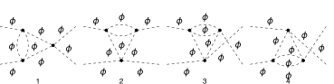
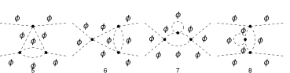
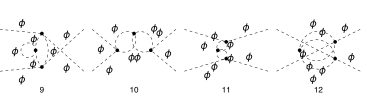
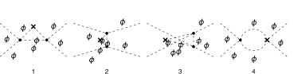
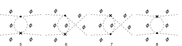
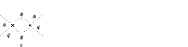
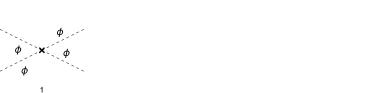

## Load FeynCalc and the necessary add-ons or other packages

This example uses a custom QCD model created with FeynRules.

```mathematica
description = "Renormalization, phi^4, MSbar, 2-loop";
If[ $FrontEnd === Null, 
  	$FeynCalcStartupMessages = False; 
  	Print[description]; 
  ];
If[ $Notebooks === False, 
  	$FeynCalcStartupMessages = False 
  ];
LaunchKernels[8];
$LoadAddOns = {"FeynArts", "FeynHelpers"};
<< FeynCalc`
$FAVerbose = 0;
$ParallelizeFeynCalc = True; 
 
FCCheckVersion[10, 2, 0];
If[ToExpression[StringSplit[$FeynHelpersVersion, "."]][[1]] < 2, 
 	Print["You need at least FeynHelpers 2.0 to run this example."]; 
 	Abort[]; 
 ]
```

$$\text{FeynCalc }\;\text{10.2.0 (dev version, 2026-05-18 16:39:56 +02:00, 05e25b95). For help, use the }\underline{\text{online} \;\text{documentation},}\;\text{ visit the }\underline{\text{forum}}\;\text{ and have a look at the supplied }\underline{\text{examples}.}\;\text{ The PDF-version of the manual can be downloaded }\underline{\text{here}.}$$

$$\text{If you use FeynCalc in your research, please evaluate FeynCalcHowToCite[] to learn how to cite this software.}$$

$$\text{Please keep in mind that the proper academic attribution of our work is crucial to ensure the future development of this package!}$$

$$\text{FeynArts }\;\text{3.12 (27 Mar 2025) patched for use with FeynCalc, for documentation see the }\underline{\text{manual}}\;\text{ or visit }\underline{\text{www}.\text{feynarts}.\text{de}.}$$

$$\text{If you use FeynArts in your research, please cite}$$

$$\text{ $\bullet $ T. Hahn, Comput. Phys. Commun., 140, 418-431, 2001, arXiv:hep-ph/0012260}$$

$$\text{FeynHelpers }\;\text{2.0.0 (2026-02-05 17:03:01 +02:00, 5db84fbb). For help, use the }\underline{\text{online} \;\text{documentation},}\;\text{ visit the }\underline{\text{forum}}\;\text{ and have a look at the supplied }\underline{\text{examples}.}\;\text{ The PDF-version of the manual can be downloaded }\underline{\text{here}.}$$

$$\text{ If you use FeynHelpers in your research, please evaluate FeynHelpersHowToCite[] to learn how to cite this work.}$$

## Configure some options

```mathematica
modelName = "Phi4";
```

```mathematica
modelDir = FileNameJoin[{$UserBaseDirectory, "Applications", "FeynCalc", "Examples", "Models", modelName}];
```

```mathematica
FAPatch[PatchModelsOnly -> True, FAModelsDirectory -> modelDir];

(*Successfully patched FeynArts.*)
```

Here we define all Z-factors for renormalization constants present in the Lagrangian

```mathematica
renConstants = Zg | Zphi | Zmphi
```

$$\text{Zg}|\text{Zphi}|\text{Zmphi}$$

## Generate Feynman diagrams

```mathematica
diagScalar4VTX = InsertFields[CreateTopologies[2, 2 -> 2, 
     ExcludeTopologies -> {Tadpoles, WFCorrections, WFCorrectionCTs}], {S[1], S[1]} -> {S[1], S[1]}, 
    InsertionLevel -> {Particles}, Model -> FileNameJoin[{modelDir, modelName}], 
    GenericModel -> FileNameJoin[{modelDir, modelName}]];
```

```mathematica
diagScalar4VTXCT = InsertFields[CreateCTTopologies[2, 2 -> 2, 
     ExcludeTopologies -> {Tadpoles, WFCorrections, WFCorrectionCTs}], {S[1], S[1]} -> {S[1], S[1]}, 
    InsertionLevel -> {Particles}, Model -> FileNameJoin[{modelDir, modelName}], 
    GenericModel -> FileNameJoin[{modelDir, modelName}]];
```

```mathematica
diagScalarTree4VTX = InsertFields[CreateCTTopologies[1, 2 -> 2, 
     ExcludeTopologies -> {Tadpoles, WFCorrections, WFCorrectionCTs}], {S[1], S[1]} -> {S[1], S[1]}, 
    InsertionLevel -> {Particles}, Model -> FileNameJoin[{modelDir, modelName}], 
    GenericModel -> FileNameJoin[{modelDir, modelName}]];
```

Self-energy and vertex diagrams

```mathematica
Paint[diagScalar4VTX, ColumnsXRows -> {4, 1}, SheetHeader -> None, 
   Numbering -> Simple, ImageSize -> 128 {4, 1}];
```







Counter-term diagrams

```mathematica
Paint[diagScalar4VTXCT, ColumnsXRows -> {4, 1}, SheetHeader -> None, 
   Numbering -> Simple, ImageSize -> 128 {4, 1}];
```







```mathematica
Paint[diagScalarTree4VTX, ColumnsXRows -> {4, 1}, SheetHeader -> None,
   Numbering -> Simple, ImageSize -> 128 {4, 1}];
```



## Master integrals

The only required masters are 1- and 2-loop tadpoles

```mathematica
tadpoleMaster = Get[FileNameJoin[{$FeynCalcDirectory, "Examples", "MasterIntegrals","Tadpoles", "tad1LxFx1x1xxEp999x.m"}]];
```

```mathematica
tadpoleMaster1 = tadpoleMaster /. m1 -> mphi /. tad1L -> "tad1Lv1";
```

```mathematica
tadpoleMaster2 = Get[FileNameJoin[{$FeynCalcDirectory, "Examples", "MasterIntegrals","Tadpoles", 
        "tad2LxFx111x111xxEp1x.m"}]] /. m1 -> mphi /. tad2LxFx111x111xxEp1x -> "tad2Lv2";
```

## Obtain the amplitudes

```mathematica
{scalar4VTX$RawAmp, scalar4VTXCT$RawAmp, diagScalarTree4VTX$RawAmp} = 
   FCFAConvert[CreateFeynAmp[#, Truncated -> True, PreFactor -> 1], 
     	IncomingMomenta -> {p1, p2}, OutgoingMomenta -> {q1, q2}, 
     	DropSumOver -> True, 
     	LoopMomenta -> {k1, k2}, UndoChiralSplittings -> True, 
     	ChangeDimension -> D, SMP -> True, 
     	FinalSubstitutions -> {}] & /@ {
    	diagScalar4VTX, diagScalar4VTXCT, diagScalarTree4VTX};
```

## Calculate the amplitudes

### Scalar vertex at 2 loops

The 1-loop four-scalar-vertex has superficial degree of divergence equal to 0. We set q1=q2=0, so that p1+p2=0 yields p1=-p2

```mathematica
FCClearScalarProducts[];
divDegree = 0;
aux1 = FCLoopGetFeynAmpDenominators[scalar4VTX$RawAmp /. q1 | q2 -> 0 /. p2 -> -p1 /. p1 -> p, {k1, k2},denHead, Momentum -> {p}, "Massless" -> True];
aux2 = FCLoopAddAuxiliaryMass[aux1[[2]], {k1, k2}, -mxt^2, 0, Head -> denHead]
```

$$\left\{\text{denHead}\left(\frac{1}{((\text{k1}-p)^2-\text{mphi}^2+i \eta )}\right)\to \frac{1}{((\text{k1}-p)^2-\text{mphi}^2+i \eta )},\text{denHead}\left(\frac{1}{((\text{k1}+\text{k2}-p)^2-\text{mphi}^2+i \eta )}\right)\to \frac{1}{((\text{k1}+\text{k2}-p)^2-\text{mphi}^2+i \eta )},\text{denHead}\left(\frac{1}{((\text{k2}+p)^2-\text{mphi}^2+i \eta )}\right)\to \frac{1}{((\text{k2}+p)^2-\text{mphi}^2+i \eta )},\text{denHead}\left(\frac{1}{((\text{k1}+\text{k2}+p)^2-\text{mphi}^2+i \eta )}\right)\to \frac{1}{((\text{k1}+\text{k2}+p)^2-\text{mphi}^2+i \eta )}\right\}$$

```mathematica
AbsoluteTiming[scalar4VTX$PreAmp1 = Contract[(aux1[[1]] /. aux2), FCParallelize -> True];]
```

$$\{0.017569,\text{Null}\}$$

```mathematica
AbsoluteTiming[scalar4VTX$Amp = scalar4VTX$PreAmp1;]
```

$$\{\text{7.$\grave{ }$*${}^{\wedge}$-6},\text{Null}\}$$

```mathematica
isoSymbols = FCMakeSymbols[KK, Range[1, $KernelCount], List]
```

$$\{\text{KK1},\text{KK2},\text{KK3},\text{KK4},\text{KK5},\text{KK6},\text{KK7},\text{KK8}\}$$

```mathematica
AbsoluteTiming[scalar4VTX$Amp1 = Collect2[scalar4VTX$Amp, p, IsolateNames -> isoSymbols, FCParallelize -> True];]
```

$$\{0.10017,\text{Null}\}$$

```mathematica
AbsoluteTiming[scalar4VTX$Amp2 = FourSeries[scalar4VTX$Amp1, {p, 0, divDegree}, FCParallelize -> True];]
```

$$\{0.033706,\text{Null}\}$$

```mathematica
AbsoluteTiming[scalar4VTX$Amp3 = Collect2[FRH2[scalar4VTX$Amp2, isoSymbols], FeynAmpDenominator, FCParallelize -> True];]
```

$$\{0.061069,\text{Null}\}$$

The rest of the calculation follows the standard multiloop template

```mathematica
FCClearScalarProducts[]
SPD[p] = pp;
```

```mathematica
AbsoluteTiming[{scalar4VTX$Amp4, scalar4VTX$Topos} = FCLoopFindTopologies[scalar4VTX$Amp3, {k1, k2}, FCI -> True, FCParallelize -> True, 
     FCLoopBasisOverdeterminedQ -> True, FinalSubstitutions -> {Hold[SPD][p] -> pp}];]
```

$$\text{FCLoopFindTopologies: Number of the initial candidate topologies: }2$$

$$\text{FCLoopFindTopologies: Number of the identified unique topologies: }1$$

$$\text{FCLoopFindTopologies: Number of the preferred topologies among the unique topologies: }0$$

$$\text{FCLoopFindTopologies: Number of the identified subtopologies: }1$$

$$\text{FCLoopFindTopologyMappings: }\;\text{Final number of found topologies: }1$$

$$\{0.232468,\text{Null}\}$$

```mathematica
AbsoluteTiming[scalar4VTX$Amp5 = FCLoopTensorReduce[scalar4VTX$Amp4, scalar4VTX$Topos, FCParallelize -> True];]
```

$$\{0.141908,\text{Null}\}$$

```mathematica
AbsoluteTiming[{scalar4VTX$Amp6, scalar4VTX$Topos2} = FCLoopRewriteOverdeterminedTopologies[scalar4VTX$Amp5, scalar4VTX$Topos, FCParallelize -> True];]
```

$$\text{FCLoopRewriteIncompleteTopologies: }\;\text{No overdetermined topologies detected.}$$

$$\{0.036967,\text{Null}\}$$

```mathematica
AbsoluteTiming[{scalar4VTX$Amp7, scalar4VTX$Topos3} = FCLoopRewriteIncompleteTopologies[scalar4VTX$Amp6, scalar4VTX$Topos2, FCParallelize -> True];]
```

$$\text{FCLoopRewriteIncompleteTopologies: }\;\text{No incomplete topologies detected.}$$

$$\{0.031317,\text{Null}\}$$

```mathematica
AbsoluteTiming[scalar4VTX$SubTopos = FCLoopFindSubtopologies[scalar4VTX$Topos3, Flatten -> True, Remove -> True, FCParallelize -> True];]
```

$$\{0.048475,\text{Null}\}$$

```mathematica
{scalar4VTX$TopoMappings, 
    scalar4VTX$FinalTopos} = FCLoopFindTopologyMappings[scalar4VTX$Topos3, PreferredTopologies -> scalar4VTX$SubTopos, FCParallelize -> True];
```

$$\text{FCLoopFindTopologyMappings: }\;\text{Found }0\text{ mapping relations }$$

$$\text{FCLoopFindTopologyMappings: }\;\text{Final number of independent topologies: }1$$

```mathematica
AbsoluteTiming[scalar4VTX$AmpGLI = FCLoopApplyTopologyMappings[scalar4VTX$Amp7, {scalar4VTX$TopoMappings, 
      scalar4VTX$FinalTopos}, FCParallelize -> True];]
```

$$\{0.069824,\text{Null}\}$$

```mathematica
scalar4VTX$GLIs = Cases2[scalar4VTX$AmpGLI, GLI];
```

```mathematica
scalar4VTX$dir = FileNameJoin[{$TemporaryDirectory, "Reduction-scalar4VTX-2L-massless"}];
Quiet[CreateDirectory[scalar4VTX$dir]];
```

```mathematica
KiraCreateJobFile[scalar4VTX$FinalTopos, scalar4VTX$GLIs, scalar4VTX$dir]
```

$$\{\text{/tmp/Reduction-scalar4VTX-2L-massless/fctopology1/job.yaml}\}$$

```mathematica
KiraCreateIntegralFile[scalar4VTX$GLIs, scalar4VTX$FinalTopos, scalar4VTX$dir]
KiraCreateConfigFiles[scalar4VTX$FinalTopos, scalar4VTX$GLIs, scalar4VTX$dir, 
  KiraMassDimensions -> {pp -> 2, mphi -> 1}]
```

$$\text{KiraCreateIntegralFile: Number of loop integrals: }3$$

$$\{\text{/tmp/Reduction-scalar4VTX-2L-massless/fctopology1/KiraLoopIntegrals}\}$$

$$\left(
\begin{array}{cc}
 \;\text{/tmp/Reduction-scalar4VTX-2L-massless/fctopology1/config/integralfamilies.yaml} & \;\text{/tmp/Reduction-scalar4VTX-2L-massless/fctopology1/config/kinematics.yaml} \\
\end{array}
\right)$$

```mathematica
KiraRunReduction[scalar4VTX$dir, scalar4VTX$FinalTopos, 
  KiraBinaryPath -> FileNameJoin[{$HomeDirectory, ".local", "bin", "kira"}], 
  KiraFermatPath -> FileNameJoin[{$HomeDirectory, "bin", "ferl64", "fer64"}]]
```

$$\{\text{True}\}$$

```mathematica
scalar4VTX$ReductionTables = KiraImportResults[scalar4VTX$FinalTopos, scalar4VTX$dir] // Flatten;
```

```mathematica
AbsoluteTiming[scalar4VTX$resPreFinal1 = (scalar4VTX$AmpGLI /. Dispatch[scalar4VTX$ReductionTables]);]
```

$$\{0.000323,\text{Null}\}$$

```mathematica
AbsoluteTiming[scalar4VTX$resPreFinal2 = Map[Collect2[#, GLI, FCParallelize -> True] &, scalar4VTX$resPreFinal1];]
```

$$\{0.255481,\text{Null}\}$$

```mathematica
scalar4VTX$masters = Cases2[scalar4VTX$resPreFinal1, GLI];
```

```mathematica
scalar4VTX$MIMappings = FCLoopFindIntegralMappings[scalar4VTX$masters, Join[tadpoleMaster1[[2]], {tadpoleMaster2[[2]]}, 
    scalar4VTX$FinalTopos], PreferredIntegrals -> {tadpoleMaster1[[1]][[1]] tadpoleMaster1[[1]][[1]], tadpoleMaster2[[1]][[1]]}]
```

$$\left(
\begin{array}{cc}
 G^{\text{fctopology1}}(1,1,0)\to G^{\text{tad1LxFx1x1xxEp999x}}(1)^2 & G^{\text{fctopology1}}(1,1,1)\to G^{\text{tad2Lv2}}(1,1,1) \\
 G^{\text{tad2Lv2}}(1,1,1) & G^{\text{tad1LxFx1x1xxEp999x}}(1)^2 \\
\end{array}
\right)$$

```mathematica
isoSymbols1 = FCMakeSymbols[LL, Range[1, $KernelCount], List];
isoSymbols2 = FCMakeSymbols[LM, Range[1, $KernelCount], List];
```

```mathematica
AbsoluteTiming[scalar4VTX$resPreFinal2 = Collect2[scalar4VTX$resPreFinal1, D, GLI, IsolateNames -> isoSymbols1, FCParallelize -> True] // FCReplaceD[#, D -> 4 - 2 ep] & // ReplaceAll[#, scalar4VTX$MIMappings[[1]]] & // 
      ReplaceAll[#, {tadpoleMaster1[[1]], tadpoleMaster2[[1]]}] & // Collect2[#, ep, IsolateNames -> isoSymbols2, FCParallelize -> True] &;]
```

$$\{0.339563,\text{Null}\}$$

```mathematica
AbsoluteTiming[scalar4VTX$resPreFinal3 = scalar4VTX$resPreFinal2 // Series[#, {ep, 0, -1}] & // Normal // Series[(I*(4*Pi)^(-2 + ep))^2 #, {ep, 0, -1}] & // Normal;]
```

$$\{0.604175,\text{Null}\}$$

```mathematica
AbsoluteTiming[scalar4VTX$resPreFinal4 = Collect2[FRH2[FRH2[scalar4VTX$resPreFinal3, isoSymbols2], isoSymbols1], DiracGamma, pp, mxt, ep, FCParallelize -> True];]
```

$$\{0.070851,\text{Null}\}$$

```mathematica
isoSymbols3 = FCMakeSymbols[LH, Range[1, $KernelCount], List];
```

```mathematica
AbsoluteTiming[scalar4VTX$resPreFinal5 = Series[Total[Collect2[scalar4VTX$resPreFinal4, mxt, IsolateNames -> isoSymbols3, FCParallelize -> True]], {mxt, 0, 2}] // Normal;]
```

$$\{0.074574,\text{Null}\}$$

```mathematica
AbsoluteTiming[scalar4VTX$resPreFinal6 = Collect2[FRH2[scalar4VTX$resPreFinal5, isoSymbols3] // ReplaceAll[#, Log[m_Symbol^2] :> 2 Log[m]] &, pp, mxt, ep, FCParallelize -> True];]
```

$$\{0.053989,\text{Null}\}$$

```mathematica
scalar4VTX$resFinal = Collect2[Collect2[scalar4VTX$resPreFinal6, ep, g, Factoring -> FullSimplify],ep, mphi, mxt] // ReplaceAll[#, Log[m_Symbol^2] :> 2 Log[m]] &
```

$$-\frac{9 i g^3}{1024 \pi ^4 \;\text{ep}^2}+\frac{9 i g^3 \log (\text{mphi})}{256 \pi ^4 \;\text{ep}}-\frac{3 i g^3 (1+\log (4096)+6 \log (\pi ))}{1024 \pi ^4 \;\text{ep}}$$

### Scalar self-energy 1-loop CT

```mathematica
FCClearScalarProducts[];
divDegree = 0;
aux1 = FCLoopGetFeynAmpDenominators[scalar4VTXCT$RawAmp /. q1 | q2 -> 0 /. p2 -> -p1 /. p1 -> p, {k1}, denHead, Momentum -> {p}, "Massless" -> True];
aux2 = FCLoopAddAuxiliaryMass[aux1[[2]], {k1}, -mxt^2, 0, Head -> denHead]
```

$$\left\{\text{denHead}\left(\frac{1}{((\text{k1}-p)^2-\text{mphi}^2+i \eta )}\right)\to \frac{1}{((\text{k1}-p)^2-\text{mphi}^2+i \eta )},\text{denHead}\left(\frac{1}{((\text{k1}+p)^2-\text{mphi}^2+i \eta )}\right)\to \frac{1}{((\text{k1}+p)^2-\text{mphi}^2+i \eta )}\right\}$$

```mathematica
scalar4VTXCT$StrName = StringReplace[ToString[Hold[scalar4VTXCT$Amp]], {"Hold[" -> "", "]" -> ""}]
```

$$\text{scalar4VTXCT\$Amp}$$

```mathematica
AbsoluteTiming[scalar4VTXCT$Amp = (aux1[[1]] /. aux2);]
```

$$\{0.000285,\text{Null}\}$$

```mathematica
AbsoluteTiming[scalar4VTXCT$Amp1 = Collect2[scalar4VTXCT$Amp, p, IsolateNames -> KK];]
AbsoluteTiming[scalar4VTXCT$Amp2 = FourSeries[scalar4VTXCT$Amp1, {p, 0, divDegree}, FCParallelize -> True];]
AbsoluteTiming[scalar4VTXCT$Amp3 = Collect2[FRH[scalar4VTXCT$Amp2], FeynAmpDenominator, FCParallelize -> True];]
```

$$\{0.030701,\text{Null}\}$$

$$\{0.026672,\text{Null}\}$$

$$\{0.031782,\text{Null}\}$$

The rest of the calculation follows the standard multiloop template

```mathematica
FCClearScalarProducts[];
SPD[p] = pp;
```

```mathematica
{scalar4VTXCT$Amp4, scalar4VTXCT$Topos} = FCLoopFindTopologies[scalar4VTXCT$Amp3, {k1}, FCParallelize -> True,
    FCLoopBasisOverdeterminedQ -> True, FinalSubstitutions -> {Hold[SPD][p] -> pp}, Names -> scalar4VTXtopo];
```

$$\text{FCLoopFindTopologies: Number of the initial candidate topologies: }1$$

$$\text{FCLoopFindTopologies: Number of the identified unique topologies: }1$$

$$\text{FCLoopFindTopologies: Number of the preferred topologies among the unique topologies: }0$$

$$\text{FCLoopFindTopologies: Number of the identified subtopologies: }0$$

$$\text{FCLoopFindTopologyMappings: }\;\text{Final number of found topologies: }1$$

```mathematica
AbsoluteTiming[scalar4VTXCT$Amp5 = FCLoopTensorReduce[scalar4VTXCT$Amp4, scalar4VTXCT$Topos, FCParallelize -> True];]
```

$$\{0.194085,\text{Null}\}$$

```mathematica
{scalar4VTXCT$Amp6, scalar4VTXCT$Topos2} = FCLoopRewriteOverdeterminedTopologies[scalar4VTXCT$Amp5, scalar4VTXCT$Topos, FCParallelize -> True];
```

$$\text{FCLoopRewriteIncompleteTopologies: }\;\text{No overdetermined topologies detected.}$$

```mathematica
{scalar4VTXCT$Amp7, scalar4VTXCT$Topos3} = FCLoopRewriteIncompleteTopologies[scalar4VTXCT$Amp6, scalar4VTXCT$Topos2, FCParallelize -> True];
```

$$\text{FCLoopRewriteIncompleteTopologies: }\;\text{No incomplete topologies detected.}$$

```mathematica
AbsoluteTiming[scalar4VTXCT$SubTopos = FCLoopFindSubtopologies[scalar4VTXCT$Topos2, Flatten -> True, Remove -> True, FCParallelize -> True];]
```

$$\{0.051261,\text{Null}\}$$

```mathematica
AbsoluteTiming[{scalar4VTXCT$TopoMappings, scalar4VTXCT$FinalTopos} = FCLoopFindTopologyMappings[scalar4VTXCT$Topos2, PreferredTopologies -> scalar4VTXCT$SubTopos, FCParallelize -> True];]
```

$$\text{FCLoopFindTopologyMappings: }\;\text{Found }0\text{ mapping relations }$$

$$\text{FCLoopFindTopologyMappings: }\;\text{Final number of independent topologies: }1$$

$$\{0.068338,\text{Null}\}$$

```mathematica
AbsoluteTiming[scalar4VTXCT$AmpGLI = FCLoopApplyTopologyMappings[scalar4VTXCT$Amp7, {scalar4VTXCT$TopoMappings, scalar4VTXCT$FinalTopos}, FCParallelize -> True];]
```

$$\{0.063827,\text{Null}\}$$

```mathematica
scalar4VTXCT$GLIs = Cases2[scalar4VTXCT$AmpGLI, GLI];
```

```mathematica
scalar4VTXCT$dir = FileNameJoin[{$TemporaryDirectory, "Reduction-" <> scalar4VTXCT$StrName <> "-1L-massive"}];
Quiet[CreateDirectory[scalar4VTXCT$dir]];
```

```mathematica
KiraCreateJobFile[scalar4VTXCT$FinalTopos, scalar4VTXCT$GLIs, scalar4VTXCT$dir]
```

$$\{\text{/tmp/Reduction-scalar4VTXCT\$Amp-1L-massive/scalar4VTXtopo1/job.yaml}\}$$

```mathematica
KiraCreateIntegralFile[scalar4VTXCT$GLIs, scalar4VTXCT$FinalTopos, scalar4VTXCT$dir]
KiraCreateConfigFiles[scalar4VTXCT$FinalTopos, scalar4VTXCT$GLIs, scalar4VTXCT$dir, 
  KiraMassDimensions -> {pp -> 2, mphi -> 1}]
```

$$\text{KiraCreateIntegralFile: Number of loop integrals: }2$$

$$\{\text{/tmp/Reduction-scalar4VTXCT\$Amp-1L-massive/scalar4VTXtopo1/KiraLoopIntegrals}\}$$

$$\left(
\begin{array}{cc}
 \;\text{/tmp/Reduction-scalar4VTXCT\$Amp-1L-massive/scalar4VTXtopo1/config/integralfamilies.yaml} & \;\text{/tmp/Reduction-scalar4VTXCT\$Amp-1L-massive/scalar4VTXtopo1/config/kinematics.yaml} \\
\end{array}
\right)$$

```mathematica
KiraRunReduction[scalar4VTXCT$dir, scalar4VTXCT$FinalTopos, 
  KiraBinaryPath -> FileNameJoin[{$HomeDirectory, ".local", "bin", "kira"}], 
  KiraFermatPath -> FileNameJoin[{$HomeDirectory, "bin", "ferl64", "fer64"}]]
```

$$\{\text{True}\}$$

```mathematica
scalar4VTXCT$ReductionTables = KiraImportResults[scalar4VTXCT$FinalTopos, scalar4VTXCT$dir] // Flatten;
```

```mathematica
scalar4VTXCT$resPreFinal1 = Collect2[Total[scalar4VTXCT$AmpGLI /. Dispatch[scalar4VTXCT$ReductionTables]],GLI, D, FCParallelize -> True];
```

```mathematica
scalar4VTXCT$masters = Cases2[scalar4VTXCT$resPreFinal1, GLI];
```

```mathematica
scalar4VTXCT$MIMappings = FCLoopFindIntegralMappings[scalar4VTXCT$masters, Join[tadpoleMaster1[[2]], 
    scalar4VTXCT$FinalTopos], PreferredIntegrals -> {tadpoleMaster1[[1]][[1]]}]
```

$$\left(
\begin{array}{c}
 G^{\text{scalar4VTXtopo1}}(1)\to G^{\text{tad1LxFx1x1xxEp999x}}(1) \\
 G^{\text{tad1LxFx1x1xxEp999x}}(1) \\
\end{array}
\right)$$

Our master integrals are calculated using the standard multiloop normalization. To convert it back to the textbook normalization
we need to multiply by I*(4 Pi)^(ep-2)

At this point we need to insert the 1-loop renormalization constants

```mathematica
knownResults1L = {rc[delZphi, 1] -> 0, rc[delZmphi, 1] -> 1/(32*ep*Pi^2), rc[delZg, 1] -> (3)/(32*ep*Pi^2)};
```

```mathematica
knownResults2L = {rc[delZphi, 2] -> -1/6144*1/(ep*Pi^4)};
```

```mathematica
Collect2[scalar4VTXCT$resPreFinal1, D, GLI, IsolateNames -> KK] // FCReplaceD[#, D -> 4 - 2 ep] & // 
  ReplaceAll[#, scalar4VTXCT$MIMappings[[1]]] &
```

$$\frac{3}{8} (4-2 \;\text{ep})^2 \;\text{KK}(54) G^{\text{tad1LxFx1x1xxEp999x}}(1)+\frac{3}{4} (4-2 \;\text{ep}) \;\text{KK}(52) G^{\text{tad1LxFx1x1xxEp999x}}(1)-3 \;\text{KK}(56) G^{\text{tad1LxFx1x1xxEp999x}}(1)$$

```mathematica
AbsoluteTiming[scalar4VTXCT$resPreFinal2 = Collect2[scalar4VTXCT$resPreFinal1, D, GLI, IsolateNames -> KK] // FCReplaceD[#, D -> 4 - 2 ep] & // 
            ReplaceAll[#, scalar4VTXCT$MIMappings[[1]]] & // ReplaceAll[#, {tadpoleMaster1[[1]], tadpoleMaster2[[1]]}] & // 
          Collect2[#, ep, IsolateNames -> KK2] & // Series[(I*(4*Pi)^(-2 + ep)) #, {ep, 0, 1}] & // Normal // FCLoopAddMissingHigherOrdersWarning[#, ep, epHelp] & // FRH // 
     ReplaceAll[#, Log[m_^2] :> 2 Log[m]] &;]
```

$$\{1.51513,\text{Null}\}$$

```mathematica
AbsoluteTiming[scalar4VTXCT$resPreFinal2 = Collect2[scalar4VTXCT$resPreFinal1, Join[{g}, List @@ renConstants],IsolateNames -> KK] // ReplaceAll[#, {
         	(h : renConstants) :> 1 + (g rc[ToExpression["del" <> ToString[h]], 1] + g^2 rc[ToExpression["del" <> ToString[h]], 2])}] & // Series[#, {g, 0, 3}] & // Normal;]
```

$$\{0.012584,\text{Null}\}$$

```mathematica
AbsoluteTiming[scalar4VTXCT$resPreFinal3 = Collect2[scalar4VTXCT$resPreFinal2 // FRH, {rc, D, GLI}, IsolateNames -> KK] // FCReplaceD[#, {D -> 4 - 2 ep}] & // ReplaceRepeated[#, knownResults1L] & // 
        ReplaceAll[#, scalar4VTXCT$MIMappings[[1]]] & // ReplaceAll[#, {tadpoleMaster1[[1]], tadpoleMaster2[[1]]}] & // If[! FreeQ[#, GLI], Abort[], #] & // Collect2[#, ep, IsolateNames -> KK] &;]
```

$$\{0.006164,\text{Null}\}$$

```mathematica
scalar4VTXCT$resFinal = scalar4VTXCT$resPreFinal3 // Series[(I*(4*Pi)^(-2 + ep)) #, {ep, 0, -1}] & // Normal // FRH //
    ReplaceAll[#, {Log[m_^2] :> 2 Log[m], Log[4 Pi] -> Log[4] + Log[Pi]}] & // Collect2[#, ep, mphi] &
```

$$\frac{9 i g^3}{512 \pi ^4 \;\text{ep}^2}-\frac{9 i g^3 \log (\text{mphi})}{256 \pi ^4 \;\text{ep}}+\frac{3 i g^3 (-1+6 \log (4)+6 \log (\pi ))}{1024 \pi ^4 \;\text{ep}}$$

### Determination of renormalization constants

```mathematica
diagScalarTree4VTX$Amp = (Total[diagScalarTree4VTX$RawAmp]) // ReplaceRepeated[#, {
        	(h : renConstants) :> 1 + (g rc[ToExpression["del" <> ToString[h]], 1] + g^2 rc[ToExpression["del" <> ToString[h]], 2])}] & // 
    	Series[#, {g, 0, 3}] & // Normal // ReplaceRepeated[#, Join[knownResults1L, knownResults2L]] &
```

$$-i g^3 \left(\text{rc}(\text{delZg},2)-\frac{1}{3072 \pi ^4 \;\text{ep}}\right)-\frac{3 i g^2}{32 \pi ^2 \;\text{ep}}$$

```mathematica
Coefficient[scalar4VTX$resFinal + scalar4VTXCT$resFinal + diagScalarTree4VTX$Amp, g, 3] // Collect2[#, pp] &
```

$$-\frac{i \left(3072 \pi ^4 \;\text{ep}^2 \;\text{rc}(\text{delZg},2)+17 \;\text{ep}+9 \;\text{ep} \log (4096)-54 \;\text{ep} \log (4)-27\right)}{3072 \pi ^4 \;\text{ep}^2}$$

```mathematica
scalar4VTX$RenConstants2L = Coefficient[scalar4VTX$resFinal + scalar4VTXCT$resFinal + diagScalarTree4VTX$Amp, g, 3] // Collect2[#, pp] & // FCMatchSolve[#, {ep, mphi, pp}] & // FullSimplify
```

$$\text{FCMatchSolve: Solving for: }\{\text{rc}(\text{delZg},2)\}$$

$$\text{FCMatchSolve: A solution exists.}$$

$$\left\{\text{rc}(\text{delZg},2)\to \frac{27-17 \;\text{ep}}{3072 \pi ^4 \;\text{ep}^2}\right\}$$

## Check the final results

Our final phi^4 2-loop wave-function renormalization constants

```mathematica
finalResults = Thread[Rule[List @@ renConstants, 
      (List @@ renConstants /. (h : renConstants) :> 1 + g rc[ToExpression["del" <> ToString[h]], 1] + g^2 rc[ToExpression["del" <> ToString[h]], 2]) // 
       ReplaceAll[#, Join[SUNSimplify[knownResults1L, SUNNToCACF -> False], scalar4VTX$RenConstants2L]] &]] // SelectNotFree[#, Zg] & // ExpandAll
```

$$\left\{\text{Zg}\to \frac{9 g^2}{1024 \pi ^4 \;\text{ep}^2}-\frac{17 g^2}{3072 \pi ^4 \;\text{ep}}+\frac{3 g}{32 \pi ^2 \;\text{ep}}+1\right\}$$

```mathematica
finalResults // TableForm
```

$$\begin{array}{l}
 \;\text{Zg}\to \frac{9 g^2}{1024 \pi ^4 \;\text{ep}^2}-\frac{17 g^2}{3072 \pi ^4 \;\text{ep}}+\frac{3 g}{32 \pi ^2 \;\text{ep}}+1 \\
\end{array}$$

```mathematica
knownResult = {rc[delZg, 2] -> (27 - 17*ep)/(3072*ep^2*Pi^4)};
```

```mathematica
FCCompareResults[scalar4VTX$RenConstants2L, knownResult, 
  Text -> {"\tCompare to the known result:", 
    "CORRECT.", "WRONG!"}, Interrupt -> {Hold[Quit[1]], Automatic}]
Print["\tCPU Time used: ", Round[N[TimeUsed[], 4], 0.001], " s."];

```mathematica

$$\text{$\backslash $tCompare to the known result:} \;\text{CORRECT.}$$

$$\text{True}$$

$$\text{$\backslash $tCPU Time used: }40.751\text{ s.}$$