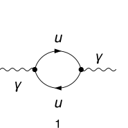

## Load FeynCalc and the necessary add-ons or other packages

```mathematica
description = "Adler function, QCD, massless quarks, 1-loop";
If[ $FrontEnd === Null, 
  	$FeynCalcStartupMessages = False; 
  	Print[description]; 
  ];
If[ $Notebooks === False, 
  	$FeynCalcStartupMessages = False 
  ];
LaunchKernels[4];
$LoadAddOns = {"FeynArts", "FeynHelpers"};
<< FeynCalc`
$FAVerbose = 0;
$ParallelizeFeynCalc = True; 
 
FCCheckVersion[10, 2, 0];
If[ToExpression[StringSplit[$FeynHelpersVersion, "."]][[1]] < 2, 
 	Print["You need at least FeynHelpers 2.0 to run this example."]; 
 	Abort[]; 
 ]
```

$$\text{FeynCalc }\;\text{10.2.1 (dev version, 2026-06-23 16:04:37 +02:00, d2d4541b). For help, use the }\underline{\text{online} \;\text{documentation},}\;\text{ visit the }\underline{\text{forum}}\;\text{ and have a look at the supplied }\underline{\text{examples}.}\;\text{ The PDF-version of the manual can be downloaded }\underline{\text{here}.}$$

$$\text{If you use FeynCalc in your research, please evaluate FeynCalcHowToCite[] to learn how to cite this software.}$$

$$\text{Please keep in mind that the proper academic attribution of our work is crucial to ensure the future development of this package!}$$

$$\text{FeynArts }\;\text{3.12 (27 Mar 2025) patched for use with FeynCalc, for documentation see the }\underline{\text{manual}}\;\text{ or visit }\underline{\text{www}.\text{feynarts}.\text{de}.}$$

$$\text{If you use FeynArts in your research, please cite}$$

$$\text{ $\bullet $ T. Hahn, Comput. Phys. Commun., 140, 418-431, 2001, arXiv:hep-ph/0012260}$$

$$\text{FeynHelpers }\;\text{2.1.0 (2026-06-17 11:21:04 +02:00, 1d1a414a). For help, use the }\underline{\text{online} \;\text{documentation},}\;\text{ visit the }\underline{\text{forum}}\;\text{ and have a look at the supplied }\underline{\text{examples}.}\;\text{ The PDF-version of the manual can be downloaded }\underline{\text{here}.}$$

$$\text{ If you use FeynHelpers in your research, please evaluate FeynHelpersHowToCite[] to learn how to cite this work.}$$

## Generate Feynman diagrams

Nicer typesetting

```mathematica
FCAttachTypesettingRule[mu, "\[Mu]"];
FCAttachTypesettingRule[nu, "\[Nu]"];
```

We compute the hadronic vacuum polarization from a single massless quark flavor.
The full Adler function is obtained by summing over all active quark flavors.

```mathematica
diags = InsertFields[CreateTopologies[1, 1 -> 1, 
     		ExcludeTopologies -> {Tadpoles}], {V[1]} -> {V[1]}, 
    	InsertionLevel -> {Particles}, 
    	ExcludeParticles -> {F[1 | 2 | 4], F[3, {2 | 3}], S[_], V[_], U[_]}]; 
 
Paint[diags, ColumnsXRows -> {1, 1}, Numbering -> Simple, 
  	SheetHeader -> None, ImageSize -> {256, 256}];
```



## Master integrals

The only required master is a massless 1-loop bubble

```mathematica
masslessBubble = Get[FileNameJoin[{$FeynCalcDirectory, "Examples", "MasterIntegrals","Mincer", "prop1L00.m"}]];
```

```mathematica
masslessBubble
```

$$\left\{G^{\text{prop1L00}}(1,1)\to \frac{e^{\gamma  \;\text{ep}} \Gamma (1-\text{ep})^2 \Gamma (\text{ep}) (-\text{qq}-i \;\text{eta})^{-\text{ep}}}{\Gamma (2-2 \;\text{ep})},\left\{\text{FCTopology}\left(\text{prop1L00},\left\{\frac{1}{(l^2+i \eta )},\frac{1}{((l-q)^2+i \eta )}\right\},\{l\},\{q\},\{\text{Hold}[\text{Pair}][q,q]\to \;\text{qq}\},\{\}\right)\right\}\right\}$$

## Obtain the amplitude

The 1/(2Pi)^D prefactor is implicit.

```mathematica
amp[0] = FCFAConvert[CreateFeynAmp[diags, PreFactor -> 1, 
   	Truncated -> True], IncomingMomenta -> {q}, 
  	OutgoingMomenta -> {q}, LorentzIndexNames -> {mu, nu}, 
  	LoopMomenta -> {k}, UndoChiralSplittings -> True, 
  	ChangeDimension -> D, List -> True, SMP -> True, 
  	FinalSubstitutions -> {SMP["m_u"] -> 0, SumOver[SUNFIndex[Col3], 3] -> SUNN}]	
```

$$\left\{\frac{N \;\text{tr}\left((-(\gamma \cdot k)).\left(-\frac{2}{3} i \;\text{e} \gamma ^{\nu }\right).(\gamma \cdot (q-k)).\left(-\frac{2}{3} i \;\text{e} \gamma ^{\mu }\right)\right)}{k^2.(k-q)^2}\right\}$$

## Fix the kinematics

We keep q^2 = qq as a free symbol so that we can differentiate Pi(q^2) later.

```mathematica
FCClearScalarProducts[];
SPD[q] = qq;
```

## Evaluate the amplitude

```mathematica
projector = MTD[mu, nu]/ ((D - 1) qq)
```

$$\frac{g^{\mu \nu }}{(D-1) \;\text{qq}}$$

```mathematica
amp[1] = (eQ^2 (3/2)^2 projector amp[0]) // Contract[#, FCParallelize -> True] & // 
   	DiracSimplify[#, FCParallelize -> True] & // 
  	SUNSimplify[#, FCParallelize -> True] &
```

$$\left\{\frac{4 (2-D) \;\text{e}^2 \;\text{eQ}^2 C_A \left(k^2-k\cdot q\right)}{(1-D) \;\text{qq} k^2.(k-q)^2}\right\}$$

## Identify and minimize the topologies

```mathematica
{amp[2], topos} = FCLoopFindTopologies[amp[1], {k}, 
   	FCParallelize -> True, 
   	FinalSubstitutions -> {Hold[SPD][q] -> qq}];
```

$$\text{FCLoopFindTopologies: Number of the initial candidate topologies: }1$$

$$\text{FCLoopFindTopologies: Number of the identified unique topologies: }1$$

$$\text{FCLoopFindTopologies: Number of the preferred topologies among the unique topologies: }0$$

$$\text{FCLoopFindTopologies: Number of the identified subtopologies: }0$$

$$\text{FCLoopFindTopologies: }\;\text{Final number of found topologies: }1$$

```mathematica
mappings = FCLoopFindTopologyMappings[topos, FCParallelize -> True];
```

$$\text{FCLoopFindIntegralMappings: }\;\text{Final number of found mappings: }1$$

$$\text{FCLoopFindTopologyMappings: }\;\text{Found }0\text{ mapping relations }$$

$$\text{FCLoopFindTopologyMappings: }\;\text{Final number of independent topologies: }1$$

## Rewrite the amplitude in terms of GLIs

```mathematica
AbsoluteTiming[ampReduced = FCLoopTensorReduce[amp[2], topos, 
    	FCParallelize -> True];]
```

$$\{0.151699,\text{Null}\}$$

```mathematica
AbsoluteTiming[ampPreFinal = FCLoopApplyTopologyMappings[ampReduced, 
    	mappings, FCParallelize -> True];]
```

$$\{0.047665,\text{Null}\}$$

```mathematica
ints = Cases2[ampPreFinal, GLI]
```

$$\left\{G^{\text{fctopology1}}(0,1),G^{\text{fctopology1}}(1,0),G^{\text{fctopology1}}(1,1)\right\}$$

```mathematica
dir = FileNameJoin[{$TemporaryDirectory, "Reduction-1L-Adler"}];
Quiet[CreateDirectory[dir]];
```

```mathematica
KiraCreateJobFile[mappings[[2]], ints, dir];
```

```mathematica
KiraCreateIntegralFile[ints, mappings[[2]], dir];
```

$$\text{KiraCreateIntegralFile: Number of loop integrals: }3$$

```mathematica
KiraCreateConfigFiles[mappings[[2]], ints, dir, 
  	KiraMassDimensions -> {qq -> 2}];
```

```mathematica
KiraRunReduction[dir, mappings[[2]], 
 	KiraBinaryPath -> FileNameJoin[{$HomeDirectory, ".local", "bin", "kira"}], 
 	KiraFermatPath -> FileNameJoin[{$HomeDirectory, "bin", "ferl64", "fer64"}]]
```

$$\{\text{True}\}$$

```mathematica
reductionTable = KiraImportResults[mappings[[2]], dir] // Flatten;
```

```mathematica
resPreFinal = Collect2[Total[ampPreFinal /. Dispatch[reductionTable]], 
  	GLI, FCParallelize -> True]
```

$$-\frac{2 (D-2) \;\text{e}^2 \;\text{eQ}^2 C_A G^{\text{fctopology1}}(1,1)}{D-1}$$

```mathematica
integralMappings = FCLoopFindIntegralMappings[Cases2[resPreFinal, GLI], 
  	Join[mappings[[2]], masslessBubble[[2]]], PreferredIntegrals -> {masslessBubble[[1]][[1]]}, FCParallelize -> True]
```

$$\text{FCLoopFindIntegralMappings: }\;\text{Final number of found mappings: }1$$

$$\left(
\begin{array}{c}
 G^{\text{fctopology1}}(1,1)\to G^{\text{prop1L00}}(1,1) \\
 G^{\text{prop1L00}}(1,1) \\
\end{array}
\right)$$

```mathematica
resFinal = Collect2[resPreFinal /. Dispatch[integralMappings[[1]]], 
  	GLI, FCParallelize -> True]
```

$$-\frac{2 (D-2) \;\text{e}^2 \;\text{eQ}^2 C_A G^{\text{prop1L00}}(1,1)}{D-1}$$

## Extract Pi(q^2) and compute the Adler function

Our master integrals are calculated using the standard multiloop normalization. To convert it back to the textbook normalization we need to multiply by I*(4 Pi)^(ep-2) per loop

```mathematica
prefAdler = -I 12 Pi^2 qq
```

$$-12 i \pi ^2 \;\text{qq}$$

```mathematica
piFunc = (I*(4*Pi)^(-2 + ep)) resFinal /. masslessBubble[[1]] // 
     	FCReplaceD[#, D -> 4 - 2 ep] & // 
    	Series[#, {ep, 0, 0}] & // Normal // ReplaceAll[#, Log[-qq - I eta] -> Log[qq] - I Pi] &
```

$$-\frac{i \;\text{e}^2 \;\text{eQ}^2 C_A}{12 \pi ^2 \;\text{ep}}-\frac{i \;\text{e}^2 \;\text{eQ}^2 C_A (-3 (\log (\text{qq})-i \pi )+5+3 \log (\pi )+\log (64))}{36 \pi ^2}$$

This expression is to be summed over the number of active quark flavors, where eQ should be replaced by the charge 
of the current quark

```mathematica
adlerFunction = SUNSimplify[prefAdler D[piFunc, qq] /. eta -> 0 /. qq -> -QQ, SUNNToCACF -> False]
```

$$\text{e}^2 \;\text{eQ}^2 N$$

## Check the final results

```mathematica
knownResult = eQ^2*SUNN*SMP["e"]^2;
FCCompareResults[adlerFunction, knownResult, 
   Text -> {"\tCompare to S. Eidelman, F. Jegerlehner, A. L. Kataev, O. Veretin, arXiv:hep-ph/9812521, Eq. (9):", 
     "CORRECT.", "WRONG!"}, Interrupt -> {Hold[Quit[1]], Automatic}];
Print["\tCPU Time used: ", Round[N[TimeUsed[], 4], 0.001], " s."];
```

$$\text{$\backslash $tCompare to S. Eidelman, F. Jegerlehner, A. L. Kataev, O. Veretin, arXiv:hep-ph/9812521, Eq. (9):} \;\text{CORRECT.}$$

$$\text{$\backslash $tCPU Time used: }30.225\text{ s.}$$