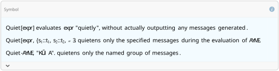

## Load FeynCalc and the necessary add-ons or other packages

This example uses a custom QCD model created with FeynRules. Please evaluate the file
FeynCalc/Examples/FeynRules/QCD/GenerateModelQCD.m before running it for the first time.

```mathematica
description = "GhGl - Gh, QCD, only UV divergences, 1-loop";
If[ $FrontEnd === Null, 
  	$FeynCalcStartupMessages = False; 
  	Print[description]; 
  ];
If[ $Notebooks === False, 
  	$FeynCalcStartupMessages = False 
  ];
LaunchKernels[4];
$LoadAddOns = {"FeynArts", "FeynHelpers"};
<< FeynCalc`
$FAVerbose = 0;
$ParallelizeFeynCalc = True; 
 
FCCheckVersion[10, 2, 0];
If[ToExpression[StringSplit[$FeynHelpersVersion, "."]][[1]] < 2, 
 	Print["You need at least FeynHelpers 2.0 to run this example."]; 
 	Abort[]; 
 ]
```

$$\text{FeynCalc }\;\text{10.2.0 (dev version, 2025-12-22 21:09:03 +01:00, fcd53f9b). For help, use the }\underline{\text{online} \;\text{documentation},}\;\text{ visit the }\underline{\text{forum}}\;\text{ and have a look at the supplied }\underline{\text{examples}.}\;\text{ The PDF-version of the manual can be downloaded }\underline{\text{here}.}$$

$$\text{If you use FeynCalc in your research, please evaluate FeynCalcHowToCite[] to learn how to cite this software.}$$

$$\text{Please keep in mind that the proper academic attribution of our work is crucial to ensure the future development of this package!}$$

$$\text{FeynArts }\;\text{3.12 (27 Mar 2025) patched for use with FeynCalc, for documentation see the }\underline{\text{manual}}\;\text{ or visit }\underline{\text{www}.\text{feynarts}.\text{de}.}$$

$$\text{If you use FeynArts in your research, please cite}$$

$$\text{ $\bullet $ T. Hahn, Comput. Phys. Commun., 140, 418-431, 2001, arXiv:hep-ph/0012260}$$

$$\text{FeynHelpers }\;\text{2.0.0 (2025-12-22 19:07:44 +01:00, c92fb9f5). For help, use the }\underline{\text{online} \;\text{documentation},}\;\text{ visit the }\underline{\text{forum}}\;\text{ and have a look at the supplied }\underline{\text{examples}.}\;\text{The PDF-version of the manual can be downloaded }\underline{\text{here}.}$$

$$\text{ If you use FeynHelpers in your research, please evaluate FeynHelpersHowToCite[] to learn how to cite this work.}$$

## Configure some options

We keep scaleless B0 functions, since otherwise the UV part would not come out right.

```mathematica
$KeepLogDivergentScalelessIntegrals = True;
```

```mathematica
FAPatch[PatchModelsOnly -> True];

(*Successfully patched FeynArts.*)
```

## Generate Feynman diagrams

Nicer typesetting

```mathematica
FCAttachTypesettingRule[mu, "\[Mu]"];
FCAttachTypesettingRule[nu, "\[Nu]"];
FCAttachTypesettingRule[rho, "\[Rho]"];
```

```mathematica
template = insertFields[createTopologies[1, 1 -> 2, 
    		ExcludeTopologies -> {Tadpoles, WFCorrections, 
      		WFCorrectionCTs, SelfEnergies}], {U[5]} -> 
    		{V[5], U[5]}, InsertionLevel -> {Particles}, 
   		Model -> FileNameJoin[{"QCD", "QCD"}], 
   		GenericModel -> FileNameJoin[{"QCD", "QCD"}]];
```

```mathematica
diags = template /. createTopologies -> CreateTopologies /. 
   	insertFields -> InsertFields;
diagsCT = template /. createTopologies -> CreateCTTopologies /. 
   	insertFields -> InsertFields;
```

```mathematica
Paint[diags, ColumnsXRows -> {2, 1}, SheetHeader -> None, 
   Numbering -> Simple, ImageSize -> {512, 256}];
```


```mathematica
Paint[diagsCT, ColumnsXRows -> {2, 1}, SheetHeader -> None, 
   Numbering -> Simple, ImageSize -> {512, 256}];
```


## Obtain the amplitudes

The 1/(2Pi)^D prefactor is implicit. We keep the full gauge dependence.

```mathematica
amp1[0] = FCFAConvert[CreateFeynAmp[DiagramExtract[diags, {1, 2}], 
   	Truncated -> True, GaugeRules -> {}, PreFactor -> 1], 
  	IncomingMomenta -> {p1}, OutgoingMomenta -> {p2, p3}, 
  	LorentzIndexNames -> {mu, nu, rho}, DropSumOver -> True, 
  	SUNIndexNames -> {a, b, c}, LoopMomenta -> {l}, UndoChiralSplittings -> True, 
  	ChangeDimension -> D,  SMP -> True, 
  	FinalSubstitutions -> {SMP["m_u"] -> SMP["m_q"]}]
```

$$\left\{-i g_s^3 l^{\nu } \;\text{p3}^{\rho } (\text{p2}-l)^{\mu } f^{a\text{Glu4}\;\text{Glu5}} f^{b\text{Glu4}\;\text{Glu6}} f^{c\text{Glu5}\;\text{Glu6}} \left(\frac{\left(1-\xi _{\text{G}}\right) (l-\text{p2}-\text{p3})^{\nu } (-l+\text{p2}+\text{p3})^{\rho }}{l^2.(l-\text{p2})^2.(l-\text{p2}-\text{p3})^4}+\frac{g^{\nu \rho }}{l^2.(l-\text{p2})^2.(l-\text{p2}-\text{p3})^2}\right),i g_s^2 \;\text{p3}^{\text{Lor5}} f^{a\text{Glu4}\;\text{Glu5}} f^{c\text{Glu5}\;\text{Glu6}} (l-\text{p2}-\text{p3})^{\nu } \left(g_s g^{\text{Lor4}\rho } (\text{p2}-l)^{\mu } f^{b\text{Glu4}\;\text{Glu6}}+g_s g^{\text{Lor4}\mu } (l-\text{p2})^{\rho } f^{b\text{Glu4}\;\text{Glu6}}+g_s l^{\text{Lor4}} g^{\mu \rho } f^{b\text{Glu4}\;\text{Glu6}}-g_s l^{\mu } g^{\text{Lor4}\rho } f^{b\text{Glu4}\;\text{Glu6}}+g_s \;\text{p2}^{\text{Lor4}} g^{\mu \rho } f^{b\text{Glu4}\;\text{Glu6}}-g_s \;\text{p2}^{\rho } g^{\text{Lor4}\mu } f^{b\text{Glu4}\;\text{Glu6}}\right) \left(\frac{\left(1-\xi _{\text{G}}\right) g^{\nu \rho } (\text{p2}-l)^{\text{Lor4}} (l-\text{p2})^{\text{Lor5}}}{l^2.(l-\text{p2})^4.(l-\text{p2}-\text{p3})^2}-\frac{\left(1-\xi _{\text{G}}\right) l^{\nu } l^{\rho } g^{\text{Lor4}\;\text{Lor5}}}{\left(l^2\right)^2.(l-\text{p2})^2.(l-\text{p2}-\text{p3})^2}+-\frac{\left(1-\xi _{\text{G}}\right){}^2 l^{\nu } l^{\rho } (\text{p2}-l)^{\text{Lor4}} (l-\text{p2})^{\text{Lor5}}}{\left(l^2\right)^2.(l-\text{p2})^4.(l-\text{p2}-\text{p3})^2}+\frac{g^{\text{Lor4}\;\text{Lor5}} g^{\nu \rho }}{l^2.(l-\text{p2})^2.(l-\text{p2}-\text{p3})^2}\right)\right\}$$

Counter-term

```mathematica
amp2[0] = FCFAConvert[CreateFeynAmp[diagsCT, 
   	Truncated -> True, GaugeRules -> {}, PreFactor -> 1], 
  	IncomingMomenta -> {p1}, OutgoingMomenta -> {p2, p3}, 
  	LorentzIndexNames -> {mu, nu, rho}, SUNIndexNames -> {a, b, c}, 
  	DropSumOver -> True, LoopMomenta -> {l}, UndoChiralSplittings -> True, 
  	ChangeDimension -> D, SMP -> True, 
  	FinalSubstitutions -> {SMP["m_u"] -> SMP["m_q"], 
    	ZA -> SMP["Z_A"], Zg -> SMP["Z_g"], Zu -> SMP["Z_u"]}]
```

$$\left\{g_s \left(-\text{p3}^{\mu }\right) f^{abc} \left(\sqrt{Z_A} Z_g Z_u-1\right)\right\}$$

## Calculate the amplitudes

### Ghost-gluon vertex

```mathematica
?Quiet
```



```mathematica
AbsoluteTiming[amp1[1] = TID[(FCE[amp1[0]] /. {-p2 - p3 -> -p1}), l, 
    	UsePaVeBasis -> True, ToPaVe -> True, FCParallelize -> True];]
```

$$\{6.80983,\text{Null}\}$$

```mathematica
amp1Div[0] = amp1[1] // Total // PaVeUVPart[#, Prefactor -> 1/(2 Pi)^D] &;
```

```mathematica
amp1Div[1] = amp1Div[0] // SUNSimplify[#, Explicit -> True] & // ReplaceAll[#, 
           	SUNTrace[x__] :> SUNTrace[x, Explicit -> True]] & // 
        	FCReplaceD[#, D -> 4 - 2 Epsilon] & // Series[#, {Epsilon, 0, 0}] & // 
      	Normal // FCHideEpsilon // SelectNotFree2[#, SMP["Delta"]] & //FCE // 
  	Collect2[#, MTD, Factoring -> Function[x, MomentumCombine[Factor[x]]]] &
```

$$\frac{\Delta  C_A \xi _{\text{G}} g_s^3 \;\text{p3}^{\mu } f^{abc}}{32 \pi ^2 (-1+4 \log (2)+4 \log (\pi )-4 \log (2 \pi ))}$$

### Counter-term

```mathematica
amp2[1] = amp2[0] // ReplaceAll[#, {SMP["Z_A"] -> 1 + alpha SMP["d_A"], 
           	SMP["Z_u"] -> 1 + alpha SMP["d_u"], 
           	SMP["Z_g"] -> 1 + alpha SMP["d_g"]}] & // Series[#, {alpha, 0, 1}] & // 
      	Normal // ReplaceAll[#, alpha -> 1] & // ExpandScalarProduct //FCE // 
  	Collect2[#, MTD, GaugeXi, Factoring -> Function[x, MomentumCombine[Factor[x]]]] &
```

$$\left\{-\frac{1}{2} g_s \;\text{p3}^{\mu } f^{abc} \left(\delta _A+2 \delta _g+2 \delta _u\right)\right\}$$

Check the cancellation of the UV divergences in the MSbar scheme. The renormalization constants are obtained from another example calculation, "Renormalization.m"

```mathematica
renormalizationConstants = {
    	SMP["d_A"] -> SMP["alpha_s"]/(4 Pi) SMP["Delta"] (1/2 CA (13/3 - GaugeXi["G"]) - 2/3 Nf), 
    	SMP["d_g"] -> ((-11*CA*SMP["alpha_s"])/(24 Pi) SMP["Delta"] + (Nf*SMP["alpha_s"])/(12*Pi) SMP["Delta"]), 
    	SMP["d_u"] -> SMP["alpha_s"]/(4 Pi) CA SMP["Delta"] (3 - GaugeXi["G"])/4 
    } /. SMP["alpha_s"] -> SMP["g_s"]^2/(4 Pi);
```

```mathematica
uvDiv[0] = ExpandScalarProduct[amp1Div[1] + amp2[1]] // Simplify
```

$$\left\{\frac{1}{32} g_s \;\text{p3}^{\mu } f^{abc} \left(-\frac{\Delta  C_A \xi _{\text{G}} g_s^2}{\pi ^2}-16 \left(\delta _A+2 \left(\delta _g+\delta _u\right)\right)\right)\right\}$$

```mathematica
uvDiv[1] = (uvDiv[0] /. renormalizationConstants) // Simplify
```

$$\{0\}$$

```mathematica
FCCompareResults[uvDiv[1], 0, 
   Text -> {"\tThe UV divergence of the ghost-gluon vertex at 1-loop is cancelled by the counter-term :", 
     "CORRECT.", "WRONG!"}, Interrupt -> {Hold[Quit[1]], Automatic}];
```

## Check the final results

```mathematica
knownResult = 
  	-I (-I SMP["g_s"] FVD[p3, mu] SUNF[a, b, c] ( SMP["g_s"]^2/(4 Pi)^2 CA*
       		GaugeXi["G"]/2 SMP["Delta"]));
FCCompareResults[PowerExpand[amp1Div[1]], knownResult, 
   Text -> {"\tCompare to Muta, Foundations of QCD, Eq. 2.5.142:", 
     "CORRECT.", "WRONG!"}, Interrupt -> {Hold[Quit[1]], Automatic}];
Print["\tCPU Time used: ", Round[N[TimeUsed[], 4], 0.001], " s."];

```mathematica

$$\text{$\backslash $tCompare to Muta, Foundations of QCD, Eq. 2.5.142:} \;\text{CORRECT.}$$

$$\text{$\backslash $tCPU Time used: }31.223\text{ s.}$$