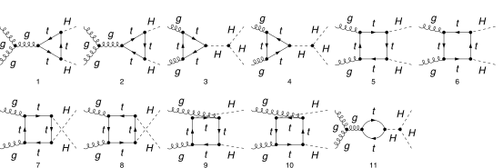

## Load FeynCalc and the necessary add-ons or other packages

```mathematica
description = "GlGl -> HH, QCD, amplitude, 1-loop";
If[ $FrontEnd === Null, 
  	$FeynCalcStartupMessages = False; 
  	Print[description]; 
  ];
If[ $Notebooks === False, 
  	$FeynCalcStartupMessages = False 
  ];
LaunchKernels[8];
$LoadAddOns = {"FeynArts", "FeynHelpers"};
<< FeynCalc`
$FAVerbose = 0;
$ParallelizeFeynCalc = True; 
 
FCCheckVersion[10, 2, 1];
If[ToExpression[StringSplit[$FeynHelpersVersion, "."]][[1]] < 2, 
 	Print["You need at least FeynHelpers 2.1 to run this example."]; 
 	Abort[]; 
 ]
```

$$\text{FeynCalc }\;\text{10.2.1 (dev version, 2026-06-17 10:56:47 +02:00, 17905d6e). For help, use the }\underline{\text{online} \;\text{documentation},}\;\text{ visit the }\underline{\text{forum}}\;\text{ and have a look at the supplied }\underline{\text{examples}.}\;\text{ The PDF-version of the manual can be downloaded }\underline{\text{here}.}$$

$$\text{If you use FeynCalc in your research, please evaluate FeynCalcHowToCite[] to learn how to cite this software.}$$

$$\text{Please keep in mind that the proper academic attribution of our work is crucial to ensure the future development of this package!}$$

$$\text{FeynArts }\;\text{3.12 (27 Mar 2025) patched for use with FeynCalc, for documentation see the }\underline{\text{manual}}\;\text{ or visit }\underline{\text{www}.\text{feynarts}.\text{de}.}$$

$$\text{If you use FeynArts in your research, please cite}$$

$$\text{ $\bullet $ T. Hahn, Comput. Phys. Commun., 140, 418-431, 2001, arXiv:hep-ph/0012260}$$

$$\text{FeynHelpers }\;\text{2.1.0 (2026-06-17 11:21:04 +02:00, 1d1a414a). For help, use the }\underline{\text{online} \;\text{documentation},}\;\text{ visit the }\underline{\text{forum}}\;\text{ and have a look at the supplied }\underline{\text{examples}.}\;\text{ The PDF-version of the manual can be downloaded }\underline{\text{here}.}$$

$$\text{ If you use FeynHelpers in your research, please evaluate FeynHelpersHowToCite[] to learn how to cite this work.}$$

## Generate Feynman diagrams

```mathematica
diags = InsertFields[CreateTopologies[1, 2 -> 2, ExcludeTopologies -> {Tadpoles}], 
    {V[5], V[5]} -> {S[1], S[1]}, InsertionLevel -> {Particles}, 
    ExcludeParticles -> {F[4], F[3, {1 | 2, _}]}, Model -> SMQCD];
```

```mathematica
Paint[diags, ColumnsXRows -> {6, 2}, SheetHeader -> False, 
   Numbering -> Simple, ImageSize -> 128 {6, 2}];
```



## Obtain the amplitudes

```mathematica
ampRaw = FCFAConvert[CreateFeynAmp[diags, PreFactor -> 1], 
     	IncomingMomenta -> {p1, p2}, OutgoingMomenta -> {-q1, -q2}, LoopMomenta -> {k}, 
     	UndoChiralSplittings -> True, ChangeDimension -> D, List -> True, SMP -> True, 
     	TransversePolarizationVectors -> {p1, p2}, 
     	DropSumOver -> False] // SMPToSymbol // ReplaceAll[#, mH -> mh] &;
```

Each of the remaining diagrams has a color matrix so that it is safe to remove SumOver symbols

```mathematica
glglToHH$Amp = ampRaw /. SumOver[__] -> 1;
```

```mathematica
processID = "glglToHHat1L";
```

## Fix the kinematics

Notice that all external momenta are incoming

```mathematica
FCClearScalarProducts[];
SetMandelstam[s, t, u, p1, p2, q1, q2, 0, 0, mh, mh];
```

## Calculate the amplitude

```mathematica
AbsoluteTiming[glglToHH$Amp1 = glglToHH$Amp // Contract[#, FCParallelize -> True] & // 
      DiracSimplify[#, FCParallelize -> True] & // SUNSimplify[#, FCParallelize -> True] &;]
```

$$\{0.836677,\text{Null}\}$$

```mathematica
glglToHH$StrName = StringReplace[ToString[Hold[glglToHH$Amp]], {"Hold[" -> "", "]" -> ""}]
```

$$\text{glglToHH\$Amp}$$

## Identify and minimize the topologies

```mathematica
{glglToHH$Amp2, glglToHH$Topos} = FCLoopFindTopologies[glglToHH$Amp1, {k}, FCParallelize -> True, 
    Names -> glglToHH1Ltopo, FinalSubstitutions -> {s -> 2 mh^2 - t - u}];
```

$$\text{FCLoopFindTopologies: Number of the initial candidate topologies: }4$$

$$\text{FCLoopFindTopologies: Number of the identified unique topologies: }3$$

$$\text{FCLoopFindTopologies: Number of the preferred topologies among the unique topologies: }0$$

$$\text{FCLoopFindTopologies: Number of the identified subtopologies: }1$$

$$\text{FCLoopFindTopologies: }\;\text{Final number of found topologies: }3$$

```mathematica
AbsoluteTiming[glglToHH$Amp3 = FCLoopTensorReduce[glglToHH$Amp2, glglToHH$Topos, FCParallelize -> True];]
```

$$\{2.77738,\text{Null}\}$$

```mathematica
AbsoluteTiming[{glglToHH$Amp4, glglToHH$Topos2} = FCLoopRewriteOverdeterminedTopologies[glglToHH$Amp3, 
     glglToHH$Topos, FCParallelize -> True];]
```

$$\text{FCLoopRewriteIncompleteTopologies: }\;\text{No overdetermined topologies detected.}$$

$$\{0.704231,\text{Null}\}$$

```mathematica
AbsoluteTiming[{glglToHH$Amp5, glglToHH$Topos3} = FCLoopRewriteIncompleteTopologies[glglToHH$Amp4, 
     glglToHH$Topos2, FCParallelize -> True];]
```

$$\text{FCLoopRewriteIncompleteTopologies: }\;\text{No incomplete topologies detected.}$$

$$\{0.666513,\text{Null}\}$$

```mathematica
glglToHH$Subtopos = FCLoopFindSubtopologies[glglToHH$Topos3, FCParallelize -> False, Names -> R];
```

$$\text{FCLoopFindSubtopologies: }\;\text{Final number of found subtopologies: }23$$

```mathematica
glglToHH$TopoMappings = FCLoopFindTopologyMappings[glglToHH$Topos3, PreferredTopologies -> glglToHH$Subtopos, 
    FCParallelize -> True];
```

$$\text{FCLoopFindIntegralMappings: }\;\text{Final number of found mappings: }1$$

$$\text{FCLoopFindTopologyMappings: }\;\text{Found }0\text{ mapping relations }$$

$$\text{FCLoopFindTopologyMappings: }\;\text{Final number of independent topologies: }3$$

```mathematica
AbsoluteTiming[glglToHH$AmpGLI = FCLoopApplyTopologyMappings[glglToHH$Amp5, glglToHH$TopoMappings, FCParallelize -> True];]
```

$$\{17.3378,\text{Null}\}$$

```mathematica
glglToHH$GLIs = Cases2[glglToHH$AmpGLI, GLI];
```

```mathematica
glglToHH$dir = FileNameJoin[{$TemporaryDirectory, "Reduction-" <> glglToHH$StrName <> "-1L"}];
Quiet[CreateDirectory[glglToHH$dir]];
```

```mathematica
tables = FIREReduceLoopIntegrals[glglToHH$GLIs, glglToHH$TopoMappings, glglToHH$dir];
```

$$\text{FIREPrepareStartFile: }\;\text{Created }3\text{ script files.}$$

```mathematica
(*Creating config file (1/3) for glglToHH1Ltopo1 (glglToHH1Ltopo1.config)... done.
Creating config file (2/3) for glglToHH1Ltopo2 (glglToHH1Ltopo2.config)... done.
Creating config file (3/3) for glglToHH1Ltopo3 (glglToHH1Ltopo3.config)... done.

glglToHH1Ltopo1, number of loop integrals: 15
glglToHH1Ltopo2, number of loop integrals: 32
glglToHH1Ltopo3, number of loop integrals: 32

Creating LiteRed files (1/3) for glglToHH1Ltopo1... done, timing: 5.128
Creating LiteRed files (2/3) for glglToHH1Ltopo2... done, timing: 5.159
Creating LiteRed files (3/3) for glglToHH1Ltopo3... done, timing: 4.905

Creating FIRE files (1/3) for glglToHH1Ltopo1... done, timing: 5.912
Creating FIRE files (2/3) for glglToHH1Ltopo2... done, timing: 6.376
Creating FIRE files (3/3) for glglToHH1Ltopo3... done, timing: 6.408

Running reduction (1/3) for glglToHH1Ltopo1... done, timing: 0.8466
Running reduction (2/3) for glglToHH1Ltopo2... done, timing: 4.181
Running reduction (3/3) for glglToHH1Ltopo3... done, timing: 4.118

Importing reduction tables (1/3) for FileBaseName[glglToHH1Ltopo1]... done.
Importing reduction tables (2/3) for FileBaseName[glglToHH1Ltopo2]... done.
Importing reduction tables (3/3) for FileBaseName[glglToHH1Ltopo3]... done.
*)
```

$$\text{FIRECreateConfigFile: }\;\text{Created }3\text{ .config files.}$$

$$\text{FIRECreateIntegralFile: }\;\text{Created }3\text{ integral files.}$$


$$\text{FIRECreateLiteRedFiles: }\;\text{Run }3\text{ script files.}$$

$$\text{FIRECreateStartFile: }\;\text{Run }3\text{ script files.}$$

$$\text{FIRERunReduction: }\;\text{Reduced }3\text{ topologies.}$$

$$\text{FIREImportResults: }\;\text{Imported }3\text{ reduction tables.}$$

```mathematica
masters = Cases2[Last /@ tables, GLI];
```

```mathematica
AbsoluteTiming[intMappings = FCLoopFindIntegralMappings[masters, glglToHH$TopoMappings, FCParallelize -> True, FinalSubstitutions -> {s -> 2 mh^2 - t - u}];]
```

$$\text{FCLoopFindIntegralMappings: }\;\text{Final number of found mappings: }11$$

$$\{0.341766,\text{Null}\}$$

```mathematica
AbsoluteTiming[glglToHH$resPreFinal1 = (glglToHH$AmpGLI /. Dispatch[tables] /. Dispatch[intMappings[[1]]]) // FeynAmpDenominatorExplicit[#, FCParallelize -> True] &;]
```

$$\{13.2846,\text{Null}\}$$

```mathematica
AbsoluteTiming[glglToHH$resPreFinal2 = Collect2[glglToHH$resPreFinal1, GLI, FCParallelize -> True];]
```

$$\{20.2646,\text{Null}\}$$

```mathematica
AbsoluteTiming[glglToHH$resPreFinal3 = Collect2[glglToHH$resPreFinal2, GLI, Factoring -> Function[x, Factor2[TrickMandelstam[x, {s, t, u, 2 mh^2}]]], FCParallelize -> True];]
```

$$\{19.703,\text{Null}\}$$

```mathematica
AbsoluteTiming[glglToHH$resFinal = Collect2[Total[glglToHH$resPreFinal3], GLI, Factoring -> Function[x, Factor2[TrickMandelstam[x, {s, t, u, 2 mh^2}]]], FCParallelize -> True];]
```

$$\{6.08832,\text{Null}\}$$

Check gauge invariance of the amplitude

```mathematica
polVec1 = Pair[LorentzIndex[mu, D], Momentum[Polarization[p1, I, Transversality -> True], D]];
rulePolVec1 = Contract[(FVD[p2, mu] == -FVD[q1 + q2 + p1, mu]) polVec1] /. Equal -> Rule // ExpandScalarProduct;
```

```mathematica
polVec2 = Pair[LorentzIndex[mu, D], Momentum[Polarization[p2, I, Transversality -> True], D]];
rulePolVec2 = Contract[(FVD[p1, mu] == -FVD[q1 + q2 + p2, mu]) polVec2] /. Equal -> Rule // ExpandScalarProduct;
```

```mathematica
rulePolVec = {rulePolVec1, rulePolVec2}
```

$$\{\text{p2}\cdot \varepsilon (\text{p1})\to -(\text{q1}\cdot \varepsilon (\text{p1}))-\text{q2}\cdot \varepsilon (\text{p1}),\text{p1}\cdot \varepsilon (\text{p2})\to -(\text{q1}\cdot \varepsilon (\text{p2}))-\text{q2}\cdot \varepsilon (\text{p2})\}$$

```mathematica
AbsoluteTiming[check1 = TrickMandelstam[glglToHH$resPreFinal3 /. Momentum[Polarization[p2, ___], D] :> Momentum[p2, D] /. rulePolVec, {s, t, u, 2 mh^2}, FCParallelize -> True];]
```

$$\{3.81445,\text{Null}\}$$

```mathematica
AbsoluteTiming[check2 = Collect2[Total[check1], GLI, FCParallelize -> True] // TrickMandelstam[#, {s, t, u, 2 mh^2}] &;]
```

$$\{0.089635,\text{Null}\}$$

```mathematica
check2
```

$$0$$

## Check the final results

We take the literature result from  Eqs. 2 and 3 of the Glover and van der Bij paper, CERN-TH-4934/87,  https://cds.cern.ch/record/183945/files/198802013.pdf

```mathematica
pT2 = (u t - mh^4)/s;
Aten[mu_, nu_] := MT[mu, nu] - FV[p1, nu] FV[p2, mu]/SPD[p1, p2];
Bten[mu_, nu_] := MT[mu, nu] + mh^2 FV[p1, nu] FV[p2, mu]/(pT2 SPD[p1, p2]) - 2 SPD[p1, q1] FV[p2, mu] FV[q1, nu]/(pT2 SPD[p1, p2]) - 
    2 SPD[p2, q1] FV[p1, nu] FV[q1, mu]/(pT2 SPD[p1, p2]) + 2 FV[q1, mu] FV[q1, nu]/pT2;
```

```mathematica
Dfun[q1_, q2_, p3_] := TrickMandelstam[1/(I Pi^2) ToPaVe[FAD[{k, mt}, {k + q1, mt}, {k + q1 + q2, mt}, 
        {k + q1 + q2 + p3, mt}], k] // PaVeOrder, {s, t, u, 2 mh^2}];
```

```mathematica
Cfun[q1_, q2_] := TrickMandelstam[1/(I Pi^2) ToPaVe[FAD[{k, mt}, {k + q1, mt}, 
        {k + q1 + q2, mt}], k] // PaVeOrder, {s, t, u, 2 mh^2}];
```

```mathematica
litResGauge1Tri = 12 mh^2 mt^2/(s - mh^2) (2 + (4 mt^2 - s) Cfun[p1, p2]);
```

```mathematica
litResGauge1Box = 4 mt^2 (
     mt^2 (8 mt^2 - s - 2 mh^2) (Dfun[p1, p2, q1] + Dfun[p2, p1, q1] +Dfun[p1, q1, p2]) 
      + ( u t - mh^4)/s (4 mt^2 - mh^2) Dfun[p1, q1, p2] + 2 + 4 mt^2 Cfun[p1, p2] + 
      2/s (mh^2 - 4 mt^2) (   (t - mh^2) Cfun[p1, q1] + (u - mh^2) Cfun[p2, q1]  ) 
    );
```

```mathematica
litResGauge2Box = 2 mt^2 (
     2 (8 mt^2 + s - 2 mh^2)*( mt^2 (Dfun[p1, p2, q1] + Dfun[p2, p1, q1] + Dfun[p1, q1, p2]) - Cfun[q1, q2]) 
      - 2 (s Cfun[p1, p2] + (t - mh^2) Cfun[p1, q1] + (u - mh^2) Cfun[p2, q1]  ) + 
      1/(u t - mh^4) (
        s u (8 u mt^2 - u^2 - mh^4) Dfun[p1, p2, q1] + 
         s t (8 t mt^2 - t^2 - mh^4) Dfun[p2, p1, q1] + 
         (8 mt^2 + s - 2 mh^2) (
           s (s - 2 mh^2) Cfun[p1, p2] + s (s - 4 mh^2) Cfun[q1, q2] +
            2 t (mh^2 - t) Cfun[p1, q1] + 2 u (mh^2 - u) Cfun[p2, q1]) 
       ) 
    );
```

```mathematica
litAmpRaw = Contract[((litResGauge1Box + litResGauge1Tri) Aten[mu, nu] +  litResGauge2Box Bten[mu, nu]) Pair[LorentzIndex[mu, D], 
       Momentum[Polarization[p1, I, Transversality -> True], D]] Pair[LorentzIndex[nu, D], Momentum[Polarization[p2, I, Transversality -> True], D]]] // ChangeDimension[#, 4] &;
```

```mathematica
litAmp = Collect2[ToPaVe2[litAmpRaw], PaVe, Factoring -> Function[x, TrickMandelstam[x, {s, t, u, 2 mh^2}]]];
```

```mathematica
mastersNew = Cases2[glglToHH$resFinal, GLI];
```

```mathematica
mastersNewPaVe = ToPaVe2[ToPaVe[FDS[FCLoopFromGLI[mastersNew, glglToHH$TopoMappings[[2]]], k], k] // TrickMandelstam[#, {s, t, u, 2 mh^2}] &]
```

$$\left\{i \pi ^2 \;\text{C}_0\left(0,\text{mh}^2,t,\text{mt}^2,\text{mt}^2,\text{mt}^2\right),i \pi ^2 \;\text{C}_0\left(0,\text{mh}^2,u,\text{mt}^2,\text{mt}^2,\text{mt}^2\right),i \pi ^2 \;\text{D}_0\left(0,\text{mh}^2,0,\text{mh}^2,t,u,\text{mt}^2,\text{mt}^2,\text{mt}^2,\text{mt}^2\right),i \pi ^2 \;\text{B}_0\left(s,\text{mt}^2,\text{mt}^2\right),i \pi ^2 \;\text{C}_0\left(\text{mh}^2,\text{mh}^2,s,\text{mt}^2,\text{mt}^2,\text{mt}^2\right),i \pi ^2 \;\text{C}_0\left(0,0,s,\text{mt}^2,\text{mt}^2,\text{mt}^2\right),i \pi ^2 \;\text{D}_0\left(0,0,\text{mh}^2,\text{mh}^2,s,t,\text{mt}^2,\text{mt}^2,\text{mt}^2,\text{mt}^2\right),i \pi ^2 \;\text{D}_0\left(0,0,\text{mh}^2,\text{mh}^2,s,u,\text{mt}^2,\text{mt}^2,\text{mt}^2,\text{mt}^2\right)\right\}$$

```mathematica
prefLit = ((1/2*I)*mW^2)/(alphas*alphaW*Pi^4*SUNDelta[SUNIndex[Glu1], SUNIndex[Glu2]]);
```

```mathematica
ruleCouplings = {gs^2 -> 4*alphas*Pi, e -> gW*sinW, gW^2 -> 4*alphaW*Pi};
```

```mathematica
res$Check1 = Collect2[PaVeLimitTo4[prefLit glglToHH$resFinal //. ruleCouplings /. Thread[Rule[mastersNew, mastersNewPaVe]]] // ToPaVe2, PaVe];
```

```mathematica
diff = Collect2[ToPaVe2[res$Check1 - litAmp ] /. ChangeDimension[rulePolVec, 4], PaVe, Factoring -> Function[x, TrickMandelstam[x, {s, t, u, 2 mh^2}]]]
```

$$0$$

```mathematica
knownResult = 0;
FCCompareResults[diff, knownResult, 
   Text -> {"\tCompare to Glover and van Der Bij, CERN-TH-4934/87, Eqs. 2-3:", 
     "CORRECT.", "WRONG!"}, Interrupt -> {Hold[Quit[1]], Automatic}];
Print["\tCPU Time used: ", Round[N[TimeUsed[], 4], 0.001], " s."];

```mathematica

$$\text{$\backslash $tCompare to Glover and van Der Bij, CERN-TH-4934/87, Eqs. 2-3:} \;\text{CORRECT.}$$

$$\text{$\backslash $tCPU Time used: }106.932\text{ s.}$$