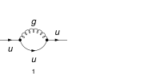
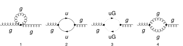
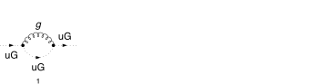
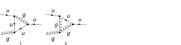
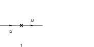
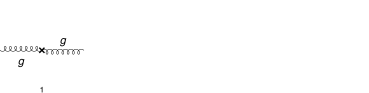
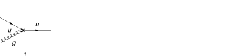

## Load FeynCalc and the necessary add-ons or other packages

This example uses a custom QCD model created with FeynRules.

```mathematica
description = "Renormalization, QCD, MSbar, massless, 1-loop";
If[ $FrontEnd === Null, 
  	$FeynCalcStartupMessages = False; 
  	Print[description]; 
  ];
If[ $Notebooks === False, 
  	$FeynCalcStartupMessages = False 
  ];
LaunchKernels[4];
$LoadAddOns = {"FeynArts", "FeynHelpers"};
<< FeynCalc`
$FAVerbose = 0;
$ParallelizeFeynCalc = True; 
 
FCCheckVersion[10, 2, 0];
If[ToExpression[StringSplit[$FeynHelpersVersion, "."]][[1]] < 2, 
 	Print["You need at least FeynHelpers 2.0 to run this example."]; 
 	Abort[]; 
 ]
```

$$\text{FeynCalc }\;\text{10.2.0 (dev version, 2026-05-18 14:09:14 +02:00, 9ab9d838). For help, use the }\underline{\text{online} \;\text{documentation},}\;\text{ visit the }\underline{\text{forum}}\;\text{ and have a look at the supplied }\underline{\text{examples}.}\;\text{ The PDF-version of the manual can be downloaded }\underline{\text{here}.}$$

$$\text{If you use FeynCalc in your research, please evaluate FeynCalcHowToCite[] to learn how to cite this software.}$$

$$\text{Please keep in mind that the proper academic attribution of our work is crucial to ensure the future development of this package!}$$

$$\text{FeynArts }\;\text{3.12 (27 Mar 2025) patched for use with FeynCalc, for documentation see the }\underline{\text{manual}}\;\text{ or visit }\underline{\text{www}.\text{feynarts}.\text{de}.}$$

$$\text{If you use FeynArts in your research, please cite}$$

$$\text{ $\bullet $ T. Hahn, Comput. Phys. Commun., 140, 418-431, 2001, arXiv:hep-ph/0012260}$$

$$\text{FeynHelpers }\;\text{2.0.0 (2026-02-05 17:03:01 +02:00, 5db84fbb). For help, use the }\underline{\text{online} \;\text{documentation},}\;\text{ visit the }\underline{\text{forum}}\;\text{ and have a look at the supplied }\underline{\text{examples}.}\;\text{ The PDF-version of the manual can be downloaded }\underline{\text{here}.}$$

$$\text{ If you use FeynHelpers in your research, please evaluate FeynHelpersHowToCite[] to learn how to cite this work.}$$

## Configure some options

```mathematica
modelDir = FileNameJoin[{$UserBaseDirectory, "Applications", "FeynCalc", "Examples", "Models", "QCD"}];
```

```mathematica
FAPatch[PatchModelsOnly -> True, FAModelsDirectory -> modelDir];

(*Successfully patched FeynArts.*)
```

Here we define all Z-factors for renormalization constants present in the Lagrangian

```mathematica
renConstants = Zpsi | ZA | ZAmxt | Zu | Zumxt | Zg | Zxi
```

$$\text{Zpsi}|\text{ZA}|\text{ZAmxt}|\text{Zu}|\text{Zumxt}|\text{Zg}|\text{Zxi}$$

## Generate Feynman diagrams

Nicer typesetting

```mathematica
FCAttachTypesettingRule[mu, "\[Mu]"];
FCAttachTypesettingRule[nu, "\[Nu]"];
FCAttachTypesettingRule[rho, "\[Rho]"];
FCAttachTypesettingRule[si, "\[Sigma]"];
```

```mathematica
diagQuarkSE = InsertFields[CreateTopologies[1, 1 -> 1, 
     ExcludeTopologies -> {Tadpoles, WFCorrections, WFCorrectionCTs}], {F[3, {1}]} -> {F[3, {1}]}, 
    InsertionLevel -> {Particles}, Model -> FileNameJoin[{modelDir, "QCD"}], 
    GenericModel -> FileNameJoin[{modelDir, "QCD"}], ExcludeParticles -> {F[3 | 4, {2 | 3}], F[4, {1}]}];
```

```mathematica
diagGluonSE = InsertFields[CreateTopologies[1, 1 -> 1, 
     ExcludeTopologies -> {Tadpoles, WFCorrections, WFCorrectionCTs}], {V[5]} -> {V[5]}, 
    InsertionLevel -> {Particles}, Model -> FileNameJoin[{modelDir, "QCD"}], 
    GenericModel -> FileNameJoin[{modelDir, "QCD"}], ExcludeParticles -> {F[3 | 4, {2 | 3}], F[4, {1}]}];
```

```mathematica
diagGhostSE = InsertFields[CreateTopologies[1, 1 -> 1, 
     ExcludeTopologies -> {Tadpoles, WFCorrections, WFCorrectionCTs}], {U[5]} -> {U[5]}, 
    InsertionLevel -> {Particles}, Model -> FileNameJoin[{modelDir, "QCD"}], 
    GenericModel -> FileNameJoin[{modelDir, "QCD"}], ExcludeParticles -> {F[3 | 4, {2 | 3}], F[4, {1}]}];
```

```mathematica
diagquarkGluonVTX = InsertFields[CreateTopologies[1, 2 -> 1, 
     ExcludeTopologies -> {Tadpoles, WFCorrections, WFCorrectionCTs}], {F[3, {1}], V[5]} -> {F[3, {1}]}, 
    InsertionLevel -> {Particles}, Model -> FileNameJoin[{modelDir, "QCD"}], 
    GenericModel -> FileNameJoin[{modelDir, "QCD"}], ExcludeParticles -> {F[3 | 4, {2 | 3}], F[4, {1}]}];
```

```mathematica
diagQuarkSECT = InsertFields[CreateCTTopologies[1, 1 -> 1, 
     ExcludeTopologies -> {Tadpoles, WFCorrections, WFCorrectionCTs}], {F[3, {1}]} -> {F[3, {1}]}, 
    InsertionLevel -> {Particles}, Model -> FileNameJoin[{modelDir, "QCD"}], 
    GenericModel -> FileNameJoin[{modelDir, "QCD"}], ExcludeParticles -> {F[3 | 4, {2 | 3}], F[4, {1}]}];
```

```mathematica
diagGluonSECT = InsertFields[CreateCTTopologies[1, 1 -> 1, 
     ExcludeTopologies -> {Tadpoles, WFCorrections, WFCorrectionCTs}], {V[5]} -> {V[5]}, 
    InsertionLevel -> {Particles}, Model -> FileNameJoin[{modelDir, "QCD"}], 
    GenericModel -> FileNameJoin[{modelDir, "QCD"}], ExcludeParticles -> {F[3 | 4, {2 | 3}], F[4, {1}]}];
```

```mathematica
diagGhostSECT = InsertFields[CreateCTTopologies[1, 1 -> 1, 
     ExcludeTopologies -> {Tadpoles, WFCorrections, WFCorrectionCTs}], {U[5]} -> {U[5]}, 
    InsertionLevel -> {Particles}, Model -> FileNameJoin[{modelDir, "QCD"}], 
    GenericModel -> FileNameJoin[{modelDir, "QCD"}], ExcludeParticles -> {F[3 | 4, {2 | 3}], F[4, {1}]}];
```

```mathematica
diagquarkGluonVTXCT = InsertFields[CreateCTTopologies[1, 2 -> 1, 
     ExcludeTopologies -> {Tadpoles, WFCorrections, WFCorrectionCTs}], {F[3, {1}], V[5]} -> {F[3, {1}]}, 
    InsertionLevel -> {Particles}, Model -> FileNameJoin[{modelDir, "QCD"}], 
    GenericModel -> FileNameJoin[{modelDir, "QCD"}], ExcludeParticles -> {F[3 | 4, {2 | 3}], F[4, {1}]}];
```

Self-energy and vertex diagrams

```mathematica
Paint[diagQuarkSE, ColumnsXRows -> {2, 1}, SheetHeader -> None, 
   Numbering -> Simple, ImageSize -> 128 {2, 1}];
Paint[diagGluonSE, ColumnsXRows -> {4, 1}, SheetHeader -> None, 
   Numbering -> Simple, ImageSize -> 128 {4, 1}];
Paint[diagGhostSE, ColumnsXRows -> {4, 1}, SheetHeader -> None, 
   Numbering -> Simple, ImageSize -> 128 {4, 1}];
Paint[diagquarkGluonVTX, ColumnsXRows -> {4, 1}, SheetHeader -> None, 
   Numbering -> Simple, ImageSize -> 128 {4, 1}];
```









Counter-term diagrams

```mathematica
Paint[diagQuarkSECT, ColumnsXRows -> {2, 1}, SheetHeader -> None, 
   Numbering -> Simple, ImageSize -> 128 {2, 1}];
Paint[diagGluonSECT, ColumnsXRows -> {4, 1}, SheetHeader -> None, 
   Numbering -> Simple, ImageSize -> 128 {4, 1}];
Paint[diagGhostSECT, ColumnsXRows -> {4, 1}, SheetHeader -> None, 
   Numbering -> Simple, ImageSize -> 128 {4, 1}];
Paint[diagquarkGluonVTXCT, ColumnsXRows -> {4, 1}, SheetHeader -> None, 
   Numbering -> Simple, ImageSize -> 128 {4, 1}];
```








## Master integrals

The only required masters are 1-loop tadpoles


```mathematica
tadpoleMaster = Get[FileNameJoin[{$FeynCalcDirectory, "Examples", "MasterIntegrals","Tadpoles", "tad1LxFx1x1xxEp999x.m"}]];
```

```mathematica
tadpoleMaster1 = tadpoleMaster /. m1 -> mq /. tad1LxFx1x1xxEp999x -> "tad1Lv1";
tadpoleMaster2 = tadpoleMaster /. m1 -> mxt /. tad1LxFx1x1xxEp999x -> "tad1Lv2";
```

```mathematica
tadpoleMaster1
```

$$\left\{G^{\text{tad1Lv1}}(1)\to -e^{\gamma  \;\text{ep}} \left(\text{mq}^2\right)^{1-\text{ep}} \Gamma (\text{ep}-1),\left\{\text{FCTopology}\left(\text{tad1Lv1},\left\{\frac{1}{(\text{k1}^2-\text{mq}^2+i \eta )}\right\},\{\text{k1}\},\{\},\{\},\{\}\right)\right\}\right\}$$

```mathematica
tadpoleMaster2
```

$$\left\{G^{\text{tad1Lv2}}(1)\to -e^{\gamma  \;\text{ep}} \left(\text{mxt}^2\right)^{1-\text{ep}} \Gamma (\text{ep}-1),\left\{\text{FCTopology}\left(\text{tad1Lv2},\left\{\frac{1}{(\text{k1}^2-\text{mxt}^2+i \eta )}\right\},\{\text{k1}\},\{\},\{\},\{\}\right)\right\}\right\}$$

## Obtain the amplitudes

```mathematica
{quarkSE$RawAmp, gluonSE$RawAmp, ghostSE$RawAmp, quarkSECT$RawAmp, gluonSECT$RawAmp, ghostSECT$RawAmp} = 
   FCFAConvert[CreateFeynAmp[#, Truncated -> True, 
      	GaugeRules -> {}, PreFactor -> 1], 
     	IncomingMomenta -> {p}, OutgoingMomenta -> {p}, 
     	LorentzIndexNames -> {mu, nu}, DropSumOver -> True, 
     	LoopMomenta -> {k}, UndoChiralSplittings -> True, 
     	ChangeDimension -> D, SMP -> True, 
     	FinalSubstitutions -> {SMP["m_u"] -> mq, SMP["g_s"] -> 4 Pi Sqrt[as4]}] & /@ {
    	diagQuarkSE, diagGluonSE, diagGhostSE, diagQuarkSECT, diagGluonSECT, diagGhostSECT};
```

```mathematica
{quarkGluonVTX$RawAmp, quarkGluonVTXCT$RawAmp} = 
   FCFAConvert[CreateFeynAmp[#, Truncated -> True, 
      	GaugeRules -> {}, PreFactor -> 1], 
     	IncomingMomenta -> {p1, p2}, OutgoingMomenta -> {q}, 
     	LorentzIndexNames -> {mu, nu}, DropSumOver -> True, 
     	LoopMomenta -> {k}, UndoChiralSplittings -> True, 
     	ChangeDimension -> D, SMP -> True, 
     	FinalSubstitutions -> {SMP["m_u"] -> mq, SMP["g_s"] -> 4 Pi Sqrt[as4]}] & /@ {
    	diagquarkGluonVTX, diagquarkGluonVTXCT 
    	};
```

## Calculate the amplitudes

Infrared rearrangement works both for massive and massless quarks. However, in both cases we get different renormalization constants for the "gluon mass".
This is why both calculations are needed if we want to reuse these results at higher loops orders.

### Quark self-energy

The 1-loop quark self-energy has superficial degree of divergence equal to 1

```mathematica
FCClearScalarProducts[];
divDegree = 1;
aux1 = FCLoopGetFeynAmpDenominators[quarkSE$RawAmp /. mq -> 0, {k}, denHead, Momentum -> {p}, "Massless" -> True];
aux2 = FCLoopAddAuxiliaryMass[aux1[[2]], {k}, -mxt^2, 0, Head -> denHead]
```

$$\left\{\text{denHead}\left(\frac{1}{(k^2+i \eta )}\right)\to \frac{1}{(k^2-\text{mxt}^2+i \eta )},\text{denHead}\left(\frac{1}{((k-p)^2+i \eta )}\right)\to \frac{1}{((k-p)^2-\text{mxt}^2+i \eta )}\right\}$$

```mathematica
quarkSE$StrName = StringReplace[ToString[Hold[quarkSE$Amp]], {"Hold[" -> "", "]" -> ""}]
```

$$\text{quarkSE\$Amp}$$

```mathematica
AbsoluteTiming[quarkSE$Amp = (aux1[[1]] /. aux2) // Contract[#, FCParallelize -> True] & // 
      SUNSimplify[#, FCParallelize -> True] & // DiracSimplify[#, FCParallelize -> True] &;]
```

$$\{0.134157,\text{Null}\}$$

flagCheck is a safety flag to ensure that higher order terms in p (higher than the divergence degree) do not  contribute to the poles

```mathematica
AbsoluteTiming[quarkSE$Amp1 = Collect2[quarkSE$Amp, p, IsolateNames -> KK];]
AbsoluteTiming[quarkSE$Amp2 = FourSeries[quarkSE$Amp1, {p, 0, divDegree + 1}, Last -> flagCheck, FCParallelize -> True];]
AbsoluteTiming[quarkSE$Amp3 = Collect2[FRH[quarkSE$Amp2], FeynAmpDenominator, FCParallelize -> True];]
```

$$\{0.037224,\text{Null}\}$$

$$\{0.094642,\text{Null}\}$$

$$\{0.037072,\text{Null}\}$$

The rest of the calculation follows the standard multiloop template

```mathematica
FCClearScalarProducts[];
SPD[p] = pp;
```

```mathematica
{quarkSE$Amp4, quarkSE$Topos} = FCLoopFindTopologies[quarkSE$Amp3, {k}, FCParallelize -> True, 
    FCLoopBasisOverdeterminedQ -> True, FinalSubstitutions -> {Hold[SPD][p] -> pp}, Names -> quarkSEtopo];
```

$$\text{FCLoopFindTopologies: Number of the initial candidate topologies: }1$$

$$\text{FCLoopFindTopologies: Number of the identified unique topologies: }1$$

$$\text{FCLoopFindTopologies: Number of the preferred topologies among the unique topologies: }0$$

$$\text{FCLoopFindTopologies: Number of the identified subtopologies: }0$$

$$\text{FCLoopFindTopologyMappings: }\;\text{Final number of found topologies: }1$$

```mathematica
FCReloadFunctionFromFile[FCLoopTensorReduce]
```

```mathematica
AbsoluteTiming[quarkSE$Amp5 = FCLoopTensorReduce[quarkSE$Amp4, quarkSE$Topos, FCParallelize -> True];]
```

$$\{0.313697,\text{Null}\}$$

```mathematica
{quarkSE$Amp6, quarkSE$Topos2} = FCLoopRewriteOverdeterminedTopologies[quarkSE$Amp5, quarkSE$Topos];
```

$$\text{FCLoopRewriteIncompleteTopologies: }\;\text{No overdetermined topologies detected.}$$

```mathematica
quarkSE$SubTopos = FCLoopFindSubtopologies[quarkSE$Topos2, Flatten -> True, Remove -> True]
```

$$\{\}$$

```mathematica
{quarkSE$TopoMappings, quarkSE$FinalTopos} = FCLoopFindTopologyMappings[quarkSE$Topos2, PreferredTopologies -> quarkSE$SubTopos];
```

$$\text{FCLoopFindTopologyMappings: }\;\text{Found }0\text{ mapping relations }$$

$$\text{FCLoopFindTopologyMappings: }\;\text{Final number of independent topologies: }1$$

```mathematica
quarkSE$AmpGLI = FCLoopApplyTopologyMappings[quarkSE$Amp6, {quarkSE$TopoMappings, quarkSE$FinalTopos}, FCParallelize -> True];
```

```mathematica
quarkSE$GLIs = Cases2[quarkSE$AmpGLI, GLI];
```

```mathematica
quarkSE$dir = FileNameJoin[{$TemporaryDirectory, "Reduction-" <> quarkSE$StrName <> "-1L"}];
Quiet[CreateDirectory[quarkSE$dir]];
```

```mathematica
KiraCreateJobFile[quarkSE$FinalTopos, quarkSE$GLIs, quarkSE$dir]
```

$$\{\text{/tmp/Reduction-quarkSE\$Amp-1L/quarkSEtopo1/job.yaml}\}$$

```mathematica
KiraCreateIntegralFile[quarkSE$GLIs, quarkSE$FinalTopos, quarkSE$dir]
KiraCreateConfigFiles[quarkSE$FinalTopos, quarkSE$GLIs, quarkSE$dir, 
  KiraMassDimensions -> {pp -> 2, mq -> 1, mxt -> 1}]
```

$$\text{KiraCreateIntegralFile: Number of loop integrals: }3$$

$$\{\text{/tmp/Reduction-quarkSE\$Amp-1L/quarkSEtopo1/KiraLoopIntegrals}\}$$

$$\left(
\begin{array}{cc}
 \;\text{/tmp/Reduction-quarkSE\$Amp-1L/quarkSEtopo1/config/integralfamilies.yaml} & \;\text{/tmp/Reduction-quarkSE\$Amp-1L/quarkSEtopo1/config/kinematics.yaml} \\
\end{array}
\right)$$

```mathematica
KiraRunReduction[quarkSE$dir, quarkSE$FinalTopos, 
  KiraBinaryPath -> FileNameJoin[{$HomeDirectory, ".local", "bin", "kira"}], 
  KiraFermatPath -> FileNameJoin[{$HomeDirectory, "bin", "ferl64", "fer64"}]]
```

$$\{\text{True}\}$$

```mathematica
quarkSE$ReductionTables = KiraImportResults[quarkSE$FinalTopos, quarkSE$dir] // Flatten;
```

```mathematica
quarkSE$resPreFinal = Collect2[Total[quarkSE$AmpGLI /. Dispatch[quarkSE$ReductionTables]] // FeynAmpDenominatorExplicit, GLI, 
    GaugeXi, flagCheck, D, DiracGamma, FCParallelize -> True];
```

```mathematica
quarkSE$masters = Cases2[quarkSE$resPreFinal, GLI];
```

```mathematica
quarkSE$MIMappings = FCLoopFindIntegralMappings[quarkSE$masters, Join[tadpoleMaster1[[2]], tadpoleMaster2[[2]], 
    quarkSE$FinalTopos], PreferredIntegrals -> {tadpoleMaster1[[1]][[1]], tadpoleMaster2[[1]][[1]]}]
```

$$\left(
\begin{array}{c}
 G^{\text{quarkSEtopo1}}(1)\to G^{\text{tad1Lv2}}(1) \\
 G^{\text{tad1Lv2}}(1) \\
\end{array}
\right)$$

Our master integrals are calculated using the standard multiloop normalization. To convert it back to the textbook normalization
we need to multiply by I*(4 Pi)^(ep-2)

```mathematica
quarkSE$resFinal = Collect2[quarkSE$resPreFinal, D, GLI, IsolateNames -> KK] // FCReplaceD[#, D -> 4 - 2 ep] & // 
         ReplaceAll[#, quarkSE$MIMappings[[1]]] & // ReplaceAll[#, {tadpoleMaster1[[1]], tadpoleMaster2[[1]]}] & // 
       Collect2[#, ep, IsolateNames -> KK2] & // Series[(I*(4*Pi)^(-2 + ep)) #, {ep, 0, -1}] & // Normal // FRH //Collect2[#, DiracGamma] &
```

$$\frac{i \;\text{as4} C_F \xi _{\text{G}} \delta _{\text{Col1}\;\text{Col2}} \gamma \cdot p}{\text{ep}}$$

```mathematica
quarkSE$RenConstants = (quarkSE$resFinal + Total[quarkSECT$RawAmp /. mq -> 0]) // ReplaceRepeated[#, {
          	(h : renConstants) :> 1 + alpha as4 rc[ToExpression["del" <> ToString[h]], 1]}] & // 
      	Series[#, {alpha, 0, 1}] & // Normal // 
    	ReplaceAll[#, alpha -> 1] & // Collect2[#, DiracGamma] & // 
  	FCMatchSolve[#, {ep, CF, DiracGamma, mq, mxt, SUNDelta, SUNFDelta, GaugeXi, as4}] &
```

$$\text{FCMatchSolve: Solving for: }\{\text{rc}(\text{delZpsi},1)\}$$

$$\text{FCMatchSolve: A solution exists.}$$

$$\left\{\text{rc}(\text{delZpsi},1)\to -\frac{C_F \xi _{\text{G}}}{\text{ep}}\right\}$$

### Gluon self-energy

The 1-loop gluon self-energy has superficial degree of divergence equal to 2. We also add the number of flavors by hand by multiplying the corresponding diagrams with Nf.

```mathematica
FCClearScalarProducts[];
gluonSE$RawAmp2 = {gluonSE$RawAmp[[1]], Nf gluonSE$RawAmp[[2]], gluonSE$RawAmp[[3]], gluonSE$RawAmp[[4]]} /. mq -> 0;
divDegree = 2;
aux1 = FCLoopGetFeynAmpDenominators[gluonSE$RawAmp2 /. mq -> 0, {k}, denHead, Momentum -> {p}, "Massless" -> True];
aux2 = FCLoopAddAuxiliaryMass[aux1[[2]], {k}, -mxt^2, 0, Head -> denHead]
```

$$\left\{\text{denHead}\left(\frac{1}{(k^2+i \eta )}\right)\to \frac{1}{(k^2-\text{mxt}^2+i \eta )},\text{denHead}\left(\frac{1}{((k-p)^2+i \eta )}\right)\to \frac{1}{((k-p)^2-\text{mxt}^2+i \eta )}\right\}$$

```mathematica
gluonSE$StrName = StringReplace[ToString[Hold[gluonSE$Amp]], {"Hold[" -> "", "]" -> ""}]
```

$$\text{gluonSE\$Amp}$$

```mathematica
AbsoluteTiming[gluonSE$Amp = (aux1[[1]] /. aux2) // Contract[#, FCParallelize -> True] & // 
      SUNSimplify[#, FCParallelize -> True] & // DiracSimplify[#, FCParallelize -> True] &;]
```

$$\{0.513112,\text{Null}\}$$

flagCheck is a safety flag to ensure that higher order terms in p (higher than the divergence degree) do not  contribute to the poles

```mathematica
AbsoluteTiming[gluonSE$Amp1 = Collect2[gluonSE$Amp, p, IsolateNames -> KK];]
AbsoluteTiming[gluonSE$Amp2 = FourSeries[gluonSE$Amp1, {p, 0, divDegree + 1}, Last -> flagCheck, FCParallelize -> True];]
AbsoluteTiming[gluonSE$Amp3 = Collect2[FRH[gluonSE$Amp2], FeynAmpDenominator, FCParallelize -> True];]
```

$$\{0.066644,\text{Null}\}$$

$$\{1.88106,\text{Null}\}$$

$$\{0.113266,\text{Null}\}$$

The rest of the calculation follows the standard multiloop template

```mathematica
FCClearScalarProducts[];
SPD[p] = pp;
```

```mathematica
{gluonSE$Amp4, gluonSE$Topos} = FCLoopFindTopologies[gluonSE$Amp3, {k}, FCParallelize -> True, 
    FCLoopBasisOverdeterminedQ -> True, FinalSubstitutions -> {Hold[SPD][p] -> pp}, Names -> gluonSEtopo];
```

$$\text{FCLoopFindTopologies: Number of the initial candidate topologies: }1$$

$$\text{FCLoopFindTopologies: Number of the identified unique topologies: }1$$

$$\text{FCLoopFindTopologies: Number of the preferred topologies among the unique topologies: }0$$

$$\text{FCLoopFindTopologies: Number of the identified subtopologies: }0$$

$$\text{FCLoopFindTopologyMappings: }\;\text{Final number of found topologies: }1$$

```mathematica
AbsoluteTiming[gluonSE$Amp5 = FCLoopTensorReduce[gluonSE$Amp4, gluonSE$Topos, FCParallelize -> True];]
```

$$\{0.883363,\text{Null}\}$$

```mathematica
{gluonSE$Amp6, gluonSE$Topos2} = FCLoopRewriteOverdeterminedTopologies[gluonSE$Amp5, gluonSE$Topos];
```

$$\text{FCLoopRewriteIncompleteTopologies: }\;\text{No overdetermined topologies detected.}$$

```mathematica
gluonSE$SubTopos = FCLoopFindSubtopologies[gluonSE$Topos2, Flatten -> True, Remove -> True]
```

$$\{\}$$

```mathematica
{gluonSE$TopoMappings, gluonSE$FinalTopos} = FCLoopFindTopologyMappings[gluonSE$Topos2, PreferredTopologies -> gluonSE$SubTopos];
```

$$\text{FCLoopFindTopologyMappings: }\;\text{Found }0\text{ mapping relations }$$

$$\text{FCLoopFindTopologyMappings: }\;\text{Final number of independent topologies: }1$$

```mathematica
gluonSE$AmpGLI = FCLoopApplyTopologyMappings[gluonSE$Amp6, {gluonSE$TopoMappings, gluonSE$FinalTopos}, FCParallelize -> True];
```

```mathematica
gluonSE$GLIs = Cases2[gluonSE$AmpGLI, GLI];
```

```mathematica
gluonSE$dir = FileNameJoin[{$TemporaryDirectory, "Reduction-" <> gluonSE$StrName <> "-1L"}];
Quiet[CreateDirectory[gluonSE$dir]];
```

```mathematica
KiraCreateJobFile[gluonSE$FinalTopos, gluonSE$GLIs, gluonSE$dir]
```

$$\{\text{/tmp/Reduction-gluonSE\$Amp-1L/gluonSEtopo1/job.yaml}\}$$

```mathematica
KiraCreateIntegralFile[gluonSE$GLIs, gluonSE$FinalTopos, gluonSE$dir]
KiraCreateConfigFiles[gluonSE$FinalTopos, gluonSE$GLIs, gluonSE$dir, 
  KiraMassDimensions -> {pp -> 2, mq -> 1, mxt -> 1}]
```

$$\text{KiraCreateIntegralFile: Number of loop integrals: }5$$

$$\{\text{/tmp/Reduction-gluonSE\$Amp-1L/gluonSEtopo1/KiraLoopIntegrals}\}$$

$$\left(
\begin{array}{cc}
 \;\text{/tmp/Reduction-gluonSE\$Amp-1L/gluonSEtopo1/config/integralfamilies.yaml} & \;\text{/tmp/Reduction-gluonSE\$Amp-1L/gluonSEtopo1/config/kinematics.yaml} \\
\end{array}
\right)$$

```mathematica
KiraRunReduction[gluonSE$dir, gluonSE$FinalTopos, 
  KiraBinaryPath -> FileNameJoin[{$HomeDirectory, ".local", "bin", "kira"}], 
  KiraFermatPath -> FileNameJoin[{$HomeDirectory, "bin", "ferl64", "fer64"}]]
```

$$\{\text{True}\}$$

```mathematica
gluonSE$ReductionTables = KiraImportResults[gluonSE$FinalTopos, gluonSE$dir] // Flatten;
```

```mathematica
gluonSE$resPreFinal = Collect2[Total[gluonSE$AmpGLI /. Dispatch[gluonSE$ReductionTables]] // FeynAmpDenominatorExplicit, GLI, 
    GaugeXi, flagCheck, D, DiracGamma, FCParallelize -> True];
```

```mathematica
gluonSE$masters = Cases2[gluonSE$resPreFinal, GLI];
```

```mathematica
gluonSE$MIMappings = FCLoopFindIntegralMappings[gluonSE$masters, Join[tadpoleMaster1[[2]], tadpoleMaster2[[2]], 
    gluonSE$FinalTopos], PreferredIntegrals -> {tadpoleMaster1[[1]][[1]], tadpoleMaster2[[1]][[1]]}]
```

$$\left(
\begin{array}{c}
 G^{\text{gluonSEtopo1}}(1)\to G^{\text{tad1Lv2}}(1) \\
 G^{\text{tad1Lv2}}(1) \\
\end{array}
\right)$$

Our master integrals are calculated using the standard multiloop normalization. To convert it back to the textbook normalization
we need to multiply by I*(4 Pi)^(ep-2)

```mathematica
gluonSE$resFinal = Collect2[gluonSE$resPreFinal, D, GLI, IsolateNames -> KK] // FCReplaceD[#, D -> 4 - 2 ep] & // 
         ReplaceAll[#, gluonSE$MIMappings[[1]]] & // ReplaceAll[#, {tadpoleMaster1[[1]], tadpoleMaster2[[1]]}] & // 
       Collect2[#, ep, IsolateNames -> KK2] & // Series[(I*(4*Pi)^(-2 + ep)) #, {ep, 0, -1}] & // Normal // FRH //Collect2[#, DiracGamma] &
```

$$\frac{i \;\text{as4} \delta ^{\text{Glu1}\;\text{Glu2}} \left(9 \;\text{mxt}^2 C_A \xi _{\text{G}} g^{\mu \nu }-6 \;\text{pp} C_A \xi _{\text{G}} g^{\mu \nu }+6 C_A \xi _{\text{G}} p^{\mu } p^{\nu }+3 \;\text{mxt}^2 C_A g^{\mu \nu }+26 \;\text{pp} C_A g^{\mu \nu }-26 C_A p^{\mu } p^{\nu }+24 \;\text{mxt}^2 N_f g^{\mu \nu }-8 \;\text{pp} N_f g^{\mu \nu }+8 N_f p^{\mu } p^{\nu }\right)}{12 \;\text{ep}}$$

```mathematica
gluonSE$RenConstants = (gluonSE$resFinal + Total[gluonSECT$RawAmp]) //ReplaceRepeated[#, {
          	(h : renConstants) :> 1 + alpha as4 rc[ToExpression["del" <> ToString[h]], 1]}] & // 
      	Series[#, {alpha, 0, 1}] & // Normal // 
    	ReplaceAll[#, alpha -> 1] & // Collect2[#, DiracGamma, pp, Pair, mxt] & // 
  	FCMatchSolve[#, {ep, CF, DiracGamma, mq, mxt, SUNDelta, SUNFDelta, CA, GaugeXi, as4, Pair, pp, Nf}] &
```

$$\text{FCMatchSolve: Solving for: }\{\text{rc}(\text{delZA},1),\text{rc}(\text{delZAmxt},1),\text{rc}(\text{delZxi},1)\}$$

$$\text{FCMatchSolve: A solution exists.}$$

$$\left\{\text{rc}(\text{delZA},1)\to \frac{-3 C_A \xi _{\text{G}}+13 C_A-4 N_f}{6 \;\text{ep}},\text{rc}(\text{delZAmxt},1)\to -\frac{3 C_A \xi _{\text{G}}+C_A+8 N_f}{8 \;\text{ep}},\text{rc}(\text{delZxi},1)\to \frac{-3 C_A \xi _{\text{G}}+13 C_A-4 N_f}{6 \;\text{ep}}\right\}$$

### Ghost self-energy

The 1-loop ghost self-energy has superficial degree of divergence equal to 2

```mathematica
FCClearScalarProducts[];
divDegree = 2;
aux1 = FCLoopGetFeynAmpDenominators[ghostSE$RawAmp /. mq -> 0, {k}, denHead, Momentum -> {p}, "Massless" -> True];
aux2 = FCLoopAddAuxiliaryMass[aux1[[2]], {k}, -mxt^2, 0, Head -> denHead]
```

$$\left\{\text{denHead}\left(\frac{1}{(k^2+i \eta )}\right)\to \frac{1}{(k^2-\text{mxt}^2+i \eta )},\text{denHead}\left(\frac{1}{((k-p)^2+i \eta )}\right)\to \frac{1}{((k-p)^2-\text{mxt}^2+i \eta )}\right\}$$

```mathematica
ghostSE$StrName = StringReplace[ToString[Hold[ghostSE$Amp]], {"Hold[" -> "", "]" -> ""}]
```

$$\text{ghostSE\$Amp}$$

```mathematica
AbsoluteTiming[ghostSE$Amp = (aux1[[1]] /. aux2) // Contract[#, FCParallelize -> True] & // 
      SUNSimplify[#, FCParallelize -> True] & // DiracSimplify[#, FCParallelize -> True] &;]
```

$$\{0.125332,\text{Null}\}$$

flagCheck is a safety flag to ensure that higher order terms in p (higher than the divergence degree) do not  contribute to the poles

```mathematica
AbsoluteTiming[ghostSE$Amp1 = Collect2[ghostSE$Amp, p, IsolateNames -> KK];]
AbsoluteTiming[ghostSE$Amp2 = FourSeries[ghostSE$Amp1, {p, 0, divDegree + 1}, Last -> flagCheck, FCParallelize -> True];]
AbsoluteTiming[ghostSE$Amp3 = Collect2[FRH[ghostSE$Amp2], FeynAmpDenominator, FCParallelize -> True];]
```

$$\{0.010944,\text{Null}\}$$

$$\{0.306278,\text{Null}\}$$

$$\{0.039595,\text{Null}\}$$

The rest of the calculation follows the standard multiloop template

```mathematica
FCClearScalarProducts[];
SPD[p] = pp;
```

```mathematica
{ghostSE$Amp4, ghostSE$Topos} = FCLoopFindTopologies[ghostSE$Amp3, {k}, FCParallelize -> True, 
    FCLoopBasisOverdeterminedQ -> True, FinalSubstitutions -> {Hold[SPD][p] -> pp}, Names -> ghostSEtopo];
```

$$\text{FCLoopFindTopologies: Number of the initial candidate topologies: }1$$

$$\text{FCLoopFindTopologies: Number of the identified unique topologies: }1$$

$$\text{FCLoopFindTopologies: Number of the preferred topologies among the unique topologies: }0$$

$$\text{FCLoopFindTopologies: Number of the identified subtopologies: }0$$

$$\text{FCLoopFindTopologyMappings: }\;\text{Final number of found topologies: }1$$

```mathematica
AbsoluteTiming[ghostSE$Amp5 = FCLoopTensorReduce[ghostSE$Amp4, ghostSE$Topos, FCParallelize -> True];]
```

$$\{0.240917,\text{Null}\}$$

```mathematica
{ghostSE$Amp6, ghostSE$Topos2} = FCLoopRewriteOverdeterminedTopologies[ghostSE$Amp5, ghostSE$Topos];
```

$$\text{FCLoopRewriteIncompleteTopologies: }\;\text{No overdetermined topologies detected.}$$

```mathematica
ghostSE$SubTopos = FCLoopFindSubtopologies[ghostSE$Topos2, Flatten -> True, Remove -> True]
```

$$\{\}$$

```mathematica
{ghostSE$TopoMappings, ghostSE$FinalTopos} = FCLoopFindTopologyMappings[ghostSE$Topos2, PreferredTopologies -> ghostSE$SubTopos];
```

$$\text{FCLoopFindTopologyMappings: }\;\text{Found }0\text{ mapping relations }$$

$$\text{FCLoopFindTopologyMappings: }\;\text{Final number of independent topologies: }1$$

```mathematica
ghostSE$AmpGLI = FCLoopApplyTopologyMappings[ghostSE$Amp6, {ghostSE$TopoMappings, ghostSE$FinalTopos}, FCParallelize -> True];
```

```mathematica
ghostSE$GLIs = Cases2[ghostSE$AmpGLI, GLI];
```

```mathematica
ghostSE$dir = FileNameJoin[{$TemporaryDirectory, "Reduction-" <> ghostSE$StrName <> "-1L"}];
Quiet[CreateDirectory[ghostSE$dir]];
```

```mathematica
KiraCreateJobFile[ghostSE$FinalTopos, ghostSE$GLIs, ghostSE$dir]
```

$$\{\text{/tmp/Reduction-ghostSE\$Amp-1L/ghostSEtopo1/job.yaml}\}$$

```mathematica
KiraCreateIntegralFile[ghostSE$GLIs, ghostSE$FinalTopos, ghostSE$dir]
KiraCreateConfigFiles[ghostSE$FinalTopos, ghostSE$GLIs, ghostSE$dir, 
  KiraMassDimensions -> {pp -> 2, mq -> 1, mxt -> 1}]
```

$$\text{KiraCreateIntegralFile: Number of loop integrals: }3$$

$$\{\text{/tmp/Reduction-ghostSE\$Amp-1L/ghostSEtopo1/KiraLoopIntegrals}\}$$

$$\left(
\begin{array}{cc}
 \;\text{/tmp/Reduction-ghostSE\$Amp-1L/ghostSEtopo1/config/integralfamilies.yaml} & \;\text{/tmp/Reduction-ghostSE\$Amp-1L/ghostSEtopo1/config/kinematics.yaml} \\
\end{array}
\right)$$

```mathematica
KiraRunReduction[ghostSE$dir, ghostSE$FinalTopos, 
  KiraBinaryPath -> FileNameJoin[{$HomeDirectory, ".local", "bin", "kira"}], 
  KiraFermatPath -> FileNameJoin[{$HomeDirectory, "bin", "ferl64", "fer64"}]]
```

$$\{\text{True}\}$$

```mathematica
ghostSE$ReductionTables = KiraImportResults[ghostSE$FinalTopos, ghostSE$dir] // Flatten;
```

```mathematica
ghostSE$resPreFinal = Collect2[Total[ghostSE$AmpGLI /. Dispatch[ghostSE$ReductionTables]] // FeynAmpDenominatorExplicit, GLI, 
    GaugeXi, flagCheck, D, DiracGamma, FCParallelize -> True];
```

```mathematica
ghostSE$masters = Cases2[ghostSE$resPreFinal, GLI];
```

```mathematica
ghostSE$MIMappings = FCLoopFindIntegralMappings[ghostSE$masters, Join[tadpoleMaster1[[2]], tadpoleMaster2[[2]], 
    ghostSE$FinalTopos], PreferredIntegrals -> {tadpoleMaster1[[1]][[1]], tadpoleMaster2[[1]][[1]]}]
```

$$\left(
\begin{array}{c}
 G^{\text{ghostSEtopo1}}(1)\to G^{\text{tad1Lv2}}(1) \\
 G^{\text{tad1Lv2}}(1) \\
\end{array}
\right)$$

Our master integrals are calculated using the standard multiloop normalization. To convert it back to the textbook normalization
we need to multiply by I*(4 Pi)^(ep-2)

```mathematica
ghostSE$resFinal = Collect2[ghostSE$resPreFinal, D, GLI, IsolateNames -> KK] // FCReplaceD[#, D -> 4 - 2 ep] & // 
         ReplaceAll[#, ghostSE$MIMappings[[1]]] & // ReplaceAll[#, {tadpoleMaster1[[1]], tadpoleMaster2[[1]]}] & // 
       Collect2[#, ep, IsolateNames -> KK2] & // Series[(I*(4*Pi)^(-2 + ep)) #, {ep, 0, -1}] & // Normal // FRH //Collect2[#, DiracGamma] &
```

$$\frac{i \;\text{as4} \;\text{pp} C_A \left(\xi _{\text{G}}-3\right) \delta ^{\text{Glu1}\;\text{Glu2}}}{4 \;\text{ep}}$$

It is not surprising that the ghost mass renormalization constant is zero, as the tree-level counter-term is not proportional to p^2

```mathematica
ghostSE$RenConstants = (ghostSE$resFinal + Total[ghostSECT$RawAmp]) //ReplaceRepeated[#, {
          	(h : renConstants) :> 1 + alpha as4 rc[ToExpression["del" <> ToString[h]], 1]}] & // 
      	Series[#, {alpha, 0, 1}] & // Normal // 
    	ReplaceAll[#, alpha -> 1] & // Collect2[#, DiracGamma, pp, Pair, mxt] & // 
  	FCMatchSolve[#, {ep, CF, DiracGamma, mq, mxt, SUNDelta, SUNFDelta, CA, GaugeXi, as4, Pair, pp, Nf}] &
```

$$\text{FCMatchSolve: Following coefficients trivially vanish: }\{\text{rc}(\text{delZumxt},1)\to 0\}$$

$$\text{FCMatchSolve: Solving for: }\{\text{rc}(\text{delZu},1)\}$$

$$\text{FCMatchSolve: A solution exists.}$$

$$\left\{\text{rc}(\text{delZumxt},1)\to 0,\text{rc}(\text{delZu},1)\to \frac{C_A \left(3-\xi _{\text{G}}\right)}{4 \;\text{ep}}\right\}$$

### Quark-gluon vertex

The 1-loop quark-gluon-vertex has superficial degree of divergence equal to 0. We set q=0, so that p+p2=q yields p=-p2

```mathematica
FCClearScalarProducts[];
divDegree = 0;
aux1 = FCLoopGetFeynAmpDenominators[quarkGluonVTX$RawAmp /. q -> 0 /. p2 -> -p /. mq -> 0, {k}, denHead, Momentum -> {p}, "Massless" -> True];
aux2 = FCLoopAddAuxiliaryMass[aux1[[2]], {k}, -mxt^2, 0, Head -> denHead]
```

$$\left\{\text{denHead}\left(\frac{1}{(k^2+i \eta )}\right)\to \frac{1}{(k^2-\text{mxt}^2+i \eta )},\text{denHead}\left(\frac{1}{((k-p)^2+i \eta )}\right)\to \frac{1}{((k-p)^2-\text{mxt}^2+i \eta )}\right\}$$

```mathematica
quarkGluonVTX$StrName = StringReplace[ToString[Hold[quarkGluonVTX$Amp]], {"Hold[" -> "", "]" -> ""}]
```

$$\text{quarkGluonVTX\$Amp}$$

```mathematica
AbsoluteTiming[quarkGluonVTX$Amp = (aux1[[1]] /. aux2) // Contract[#, FCParallelize -> True] & // 
      SUNSimplify[#, FCParallelize -> True] & // DiracSimplify[#, FCParallelize -> True] &;]
```

$$\{0.573331,\text{Null}\}$$

flagCheck is a safety flag to ensure that higher order terms in p (higher than the divergence degree) do not  contribute to the poles

```mathematica
AbsoluteTiming[quarkGluonVTX$Amp1 = Collect2[quarkGluonVTX$Amp, p, IsolateNames -> KK];]
AbsoluteTiming[quarkGluonVTX$Amp2 = FourSeries[quarkGluonVTX$Amp1, {p, 0, divDegree + 1}, Last -> flagCheck, FCParallelize -> True];]
AbsoluteTiming[quarkGluonVTX$Amp3 = Collect2[FRH[quarkGluonVTX$Amp2], FeynAmpDenominator, FCParallelize -> True];]
```

$$\{0.100608,\text{Null}\}$$

$$\{0.146323,\text{Null}\}$$

$$\{0.053971,\text{Null}\}$$

The rest of the calculation follows the standard multiloop template

```mathematica
FCClearScalarProducts[];
SPD[p] = pp;
```

```mathematica
{quarkGluonVTX$Amp4, quarkGluonVTX$Topos} = FCLoopFindTopologies[quarkGluonVTX$Amp3, {k}, FCParallelize -> True,
    FCLoopBasisOverdeterminedQ -> True, FinalSubstitutions -> {Hold[SPD][p] -> pp}, Names -> quarkGluonVTXtopo];
```

$$\text{FCLoopFindTopologies: Number of the initial candidate topologies: }1$$

$$\text{FCLoopFindTopologies: Number of the identified unique topologies: }1$$

$$\text{FCLoopFindTopologies: Number of the preferred topologies among the unique topologies: }0$$

$$\text{FCLoopFindTopologies: Number of the identified subtopologies: }0$$

$$\text{FCLoopFindTopologyMappings: }\;\text{Final number of found topologies: }1$$

```mathematica
AbsoluteTiming[quarkGluonVTX$Amp5 = FCLoopTensorReduce[quarkGluonVTX$Amp4, quarkGluonVTX$Topos, FCParallelize -> True];]
```

$$\{0.501617,\text{Null}\}$$

```mathematica
{quarkGluonVTX$Amp6, quarkGluonVTX$Topos2} = FCLoopRewriteOverdeterminedTopologies[quarkGluonVTX$Amp5, quarkGluonVTX$Topos];
```

$$\text{FCLoopRewriteIncompleteTopologies: }\;\text{No overdetermined topologies detected.}$$

```mathematica
quarkGluonVTX$SubTopos = FCLoopFindSubtopologies[quarkGluonVTX$Topos2, Flatten -> True, Remove -> True]
```

$$\{\}$$

```mathematica
{quarkGluonVTX$TopoMappings, quarkGluonVTX$FinalTopos} = FCLoopFindTopologyMappings[quarkGluonVTX$Topos2, PreferredTopologies -> quarkGluonVTX$SubTopos];
```

$$\text{FCLoopFindTopologyMappings: }\;\text{Found }0\text{ mapping relations }$$

$$\text{FCLoopFindTopologyMappings: }\;\text{Final number of independent topologies: }1$$

```mathematica
quarkGluonVTX$AmpGLI = FCLoopApplyTopologyMappings[quarkGluonVTX$Amp6, {quarkGluonVTX$TopoMappings, quarkGluonVTX$FinalTopos}, FCParallelize -> True];
```

```mathematica
quarkGluonVTX$GLIs = Cases2[quarkGluonVTX$AmpGLI, GLI];
```

```mathematica
quarkGluonVTX$dir = FileNameJoin[{$TemporaryDirectory, "Reduction-" <> quarkGluonVTX$StrName <> "-1L"}];
Quiet[CreateDirectory[quarkGluonVTX$dir]];
```

```mathematica
KiraCreateJobFile[quarkGluonVTX$FinalTopos, quarkGluonVTX$GLIs, quarkGluonVTX$dir]
```

$$\{\text{/tmp/Reduction-quarkGluonVTX\$Amp-1L/quarkGluonVTXtopo1/job.yaml}\}$$

```mathematica
KiraCreateIntegralFile[quarkGluonVTX$GLIs, quarkGluonVTX$FinalTopos, quarkGluonVTX$dir]
KiraCreateConfigFiles[quarkGluonVTX$FinalTopos, quarkGluonVTX$GLIs, quarkGluonVTX$dir, 
  KiraMassDimensions -> {pp -> 2, mq -> 1, mxt -> 1}]
```

$$\text{KiraCreateIntegralFile: Number of loop integrals: }3$$

$$\{\text{/tmp/Reduction-quarkGluonVTX\$Amp-1L/quarkGluonVTXtopo1/KiraLoopIntegrals}\}$$

$$\left(
\begin{array}{cc}
 \;\text{/tmp/Reduction-quarkGluonVTX\$Amp-1L/quarkGluonVTXtopo1/config/integralfamilies.yaml} & \;\text{/tmp/Reduction-quarkGluonVTX\$Amp-1L/quarkGluonVTXtopo1/config/kinematics.yaml} \\
\end{array}
\right)$$

```mathematica
KiraRunReduction[quarkGluonVTX$dir, quarkGluonVTX$FinalTopos, 
  KiraBinaryPath -> FileNameJoin[{$HomeDirectory, ".local", "bin", "kira"}], 
  KiraFermatPath -> FileNameJoin[{$HomeDirectory, "bin", "ferl64", "fer64"}]]
```

$$\{\text{True}\}$$

```mathematica
quarkGluonVTX$ReductionTables = KiraImportResults[quarkGluonVTX$FinalTopos, quarkGluonVTX$dir] // Flatten;
```

```mathematica
quarkGluonVTX$resPreFinal = Collect2[Total[quarkGluonVTX$AmpGLI /. Dispatch[quarkGluonVTX$ReductionTables]] // FeynAmpDenominatorExplicit, GLI, 
    GaugeXi, flagCheck, D, DiracGamma, FCParallelize -> True];
```

```mathematica
quarkGluonVTX$masters = Cases2[quarkGluonVTX$resPreFinal, GLI];
```

```mathematica
quarkGluonVTX$MIMappings = FCLoopFindIntegralMappings[quarkGluonVTX$masters, Join[tadpoleMaster1[[2]], tadpoleMaster2[[2]], 
    quarkGluonVTX$FinalTopos], PreferredIntegrals -> {tadpoleMaster1[[1]][[1]], tadpoleMaster2[[1]][[1]]}]
```

$$\left(
\begin{array}{c}
 G^{\text{quarkGluonVTXtopo1}}(1)\to G^{\text{tad1Lv2}}(1) \\
 G^{\text{tad1Lv2}}(1) \\
\end{array}
\right)$$

Our master integrals are calculated using the standard multiloop normalization. To convert it back to the textbook normalization
we need to multiply by I*(4 Pi)^(ep-2)

```mathematica
quarkGluonVTX$resFinal = Collect2[quarkGluonVTX$resPreFinal, D, GLI, IsolateNames -> KK] // FCReplaceD[#, D -> 4 - 2 ep] & // 
         ReplaceAll[#, quarkGluonVTX$MIMappings[[1]]] & // ReplaceAll[#, {tadpoleMaster1[[1]], tadpoleMaster2[[1]]}] & // 
       Collect2[#, ep, IsolateNames -> KK2] & // Series[(I*(4*Pi)^(-2 + ep)) #, {ep, 0, -1}] & // Normal // FRH //Collect2[#, DiracGamma] &
```

$$-\frac{i \pi  \;\text{as4}^{3/2} \gamma ^{\mu } T_{\text{Col3}\;\text{Col1}}^{\text{Glu2}} \left(C_A \xi _{\text{G}}+3 C_A+4 C_F \xi _{\text{G}}\right)}{\text{ep}}$$

```mathematica
quarkGluonVTX$RenConstants = (quarkGluonVTX$resFinal + Total[quarkGluonVTXCT$RawAmp]) // ReplaceRepeated[#, {
           	(h : renConstants) :> 1 + alpha as4 rc[ToExpression["del" <> ToString[h]], 1]}] & // 
       	Series[#, {alpha, 0, 1}] & // Normal // ReplaceAll[#, Join[gluonSE$RenConstants, quarkSE$RenConstants]] & // 
    	ReplaceAll[#, alpha -> 1] & // Collect2[#, DiracGamma, pp, Pair, mxt] & // 
  	FCMatchSolve[#, {ep, CF, DiracGamma, mq, mxt, SUNDelta, SUNTF, SUNFDelta, CA, GaugeXi, as4, Pair, pp, Nf}] &
```

$$\text{FCMatchSolve: Solving for: }\{\text{rc}(\text{delZg},1)\}$$

$$\text{FCMatchSolve: A solution exists.}$$

$$\left\{\text{rc}(\text{delZg},1)\to -\frac{11 C_A-2 N_f}{6 \;\text{ep}}\right\}$$

## Check the final results

Our final QCD 1-loop renormalization constants

```mathematica
finalResults = Thread[Rule[List @@ renConstants, 
    (List @@ renConstants /. (h : renConstants) :> 1 + as4 rc[ToExpression["del" <> ToString[h]], 1]) // ReplaceAll[#, Join[gluonSE$RenConstants, quarkSE$RenConstants, 
        ghostSE$RenConstants, quarkGluonVTX$RenConstants]] &]]
```

$$\left\{\text{Zpsi}\to 1-\frac{\text{as4} C_F \xi _{\text{G}}}{\text{ep}},\text{ZA}\to \frac{\text{as4} \left(-3 C_A \xi _{\text{G}}+13 C_A-4 N_f\right)}{6 \;\text{ep}}+1,\text{ZAmxt}\to 1-\frac{\text{as4} \left(3 C_A \xi _{\text{G}}+C_A+8 N_f\right)}{8 \;\text{ep}},\text{Zu}\to \frac{\text{as4} C_A \left(3-\xi _{\text{G}}\right)}{4 \;\text{ep}}+1,\text{Zumxt}\to 1,\text{Zg}\to 1-\frac{\text{as4} \left(11 C_A-2 N_f\right)}{6 \;\text{ep}},\text{Zxi}\to \frac{\text{as4} \left(-3 C_A \xi _{\text{G}}+13 C_A-4 N_f\right)}{6 \;\text{ep}}+1\right\}$$

```mathematica
knownResult = {
    rc[delZA, 1] -> (13*CA - 4*Nf - 3*CA*GaugeXi["G"])/(6*ep), 
    rc[delZAmxt, 1] -> -1/8*(CA + 8*Nf + 3*CA*GaugeXi["G"])/ep, 
    rc[delZxi, 1] -> (13*CA - 4*Nf - 3*CA*GaugeXi["G"])/(6*ep), 
    rc[delZpsi, 1] -> -((CF*GaugeXi["G"])/ep), 
    rc[delZumxt, 1] -> 0, 
    rc[delZu, 1] -> (CA*(3 - GaugeXi["G"]))/(4*ep), 
    rc[delZg, 1] -> -1/6*(11*CA - 2*Nf)/ep};
```

```mathematica
FCCompareResults[Join[gluonSE$RenConstants, quarkSE$RenConstants, 
    ghostSE$RenConstants, quarkGluonVTX$RenConstants] /. Rule -> Equal, knownResult /. Rule -> Equal, 
  Text -> {"\tCompare to Muta, Foundations of QCD, Eqs 2.5.131-2.5.147:", 
    "CORRECT.", "WRONG!"}, Interrupt -> {Hold[Quit[1]], Automatic}]
Print["\tCPU Time used: ", Round[N[TimeUsed[], 4], 0.001], " s."];
```

$$\text{$\backslash $tCompare to Muta, Foundations of QCD, Eqs 2.5.131-2.5.147:} \;\text{CORRECT.}$$

$$\text{True}$$

$$\text{$\backslash $tCPU Time used: }48.855\text{ s.}$$