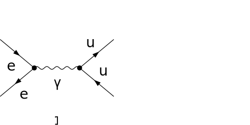

## Load FeynCalc and the necessary add-ons or other packages

```mathematica
description = "El Ael -> Q Qbar, QCD, total cross section, tree";
If[ $FrontEnd === Null, 
  	$FeynCalcStartupMessages = False; 
  	Print[description]; 
  ];
If[ $Notebooks === False, 
  	$FeynCalcStartupMessages = False 
  ];
$LoadAddOns = {"FeynArts"};
<< FeynCalc`
$FAVerbose = 0; 
 
FCCheckVersion[9, 3, 1];
```

$$\text{FeynCalc }\;\text{10.0.0 (dev version, 2023-12-20 22:40:59 +01:00, dff3b835). For help, use the }\underline{\text{online} \;\text{documentation}}\;\text{, check out the }\underline{\text{wiki}}\;\text{ or visit the }\underline{\text{forum}.}$$

$$\text{Please check our }\underline{\text{FAQ}}\;\text{ for answers to some common FeynCalc questions and have a look at the supplied }\underline{\text{examples}.}$$

$$\text{If you use FeynCalc in your research, please evaluate FeynCalcHowToCite[] to learn how to cite this software.}$$

$$\text{Please keep in mind that the proper academic attribution of our work is crucial to ensure the future development of this package!}$$

$$\text{FeynArts }\;\text{3.11 (3 Aug 2020) patched for use with FeynCalc, for documentation see the }\underline{\text{manual}}\;\text{ or visit }\underline{\text{www}.\text{feynarts}.\text{de}.}$$

$$\text{If you use FeynArts in your research, please cite}$$

$$\text{ $\bullet $ T. Hahn, Comput. Phys. Commun., 140, 418-431, 2001, arXiv:hep-ph/0012260}$$

## Generate Feynman diagrams

Nicer typesetting

```mathematica
MakeBoxes[p1, TraditionalForm] := "\!\(\*SubscriptBox[\(p\), \(1\)]\)";
MakeBoxes[p2, TraditionalForm] := "\!\(\*SubscriptBox[\(p\), \(2\)]\)";
MakeBoxes[k1, TraditionalForm] := "\!\(\*SubscriptBox[\(k\), \(1\)]\)";
MakeBoxes[k2, TraditionalForm] := "\!\(\*SubscriptBox[\(k\), \(2\)]\)";
```

```mathematica
diags = InsertFields[CreateTopologies[0, 2 -> 2], {F[2, {1}], -F[2, {1}]} -> 
     	{F[3, {1}], -F[3, {1}]}, InsertionLevel -> {Classes}, Model -> "SMQCD", 
    	ExcludeParticles -> {S[_], V[2]}]; 
 
Paint[diags, ColumnsXRows -> {2, 1}, Numbering -> Simple, 
  	SheetHeader -> None, ImageSize -> {512, 256}];
```



## Obtain the amplitude

```mathematica
amp[0] = FCFAConvert[CreateFeynAmp[diags], IncomingMomenta -> {p1, p2}, 
  	OutgoingMomenta -> {k1, k2}, UndoChiralSplittings -> True, ChangeDimension -> 4, 
  	List -> False, SMP -> True, Contract -> True, DropSumOver -> True, 
  	Prefactor -> 3/2 SMP["e_Q"], FinalSubstitutions -> {SMP["m_u"] -> SMP["m_q"]}]
```

$$\frac{\text{e}^2 e_Q \delta _{\text{Col3}\;\text{Col4}} \left(\varphi (-\overline{p_2},m_e)\right).\bar{\gamma }^{\text{Lor1}}.\left(\varphi (\overline{p_1},m_e)\right) \left(\varphi (\overline{k_1},m_q)\right).\bar{\gamma }^{\text{Lor1}}.\left(\varphi (-\overline{k_2},m_q)\right)}{(\overline{k_1}+\overline{k_2}){}^2}$$

## Fix the kinematics

```mathematica
FCClearScalarProducts[];
SetMandelstam[s, t, u, p1, p2, -k1, -k2, SMP["m_e"], SMP["m_e"], 
  	SMP["m_q"], SMP["m_q"]];
```

## Square the amplitude

```mathematica
ampSquared[0] = (amp[0] (ComplexConjugate[amp[0]])) // 
       	FeynAmpDenominatorExplicit // SUNSimplify[#, Explicit -> True, 
        	SUNNToCACF -> False] & // FermionSpinSum[#, ExtraFactor -> 1/2^2] & // 
    	DiracSimplify // 
   	TrickMandelstam[#, {s, t, u, 2 SMP["m_q"]^2 + 2 SMP["m_e"]^2}] & //Simplify
```

$$\frac{2 \;\text{e}^4 N e_Q^2 \left(-4 m_e^2 \left(u-m_q^2\right)+2 m_e^4-4 u m_q^2+2 m_q^4+s^2+2 s u+2 u^2\right)}{s^2}$$

```mathematica
ampSquaredMassless[0] = ampSquared[0] // ReplaceAll[#, {SMP["m_q" | "m_e"] -> 0}] & // 
  	TrickMandelstam[#, {s, t, u, 0}] &
```

$$\frac{2 \;\text{e}^4 N e_Q^2 \left(t^2+u^2\right)}{s^2}$$

```mathematica
ampSquaredMasslessSUNN3[0] = ampSquaredMassless[0] /. SUNN -> 3
```

$$\frac{6 \;\text{e}^4 e_Q^2 \left(t^2+u^2\right)}{s^2}$$

## Total cross-section

The differential cross-section d sigma/ d Omega is given by

```mathematica
prefac1 = 1/(64 Pi^2 s);
```

```mathematica
integral1 = (Factor[ampSquaredMasslessSUNN3[0] /. {t -> -s/2 (1 - Cos[Th]), u -> -s/2 (1 + Cos[Th]), 
      SMP["e"]^4 -> (4 Pi SMP["alpha_fs"])^2}])
```

$$48 \pi ^2 \alpha ^2 e_Q^2 \left(\cos ^2(\text{Th})+1\right)$$

```mathematica
diffXSection1 = prefac1 integral1
```

$$\frac{3 \alpha ^2 e_Q^2 \left(\cos ^2(\text{Th})+1\right)}{4 s}$$

The differential cross-section d sigma/ d t d phi is given by

```mathematica
prefac2 = 1/(128 Pi^2 s)
```

$$\frac{1}{128 \pi ^2 s}$$

```mathematica
integral2 = Simplify[ampSquaredMasslessSUNN3[0]/(s/4) /. {u -> -s - t, 
     SMP["e"]^4 -> (4 Pi SMP["alpha_fs"])^2}]
```

$$\frac{384 \pi ^2 \alpha ^2 e_Q^2 \left(s^2+2 s t+2 t^2\right)}{s^3}$$

```mathematica
diffXSection2 = prefac2 integral2
```

$$\frac{3 \alpha ^2 e_Q^2 \left(s^2+2 s t+2 t^2\right)}{s^4}$$

The total cross-section. We see that integrating both expressions gives the same result

```mathematica
2 Pi Integrate[diffXSection1 Sin[Th], {Th, 0, Pi}]
```

$$\frac{4 \pi  \alpha ^2 e_Q^2}{s}$$

```mathematica
crossSectionTotal = 2 Pi Integrate[diffXSection2, {t, -s, 0}]
```

$$\frac{4 \pi  \alpha ^2 e_Q^2}{s}$$

Notice that up to the overall factor color factor 3 and the quark electric charge squared this result is identical to the total cross-section for the muon production in electron-positron annihilation.

```mathematica
crossSectionTotalQED = 4*Pi*SMP["alpha_fs"]^2/3/s
```

$$\frac{4 \pi  \alpha ^2}{3 s}$$

Taking the ratio of the two gives us the famous R-ration prediction of the parton mode, where the summation over the quark flavors in front of the charge squared is understood

```mathematica
crossSectionTotal/crossSectionTotalQED
```

$$3 e_Q^2$$

```mathematica
quarkCharges = { eq[u | c | t] -> 2/3, eq[d | s | b] -> -1/3};
```

Depending on the available center of mass energy, we may not be able to produce all the existing
quark flavors. Below 3 GeV (roughly twice the mass of the charm quark) we have only up, down and strange quarks and the R-ratio is given by

```mathematica
Sum[3 eq[i]^2, {i, {u, d, s}}] /. quarkCharges
```

$$2$$

At higher energies but below 9 GeV (roughly twice the mass of the bottom quark) we also have the 
contribution from the charm quark

```mathematica
Sum[3 eq[i]^2, {i, {u, d, s, c}}] /. quarkCharges
```

$$\frac{10}{3}$$

At even higher energies the bottom quark must also be taken into account

```mathematica
Sum[3 eq[i]^2, {i, {u, d, s, c, b}}] /. quarkCharges
```

$$\frac{11}{3}$$

At some point we finally reach sufficiently high energies to produce the top quark

```mathematica
Sum[3 eq[i]^2, {i, {u, d, s, c, b, t}}] /. quarkCharges
```

$$5$$

## Check the final results

```mathematica
knownResults = {
   	(6*(t^2 + u^2)*SMP["e"]^4*SMP["e_Q"]^2)/(s^2), 
   	(4*Pi*SMP["alpha_fs"]^2*SMP["e_Q"]^2)/s 
   };
FCCompareResults[{ampSquaredMasslessSUNN3[0], crossSectionTotal}, 
  knownResults, 
  Text -> {"\tCompare to CalcHEP and to Field, Applications of Perturbative QCD, Eq. 2.1.15:", 
    "CORRECT.", "WRONG!"}, Interrupt -> {Hold[Quit[1]], Automatic}]
Print["\tCPU Time used: ", Round[N[TimeUsed[], 3], 0.001], " s."];
```

$$\text{$\backslash $tCompare to CalcHEP and to Field, Applications of Perturbative QCD, Eq. 2.1.15:} \;\text{CORRECT.}$$

$$\text{True}$$

$$\text{$\backslash $tCPU Time used: }32.349\text{ s.}$$