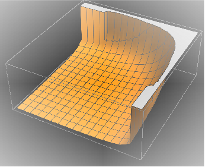

## Load FeynCalc and the necessary add-ons or other packages

```mathematica
description = "Ga^* -> Q Qbar Gl, QCD, total decay rate, tree";
If[ $FrontEnd === Null, 
  	$FeynCalcStartupMessages = False; 
  	Print[description]; 
  ];
If[ $Notebooks === False, 
  	$FeynCalcStartupMessages = False 
  ];
$LoadAddOns = {"FeynArts"};
<< FeynCalc`
$FAVerbose = 0; 
 
FCCheckVersion[9, 3, 1];
```

$$\text{FeynCalc }\;\text{10.0.0 (dev version, 2023-12-20 22:40:59 +01:00, dff3b835). For help, use the }\underline{\text{online} \;\text{documentation}}\;\text{, check out the }\underline{\text{wiki}}\;\text{ or visit the }\underline{\text{forum}.}$$

$$\text{Please check our }\underline{\text{FAQ}}\;\text{ for answers to some common FeynCalc questions and have a look at the supplied }\underline{\text{examples}.}$$

$$\text{If you use FeynCalc in your research, please evaluate FeynCalcHowToCite[] to learn how to cite this software.}$$

$$\text{Please keep in mind that the proper academic attribution of our work is crucial to ensure the future development of this package!}$$

$$\text{FeynArts }\;\text{3.11 (3 Aug 2020) patched for use with FeynCalc, for documentation see the }\underline{\text{manual}}\;\text{ or visit }\underline{\text{www}.\text{feynarts}.\text{de}.}$$

$$\text{If you use FeynArts in your research, please cite}$$

$$\text{ $\bullet $ T. Hahn, Comput. Phys. Commun., 140, 418-431, 2001, arXiv:hep-ph/0012260}$$

## Generate Feynman diagrams

Nicer typesetting

```mathematica
MakeBoxes[k1, TraditionalForm] := "\!\(\*SubscriptBox[\(k\), \(1\)]\)";
MakeBoxes[k2, TraditionalForm] := "\!\(\*SubscriptBox[\(k\), \(2\)]\)";
MakeBoxes[k3, TraditionalForm] := "\!\(\*SubscriptBox[\(k\), \(3\)]\)";
```

```mathematica
diags = InsertFields[CreateTopologies[0, 1 -> 3], {V[1]} -> 
    	{F[3, {1}], -F[3, {1}], V[5]}, InsertionLevel -> {Classes}, 
   	Model -> "SMQCD"];
Paint[diags, ColumnsXRows -> {2, 1}, Numbering -> Simple, 
  	SheetHeader -> None, ImageSize -> {512, 256}];
```


## Obtain the amplitude

```mathematica
amp[0] = FCFAConvert[CreateFeynAmp[diags], IncomingMomenta -> {p}, 
  	OutgoingMomenta -> {k1, k2, k3}, UndoChiralSplittings -> True, 
  	ChangeDimension -> 4, 
  	List -> False, SMP -> True, Contract -> True, DropSumOver -> True, 
  	Prefactor -> 3/2 SMP["e_Q"], FinalSubstitutions -> {SMP["m_u"] -> SMP["m_q"]}]
```

$$\frac{\text{e} e_Q g_s T_{\text{Col2}\;\text{Col3}}^{\text{Glu4}} \left(\varphi (\overline{k_1},m_q)\right).\left(\bar{\gamma }\cdot \bar{\varepsilon }^*\left(k_3\right)\right).\left(\bar{\gamma }\cdot \left(\overline{k_1}+\overline{k_3}\right)+m_q\right).\left(\bar{\gamma }\cdot \bar{\varepsilon }(p)\right).\left(\varphi (-\overline{k_2},m_q)\right)}{(-\overline{k_1}-\overline{k_3}){}^2-m_q^2}+\frac{\text{e} e_Q g_s T_{\text{Col2}\;\text{Col3}}^{\text{Glu4}} \left(\varphi (\overline{k_1},m_q)\right).\left(\bar{\gamma }\cdot \bar{\varepsilon }(p)\right).\left(\bar{\gamma }\cdot \left(-\overline{k_2}-\overline{k_3}\right)+m_q\right).\left(\bar{\gamma }\cdot \bar{\varepsilon }^*\left(k_3\right)\right).\left(\varphi (-\overline{k_2},m_q)\right)}{(\overline{k_2}+\overline{k_3}){}^2-m_q^2}$$

## Fix the kinematics

```mathematica
FCClearScalarProducts[];
SP[k1] = SMP["m_q"]^2;
SP[k2] = SMP["m_q"]^2;
SP[k3] = 0;
SP[k1, k2] = QQ/2 (1 - x3);
SP[k1, k3] = QQ/2 (1 - x2);
SP[k2, k3] = QQ/2 (1 - x1);
```

## Square the amplitude

```mathematica
ampSquared[0] = (amp[0] (ComplexConjugate[amp[0]])) // SUNSimplify // 
       	DoPolarizationSums[#, p, 0, 
         	VirtualBoson -> True] & // DoPolarizationSums[#, k3, 0, 
        	VirtualBoson -> True] & // FermionSpinSum // 
    	DiracSimplify // FeynAmpDenominatorExplicit // Simplify
```

$$\frac{1}{\text{QQ}^2 (\text{x1}-1)^2 (\text{x2}-1)^2}8 \;\text{e}^2 C_A C_F e_Q^2 g_s^2 \left(2 \;\text{QQ} m_q^2 \left(\text{x1}^3+\text{x1}^2 (\text{x2}+\text{x3}-5)+\text{x1} \left(\text{x2}^2-4 \;\text{x2} \;\text{x3}+2 \;\text{x3}+4\right)+\text{x2}^3+\text{x2}^2 (\text{x3}-5)+2 \;\text{x2} (\text{x3}+2)-2 (\text{x3}+1)\right)-8 m_q^4 \left(\text{x1}^2-2 \;\text{x1}+\text{x2}^2-2 \;\text{x2}+2\right)+\text{QQ}^2 (\text{x1}-1) (\text{x2}-1) \left(\text{x1}^2+2 \;\text{x1} (\text{x3}-2)+\text{x2}^2+2 \;\text{x2} (\text{x3}-2)+2 (\text{x3}-2)^2\right)\right)$$

```mathematica
ampSquaredMassless[0] = ampSquared[0] // ReplaceAll[#, {SMP["m_q"] -> 0, 
        x3 -> 2 - x1 - x2, SMP["e"]^2 -> (4 Pi SMP["alpha_fs"]), SMP["g_s"]^2 -> (4 Pi SMP["alpha_s"])}] & // 
    Simplify // SUNSimplify[#, SUNNToCACF -> False] &
```

$$\frac{64 \pi ^2 \alpha  \left(N^2-1\right) e_Q^2 \alpha _s \left(\text{x1}^2+\text{x2}^2\right)}{(\text{x1}-1) (\text{x2}-1)}$$

```mathematica
ampSquaredMasslessSUNN3[0] = ampSquaredMassless[0] /. SUNN -> 3
```

$$\frac{512 \pi ^2 \alpha  e_Q^2 \alpha _s \left(\text{x1}^2+\text{x2}^2\right)}{(\text{x1}-1) (\text{x2}-1)}$$

## Total decay rate

```mathematica
pref = QQ/(128 Pi^3 ) 1/(2 Sqrt[QQ])
```

$$\frac{\sqrt{\text{QQ}}}{256 \pi ^3}$$

```mathematica
normBorn = 3 SMP["alpha_fs"] SMP["e_Q"]^2 Sqrt[QQ]
```

$$3 \alpha  \sqrt{\text{QQ}} e_Q^2$$

Differential cross-section normalized w.r.t to the Born cross-section 1/sigma_0 d sigma / (d x1 d x2)

```mathematica
normDiffCrossSection = ampSquaredMasslessSUNN3[0] pref/normBorn
```

$$\frac{2 \alpha _s \left(\text{x1}^2+\text{x2}^2\right)}{3 \pi  (\text{x1}-1) (\text{x2}-1)}$$

This integral is divergent for x1->1 and x2->1. The source of these divergences are infrared (when the gluon energy
approaches 0)  and collinear (when the gluon and quark become collinear) singularities.

```mathematica
If[ $FrontEnd =!= Null, 
 	Plot3D[(normDiffCrossSection /. SMP["alpha_s"] -> 1), {x1, 0, 1}, {x2, 0, 1}] 
 ]
```



Introducing a regulator beta=m^2/Q^2 to enforce that the Mandelstam variables s and t are always larger than m^2 gives

```mathematica
normDiffCrossSection
```

$$\frac{2 \alpha _s \left(\text{x1}^2+\text{x2}^2\right)}{3 \pi  (\text{x1}-1) (\text{x2}-1)}$$

```mathematica
tmpIntegral = Integrate[normDiffCrossSection, {x2, 1 - x1, 1 - beta}, 
  	Assumptions -> {beta < x1, beta > 0, x1 >= 0, x1 <= 1}]
```

$$\frac{\alpha _s \left(2 \;\text{x1}^2 \log \left(\frac{\text{beta}}{\text{x1}}\right)+(\text{beta}-\text{x1}) (\text{beta}+\text{x1}-4)+2 \log (\text{beta})-2 \log (\text{x1})\right)}{3 \pi  (\text{x1}-1)}$$

```mathematica
(*integralReg=Integrate[tmpIntegral,{x1,beta,1-beta},Assumptions->{beta>0}]*)
  integralReg = ConditionalExpression[
    ((5 - 10*beta - 4*(3 + (-4 + beta)*beta + (2*I)*Pi)*ArcTanh[1 - 2*beta] + 
        	2*Log[1 - beta]*Log[(1 - beta)/beta^2] + 2*Log[beta]^2 + 
        	4*PolyLog[2, (1 - beta)^(-1)] - 4*PolyLog[2, beta^(-1)])*
       SMP["alpha_s"])/(3*Pi), beta < 1/2]
```

$$\fbox{$\frac{\alpha _s \left(2 \log (1-\text{beta}) \log \left(\frac{1-\text{beta}}{\text{beta}^2}\right)+4 \;\text{Li}_2\left(\frac{1}{1-\text{beta}}\right)-4 \;\text{Li}_2\left(\frac{1}{\text{beta}}\right)-10 \;\text{beta}+2 \log ^2(\text{beta})-4 ((\text{beta}-4) \;\text{beta}+2 i \pi +3) \tanh ^{-1}(1-2 \;\text{beta})+5\right)}{3 \pi }\;\text{ if }\;\text{beta}<\frac{1}{2}$}$$

Expanding around beta=0 we obtain

```mathematica
integralRegExpanded = Series[Simplify[Normal[integralReg]], {beta, 0, 0}, 
   	Assumptions -> beta > 0] // Normal
```

$$-\frac{\left(-12 \log ^2(\text{beta})-18 \log (\text{beta})+2 \pi ^2-15\right) \alpha _s}{9 \pi }$$

Factoring out the Born cross-section we arrive to

```mathematica
integralRegExpandedFinal = Collect2[integralRegExpanded, Log, Pi, FCFactorOut -> 2/(3 Pi) SMP["alpha_s"]]
```

$$\frac{2 \left(2 \log ^2(\text{beta})+3 \log (\text{beta})-\frac{\pi ^2}{3}+\frac{5}{2}\right) \alpha _s}{3 \pi }$$

To get rid of the singularities we must also include the virtual contributions to the cross-section!

## Check the final results

```mathematica
knownResults = {
   	(2*(x1^2 + x2^2)*SMP["alpha_s"])/(3*Pi*(-1 + x1)*(-1 + x2)) 
   };
FCCompareResults[{normDiffCrossSection}, knownResults, 
   Text -> {"\tCompare to Field, Applications of Perturbative QCD, Eq. 2.3.32", 
     "CORRECT.", "WRONG!"}, Interrupt -> {Hold[Quit[1]], Automatic}];
Print["\tCPU Time used: ", Round[N[TimeUsed[], 4], 0.001], " s."];
```

$$\text{$\backslash $tCompare to Field, Applications of Perturbative QCD, Eq. 2.3.32} \;\text{CORRECT.}$$

$$\text{$\backslash $tCPU Time used: }28.225\text{ s.}$$