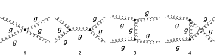

## Load FeynCalc and the necessary add-ons or other packages

```mathematica
description = "Gl Gl -> Gl Gl, QCD, matrix element squared, tree";
If[ $FrontEnd === Null, 
  	$FeynCalcStartupMessages = False; 
  	Print[description]; 
  ];
If[ $Notebooks === False, 
  	$FeynCalcStartupMessages = False 
  ];
$LoadAddOns = {"FeynArts"};
<< FeynCalc`
$FAVerbose = 0;
LaunchKernels[8]; 
 
$ParallelizeFeynCalc = True; 
FCCheckVersion[10, 2, 0];
```

$$\text{FeynCalc }\;\text{10.2.0 (dev version, 2026-06-09 14:14:02 +02:00, 96f9ea07). For help, use the }\underline{\text{online} \;\text{documentation},}\;\text{ visit the }\underline{\text{forum}}\;\text{ and have a look at the supplied }\underline{\text{examples}.}\;\text{ The PDF-version of the manual can be downloaded }\underline{\text{here}.}$$

$$\text{If you use FeynCalc in your research, please evaluate FeynCalcHowToCite[] to learn how to cite this software.}$$

$$\text{Please keep in mind that the proper academic attribution of our work is crucial to ensure the future development of this package!}$$

$$\text{FeynArts }\;\text{3.12 (27 Mar 2025) patched for use with FeynCalc, for documentation see the }\underline{\text{manual}}\;\text{ or visit }\underline{\text{www}.\text{feynarts}.\text{de}.}$$

$$\text{If you use FeynArts in your research, please cite}$$

$$\text{ $\bullet $ T. Hahn, Comput. Phys. Commun., 140, 418-431, 2001, arXiv:hep-ph/0012260}$$

## Generate Feynman diagrams

Nicer typesetting

```mathematica
FCAttachTypesettingRule[k1, {SubscriptBox, k, 1}]
FCAttachTypesettingRule[k2, {SubscriptBox, k, 2}]
FCAttachTypesettingRule[k3, {SubscriptBox, k, 3}]
FCAttachTypesettingRule[k4, {SubscriptBox, k, 4}]
```

```mathematica
diags = InsertFields[CreateTopologies[0, 2 -> 2], {V[5], V[5]} -> 
     		{V[5], V[5]}, InsertionLevel -> {Classes}, Model -> "SMQCD"]; 
 
Paint[diags, ColumnsXRows -> {4, 1}, Numbering -> Simple, 
  	SheetHeader -> None, ImageSize -> 128 {4, 1}];
```



## Obtain the amplitude

```mathematica
amp[0] = FCFAConvert[CreateFeynAmp[diags], IncomingMomenta -> {p1, p2},
   	OutgoingMomenta -> {q1, q2}, UndoChiralSplittings -> True, ChangeDimension -> D, 
   	TransversePolarizationVectors -> {p1, p2, q1, q2}, List -> True, SMP -> True, 
   	Contract -> True, DropSumOver -> True];
```

## Fix the kinematics

```mathematica
FCClearScalarProducts[];
SetMandelstam[s, t, u, p1, p2, -q1, -q2, 0, 0, 0, 0];
```

## Square the amplitude

```mathematica
ampSquared[0] = SquareAmplitude[amp[0], ComplexConjugate[amp[0]], Real -> True];
```

```mathematica
AbsoluteTiming[ampSquared[1] = FeynAmpDenominatorExplicit[ampSquared[0], FCParallelize -> True] //SUNSimplify[#, FCParallelize -> True] &;]
```

$$\{1.25141,\text{Null}\}$$

```mathematica
AbsoluteTiming[ampSquared[2] = ampSquared[1] // DoPolarizationSums[#, p1, p2, FCParallelize -> True, ExtraFactor -> 1/2] &;]
```

$$\{2.87501,\text{Null}\}$$

```mathematica
AbsoluteTiming[ampSquared[3] = ampSquared[2] // DoPolarizationSums[#, p2, p1, FCParallelize -> True, ExtraFactor -> 1/2] &;]
```

$$\{1.61495,\text{Null}\}$$

```mathematica
AbsoluteTiming[ampSquared[4] = ampSquared[3] // DoPolarizationSums[#, q1, q2, FCParallelize -> True] &;]
```

$$\{1.50372,\text{Null}\}$$

```mathematica
AbsoluteTiming[ampSquared[5] = ampSquared[4] // DoPolarizationSums[#, q2, q1, FCParallelize -> True] &;]
```

$$\{0.477498,\text{Null}\}$$

```mathematica
ampSquared[6] = SUNSimplify[1/((SUNN^2 - 1)^2) ampSquared[5], FCParallelize -> True, SUNNToCACF -> False] // TrickMandelstam[#, {s, t, u, 0}, FCParallelize -> True] & // Total // Collect2[#, D, FCParallelize -> True] & // 
   TrickMandelstam[#, {s, t, u, 0}] &
```

$$-\frac{(2-D)^2 N^2 g_s^4 \left(t^2+t u+u^2\right)^3}{\left(1-N^2\right) s^2 t^2 u^2}$$

```mathematica
ampSquaredSUNN3[0] = ampSquared[6] /. D -> 4 /. SUNN -> 3
```

$$\frac{9 g_s^4 \left(t^2+t u+u^2\right)^3}{2 s^2 t^2 u^2}$$

## Check the final results

```mathematica
knownResults = {
   	(9/2) SMP["g_s"]^4 (3 - t u/s^2 - s u/t^2 - s t/u^2) 
   };
FCCompareResults[{ampSquaredSUNN3[0]}, {knownResults}, 
  Text -> {"\tCompare to Ellis, Stirling and Weber, QCD and Collider Physics, Table 7.1:", "CORRECT.", "WRONG!"}, Interrupt -> {Hold[Quit[1]], Automatic}, Factoring -> 
   Function[x, Simplify[TrickMandelstam[x, {s, t, u, 0}]]]]
Print["\tCPU Time used: ", Round[N[TimeUsed[], 3], 0.001], " s."];

```mathematica

$$\text{$\backslash $tCompare to Ellis, Stirling and Weber, QCD and Collider Physics, Table 7.1:} \;\text{CORRECT.}$$

$$\text{True}$$

$$\text{$\backslash $tCPU Time used: }48.517\text{ s.}$$