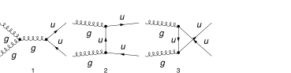

## Load FeynCalc and the necessary add-ons or other packages

```mathematica
description = "Gl Gl -> Q Qbar, QCD, matrix element squared, tree";
If[ $FrontEnd === Null, 
  	$FeynCalcStartupMessages = False; 
  	Print[description]; 
  ];
If[ $Notebooks === False, 
  	$FeynCalcStartupMessages = False 
  ];
$LoadAddOns = {"FeynArts"};
<< FeynCalc`
$FAVerbose = 0;
LaunchKernels[8]; 
 
$ParallelizeFeynCalc = True; 
FCCheckVersion[10, 2, 0];
```

$$\text{FeynCalc }\;\text{10.2.0 (dev version, 2026-06-09 14:14:02 +02:00, 96f9ea07). For help, use the }\underline{\text{online} \;\text{documentation},}\;\text{ visit the }\underline{\text{forum}}\;\text{ and have a look at the supplied }\underline{\text{examples}.}\;\text{ The PDF-version of the manual can be downloaded }\underline{\text{here}.}$$

$$\text{If you use FeynCalc in your research, please evaluate FeynCalcHowToCite[] to learn how to cite this software.}$$

$$\text{Please keep in mind that the proper academic attribution of our work is crucial to ensure the future development of this package!}$$

$$\text{FeynArts }\;\text{3.12 (27 Mar 2025) patched for use with FeynCalc, for documentation see the }\underline{\text{manual}}\;\text{ or visit }\underline{\text{www}.\text{feynarts}.\text{de}.}$$

$$\text{If you use FeynArts in your research, please cite}$$

$$\text{ $\bullet $ T. Hahn, Comput. Phys. Commun., 140, 418-431, 2001, arXiv:hep-ph/0012260}$$

## Generate Feynman diagrams

Nicer typesetting

```mathematica
FCAttachTypesettingRule[p1, {SubscriptBox, p, 1}]
FCAttachTypesettingRule[p2, {SubscriptBox, p, 2}]
FCAttachTypesettingRule[q1, {SubscriptBox, q, 1}]
FCAttachTypesettingRule[q2, {SubscriptBox, q, 2}]
```

```mathematica
diags = InsertFields[CreateTopologies[0, 2 -> 2], {V[5], V[5]} -> 
     		{F[3, {1}], -F[3, {1}]}, InsertionLevel -> {Classes}, 
    		Model -> "SMQCD"]; 
 
Paint[diags, ColumnsXRows -> {4, 1}, Numbering -> Simple, 
  	SheetHeader -> None, ImageSize -> 128 {4, 1}];
```



## Obtain the amplitude

```mathematica
amp[0] = FCFAConvert[CreateFeynAmp[diags], IncomingMomenta -> {p1, p2},
   	OutgoingMomenta -> {q1, q2}, UndoChiralSplittings -> True, ChangeDimension -> D, 
   	TransversePolarizationVectors -> {p1, p2}, List -> True, SMP -> True, 
   	Contract -> True, DropSumOver -> True];
```

## Fix the kinematics

```mathematica
FCClearScalarProducts[];
SetMandelstam[s, t, u, p1, p2, -q1, -q2, 0, 0, SMP["m_u"], SMP["m_u"]];
```

## Square the amplitude

```mathematica
ampSquared[0] = SquareAmplitude[amp[0], ComplexConjugate[amp[0]], Real -> True];
```

```mathematica
AbsoluteTiming[ampSquared[1] = FeynAmpDenominatorExplicit[ampSquared[0], FCParallelize -> True] //
     SUNSimplify[#, FCParallelize -> True] &;]
```

$$\{0.11661,\text{Null}\}$$

```mathematica
AbsoluteTiming[ampSquared[2] = ampSquared[1] // DoPolarizationSums[#, p1, p2, 
        FCParallelize -> True, ExtraFactor -> 1/2] & // DoPolarizationSums[#, p2, p1, 
       FCParallelize -> True, ExtraFactor -> 1/2] &;]
```

$$\{0.725239,\text{Null}\}$$

```mathematica
AbsoluteTiming[ampSquared[3] = ampSquared[2] // FermionSpinSum[#, FCParallelize -> True] & // DiracSimplify[#, FCParallelize -> True] &;]
```

$$\{2.67024,\text{Null}\}$$

```mathematica
AbsoluteTiming[ampSquared[4] = 1/((SUNN^2 - 1)^2) ampSquared[3] // TrickMandelstam[#, {s, t, u, 2  SMP["m_u"]^2}, FCParallelize -> True] &;]
```

$$\{0.670016,\text{Null}\}$$

```mathematica
ampSquared[5] = Collect2[ampSquared[4] // Total, CA, CF, D, Factoring -> Function[{x}, TrickMandelstam[x, {s, t, u, 2  SMP["m_u"]^2}]]]
```

$$\frac{D^2 C_A C_F^2 g_s^4 \left(-2 t m_u^2+2 m_u^4-2 u m_u^2+t^2+u^2\right)}{2 \left(1-N^2\right)^2 \left(u-m_u^2\right) \left(t-m_u^2\right)}-\frac{D C_A^2 C_F g_s^4 \left(-2 t m_u^2+2 m_u^4-2 u m_u^2+t^2+u^2\right)}{\left(1-N^2\right)^2 s^2}-\frac{2 D C_A C_F^2 g_s^4 \left(-2 t m_u^2+2 m_u^4-2 u m_u^2+t^2+u^2\right)}{\left(1-N^2\right)^2 \left(u-m_u^2\right) \left(t-m_u^2\right)}+\frac{2 C_A^2 C_F g_s^4 \left(-t^3 m_u^2+2 t^2 m_u^4-3 t^2 u m_u^2-3 t u^2 m_u^2-4 t m_u^6+8 t u m_u^4-u^3 m_u^2+2 u^2 m_u^4+2 m_u^8-4 u m_u^6+2 t^3 u-2 t^2 u^2+2 t u^3\right)}{\left(1-N^2\right)^2 s^2 \left(u-m_u^2\right) \left(t-m_u^2\right)}+\frac{1}{\left(1-N^2\right)^2 s^2 \left(u-m_u^2\right){}^2 \left(t-m_u^2\right){}^2}2 C_A C_F^2 g_s^4 \left(-t^5 m_u^2+7 t^4 m_u^4-11 t^4 u m_u^2-20 t^3 u^2 m_u^2-18 t^3 m_u^6+48 t^3 u m_u^4-20 t^2 u^3 m_u^2+58 t^2 u^2 m_u^4+16 t^2 m_u^8-78 t^2 u m_u^6-11 t u^4 m_u^2+48 t u^3 m_u^4-78 t u^2 m_u^6+56 t u m_u^8-u^5 m_u^2+7 u^4 m_u^4-18 u^3 m_u^6+16 u^2 m_u^8-8 m_u^{12}+t^5 u+6 t^3 u^3+t u^5\right)-\frac{D^2 C_F g_s^4}{2 \left(1-N^2\right)^2}+\frac{3 D C_F g_s^4}{\left(1-N^2\right)^2}-\frac{2 C_F g_s^4 \left(-2 t^3 m_u^2+9 t^2 m_u^4-18 t^2 u m_u^2-18 t u^2 m_u^2-12 t m_u^6+38 t u m_u^4-2 u^3 m_u^2+9 u^2 m_u^4-12 u m_u^6+3 t^3 u+2 t^2 u^2+3 t u^3\right)}{\left(1-N^2\right)^2 s^2 \left(u-m_u^2\right) \left(t-m_u^2\right)}$$

```mathematica
ampSquaredMassless[0] = Collect2[ampSquared[5] // ReplaceAll[#, {SMP["m_u"] -> 0}] &, D, CA, CF, 
   Factoring -> Function[{x}, TrickMandelstam[x, {s, t, u, 2  SMP["m_u"]^2}]]]
```

$$\frac{D^2 C_A C_F^2 g_s^4 \left(t^2+u^2\right)}{2 \left(1-N^2\right)^2 t u}-\frac{D C_A^2 C_F g_s^4 \left(t^2+u^2\right)}{\left(1-N^2\right)^2 s^2}-\frac{2 D C_A C_F^2 g_s^4 \left(t^2+u^2\right)}{\left(1-N^2\right)^2 t u}+\frac{4 C_A^2 C_F g_s^4 \left(t^2-t u+u^2\right)}{\left(1-N^2\right)^2 s^2}+\frac{2 C_A C_F^2 g_s^4 \left(t^4+6 t^2 u^2+u^4\right)}{\left(1-N^2\right)^2 s^2 t u}-\frac{D^2 C_F g_s^4}{2 \left(1-N^2\right)^2}+\frac{3 D C_F g_s^4}{\left(1-N^2\right)^2}-\frac{2 C_F g_s^4 \left(3 t^2+2 t u+3 u^2\right)}{\left(1-N^2\right)^2 s^2}$$

```mathematica
ampSquaredMasslessSUNN3[0] = TrickMandelstam[SUNSimplify[ampSquaredMassless[0] /. D -> 4, SUNNToCACF -> False] /. SUNN -> 3, {s, t, u, 0}]
```

$$\frac{g_s^4 \left(t^2+u^2\right) \left(4 t^2-t u+4 u^2\right)}{24 s^2 t u}$$

## Check the final results

```mathematica
knownResults = {
   	(1/6) SMP["g_s"]^4 (t^2 + u^2)/(t u) - (3/8) SMP["g_s"]^4 (t^2 + u^2)/(s^2) 
   };
FCCompareResults[{ampSquaredMasslessSUNN3[0]}, {knownResults}, 
  Text -> {"\tCompare to Ellis, Stirling and Weber, QCD and Collider Physics, Table 7.1:", "CORRECT.", "WRONG!"}, Interrupt -> {Hold[Quit[1]], Automatic}, Factoring -> 
   Function[x, Simplify[TrickMandelstam[x, {s, t, u, 0}]]]]
Print["\tCPU Time used: ", Round[N[TimeUsed[], 3], 0.001], " s."];

```mathematica

$$\text{$\backslash $tCompare to Ellis, Stirling and Weber, QCD and Collider Physics, Table 7.1:} \;\text{CORRECT.}$$

$$\text{True}$$

$$\text{$\backslash $tCPU Time used: }38.728\text{ s.}$$