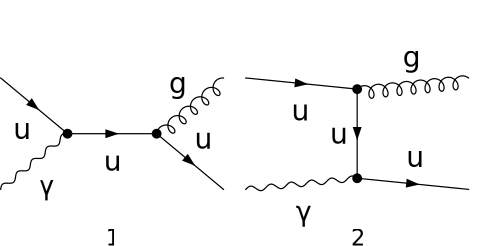

## Load FeynCalc and the necessary add-ons or other packages

```mathematica
description = "Q Ga -> Gl Q, QCD, matrix element squared, tree";
If[ $FrontEnd === Null, 
  	$FeynCalcStartupMessages = False; 
  	Print[description]; 
  ];
If[ $Notebooks === False, 
  	$FeynCalcStartupMessages = False 
  ];
$LoadAddOns = {"FeynArts"};
<< FeynCalc`
$FAVerbose = 0; 
 
FCCheckVersion[9, 3, 1];
```

$$\text{FeynCalc }\;\text{10.0.0 (dev version, 2023-12-20 22:40:59 +01:00, dff3b835). For help, use the }\underline{\text{online} \;\text{documentation}}\;\text{, check out the }\underline{\text{wiki}}\;\text{ or visit the }\underline{\text{forum}.}$$

$$\text{Please check our }\underline{\text{FAQ}}\;\text{ for answers to some common FeynCalc questions and have a look at the supplied }\underline{\text{examples}.}$$

$$\text{If you use FeynCalc in your research, please evaluate FeynCalcHowToCite[] to learn how to cite this software.}$$

$$\text{Please keep in mind that the proper academic attribution of our work is crucial to ensure the future development of this package!}$$

$$\text{FeynArts }\;\text{3.11 (3 Aug 2020) patched for use with FeynCalc, for documentation see the }\underline{\text{manual}}\;\text{ or visit }\underline{\text{www}.\text{feynarts}.\text{de}.}$$

$$\text{If you use FeynArts in your research, please cite}$$

$$\text{ $\bullet $ T. Hahn, Comput. Phys. Commun., 140, 418-431, 2001, arXiv:hep-ph/0012260}$$

## Generate Feynman diagrams

Nicer typesetting

```mathematica
MakeBoxes[p1, TraditionalForm] := "\!\(\*SubscriptBox[\(p\), \(1\)]\)";
MakeBoxes[p2, TraditionalForm] := "\!\(\*SubscriptBox[\(p\), \(2\)]\)";
MakeBoxes[k1, TraditionalForm] := "\!\(\*SubscriptBox[\(k\), \(1\)]\)";
MakeBoxes[k2, TraditionalForm] := "\!\(\*SubscriptBox[\(k\), \(2\)]\)";
```

```mathematica
diags = InsertFields[CreateTopologies[0, 2 -> 2], {F[3, {1}], V[1]} -> 
     		{V[5], F[3, {1}]}, InsertionLevel -> {Classes}, Model -> "SMQCD"]; 
 
Paint[diags, ColumnsXRows -> {2, 1}, Numbering -> Simple, 
  	SheetHeader -> None, ImageSize -> {512, 256}];
```



## Obtain the amplitude

```mathematica
amp[0] = FCFAConvert[CreateFeynAmp[diags], IncomingMomenta -> {p1, p2}, 
  	OutgoingMomenta -> {k1, k2}, UndoChiralSplittings -> True, ChangeDimension -> 4, 
  	TransversePolarizationVectors -> {k1}, List -> False, SMP -> True, 
  	Contract -> True, DropSumOver -> True, Prefactor -> 3/2 SMP["e_Q"]]
```

$$-\frac{\text{e} e_Q g_s T_{\text{Col4}\;\text{Col1}}^{\text{Glu3}} \left(\varphi (\overline{k_2},m_u)\right).\left(\bar{\gamma }\cdot \bar{\varepsilon }^*\left(k_1\right)\right).\left(\bar{\gamma }\cdot \left(\overline{k_1}+\overline{k_2}\right)+m_u\right).\left(\bar{\gamma }\cdot \bar{\varepsilon }\left(p_2\right)\right).\left(\varphi (\overline{p_1},m_u)\right)}{(-\overline{k_1}-\overline{k_2}){}^2-m_u^2}-\frac{\text{e} e_Q g_s T_{\text{Col4}\;\text{Col1}}^{\text{Glu3}} \left(\varphi (\overline{k_2},m_u)\right).\left(\bar{\gamma }\cdot \bar{\varepsilon }\left(p_2\right)\right).\left(\bar{\gamma }\cdot \left(\overline{k_2}-\overline{p_2}\right)+m_u\right).\left(\bar{\gamma }\cdot \bar{\varepsilon }^*\left(k_1\right)\right).\left(\varphi (\overline{p_1},m_u)\right)}{(\overline{p_2}-\overline{k_2}){}^2-m_u^2}$$

## Fix the kinematics

```mathematica
FCClearScalarProducts[];
SetMandelstam[s, t, u, p1, p2, -k1, -k2, SMP["m_u"], qQ, 0, SMP["m_u"]];
```

## Square the amplitude

Now come the usual steps, but with some special features. We do not average over the polarizations of the virtual photon, but use the gauge trick for the sum over its polarizations. In this case the sum goes over all 4 unphysical polarizations,  not just 2.

```mathematica
ampSquared[0] = 1/(SUNN) (amp[0] (ComplexConjugate[amp[0]])) // 
         	FeynAmpDenominatorExplicit // SUNSimplify[#, Explicit -> True, 
          	SUNNToCACF -> False] & // FermionSpinSum[#, ExtraFactor -> 1/2] & // 
      	DiracSimplify // DoPolarizationSums[#, p2, 0, 
       	VirtualBoson -> True] & // DoPolarizationSums[#, k1, p2] & // 
   	TrickMandelstam[#, {s, t, u, 2 SMP["m_u"]^2 + qQ^2}] & // Simplify
```

$$\frac{2 \;\text{e}^2 \left(N^2-1\right) e_Q^2 g_s^2 \left(-m_u^4 \left(2 \;\text{qQ}^4-2 \;\text{qQ}^2 (s+t)+3 s^2+14 s t+3 t^2\right)+m_u^2 \left(2 \;\text{qQ}^4 (s+t)-8 \;\text{qQ}^2 s t+s^3+7 s^2 t+7 s t^2+t^3\right)+6 m_u^8-s t \left(2 \;\text{qQ}^4-2 \;\text{qQ}^2 (s+t)+s^2+t^2\right)\right)}{N \left(s-m_u^2\right){}^2 \left(t-m_u^2\right){}^2}$$

```mathematica
ampSquaredMassless[0] = ampSquared[0] // ReplaceAll[#, {SMP["m_u"] -> 0}] & // 
  	TrickMandelstam[#, {s, t, u, qQ^2}] &
```

$$\frac{2 \;\text{e}^2 \left(1-N^2\right) e_Q^2 g_s^2 \left(\text{qQ}^4-2 \;\text{qQ}^2 t+2 t^2+2 t u+u^2\right)}{N s t}$$

```mathematica
ampSquaredMasslessSUNN3[0] = 
 	Simplify[ampSquaredMassless[0] /. SUNN -> 3 /. u -> qQ^2 - s - t /. qQ -> I Q]
```

$$-\frac{16 \;\text{e}^2 e_Q^2 g_s^2 \left(2 Q^4+2 Q^2 (s+t)+s^2+t^2\right)}{3 s t}$$

## Check the final results

```mathematica
knownResults = {
   	(16/3) SMP["e"]^2 SMP["e_Q"]^2 SMP["g_s"]^2 (-t/s - s/t - 2 Q^2 (s + t + Q^2)/(t s)) 
   };
FCCompareResults[{ampSquaredMasslessSUNN3[0]}, {knownResults}, 
   Text -> {"\tCheck with R. Field, Applications of Perturbative QCD, Eq 4.3.10:", 
     "CORRECT.", "WRONG!"}, Interrupt -> {Hold[Quit[1]], Automatic}];
Print["\tCPU Time used: ", Round[N[TimeUsed[], 3], 0.001], " s."];

```mathematica

$$\text{$\backslash $tCheck with R. Field, Applications of Perturbative QCD, Eq 4.3.10:} \;\text{CORRECT.}$$

$$\text{$\backslash $tCPU Time used: }21.478\text{ s.}$$